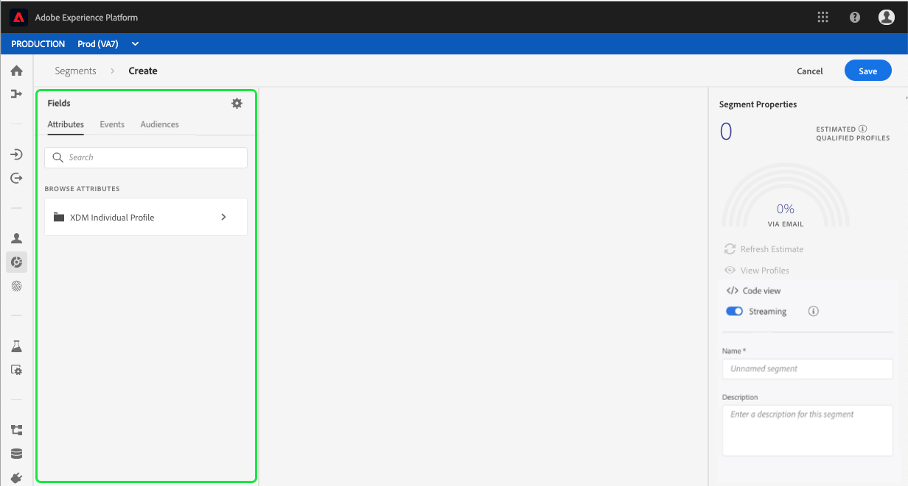

# 区段生成器用户指南

Adobe Experience Platform Segmentation Service提供RESTful API和用户界面，用于根据实时客户用户档案数据创建细分定义。

## 入门指南

使用细分定义需要了解与细分相关的各种Experience Platform服务。 在阅读本用户指南之前，请查阅以下服务的文档：

- [分段服务](../home.md):Segmentation Service允许您将存储在Experience Platform中与个人(如客户、潜在客户、用户或组织)相关的数据分为小组，这些小组具有相似的特征并将响应类似的营销策略。
- [实时客户用户档案](../../profile/home.md):根据来自多个来源的汇总数据提供统一、实时的消费者用户档案。
- [标识服务](../../identity-service/home.md):通过将来自不同数据源的身份引入平台，实现实时客户用户档案。
- [体验数据模型(XDM)](../../xdm/home.md):平台通过标准化框架组织客户体验数据。

了解本文档中使用的两个关键术语并了解它们之间的区别也很重要：
- **细分定义**:用于描述目标受众的关键特性或行为的规则集。
- **受众**:生成的一组符合区段定义标准的用户档案。

## 访问区段定义

要开始在Adobe Experience Platform中使用区段定义，请单击左侧导 **航中的** “区段”。 要查看您的组织的所有区段定义，请单击“浏览 *”选项卡* 。 此视图列表有关区段定义的信息，包括评估方法、创建日期和上次修改日期。

评价方法可以是流式的，也可以是批式的。 当数据进入系统时，会持续评估流段。 批区段根据一组计划进行评估。

此时会显示批段的附加信息，其中既显示了批的上次评估日期，也显示了批的下一次评估日期。

单 **击右上角的** “创建区段”会打开“区段生成器”工作区，您可以在其中开始创建区段定义。

## 区段生成器工作区

区段生成器提供丰富的工作区，允许您与用户档案数据元素交互。 工作区提供了用于构建和编辑规则的直观控件，如用于表示数据属性的拖放拼贴。

## 段定义构件块

区段定义的基本构件块是属性 **和****事件**。 此外，现有事件中包含的属性和 **受众** ，也可用作新定义的组件。

您可以在Segment Builder工作区左侧的 ** “字段”部分中看到这些构建块。 *字段* (Fields)包含每个主要构造块的选项卡：属 **性**、 **事件**&#x200B;和 **受众**。

### 属性

“属 **性** ”选项卡允许您浏览属于XDM单个用户档案类的用户档案属性。 每个文件夹都可以展开以显示其他属性，其中每个属性都是一个拼贴，可拖动到工作区中心的规则构建器画布上。 本指 [南后面将更详细地讨论规则构建器画布](#rule-builder-canvas) 。

### 事件

事件 **选项卡** ，允许您根据使用XDM ExperienceEvent数据元素进行的事件或操作创建受众。 您还可以在事件类型选项卡 **中查找事件** ，该选项卡是一组常用事件，使您能够更快地创建区段。

除了能够浏览ExperienceEvent元素之外，您还可以搜索事件类型。 事件类型使用与ExperienceEvents相同的编码逻辑，无需您通过XDM ExperienceEvent类进行搜索以寻找正确的事件。 例如，使用搜索栏搜索“购物车”将返回事件类型“AddCart”和“RemoveCart”，这两个操作是构建区段定义时常用的两种购物车操作。

通过在搜索栏中键入组件名称，可以搜索任何类型的组件，该搜索栏使用 [Lucene的搜索语法](https://docs.microsoft.com/en-us/azure/search/query-lucene-syntax)。 在输入整个单词时，搜索结果开始填充。 例如，要基于XDM字段构建规则，请 `ExperienceEvent.commerce.productViews`开始在搜索字段中键入“产品视图”。 输入单词“product”后，搜索结果开始显示。 每个结果都包括它所属的对象层次结构。

>[!NOTE] 由您的组织定义的自定义模式字段可能需要24小时才能显示并可用于构建规则。

然后，您可以轻松地将ExperienceEvents和事件类型拖放到您的区段定义中。

默认情况下，只显示数据存储中已填充的模式字段。 这包括事件类型。 如果事件类型列表不可见，或者您只能选择“任何”作为事件类型，请单击“字段”旁边的齿轮图标，然后选择“可用字段”下 *的“显示完整的XDM模式*” ******。 再次单击齿轮图标以返回到“字段 ** ”选项卡，您现在应能视图多个事件类型和模式字段，而不管它们是否包含数据。

### 受众

受众 **选项卡** ,列表从外部源(如Adobe受众管理器)导入的所有受众，以及在Experience Platform中创建的受众。

在“受众”选项卡上，您可以将所有可用源显示为一组文件夹。 单击到这些文件夹时，可以看到可用的子文件夹和受众。 此外，您还可以单击文件夹图标（如最右侧图像中所示），以视图文件夹结构（复选标记表示您当前所在的文件夹），并通过单击树中某个文件夹的名称轻松地在文件夹之间导航回去。

您可以将鼠标悬停在受众ⓘ旁边，以视图有关受众的信息，包括其ID、描述和文件夹层次结构，以便找到受众。

您还可以使用搜索栏搜索受众，该搜索栏利 [用Lucene的搜索语法](https://docs.microsoft.com/en-us/azure/search/query-lucene-syntax)。 在“ *受众* ”选项卡上，选择顶级文件夹会显示搜索栏，允许您在该文件夹中搜索。 只有输入完整单词后，搜索结果才会开始填充。 例如，要查找名为的受众, `Online Shoppers`请在搜索栏中开始键入“Online”。 在完整键入“在线”一词后，将显示包含“在线”一词的搜索结果。

## 规则构建器画布

区段定义是用于描述目标受众的关键特性或行为的规则集合。 这些规则是使用位于区段 *构建器中心的规则*&#x200B;构建器画布创建的。

要向区段定义添加新规则，请从“字段”选项卡中拖动拼贴 ** ，然后将其放到规则构建器画布上。 然后，将根据要添加的数据类型向您显示上下文特定选项。 可用数据类型包括：字符串、日期、ExperienceEvents、事件类型和受众。

### 添加受众

您可以将受众从受众选项卡拖放到规则 *构建器画布上* ，以在新的区段定义中引用受众成员关系。 这允许您将受众会员资格作为属性加入或排除新区段规则。

对于使用区段构建器创建的平台受众，您可以选择将受众转换为在该受众的区段定义中使用的规则集。 此转换创建规则逻辑的副本，然后可以修改该副本，而不会影响原始段定义。

>[!NOTE] 从外部源添加受众时，只引用受众会员资格。 您无法将受众转换为规则，因此用于创建原始受众的规则无法在新区段定义中修改。

## 容器

细分规则将按其列出的顺序进行评估。 容器允许通过使用嵌套查询来控制执行顺序。

在规则构建器画布中至少添加一个拼贴后，您可以开始添加容器。 要创建新容器，请单击拼贴右上角的省略号(...)，然后单击添加 **容器**。

新容器显示为第一个容器的子项，但您可以通过拖动和移动容器来调整层次。 容器的默认行为是“包括”提供的属性、事件或受众。 您可以将规则设置为“排除”符合用户档案条件的容器，方法是单击拼贴左上角的“包括 **** ”，然后选择“排除”。

还可以通过单击子容器上的“取消容器”，提取子容器并嵌入到父容器中。 单击子容器右上角的省略号(...)以访问此选项。

单击“取消 **绕排容器** ”后，子容器即被删除，并且条件显示在行中。

>[!NOTE] 在展开容器时，请注意逻辑继续满足所需的段定义。

## 合并策略

Experience Platform使您能够将来自多个来源的数据整合在一起，并将其合并，以便查看每个客户的完整视图。 整合这些数据时，合并策略是平台用来确定数据的优先级以及将哪些数据合并以创建用户档案的规则。

您可以选择与本受众的营销目的匹配的合并策略，或使用平台提供的默认合并策略。 您可以创建组织特有的多个合并策略，包括创建您自己的默认合并策略。 有关为组织创建合并策略的分步说明，请参阅使用UI [处理合并策略的教程](../../profile/ui/merge-policies.md)。

要为区段定义选择合并策略，请单击“字段”选项卡上的齿轮图标，然后使用“合并策略”下拉菜单 **** ，以选择要使用的合并策略。

## 区段属性

在构建区段定义时，工作区右侧的“区段属性 ** ”部分会显示所生成区段的估计大小，允许您在构建受众本身之前根据需要调整区段定义。

在“ *区段属性* ”部分，您还可以指定有关区段定义的重要信息，包括其名称 *和* 说明 **。 区段定义名称用于在组织定义的区段中标识您的区段，因此应具有描述性、简明性和唯一性。

在继续构建区段定义时，您可以通过选择视图预览来视图受众的分 **页用户档案**。

>[!NOTE] 受众估计是使用当天样本数据的样本大小生成的。 如果您的用户档案商店中有不到100万个实体，则使用完整的数据集；100万至2000万个单位使用100万个；超过2000万个单位，占实体总数的5%。 有关生成区段估计的更多信息，可在区段创建教 [程的估计生成部分](../tutorials/create-a-segment.md#estimate-and-preview-an-audience) 中找到。

## 启用计划细分

在创建区段定义后，您便可以通过按需或计划（连续）评估来评估这些定义。 评估是指通过细分定义移动实时客户用户档案数据以生成相应的受众。 创建后，将保存和存储受众，以便使用Experience Platform API导出它们。

按需评估包括使用API根据需要执行评估和构建受众，而计划评估（也称为“计划细分”）允许您创建循环计划，以在特定时间（最多每天一次）评估区段定义。

可以使用UI或API为计划评估启用区段定义。 在UI中，返回到“区段”中 *的* “浏览 **”选项卡** ，并打开“ **评估所有区段”**。 这将导致所有区段都会根据您的组织设置的计划进行评估。

>[!NOTE] 对于沙箱，对于XDM单个用户档案最多可以启用五(5)个合并策略的计划评估。 如果您的组织在单个沙箱环境中有五个以上的XDM单个用户档案合并策略，您将无法使用计划的评估。

计划当前只能使用API创建。 有关使用API创建、编辑和使用计划的详细步骤，请阅读教程以评估和访问区段结果，特别是有关使用API进行计划评估 [的部分](../tutorials/evaluate-a-segment.md#scheduled-evaluation)。

## 支持流细分

>[!NOTE] 流细分是测试版功能，可应要求提供。

此外，在创建流分段之前或之后，可以为流分段启用区段定义。 流细分在事件进入特定细分组后立即评估客户。 借助此功能，当数据传入平台时，现在可以评估大多数细分规则，这意味着细分成员关系将保持最新，而不会运行计划的细分作业。 有关流分段的更多详细信息，请阅读流分 [段文档](../api/streaming-segmentation.md)。

可以使用UI或API为流启用区段定义。 要在UI中为流化启用新的或现有的段定义，您需要将“流化”选项 *切换* 为 **ON**。

启用流细分后，必须建立基线（这是初始运行，之后区段将始终保持最新）。 系统会自动处理基线，但只有在已启用计划的分段时，才可能这样做。 有关启用计划分段的详细信息，请参 [阅本用户指南的上一节](#enable-scheduled-segmentation)。

## 违反DULE策略

>[!NOTE] DULE策略违规仅在创建已分配到目标的区段时适用。

创建完细分后，细分将通过“数据管理”进行分析，以确保细分中不存在违反政策的情况。 有关DULE和策略违规的详细信息，请参阅数 [据使用标签概述](../../data-governance/labels/overview.md)。

## 后续步骤

Segment Builder提供了一个丰富的工作流，允许您从实时客户受众数据中隔离有价用户档案。 阅读本指南后，您现在应能够：

- 将属性、事件和现有受众的组合用作构件块，创建区段定义。
- 使用规则构建器画布和容器控制执行区段规则的顺序。
- 视图对预期受众的估计，允许您根据需要调整细分定义。
- 为计划分段启用所有区段定义。
- 为流分段启用指定的段定义。

有关使用实时客户用户档案API使用分段服务的分步说明，请参阅使用API [创建受众区段教程](../tutorials/create-a-segment.md) 。