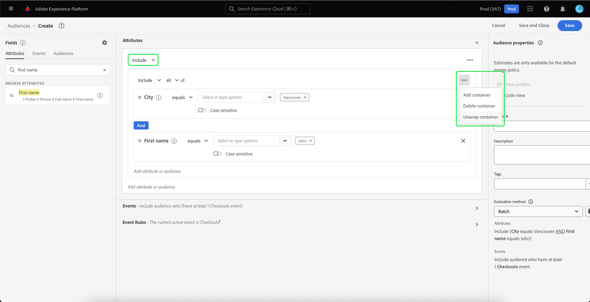

# [!DNL Segment Builder] UI指南

[!DNL Segment Builder] 提供了丰富的工作区，可让您与 [!DNL Profile] 数据元素。 工作区提供了用于构建和编辑规则的直观控件，例如用于表示数据属性的拖放图块。

## 区段定义构建基块 {#building-blocks}

>[!CONTEXTUALHELP]
>id="platform_segments_createsegment_segmentbuilder_fields"
>title="字段"
>abstract="构成区段的三个字段类型是属性、事件和受众。 “属性”允许您使用属于XDM个人配置文件类的配置文件属性，“事件”允许您根据使用XDM ExperienceEvent数据元素执行的操作或事件创建受众，“受众”则允许您使用从外部源导入的受众。"

区段定义的基本构建块是属性和事件。 此外，现有受众中包含的属性和事件可用作新定义的组件。

您可以在 **[!UICONTROL 字段]** 的左侧 [!DNL Segment Builder] 工作区。 **[!UICONTROL 字段]** 包含每个主要构建基块的选项卡：&quot;[!UICONTROL 属性]&quot;, &quot;[!UICONTROL 事件]&quot;和&quot;[!UICONTROL 受众]&quot;

### 属性

的 **[!UICONTROL 属性]** 选项卡，用于浏览 [!DNL Profile] 属于的属性 [!DNL XDM Individual Profile] 类。 每个文件夹都可以展开以显示其他属性，其中每个属性都是一个拼贴，可拖动到工作区中心的规则生成器画布上。 的 [规则生成器画布](#rule-builder-canvas) 将在本指南的后面部分详细讨论。

### 事件

的 **[!UICONTROL 事件]** 选项卡，用于根据使用 [!DNL XDM ExperienceEvent] 数据元素。 您还可以在 **[!UICONTROL 事件]** 选项卡，这是常用事件的集合，可让您更快地创建区段。

除了能够浏览 [!DNL ExperienceEvent] 元素中，您还可以搜索事件类型。 事件类型使用与相同的编码逻辑 [!DNL ExperienceEvents]，无需您搜索 [!DNL XDM ExperienceEvent] 类查找正确的事件。 例如，使用搜索栏搜索“购物车”会返回事件类型“[!UICONTROL AddCart]&quot;和&quot;[!UICONTROL RemoveCart]“ ”，构建区段定义时最常用的两个购物车操作。

可通过在搜索栏中键入任何类型的组件名称来搜索，该搜索栏使用 [Lucene的搜索语法](https://docs.microsoft.com/en-us/azure/search/query-lucene-syntax). 在输入整个词时，搜索结果会开始填充。 例如，要构建基于XDM字段的规则，请执行以下操作 `ExperienceEvent.commerce.productViews`，开始在搜索字段中键入“产品视图”。 键入“product”一词后，搜索结果即开始显示。 每个结果都包括它所属的对象层次结构。

>[!NOTE]
>
>您的组织定义的自定义架构字段可能需要长达24小时才能显示出来，并可用于构建规则。

然后，您可以轻松拖放 [!DNL ExperienceEvents] 和&quot;[!UICONTROL 事件类型]”添加到区段定义中。

默认情况下，仅显示数据存储中填充的架构字段。 这包括“[!UICONTROL 事件类型]&quot; 如果[!UICONTROL 事件类型]“ ”列表不可见，或者您只能选择“[!UICONTROL 任意]&quot;作为&quot;[!UICONTROL 事件类型]&quot;，选择 **齿轮图标** 下一页 **[!UICONTROL 字段]**，然后选择 **[!UICONTROL 显示完整的XDM架构]** 在 **[!UICONTROL 可用字段]**. 选择 **齿轮图标** 再次返回 **[!UICONTROL 字段]** 选项卡，此时您应该能够查看多个“[!UICONTROL 事件类型]“ ”和架构字段，无论它们是否包含数据。

#### Adobe Analytics报表包数据集

您可以将单个或多个Adobe Analytics报表包中的数据用作分段内的事件。

使用单个Analytics报表包中的数据时，Platform会自动向eVar添加描述符和友好名称，以便在中更轻松地查找这些字段 [!DNL Segment Builder].

使用来自多个Analytics报表包、Platform的数据时 **无法** 自动向eVar添加描述符或友好名称。 因此，在使用Analytics报表包中的数据之前，您必须映射到XDM字段。 有关将Analytics变量映射到XDM的更多信息，请参阅 [Adobe Analytics源连接指南](../../sources/tutorials/ui/create/adobe-applications/analytics.md#mapping).

例如，假定您有两个具有以下变量的报表包：

| 字段 | 报表包架构A | 报表包架构B |
| ----- | --------------------- | --------------------- |
| eVar1 | 反向链接域 | 已登录Y/N |
| eVar2 | 页面名称 | 会员忠诚度ID |
| eVar3 | URL | 页面名称 |
| eVar4 | 搜索词 | 产品名称 |
| event1 | 单击次数 | Page Views |
| event2 | Page Views | 购物车加货 |
| event3 | 购物车加货 | 结账 |
| event4 | 购买 | 购买 |

在这种情况下，您可以使用以下架构映射两个报表包：

>[!NOTE]
>
>虽然仍会填充通用eVar值，但您应该 **not** 请在区段定义中使用它们（如果可能），因为这些值可能与它们最初在报表中的含义不同。

映射报表包后，您可以在与用户档案相关的工作流和区段中使用这些新映射的字段。

| 方案 | 并集架构体验 | 分段通用变量 | 分段映射的变量 |
| -------- | ----------------------- | ----------------------------- | ---------------------------- |
| 单个报表包 | 易记名称描述符随通用变量一起包含。   **示例：** 页面名称(eVar2) | <ul><li>通用变量中包含的友好名称描述符</li><li>查询使用来自特定数据集的数据，因为它是唯一一个</li></ul> | 查询可以使用Adobe Analytics数据以及可能的其他源。 |
| 多个报表包 | 通用变量中不包含易记名称描述符。   **示例：** eVar2 | <ul><li>具有多个描述符的任何字段都显示为通用字段。 这意味着UI中不显示任何友好名称。</li><li>查询可以使用包含eVar的任何数据集中的数据，这可能会导致结果混合或不正确。</li></ul> | 查询使用来自多个数据集的正确组合结果。 |

### 受众

的 **[!UICONTROL 受众]** 选项卡列出了从外部源(如Adobe Audience Manager)导入的所有受众，以及在 [!DNL Experience Platform].

在 **[!UICONTROL 受众]** 选项卡，您可以将所有可用源视为一组文件夹。 选择文件夹时，可以看到可用的子文件夹和受众。 此外，您还可以选择文件夹图标（如最右侧图像中所示）以查看文件夹结构（复选标记表示您当前所在的文件夹），并通过选择树中文件夹的名称轻松导航回文件夹。

您可以将鼠标悬停在受众旁ⓘ的上方，以查看有关受众的信息，包括受众的ID、描述以及用于查找受众的文件夹层次结构。

您还可以使用搜索栏搜索受众，该搜索栏利用 [Lucene的搜索语法](https://docs.microsoft.com/en-us/azure/search/query-lucene-syntax). 在 **[!UICONTROL 受众]** 选项卡，则选择顶级文件夹会显示搜索栏，从而允许您在该文件夹内进行搜索。 只有输入了整个词后，搜索结果才会开始填充。 例如，要查找名为 `Online Shoppers`，开始在搜索栏中键入“在线”。 完整键入“在线”一词后，将显示包含“在线”一词的搜索结果。

## 规则生成器画布 {#rule-builder-canvas}

区段定义是用于描述目标受众的关键特征或行为的规则集合。 这些规则是使用规则生成器画布创建的，画布位于 [!DNL Segment Builder].

要向区段定义中添加新规则，请从 **[!UICONTROL 字段]** 选项卡，并将其拖放到规则生成器画布上。 然后，将根据要添加的数据类型向您显示特定于上下文的选项。 可用数据类型包括：字符串，日期， [!DNL ExperienceEvents], &quot;[!UICONTROL 事件类型]和受众。

>[!IMPORTANT]
>
>对Adobe Experience Platform的最新更改更新了 `OR` 和 `AND` 事件之间的逻辑运算符。 这些更新不会影响现有区段。 但是，对现有区段和新区段创建的所有后续更新都将受到这些更改的影响。 请阅读 [时间常量更新](./segment-refactoring.md) 以了解更多信息。

选择属性的值时，您将看到属性可以包含的枚举值列表。

如果从此枚举列表中选择一个值，则该值将用实边框列出。 但是，对于使用 `meta:enum` （柔和）枚举，则还可以 **not** 从枚举列表。 如果您创建自己的值，则会用虚线边框列出该值，并出现一则警告，指出该值未在枚举列表中。

### 添加受众

您可以从 **[!UICONTROL 受众]** 选项卡，以引用新区段定义中的受众成员资格。 这允许您在新区段规则中包含或排除受众成员资格作为属性。

对于 [!DNL Platform] 使用 [!DNL Segment Builder]，则您可以选择将受众转换为在该受众的区段定义中使用的规则集。 此转换会生成规则逻辑的副本，随后可以修改该副本，而不会影响原始区段定义。 在将区段定义转换为规则逻辑之前，请确保已保存对区段定义所做的任何最近更改。

>[!NOTE]
>
>从外部源添加受众时，仅引用受众成员资格。 您无法将受众转换为规则，因此在新区段定义中无法修改用于创建原始受众的规则。

如果在将受众转换为规则时发生任何冲突， [!DNL Segment Builder] 会尽量保留现有选项。

### 代码视图

或者，您也可以查看在 [!DNL Segment Builder]. 在规则生成器画布中创建规则后，您可以选择 **[!UICONTROL 代码视图]** 将区段视为PQL。

“代码”视图提供了一个按钮，用于复制要在API调用中使用的区段值。 要获取区段的最新版本，请确保已将最新更改保存到该区段。

### 聚合函数

中的聚合 [!DNL Segment Builder] 是对数据类型为数字（双精度或整数）的一组XDM属性的计算。 区段生成器中支持的四个聚合函数是SUM、AVERAGE、MIN和MAX。

要创建聚合函数，请从左边栏中选择一个事件，然后将其插入到 [!UICONTROL 事件] 容器。

将事件置于事件容器中后，选择省略号图标(...)，然后选择 **[!UICONTROL 聚合]**.

聚合现已添加。 您现在可以选择聚合函数、选择要聚合的属性、相等函数以及值。 对于以下示例，此区段将确定任何购买值总和大于$100（即使每次购买小于$100）的用户档案。

### 计数函数 {#count-functions}

区段生成器中的计数函数用于查找指定的事件并计数完成事件的次数。 区段生成器中支持的计数函数为“至少”、“最多”、“精确”、“介于”和“全部”。

要创建计数函数，请从左边栏中选择一个事件，并将其插入 [!UICONTROL 事件] 容器。

将事件置于事件容器中后，选择 [!UICONTROL 至少1个] 按钮。

计数函数现已添加。 您现在可以选择计数函数和函数的值。 以下示例将包括至少单击一次的任何事件。

## 容器

区段规则将按其列出顺序进行评估。 容器允许通过使用嵌套查询来控制执行顺序。

在规则生成器画布中至少添加一个拼贴后，即可开始添加容器。 要创建新容器，请选择图块右上角的省略号(...)，然后选择 **[!UICONTROL 添加容器]**.

新容器将作为第一个容器的子容器显示，但您可以通过拖动和移动容器来调整层次结构。 容器的默认行为为“[!UICONTROL 包括]“提供的属性、事件或受众。 您可以将规则设置为“[!UICONTROL 排除]“与容器条件匹配的配置文件(通过选择 **[!UICONTROL 包括]** ，然后选择“[!UICONTROL 排除]&quot;

也可以通过选择子容器上的“取消包装容器”来提取子容器并将其内联添加到父容器。 选择子容器右上角的省略号(...)以访问此选项。

选择 **[!UICONTROL 取消包装容器]** 子容器将被删除，并且标准将显示在内联。

>[!NOTE]
>
>展开容器时，请务必注意逻辑是否继续满足所需的区段定义。

## 合并策略

[!DNL Experience Platform] 允许您将多个来源的数据合并在一起，以便查看各个客户的完整视图。 将此数据整合在一起时，合并策略是 [!DNL Platform] 用于确定数据的优先级以及将合并哪些数据以创建用户档案。

您可以选择与此受众的营销目的匹配的合并策略，或使用 [!DNL Platform]. 您可以创建组织特有的多个合并策略，包括创建您自己的默认合并策略。 有关为贵组织创建合并策略的分步说明，请首先阅读 [合并策略概述](../../profile/merge-policies/overview.md).

要为区段定义选择合并策略，请在 **[!UICONTROL 字段]** 选项卡，然后使用 **[!UICONTROL 合并策略]** 下拉菜单，选择要使用的合并策略。

## 区段属性 {#segment-properties}

>[!CONTEXTUALHELP]
>id="platform_segments_createsegment_segmentbuilder_segmentproperties"
>title="区段属性"
>abstract="区段属性部分显示结果区段的估计大小，显示符合条件的用户档案数与用户档案总数的比较。 这样，您就可以根据需要调整区段定义，然后再构建受众本身。"

>[!CONTEXTUALHELP]
>id="platform_segments_createsegment_segmentbuilder_refreshestimate"
>title="更新估计"
>abstract="您可以刷新区段的预计值，以立即查看有多少用户档案符合建议区段的资格条件的预览。 受众估计是使用当天样本数据的样本量生成的。"
>additional-url="https://experienceleague.adobe.com/docs/experience-platform/segmentation/tutorials/create-a-segment.html?lang=en#estimate-and-preview-an-audience" text="评估和预览受众"

生成区段定义时， **[!UICONTROL 区段属性]** 工作区右侧的部分显示结果区段的预估大小，允许您在构建受众本身之前根据需要调整区段定义。

的 **[!UICONTROL 区段属性]** 部分中，您还可以指定有关区段定义的重要信息，包括其名称、描述和评估类型。 区段定义名称用于在组织定义的区段中标识您的区段，因此应当具有描述性、简洁性和唯一性。

在继续构建区段定义时，您可以通过选择 **[!UICONTROL 查看配置文件]**.

>[!NOTE]
>
>受众估计是使用当天样本数据的样本量生成的。 如果您的用户档案存储中的实体少于100万个，则使用完整的数据集；100万至2000万个单位使用100万个单位；超过2000万个单位使用5%的单位。 有关生成区段估计的更多信息，请参阅 [估计生成节](../tutorials/create-a-segment.md#estimate-and-preview-an-audience) 区段创建教程的“受众”部分。

您还可以选择评估方法。 如果您知道要使用哪种评估方法，则可以使用下拉列表选择所需的评估方法。 如果您想知道此区段符合哪些评估类型，则可以选择浏览图标  以查看可用区段评估方法的列表。

的 [!UICONTROL 评价方法资格] 弹出窗口。 此弹出窗口显示可用的评估方法，即批量、流和边。 弹出窗口会显示哪些评估方法符合条件和不符合条件。 根据区段定义中使用的参数，该参数可能不符合某些评估方法的条件。 有关每种评估方法要求的详细信息，请阅读 [流分段](./streaming-segmentation.md#query-types) 或 [边缘分割](./edge-segmentation.md#query-types) 概述。

如果选择无效的评估方法，系统将提示您更改区段定义规则或更改评估方法。

有关不同区段定义评估方法的详细信息，请参阅 [分段概述](../home.md#evaluate-segments).

## 后续步骤 {#next-steps}

区段生成器提供了一个丰富的工作流程，允许您将可销售的受众与 [!DNL Real-Time Customer Profile] 数据。 阅读本指南后，您现在应该能够：

- 使用属性、事件和现有受众的组合作为构建基块来创建区段定义。
- 使用规则生成器画布和容器来控制区段规则执行的顺序。
- 查看潜在受众的估计值，以便根据需要调整区段定义。
- 为计划分段启用所有区段定义。
- 为流分段启用指定的区段定义。

详细了解 [!DNL Segmentation Service]，请继续阅读文档，并通过观看相关视频来补充您的学习。 了解有关 [!DNL Segmentation Service] UI，请阅读 [[!DNL Segmentation Service] 用户指南](./overview.md)
