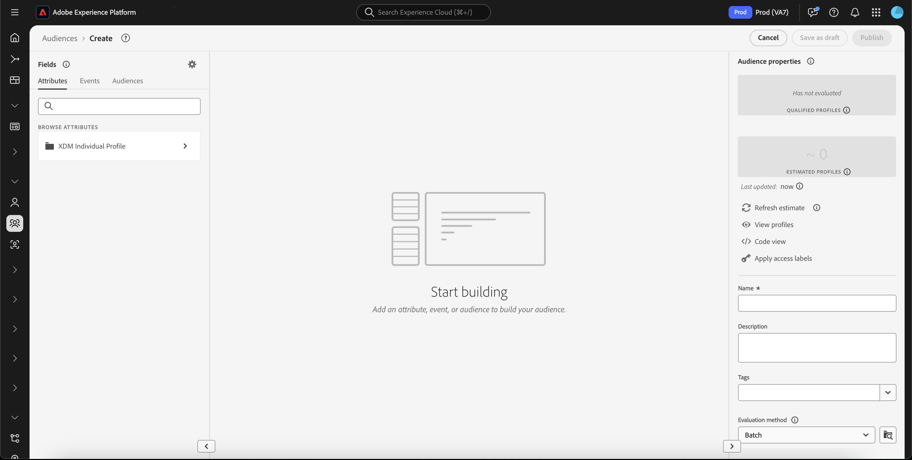
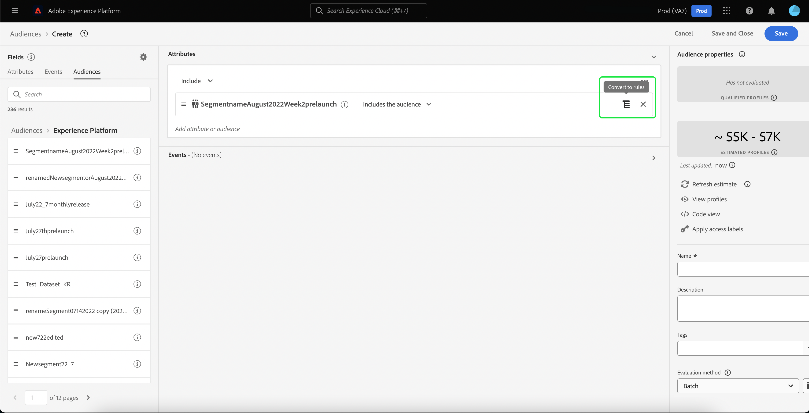

# [!DNL Segment Builder] UI指南

[!DNL Segment Builder] 提供丰富的工作区，允许您与数据元 [!DNL Profile] 素交互。工作区提供用于构建和编辑规则的直观控件，如用于表示数据属性的拖放拼贴。

## 区段定义构建块

区段定义的基本构件是属性和事件。 此外，现有受众中包含的属性和事件也可用作新定义的组件。

您可以在[!DNL Segment Builder]工作区左侧的&#x200B;**[!UICONTROL Fields]**&#x200B;部分中看到这些构建块。 **[!UICONTROL Fields]** 包含每个主要构造块的选项卡：“[!UICONTROL Attributes]”、[!UICONTROL Events]“”和“[!UICONTROL Audiences]”。

### 属性

**[!UICONTROL Attributes]**&#x200B;选项卡允许您浏览属于[!DNL XDM Individual Profile]类的[!DNL Profile]属性。 每个文件夹都可以展开以显示其他属性，其中每个属性都是一个拼贴，可拖动到工作区中心的规则生成器画布上。 本指南后面将详细讨论[规则生成器画布](#rule-builder-canvas)。

### 事件

**[!UICONTROL Events]**&#x200B;选项卡允许您根据使用[!DNL XDM ExperienceEvent]受众元素进行的事件或操作创建数据。 您还可以在&#x200B;**[!UICONTROL Events]**&#x200B;选项卡上找到事件类型，该选项卡是一组常用事件，可让您更快地创建区段。

除了能够浏览[!DNL ExperienceEvent]元素之外，您还可以搜索事件类型。 事件类型使用与[!DNL ExperienceEvents]相同的编码逻辑，无需您在[!DNL XDM ExperienceEvent]类中搜索以寻找正确的事件。 例如，使用搜索栏搜索“购物车”将返回事件类型“[!UICONTROL AddCart]”和“[!UICONTROL RemoveCart]”，这两个操作在生成区段定义时非常常用。

可通过在搜索栏中键入其名称来搜索任何类型的组件，该搜索栏使用[Lucene的搜索语法](https://docs.microsoft.com/en-us/azure/search/query-lucene-syntax)。 在输入整个词时，搜索结果开始填充。 例如，要根据XDM字段`ExperienceEvent.commerce.productViews`构建规则，请在搜索字段中开始键入“产品视图”。 键入“product”一词后，搜索结果开始显示。 每个结果都包括它所属的对象层次结构。

>[!NOTE]
>
>您的组织定义的自定义模式字段可能需要长达24小时才能显示并可用于构建规则。

然后，您可以轻松地将[!DNL ExperienceEvents]和“[!UICONTROL Event Types]”拖放到区段定义中。

默认情况下，只显示模式存储中已填充的数据字段。 这包括“[!UICONTROL Event Types]”。 如果“[!UICONTROL Event Types]”列表不可见，或者您只能选择“[!UICONTROL Any]”作为“[!UICONTROL Event Type]”，请选择&#x200B;**[!UICONTROL Fields]**&#x200B;旁边的&#x200B;**齿轮图标**，然后在&#x200B;**[!UICONTROL Available Fields]**&#x200B;下选择&#x200B;**[!UICONTROL Show full XDM schema]**。 再次选择&#x200B;**齿轮图标**&#x200B;以返回到&#x200B;**[!UICONTROL Fields]**&#x200B;选项卡，您现在应能视图多个“[!UICONTROL Event Types]”和模式字段，而不管它们是否包含数据。

### 受众

**[!UICONTROL Audiences]**&#x200B;选项卡列表从外部源(如Adobe Audience Manager)导入的所有受众，以及在[!DNL Experience Platform]中创建的受众。

在&#x200B;**[!UICONTROL Audiences]**&#x200B;选项卡上，您可以将所有可用源作为一组文件夹查看。 当您选择文件夹时，可以看到可用的子文件夹和受众。 此外，您还可以选择文件夹图标（如最右侧图像中所示）以视图文件夹结构（复选标记表示您当前所在的文件夹），并通过选择树中某个文件夹的名称，轻松地在文件夹之间导航。

您可以将鼠标悬停在受众ⓘ旁的视图上，以有关受众的信息，包括其ID、描述和文件夹层次结构，以便找到受众。

您还可以使用搜索栏搜索受众，该搜索栏使用[Lucene的搜索语法](https://docs.microsoft.com/en-us/azure/search/query-lucene-syntax)。 在&#x200B;**[!UICONTROL Audiences]**&#x200B;选项卡上，选择顶级文件夹会显示搜索栏，允许您在该文件夹中进行搜索。 只有输入完整单词后，搜索结果才会开始填充。 例如，要查找名为`Online Shoppers`的受众，请在搜索栏中开始键入“Online”。 在完整键入“在线”一词后，将显示包含“在线”一词的搜索结果。

## 规则生成器画布{#rule-builder-canvas}

区段定义是用于描述目标受众的关键特征或行为的规则集合。 这些规则是使用位于[!DNL Segment Builder]中心的规则生成器画布创建的。

要将新规则添加到区段定义中，请从&#x200B;**[!UICONTROL Fields]**&#x200B;选项卡中拖动一个拼贴并将其放置到规则生成器画布上。 然后，将根据要添加的数据类型向您显示上下文特定选项。 可用数据类型包括：字符串、日期、[!DNL ExperienceEvents]、“[!UICONTROL Event Types]”和受众。

>[!IMPORTANT]
>
>对Adobe Experience Platform的最新更改已更新了事件之间`OR`和`AND`逻辑运算符的用法。 这些更新不会影响现有区段。 但是，对现有区段和新区段创建的所有后续更新都将受到这些更改的影响。 有关详细信息，请阅读[时间常量update](./segment-refactoring.md)。

### 添加受众

您可以将&#x200B;**[!UICONTROL Audience]**&#x200B;选项卡中的受众拖放到规则生成器画布上，以在新区段定义中引用受众成员身份。 这允许您将受众成员资格作为属性包含或排除在新区段规则中。

对于使用[!DNL Segment Builder]创建的[!DNL Platform]受众，您可以选择将受众转换为该受众的区段定义中使用的规则集。 此转换会生成规则逻辑的副本，然后可以在不影响原始区段定义的情况下修改该副本。 在将区段定义转换为规则逻辑之前，请确保已保存对区段定义的任何最近更改。

>[!NOTE]
>
>从外部源添加受众时，只引用受众成员身份。 您无法将受众转换为规则，因此用于创建原始受众的规则无法在新区段定义中修改。

如果在将受众转换为规则时出现任何冲突，[!DNL Segment Builder]将尝试保留现有选项以尽其所能。

### 代码视图

或者，您也可以视图在[!DNL Segment Builder]中创建的规则的基于代码的版本。 在规则生成器画布中创建规则后，您可以选择&#x200B;**[!UICONTROL Code view]**&#x200B;将区段视为PQL。

代码视图提供了一个按钮，允许您复制要在API调用中使用的区段值。 要获取区段的最新版本，请确保您已将最新更改保存到区段。

### 聚合函数

[!DNL Segment Builder]中的聚合是对一组XDM属性的计算，该组XDM属性的数据类型是数字(多次或整数)。 区段生成器中支持的四个聚合函数是SUM、AVERAGE、MIN和MAX。

要创建聚合函数，请从左边栏中选择一个事件，然后将其插入[!UICONTROL Events]容器。

将事件放入事件容器后，选择省略号图标(...)，后跟&#x200B;**[!UICONTROL Aggregate]**。

现在添加了聚合。 您现在可以选择聚合函数，选择聚合的属性、等式函数以及值。 对于以下示例，此区段将限定任何已购买值总和大于$100的用户档案，即使每次单独购买小于$100。

### 计数函数

区段生成器中的计数函数用于查找指定的事件并计算它们完成的次数。 区段生成器中支持的计数函数为“至少”、“最多”、“准确”、“介于”和“全部”。

要创建计数函数，请从左边栏中选择一个事件，然后将其插入[!UICONTROL Events]容器。

将事件放入事件容器后，选择[!UICONTROL At least 1]按钮。

现在添加了count函数。 您现在可以选择计数函数和函数的值。 以下示例将包括至少单击一次的任何事件。

## 容器

区段规则将按其列出的顺序进行评估。 容器允许通过使用嵌套查询来控制执行顺序。

在规则构建器画布中至少添加了一个拼贴后，即可开始添加容器。 要创建新容器，请选择磁贴右上角的省略号(...)，然后选择&#x200B;**[!UICONTROL Add container]**。

新容器将作为第一个容器的子项显示，但您可以通过拖动和移动容器来调整层次结构。 容器的默认行为是“[!UICONTROL Include]”提供的属性、事件或受众。 通过选择拼贴左上角的&#x200B;**[!UICONTROL Include]**&#x200B;并选择“[!UICONTROL Exclude]”，可以将规则设置为与容器条件匹配的“[!UICONTROL Exclude]”用户档案。

也可以通过在子容器上选择“取消换行容器”，提取子容器并嵌入到父容器。 选择子容器右上角的省略号(...)以访问此选项。

选择&#x200B;**[!UICONTROL Unwrap container]**&#x200B;后，将删除子容器，并内联显示条件。

>[!NOTE]
>
>展开容器时，请务必确保逻辑继续满足所需的段定义。

## 合并策略

[!DNL Experience Platform] 使您能够将来自多个来源的数据整合在一起，并将其合并，以全面视图每位客户。合并策略是[!DNL Platform]用来确定如何对数据进行优先级排序以及将哪些数据合并以创建用户档案的规则。

您可以选择与本受众的营销目的相匹配的合并策略，或使用[!DNL Platform]提供的默认合并策略。 您可以创建组织特有的多个合并策略，包括创建自己的默认合并策略。 有关为组织创建合并策略的分步说明，请参阅有关使用UI](../../profile/ui/merge-policies.md)使用合并策略的教程。[

要为区段定义选择合并策略，请在&#x200B;**[!UICONTROL Fields]**&#x200B;选项卡上选择齿轮图标，然后使用&#x200B;**[!UICONTROL Merge Policy]**&#x200B;下拉菜单选择要使用的合并策略。

## 区段属性

在构建区段定义时，工作区右侧的&#x200B;**[!UICONTROL Segment Properties]**&#x200B;部分显示所生成区段的估计大小，允许您在构建受众本身之前根据需要调整区段定义。

在&#x200B;**[!UICONTROL Segment Properties]**&#x200B;部分，您还可以指定有关区段定义的重要信息，包括其名称和说明。 区段定义名称用于在组织定义的区段中标识您的区段，因此应具有描述性、简洁性和唯一性。

在继续构建区段定义时，您可以通过选择&#x200B;**[!UICONTROL View Profiles]**&#x200B;视图受众的分页预览。

>[!NOTE]
>
>受众估计是使用当天样本数据的样本大小生成的。 如果您的用户档案存储中的实体少于100万个，则使用完整的数据集；100万至2000万个单位使用100万个单位；超过2,000万个单位，占全部单位的5%。 有关生成区段估计的详细信息，请参阅区段创建教程的[估计生成部分](../tutorials/create-a-segment.md#estimate-and-preview-an-audience)。

## 后续步骤 {#next-steps}

区段生成器提供丰富的工作流，允许您从[!DNL Real-time Customer Profile]数据中隔离可销售受众。 阅读本指南后，您现在应能够：

- 使用属性、事件和现有受众的组合作为构件块创建区段定义。
- 使用规则生成器画布和容器控制执行区段规则的顺序。
- 视图对预期受众的估计，允许您根据需要调整细分定义。
- 为计划分段启用所有区段定义。
- 为流分段启用指定的段定义。

要进一步了解[!DNL Segmentation Service]，请继续阅读文档，并通过观看相关视频来补充您的学习内容。 要进一步了解[!DNL Segmentation Service] UI的其他部分，请阅读[[!DNL Segmentation Service] 用户指南](./overview.md)
