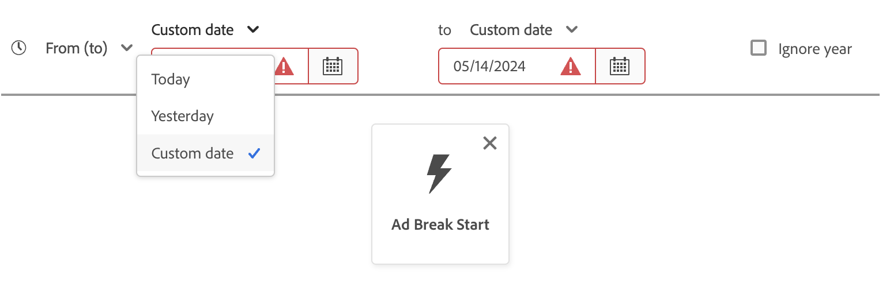
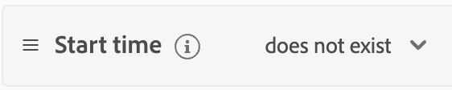

# [!DNL Segment Builder] UI 指南

>[!NOTE]
>
>本指南介绍如何使用区段生成器通过&#x200B;**区段定义**&#x200B;创建受众。 要了解如何使用受众组合创建受众，请阅读[受众组合UI指南](./audience-composition.md)。

[!DNL Segment Builder]提供了一个丰富的工作区，允许您与[!DNL Profile]数据元素进行交互。 工作区为构建和编辑规则提供了直观的控件，例如用于表示数据属性的拖放图块。

## 区段定义生成块 {#building-blocks}

>[!CONTEXTUALHELP]
>id="platform_segments_createsegment_segmentbuilder_fields"
>title="字段"
>abstract="构成区段定义的三种字段类型是属性、事件和受众。事件和受众。通过属性，您可以使用属于 XDM Individual Profile 类的 Profile属性；通过事件，可根据使用 XDM ExperienceEvent 数据元素生的操作或事件创建受众；而通过受众，可使用从外部源导入的受众。"

>[!CONTEXTUALHELP]
>id="platform_segmentation_segmentbuilder_showfullxdmschema"
>title="显示完整 XDM 架构"
>abstract="默认情况下，仅显示包含数据的字段。启用此选项可显示 XDM 架构中的所有字段。"

>[!CONTEXTUALHELP]
>id="platform_segmentation_segmentbuilder_showdeprecatedfields"
>title="显示弃用的字段"
>abstract="默认情况下不显示已弃用的 XDM 字段。启用此选项可显示已弃用的 XDM 字段。"

区段定义的基本构建块是属性和事件。 此外，现有受众中包含的属性和事件还可以用作新定义的组件。

>[!CONTEXTUALHELP]
>id="platform_segments_createsegment_segmentbuilder_summarydata"
>title="摘要数据"
>abstract="摘要数据只出现在轮廓属性中，<b>不</b> 出现在事件或受众属性中。  在以下情况下，可能不会出现轮廓属性的摘要数据： <ol><li>部分属性值的长度超过 100 个字符。</li><li>该属性的唯一值超过 3000 个。</li></ol>"

>[!NOTE]
>
>如果选择属性的信息气泡，则可以查看字段的值分布（也称为摘要数据）。 这些属性在“属性”选项卡中仅可用&#x200B;**仅**，在“事件”或“受众”选项卡中不可用。
>
>如果属性满足以下条件，则会显示摘要数据：属性的所有值都在100个字符以内，并且属性的唯一值在3000个或更少。
>
>但是，如果属性是通过关系链接到配置文件的多实体数据，则它将&#x200B;**不**&#x200B;具有摘要数据。 例如，如果您有一个名为`Vehicle`的自定义架构，则`Vehicle`架构中的&#x200B;**属性**&#x200B;将&#x200B;**不**&#x200B;包含摘要数据。

您可以在[!DNL Segment Builder]工作区左侧的&#x200B;**[!UICONTROL 字段]**&#x200B;部分中看到这些构建基块。 **[!UICONTROL 字段]**&#x200B;包含每个主要构建块的选项卡：“[!UICONTROL 属性]”、“[!UICONTROL 事件]”和“[!UICONTROL 受众]”。

### 属性

**[!UICONTROL 属性]**&#x200B;选项卡允许您浏览属于[!DNL XDM Individual Profile]类的[!DNL Profile]属性。 可以展开每个文件夹以显示其他属性，其中每个属性都是一个拼贴，可以将该拼贴拖动到工作区中心的规则生成器画布上。 本指南稍后将更详细地讨论[规则生成器画布](#rule-builder-canvas)。

### 活动

通过&#x200B;**[!UICONTROL 事件]**&#x200B;选项卡，可根据使用[!DNL XDM ExperienceEvent]数据元素发生的事件或操作创建受众。 您还可以在&#x200B;**[!UICONTROL 事件]**&#x200B;选项卡上找到事件类型，这些事件是常用事件的集合，使您能够更快地创建区段定义。

除了能够浏览[!DNL ExperienceEvent]元素之外，您还可以搜索事件类型。 事件类型使用与[!DNL ExperienceEvents]相同的编码逻辑，无需您在[!DNL XDM ExperienceEvent]类中搜索以查找正确的事件。 例如，使用搜索栏搜索“购物车”会返回事件类型“[!UICONTROL AddCart]”和“[!UICONTROL RemoveCart]”，这是构建区段定义时最常用的两个购物车操作。

任何类型的组件都可以通过在搜索栏中键入其名称来搜索，该搜索栏使用[Lucene的搜索语法](https://docs.microsoft.com/en-us/azure/search/query-lucene-syntax)。 当输入整个单词时，搜索结果将开始填充。 例如，要基于XDM字段`ExperienceEvent.commerce.productViews`构建规则，请在搜索字段中开始键入“产品视图”。 键入“product”一词后，搜索结果即会开始显示。 每个结果都包含它所属的对象层次结构。

>[!NOTE]
>
>贵组织定义的自定义架构字段最多可能需要24小时才能显示，并且可在构建规则中使用。

然后，您可以轻松地将[!DNL ExperienceEvents]和“[!UICONTROL 事件类型]”拖放到区段定义中。

默认情况下，仅显示数据存储中填充的架构字段。 这包括“[!UICONTROL 事件类型]”。 如果“[!UICONTROL 事件类型]”列表不可见，或者您只能选择“[!UICONTROL 任何]”作为“[!UICONTROL 事件类型]”，请选择&#x200B;**[!UICONTROL 字段]**&#x200B;旁边的&#x200B;**齿轮图标**，然后在&#x200B;**[!UICONTROL 可用字段]**&#x200B;下选择&#x200B;**[!UICONTROL 显示完整的XDM架构]**。 再次选择&#x200B;**齿轮图标**&#x200B;以返回&#x200B;**[!UICONTROL 字段]**&#x200B;选项卡，您现在应该能够查看多个“[!UICONTROL 事件类型]”和架构字段，无论它们是否包含数据。

#### Adobe Analytics报表包数据集

您可以将单个或多个Adobe Analytics报表包中的数据用作分段中的事件。

使用来自单个Analytics报表包的数据时，Experience Platform会自动将描述符和友好名称添加到eVar中，以便在[!DNL Segment Builder]中更轻松地查找这些字段。

使用多个Analytics报表包中的数据时，Experience Platform **无法**&#x200B;自动将描述符或友好名称添加到eVar。 因此，在使用Analytics报表包中的数据之前，必须映射到XDM字段。 有关将Analytics变量映射到XDM的更多信息，请参阅[Adobe Analytics源连接指南](../../sources/tutorials/ui/create/adobe-applications/analytics.md#mapping)。

例如，假定您有两个包含以下变量的报表包：

| 字段 | 报表包架构A | 报表包架构B |
| ----- | --------------------- | --------------------- |
| EVAR1 | 反向链接域 | 已登录Y/N |
| EVAR2 | 页面名称 | 成员忠诚度ID |
| EVAR3 | URL | 页面名称 |
| EVAR4 | 搜索词 | 产品名称 |
| event1 | 点击次数 | Page Views |
| event2 | Page Views | 购物车加货 |
| event3 | 购物车加货 | 结账次数 |
| event4 | 购买次数 | 购买次数 |

在这种情况下，您可以使用以下架构映射两个报表包：

>[!NOTE]
>
>虽然仍会填充通用eVar值，但您应&#x200B;**不应**&#x200B;在区段定义中使用它们（如果可能），因为这些值的含义可能与其报表中的原始值不同。

映射报表包后，您可以在配置文件相关的工作流程和分段中使用这些新映射的字段。

| 方案 | 合并架构体验 | 分段通用变量 | 分段映射变量 |
| -------- | ----------------------- | ----------------------------- | ---------------------------- |
| 单个报表包 | 通用变量中包含友好名称描述符。   **示例：**&#x200B;页面名称(eVar2) | <ul><li>通用变量中包含的友好名称描述符</li><li>查询使用来自特定数据集的数据，因为它是唯一的数据集</li></ul> | 查询可以使用Adobe Analytics数据和潜在的其他源。 |
| 多个报表包 | 泛型变量中未包含任何友好名称描述符。   **示例：** eVar2 | <ul><li>任何具有多个描述符的字段均以通用形式显示。 这意味着UI中不会显示友好名称。</li><li>查询可以使用包含eVar的任何数据集中的数据，这可能会导致混合或不正确的结果。</li></ul> | 查询使用来自多个数据集的正确组合结果。 |

### 受众

>[!CONTEXTUALHELP]
>id="platform_segmentation_segmentBuilder_b2b_decomposition"
>title="复杂评估"
>abstract="下面的表达式太复杂，无法作为单个受众来表达。为了在同一个区段定义中同时使用 B2B 规则和基于人员的事件，请遵循以下步骤。<ol><li>创建仅引用基于人员的事件的区段定义，并将其保存为其自己的区段定义。</li><li>在新的区段定义中，参考 B2B 规则导入之前创建的区段定义。</li></ol>"

>[!NOTE]
>
>对于在Experience Platform中创建的受众，仅显示具有&#x200B;**same**&#x200B;合并策略的受众。

**[!UICONTROL 受众]**&#x200B;选项卡列出了从外部源(如Adobe Audience Manager或Customer Journey Analytics)导入的所有受众，以及在[!DNL Experience Platform]内创建的受众。

在&#x200B;**[!UICONTROL 受众]**&#x200B;选项卡上，您可以将所有可用源作为一组文件夹查看。 选择文件夹时，可以看到可用的子文件夹和受众。 此外，您还可以选择文件夹图标（如最右侧的图像中所示）以查看文件夹结构（复选标记表示您当前所在的文件夹），并通过在树中选择文件夹名称轻松地在文件夹之间向后导航。

您可以将鼠标悬停在受众旁边的ⓘ上，以查看有关受众的信息，包括其ID、描述以及用于查找受众的文件夹层次结构。

## 规则生成器画布 {#rule-builder-canvas}

>[!IMPORTANT]
>
>截至2024年6月版，“本月”和“今年”时间限制分别表示“月至今”和“年初至今”。 例如，如果您在7月18日创建受众，查找“本月生日的所有客户”，则受众将获取其生日从7月1日到7月31日的所有客户。 8月1日，此受众将获取其生日为8月1日至8月31日的所有客户。
>
>先前，“本月”和“今年”分别代表30天和365天，未能说明包含31天和闰年的月份。
>
>为了更新受众的逻辑，请重新保存之前创建的受众。

区段定义是用于描述目标受众的关键特征或行为的规则集合。 这些规则是使用位于[!DNL Segment Builder]中心的规则生成器画布创建的。

要向区段定义添加新规则，请从&#x200B;**[!UICONTROL 字段]**&#x200B;选项卡中拖动一个拼贴，然后将其放到规则生成器画布上。 然后，将根据要添加的数据类型，为您显示特定于上下文的选项。 可用数据类型包括：字符串、日期、[!DNL ExperienceEvents]、“[!UICONTROL 事件类型]”和受众。

>[!IMPORTANT]
>
>对Adobe Experience Platform的最新更改更新了事件之间`OR`和`AND`逻辑运算符的使用。 这些更新不会影响现有区段定义。 但是，对现有区段定义和新创建区段定义的所有后续更新都将受这些更改的影响。 有关详细信息，请阅读[时间常量更新](./segment-refactoring.md)。

选择属性的值时，您将看到属性可以成为的枚举值列表。

如果从该枚举列表中选择值，该值将以实线边框列出。 但是，对于使用`meta:enum` （软）枚举的字段，您还可以从枚举列表中选择一个&#x200B;**非**&#x200B;的值。 如果您创建自己的值，则会用虚线边框突出显示该值，并警告该值不在枚举列表中。

如果要创建多个值，则可以使用批量上传同时添加所有这些值。 选择以显示&#x200B;**[!UICONTROL 批量添加值]**&#x200B;弹出框。

在&#x200B;**[!UICONTROL 批量添加值]**&#x200B;弹出窗口上，您可以上传CSV或TSV文件。

或者，您可以手动添加逗号分隔的值。

请注意，允许的最大值为250。 如果超过此数量，则需要先删除一些值，然后再添加其他值。

### 添加受众

>[!CONTEXTUALHELP]
>id="platform_segmentation_segmentbuilder_addaudiences"
>title="搜索更新"
>abstract="现有的搜索系统经过更新会使用统一搜索。统一搜索可让您更轻松、更稳健地搜索受众群体的区段会员资格。"

您可以将受众从&#x200B;**[!UICONTROL 受众]**&#x200B;选项卡拖放到规则生成器画布上，以引用新区段定义中的受众成员资格。 这样，您就可以在新的区段定义规则中包含或排除作为属性的受众成员资格。

对于使用[!DNL Segment Builder]创建的[!DNL Experience Platform]受众，您可以选择将该受众转换为在该受众的区段定义中使用的规则集。 此转换会生成规则逻辑的副本，之后可以修改该副本而不会影响原始区段定义。 在将区段定义转换为规则逻辑之前，请确保已保存对区段定义所做的任何最新更改。

>[!NOTE]
>
>从外部源添加受众时，仅引用受众成员资格。 您无法将受众转换为规则，因此用于创建原始受众的规则无法在新的区段定义中进行修改。

如果在将受众转换为规则时发生任何冲突，[!DNL Segment Builder]将尝试尽可能保留现有选项。

### 代码视图

或者，您也可以查看在[!DNL Segment Builder]中创建的规则的基于代码的版本。 在规则生成器画布中创建规则后，您可以选择&#x200B;**[!UICONTROL 代码视图]**&#x200B;以查看您的区段定义为PQL。

代码视图提供了一个按钮，允许您复制要用于API调用的区段定义的值。 要获取最新版本的区段定义，请确保已保存对区段定义进行的最新更改。

### 聚合函数

[!DNL Segment Builder]中的聚合是对数据类型为数字（双精度或整数）的一组XDM属性的计算。 区段生成器中支持的四个聚合函数为SUM、AVERAGE、MIN和MAX。

要创建聚合函数，请从左边栏中选择一个事件，并将其插入到[!UICONTROL 事件]容器中。

将事件放入事件容器后，选择省略号图标(...)，然后选择&#x200B;**[!UICONTROL 聚合]**。

现在添加了聚合。 现在，您可以选择聚合函数、要聚合的属性、相等函数以及值。 对于下面的示例，此区段定义将限定购买值之和大于$100的任何用户档案，即使每次购买小于$100也是如此。

### 计数函数 {#count-functions}

区段生成器中的计数函数用于查找指定的事件并计算其完成次数。 区段生成器中支持的计数函数为“至少”、“最多”、“确切”、“介于”和“全部”。

要创建计数函数，请从左边栏中选择一个事件并将其插入到[!UICONTROL 事件]容器中。

将事件放入事件容器后，选择[!UICONTROL 至少1]按钮。

现在添加了count函数。 现在，您可以选择计数函数和函数的值。 下面的示例将包括至少单击一次的任何事件。

### 时间限制 {#time-constraints}

时间限制允许您对基于时间的属性、事件以及事件之间的序列应用时间限制。

>[!IMPORTANT]
>
>如果您在2024年6月之前创建的区段定义具有“本月”或“今年”时间限制，则需要重新保存区段定义。 2024年6月之前，“本月”以30天为基准，而“今年”则以365天为基准。

>[!NOTE]
>
>[忽略年份时间约束](./ignore-year.md)和[规则级别时间约束](./segment-refactoring.md)之前都已重构，在链接的概述中提供了更多信息。

可用时间约束的列表如下：

+++ 可用时间限制

>[!NOTE]
>
>所有时间约束都基于UTC。
>
>此外，如果启用了[!UICONTROL 忽略年份]复选框，则年份将&#x200B;**不会**&#x200B;作为区段定义评估的一部分进行比较。

| 时间约束 | 描述 | 可以启用忽略年份 | 示例 |
| --------------- | ----------- | ------------------- | ------- |
| 今天 | 正在比较的属性或事件必须&#x200B;**发生在今天。** | 是 | {width="100" zoomable="yes"} |
| 昨天 | 进行比较的属性或事件必须&#x200B;**发生在昨天。** | 是 | {width="100" zoomable="yes"} |
| 本月 | 正在比较的属性或事件必须&#x200B;**发生在此日历月。** | 是 | {width="100" zoomable="yes"} |
| 今年 | 正在比较的属性或事件必须&#x200B;**发生在此日历年。** | 否 | {width="100" zoomable="yes"} |
| 自定义日期 | 进行比较的属性或事件必须&#x200B;**在给定的日期发生。** | 是 | {width="100" zoomable="yes"} |
| 最近 | 进行比较的属性或事件必须&#x200B;**发生在最后选定的时间段内。**&#x200B;在评估时间之前，此时间段为&#x200B;**inclusive**。 | 否 | {width="100" zoomable="yes"} |
| 从（到） | 正在比较的属性或事件&#x200B;**必须**&#x200B;在选定的两个日历日期内发生。 此时间段是两个日期的&#x200B;**包含**。 | 是，如果为自定义日期 | {width="100" zoomable="yes"} |
| 时段 | 进行比较的属性或事件必须&#x200B;**在选定的月份或年份内发生。**&#x200B;如果选择月份，则需要同时选择属性或事件发生所在的月份和年份。  如果选择年份，则只需选择属性或事件发生的年份。 如果选择月份，您还可以启用[!UICONTROL 忽略年份]复选框。 | 是 | {width="100" zoomable="yes"} |
| 范围(+/-) | 进行比较的属性或事件必须&#x200B;**在选定日期后的天、周、月或年内发生。**&#x200B;此时间段是两个日期的&#x200B;**包含**。 所选日期可以是今天、昨天或您选择的其他自定义日期。 | 是 | {width="100" zoomable="yes"} |
| 早于 | 要比较的属性或事件必须&#x200B;**发生在所选日期之前。**&#x200B;所选日期可以是您选择的自定义日期，也可以是在天、周、月或年之前的选择。 | 是 | {width="100" zoomable="yes"} |
| 之后 | 要比较的属性或事件必须&#x200B;**发生在所选日期之后。**&#x200B;所选日期可以是您选择的自定义日期，也可以是在天、周、月或年之前的选择。 | 是 | {width="100" zoomable="yes"} |
| 滚动范围 | 要比较的属性或事件必须出现在两个相对日期之间。 日期可以用秒、分钟、小时、天、周、月或年表示。 | 否 | {width="100" zoomable="yes"} |
| 下一 | 要比较的属性或事件必须在所选的下一个时间段内发生。 选定的时间段包括分钟、小时、天、周、月和年。 | 否 | {width="100" zoomable="yes"} |
| 存在 | 属性存在。 | 否 | {width="100" zoomable="yes"} |
| 不存在 | 属性不存在。 | 否 | {width="100" zoomable="yes"} |

+++

对事件应用时间限制时，可以在画布级别、卡片级别或事件之间应用该时间限制。

#### 画布级别约束

要应用画布级别的时间限制，请选择事件时间线上方显示的时钟图标。

在画布级别应用时间限制时，这会将时间限制应用于受众中的&#x200B;**所有**&#x200B;事件。

#### 卡片级别约束

要应用卡片级别限制，请选择要应用时间限制的卡片，后跟省略号图标，然后&#x200B;**[!UICONTROL 应用时间规则]**。 这允许您在&#x200B;**[!UICONTROL 事件规则]**&#x200B;容器中选择时间限制。

当您在卡片级别应用时间限制时，这会将时间限制应用于受众中的&#x200B;**指定**&#x200B;事件。

#### Between事件约束

要在事件之间应用时间约束，请在要应用时间约束的两个事件之间选择时钟图标。

在事件之间应用时间约束时，这会将时间约束应用于事件之间&#x200B;**的时间**。

此操作的可用时间约束列表与主时间约束列表不同，如下所示：

+++ 可用时间限制

| 时间约束 | 描述 |
| --------------- | ----------- |
| 之后 | 后一个事件&#x200B;**必须至少**&#x200B;发生在前一个事件之后。 |
| 范围 | 两个事件&#x200B;**必须**&#x200B;发生在时间限制内列出的时间段内。 |

>[!NOTE]
>
>当使用“晚于”时间限制时，后一个事件发生的时间可能超过在时间限制内列出的时间量。 >
>>例如，如果您有一个页面查看事件和一个签出事件，并在这两个事件之间放置了“1小时后”时间限制，则一个在页面查看事件发生2小时后具有签出事件的区段定义符合条件。
>
>此外，这两个时间约束可以相互协调使用。
>
>例如，如果您具有页面查看事件和签出事件，并且同时设置了“1小时后”和“24小时内”时间约束，则在“页面查看”事件发生12小时后具有签出事件的区段定义将符合条件，而在“页面查看”事件发生36小时后具有签出事件的区段定义将不符合条件。

+++

## 容器 {#containers}

区段规则会按其列出的顺序进行评估。 容器允许通过使用嵌套查询来控制执行顺序。

将至少一个图块添加到规则生成器画布后，即可开始添加容器。 要创建新容器，请选择图块右上角的省略号(...)，然后选择&#x200B;**[!UICONTROL 添加容器]**。

新容器显示为第一个容器的子级，但您可以通过拖动和移动容器来调整层次结构。 容器的默认行为是提供的属性、事件或受众包含“[!UICONTROL Include]”。 通过选择图块左上角的&#x200B;**[!UICONTROL 包含]**&#x200B;并选择“[!UICONTROL 排除]”，可以将规则设置为与容器条件匹配的“[!UICONTROL 排除]”配置文件。

也可以提取子容器，并通过在子容器上选择“unwrap container”将其内联添加到父容器。 选择子容器右上角的省略号(...)以访问此选项。

选择&#x200B;**[!UICONTROL 取消容器包装]**&#x200B;后，子容器将被删除，条件将内联显示。

>[!NOTE]
>
>展开容器时，请注意，逻辑将继续符合所需的区段定义。

## 合并策略

>[!CONTEXTUALHELP]
>id="platform_segmentation_createSegment_segmentBuilder_mergePolicies"
>title="合并策略"
>abstract="合并策略可以合并不同的数据集，以形成您的轮廓。Experience Platform 已提供默认合并策略，您也可以在轮廓中创建新的默认合并策略。为该受众选择与您的营销目的相匹配的合并策略。"

[!DNL Experience Platform]使您能够将来自多个来源的数据集合起来并组合这些数据，以便查看每个客户的完整视图。 在汇总此数据时，合并策略是[!DNL Experience Platform]用于确定数据优先顺序的规则以及将合并哪些数据以创建配置文件。

您可以为此受众选择与您的营销目的相匹配的合并策略，也可以使用[!DNL Experience Platform]提供的默认合并策略。 您可以创建组织特有的多个合并策略，包括创建您自己的默认合并策略。 有关为组织创建合并策略的分步说明，请先阅读[合并策略概述](../../profile/merge-policies/overview.md)。

要为区段定义选择合并策略，请选择&#x200B;**[!UICONTROL 字段]**&#x200B;选项卡上的齿轮图标，然后使用&#x200B;**[!UICONTROL 合并策略]**&#x200B;下拉菜单选择要使用的合并策略。

## 区段定义属性 {#segment-properties}

>[!CONTEXTUALHELP]
>id="platform_segments_createsegment_segmentbuilder_segmentproperties"
>title="区段定义属性"
>abstract="区段定义属性部分显示生成的区段定义的大小估计值，并显示合格轮廓的数量与轮廓总数的比较情况。这允许您在生成受众本身之前根据需要调整区段定义。"

>[!CONTEXTUALHELP]
>id="platform_segments_createsegment_segmentbuilder_refreshestimate"
>title="刷新估计值"
>abstract="您可以刷新区段定义的估计值，以立即预览符合建议的区段定义资格的轮廓数目。受众估计值是通过使用当天的示例数据的示例大小生成的。"
>additional-url="https://experienceleague.adobe.com/docs/experience-platform/segmentation/tutorials/create-a-segment.html#estimate-and-preview-an-audience" text="估计和预览受众"

>[!CONTEXTUALHELP]
>id="platform_segments_createsegment_segmentbuilder_qualifiedprofiles"
>title="符合条件的轮廓"
>abstract="符合条件的轮廓指的是实际满足区段定义规则的轮廓数量。该数字每 24 小时更新一次，更新时间为区段评估任务运行完成之后。"

>[!CONTEXTUALHELP]
>id="platform_segments_createsegment_segmentbuilder_estimatedprofiles"
>title="预估轮廓数"
>abstract="预估轮廓数指的是根据抽样任务得出的近似轮廓数量，这些轮廓可能符合区段定义的规则。这意味着将样本数据投射到更大的轮廓集上，所得出的预估数量可能会与实际符合条件的轮廓数量有所差异。预估轮廓样本具有 95% 的置信区间。  该数值会在抽样任务更新时同步更新，更新条件包括：客户数据变动超过 5%，或上一次抽样任务距今已超过 7 天。"

在构建区段定义时，工作区右侧的&#x200B;**[!UICONTROL 受众属性]**&#x200B;部分会显示所生成区段定义的大小估计值，这样您可以在构建受众本身之前根据需要调整区段定义。

**[!UICONTROL 合格配置文件]**&#x200B;指示与区段定义规则匹配的&#x200B;**实际**&#x200B;配置文件数。 该数字每 24 小时更新一次，更新时间为区段评估任务运行完成之后。

合格配置文件的时间戳表示最新的&#x200B;**批次**&#x200B;区段评估作业，对于使用流式或边缘分段评估的区段定义，该时间戳显示为&#x200B;**not**。 如果编辑区段定义，则在运行下一个区段评估作业之前，符合条件的配置文件数将保持不变。

根据&#x200B;**示例作业**，**[!UICONTROL 预计的配置文件]**&#x200B;表示大约&#x200B;**个**&#x200B;配置文件数。 这意味着将样本数据投射到更大的轮廓集上，所得出的预估数量可能会与实际符合条件的轮廓数量有所差异。估计的配置文件样本具有95%的置信区间。

当示例作业更新时，此数字也会更新；当客户数据发生大于5%的更改或上一个示例作业超过7天时，会发生这种情况。”

选择信息泡可提供错误阈值和最近示例作业时间。

在&#x200B;**[!UICONTROL 受众属性]**&#x200B;部分中，您还可以指定有关区段定义的重要信息，包括其名称、描述和评估类型。 区段定义名称用于在组织定义的区段定义中标识您的区段定义，因此应具有描述性、简洁性和唯一性。

在继续构建区段定义时，您可以通过选择&#x200B;**[!UICONTROL 查看配置文件]**&#x200B;来查看受众的分页预览。

>[!NOTE]
>
>通过使用当天样本数据的样本量生成受众估计。 如果您的配置文件存储中的实体少于100万，则使用完整数据集；对于100万到2,000万之间的实体，使用100万个实体；而对于2000多万个实体，使用总实体的5%。
>
>此外，此估计基于上次运行配置文件示例作业的时间。 这意味着，如果您使用相对日期函数，例如“今天”或“本周”，则估计值将基于最后一个配置文件示例作业运行时间进行计算。 例如，如果今天是1月24日，而最后一个配置文件示例作业在1月22日运行，则“Yesterday”相对日期函数将基于1月21日，而不是1月23日。
>
>有关为区段定义生成估算的详细信息，请参阅区段定义创建教程的[估算生成部分](../tutorials/create-a-segment.md#estimate-and-preview-an-audience)。

您还可以选择评估方法。 如果您知道要使用哪种评估方法，则可以使用下拉列表选择所需的评估方法。 如果您想了解此区段定义符合什么评估类型，可以选择带有放大镜的浏览图标以查看可用区段定义评估方法的列表。

出现[!UICONTROL 评估方法资格]弹出框。 此弹出框显示可用的评估方法，即批处理、流和边缘。 弹出框显示哪些评估方法符合条件以及哪些方法不符合条件。 根据您在区段定义中使用的参数，它可能不符合某些评估方法的条件。 有关每种评估方法的要求的更多信息，请阅读[流式分段](../methods/streaming-segmentation.md#query-types)或[边缘分段](../methods/edge-segmentation.md#query-types)概述。

完成创建段定义后，您还可以更改段定义的评估方法。 如果将评估方法从Edge或流更改为批处理，则&#x200B;**无法**&#x200B;将其更改回Edge或流。 在弹出框中选择&#x200B;**[!UICONTROL 保存]**&#x200B;后，对评估方法的更改将&#x200B;**仅**&#x200B;生效。 取消对话框将&#x200B;**保留**&#x200B;原始评估方法。

如果选取了无效的评估方法，系统将提示您更改区段定义规则或更改评估方法。

有关不同区段定义评估方法的更多信息，请参阅[分段概述](../home.md#evaluate-segments)。

## 后续步骤 {#next-steps}

区段生成器提供了一个丰富的工作流，允许您从[!DNL Real-Time Customer Profile]数据中分离出适销受众。 阅读本指南后，您现在应该能够：

- 将属性、事件和现有受众的组合用作构建块来创建区段定义。
- 使用规则生成器画布和容器可控制区段规则的执行顺序。
- 查看潜在受众的估计值，允许您根据需要调整区段定义。
- 为计划分段启用所有区段定义。
- 为流式分段启用指定的区段定义。

要了解有关[!DNL Segmentation Service]的更多信息，请继续阅读文档并通过观看相关视频补充您的学习。 若要了解有关[!DNL Segmentation Service] UI其他部分的更多信息，请阅读[[!DNL Segmentation Service] 用户指南](./overview.md)
