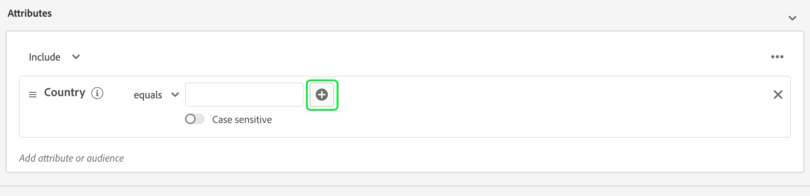

# [!DNL Segment Builder] UI指南

>[!NOTE]
>
>本指南介绍如何通过创建受众 **区段定义** 使用区段生成器。 要了解如何使用受众构成创建受众，请参阅 [受众合成UI指南](./audience-composition.md).

[!DNL Segment Builder] 提供了一个丰富的工作区，允许您与 [!DNL Profile] 数据元素。 工作区为构建和编辑规则提供了直观的控件，例如用于表示数据属性的拖放图块。

## 区段定义构建块 {#building-blocks}

>[!CONTEXTUALHELP]
>id="platform_segments_createsegment_segmentbuilder_fields"
>title="字段"
>abstract="构成区段定义的三种字段类型是属性、事件和受众。属性允许您使用属于 XDM 个人配置文件类的配置文件属性，事件允许您基于使用 XDM ExperienceEvent 数据元素发生的操作或事件创建受众，受众允许您使用从外部源导入的受众。"

区段定义的基本构建块是属性和事件。 此外，现有受众中包含的属性和事件还可以用作新定义的组件。

您可以在 **[!UICONTROL 字段]** 左侧部分 [!DNL Segment Builder] 工作区。 **[!UICONTROL 字段]** 包含每个主要构建基块的选项卡：“[!UICONTROL 属性]“， ”[!UICONTROL 活动]“”和“”[!UICONTROL 受众]“。

### 属性

此 **[!UICONTROL 属性]** 选项卡允许您浏览 [!DNL Profile] 属于 [!DNL XDM Individual Profile] 类。 可以展开每个文件夹以显示其他属性，其中每个属性都是一个拼贴，可以将该拼贴拖动到工作区中心的规则生成器画布上。 此 [规则生成器画布](#rule-builder-canvas) 本指南的后文中将更详细地讨论。

### 活动

此 **[!UICONTROL 活动]** 选项卡允许您根据发生的事件或操作创建受众，使用 [!DNL XDM ExperienceEvent] 数据元素。 您还可以在以下位置找到事件类型： **[!UICONTROL 活动]** 选项卡中，这是常用事件的集合，使您能够更快地创建区段定义。

除了能够浏览 [!DNL ExperienceEvent] 元素时，您还可以搜索事件类型。 事件类型使用与相同的编码逻辑 [!DNL ExperienceEvents]，无需您搜索 [!DNL XDM ExperienceEvent] 类以查找正确的事件。 例如，使用搜索栏搜索“cart”会返回事件类型[!UICONTROL AddCart]”和“[!UICONTROL Removcart]“”，这是构建区段定义时最常用的两个购物车操作。

任何类型的组件都可以通过在搜索栏中键入其名称来搜索，该搜索栏使用 [Lucene的搜索语法](https://docs.microsoft.com/en-us/azure/search/query-lucene-syntax). 当输入整个单词时，搜索结果将开始填充。 例如，根据XDM字段构建规则 `ExperienceEvent.commerce.productViews`，开始在搜索字段中键入“产品查看次数”。 键入“product”一词后，搜索结果即会开始显示。 每个结果都包含它所属的对象层次结构。

>[!NOTE]
>
>贵组织定义的自定义架构字段最多可能需要24小时才能显示，并且可在构建规则中使用。

然后，您可以轻松地执行拖放操作 [!DNL ExperienceEvents] 和&#39;&#39;[!UICONTROL 事件类型]”添加到您的区段定义中。

默认情况下，仅显示数据存储中填充的架构字段。 这包括&quot;[!UICONTROL 事件类型]“。 如果&quot;[!UICONTROL 事件类型]“列表不可见，或者您只能选择”[!UICONTROL 任何]&quot; as a &quot;[!UICONTROL 事件类型]”，选择 **齿轮图标** 旁边 **[!UICONTROL 字段]**，然后选择 **[!UICONTROL 显示完整XDM架构]** 下 **[!UICONTROL 可用字段]**. 选择 **齿轮图标** 再次返回到 **[!UICONTROL 字段]** 选项卡，您现在应该能够查看多个&quot;[!UICONTROL 事件类型]”和架构字段，无论它们是否包含数据。

#### Adobe Analytics报表包数据集

您可以将单个或多个Adobe Analytics报表包中的数据用作分段中的事件。

使用来自单个Analytics报告包的数据时，Platform会自动将描述符和友好名称添加到eVar中，以便更轻松地在中查找这些字段 [!DNL Segment Builder].

使用来自多个Analytics报表包的数据时，Platform **无法** 自动将描述符或友好名称添加到eVar。 因此，在使用Analytics报表包中的数据之前，必须映射到XDM字段。 有关将Analytics变量映射到XDM的更多信息，请参阅 [Adobe Analytics源连接指南](../../sources/tutorials/ui/create/adobe-applications/analytics.md#mapping).

例如，假定您有两个包含以下变量的报表包：

| 字段 | 报表包架构A | 报表包架构B |
| ----- | --------------------- | --------------------- |
| eVar1 | 反向链接域 | 已登录Y/N |
| eVar2 | 页面名称 | 成员忠诚度ID |
| eVar3 | URL | 页面名称 |
| eVar4 | 搜索词 | 产品名称 |
| event1 | 单击次数 | Page Views |
| event2 | Page Views | 购物车加货 |
| event3 | 购物车加货 | 结账 |
| event4 | 购买 | 购买 |

在这种情况下，您可以使用以下架构映射两个报表包：

>[!NOTE]
>
>当仍填充通用eVar值时，您应 **非** 在区段定义中使用这些值（如果可能），因为这些值的含义可能与它们最初在报表中的含义不同。

映射报表包后，您可以在配置文件相关的工作流程和分段中使用这些新映射的字段。

| 场景 | 合并架构体验 | 分段通用变量 | 分段映射变量 |
| -------- | ----------------------- | ----------------------------- | ---------------------------- |
| 单个报表包 | 通用变量中包含友好名称描述符。   **示例：** 页面名称(eVar2) | <ul><li>通用变量中包含的友好名称描述符</li><li>查询使用来自特定数据集的数据，因为它是唯一的数据集</li></ul> | 查询可以使用Adobe Analytics数据和潜在的其他源。 |
| 多个报告包 | 泛型变量中未包含任何友好名称描述符。   **示例：** EVAR2 | <ul><li>任何具有多个描述符的字段均以通用形式显示。 这意味着UI中不会显示友好名称。</li><li>查询可以使用包含eVar的任何数据集中的数据，这可能会导致混合或不正确的结果。</li></ul> | 查询使用来自多个数据集的正确组合结果。 |

### 受众

>[!NOTE]
>
>对于在Platform中创建的受众，仅限具有 **相同** 将显示合并策略。

此 **[!UICONTROL 受众]** 选项卡列出了从外部源(如Adobe Audience Manager)导入的所有受众，以及在其中创建的受众 [!DNL Experience Platform].

在 **[!UICONTROL 受众]** 选项卡，可以将所有可用的源作为文件夹组查看。 选择文件夹时，可以看到可用的子文件夹和受众。 此外，您还可以选择文件夹图标（如最右侧的图像中所示）以查看文件夹结构（复选标记表示您当前所在的文件夹），并通过在树中选择文件夹名称轻松地在文件夹之间向后导航。

您可以将鼠标悬停在受众旁边的ⓘ上，以查看有关受众的信息，包括其ID、描述以及用于查找受众的文件夹层次结构。

您还可以使用搜索栏(利用 [Lucene的搜索语法](https://docs.microsoft.com/en-us/azure/search/query-lucene-syntax). 在 **[!UICONTROL 受众]** 选项卡，选择顶级文件夹将显示搜索栏，允许您在该文件夹中进行搜索。 只有在输入了整个单词后，搜索结果才会开始填充。 例如，查找名为的受众 `Online Shoppers`，开始在搜索栏中键入“Online”。 一旦“在线”一词被完整输入，包含“在线”一词的搜索结果就会出现。

## 规则生成器画布 {#rule-builder-canvas}

区段定义是用于描述目标受众的关键特征或行为的规则集合。 这些规则是使用位于的中心的规则生成器画布创建的 [!DNL Segment Builder].

要向区段定义添加新规则，请从以下位置拖动一个拼贴： **[!UICONTROL 字段]** 制表符并将其放到规则生成器的画布上。 然后，将根据要添加的数据类型，为您显示特定于上下文的选项。 可用的数据类型包括：字符串、日期、 [!DNL ExperienceEvents]， &quot;[!UICONTROL 事件类型]”和受众。

>[!IMPORTANT]
>
>对Adobe Experience Platform的最新更改已更新的 `OR` 和 `AND` 事件之间的逻辑运算符。 这些更新不会影响现有区段定义。 但是，对现有区段定义和新创建区段定义的所有后续更新都将受这些更改的影响。 请阅读 [时间常量更新](./segment-refactoring.md) 以了解更多信息。

选择属性的值时，您将看到属性可以成为的枚举值列表。

如果从该枚举列表中选择值，该值将以实线边框列出。 但是，对于使用的字段 `meta:enum` （柔性）枚举，也可以选取一个值 **非** 枚举列表中。 如果您创建自己的值，则会用虚线边框突出显示该值，并警告该值不在枚举列表中。

如果要创建多个值，则可以使用批量上传同时添加所有这些值。 选择  以显示 **[!UICONTROL 批量添加值]** 弹出窗口。

在 **[!UICONTROL 批量添加值]** 弹出窗口，您可以上传CSV或TSV文件。

或者，您可以手动添加逗号分隔的值。

请注意，允许的最大值为250。 如果超过此数量，则需要先删除一些值，然后再添加其他值。

### 添加受众

您可以从以下位置拖放受众 **[!UICONTROL 受众]** 选项卡转至规则生成器画布，以引用新区段定义中的受众成员资格。 这样，您就可以在新的区段定义规则中包含或排除作为属性的受众成员资格。

对象 [!DNL Platform] 使用创建的受众 [!DNL Segment Builder]，您可以选择将受众转换为该受众的区段定义中使用的规则集。 此转换会生成规则逻辑的副本，之后可以修改该副本而不会影响原始区段定义。 在将区段定义转换为规则逻辑之前，请确保已保存对区段定义所做的任何最新更改。

>[!NOTE]
>
>从外部源添加受众时，仅引用受众成员资格。 您无法将受众转换为规则，因此用于创建原始受众的规则无法在新的区段定义中进行修改。

如果将受众转换为规则时出现任何冲突， [!DNL Segment Builder] 将尽力保留现有的选择。

### 代码视图

或者，您也可以查看在中创建的规则的基于代码的版本 [!DNL Segment Builder]. 在规则生成器画布中创建规则后，您可以选择 **[!UICONTROL 代码视图]** 将区段定义视为PQL。

代码视图提供了一个按钮，允许您复制要用于API调用的区段定义的值。 要获取最新版本的区段定义，请确保已保存对区段定义进行的最新更改。

### 聚合函数

中的聚合 [!DNL Segment Builder] 是对数据类型为数字（双精度类型或整数类型）的一组XDM属性的计算。 区段生成器中支持的四个聚合函数为SUM、AVERAGE、MIN和MAX。

要创建聚合函数，请从左边栏中选择一个事件，然后将其插入到 [!UICONTROL 活动] 容器。

将事件放入事件容器后，选择省略号图标(...)，然后选择 **[!UICONTROL 总计]**.

现在添加了聚合。 现在，您可以选择聚合函数、要聚合的属性、相等函数以及值。 对于下面的示例，此区段定义将限定购买值之和大于$100的任何用户档案，即使每次购买小于$100也是如此。

### 计数函数 {#count-functions}

区段生成器中的计数函数用于查找指定的事件并计算其完成次数。 区段生成器中支持的计数函数为“至少”、“最多”、“确切”、“介于”和“全部”。

要创建计数函数，请从左边栏中选择一个事件并将其插入到 [!UICONTROL 活动] 容器。

将事件放入事件容器后，选择 [!UICONTROL 至少1] 按钮。

现在添加了count函数。 现在，您可以选择计数函数和函数的值。 下面的示例将包括至少单击一次的任何事件。

## 容器

区段规则会按其列出的顺序进行评估。 容器允许通过使用嵌套查询来控制执行顺序。

将至少一个图块添加到规则生成器画布后，即可开始添加容器。 要创建新容器，请选择图块右上角的省略号(...)，然后选择 **[!UICONTROL 添加容器]**.

新容器显示为第一个容器的子级，但您可以通过拖动和移动容器来调整层次结构。 容器的默认行为是&#39;&#39;[!UICONTROL 包括]”提供的属性、事件或受众。 您可以将规则设置为&quot;[!UICONTROL 排除]”配置文件，通过选择 **[!UICONTROL 包括]** 图标，然后选择“[!UICONTROL 排除]“。

也可以提取子容器，并通过在子容器上选择“unwrap container”将其内联添加到父容器。 选择子容器右上角的省略号(...)以访问此选项。

选择后 **[!UICONTROL 取消容器包装]** 子容器将被移除，并且标准将内联显示。

>[!NOTE]
>
>展开容器时，请注意，逻辑将继续符合所需的区段定义。

## 合并策略

>[!CONTEXTUALHELP]
>id="platform_segmentation_createSegment_segmentBuilder_mergePolicies"
>title="合并策略"
>abstract="合并策略可以合并不同的数据集，以形成您的配置文件。Platform 已提供默认合并策略，您也可以在配置文件中创建新的默认合并策略。为该受众选择与您的营销目的相匹配的合并策略。"

[!DNL Experience Platform] 使您能够将来自多个来源的数据整合在一起，并将它们组合在一起，以便查看每个客户的完整视图。 在汇总此数据时，合并策略是指 [!DNL Platform] 使用确定数据的优先级以及将合并哪些数据以创建配置文件。

您可以选择与此受众的营销目的相匹配的合并策略，也可以使用提供的默认合并策略 [!DNL Platform]. 您可以创建组织特有的多个合并策略，包括创建您自己的默认合并策略。 有关为组织创建合并策略的分步说明，请先阅读 [合并策略概述](../../profile/merge-policies/overview.md).

要为区段定义选择合并策略，请选择 **[!UICONTROL 字段]** 选项卡，然后使用 **[!UICONTROL 合并策略]** 下拉菜单，选择要使用的合并策略。

## 区段定义属性 {#segment-properties}

>[!CONTEXTUALHELP]
>id="platform_segments_createsegment_segmentbuilder_segmentproperties"
>title="区段定义属性"
>abstract="区段定义属性部分显示生成的区段定义的大小估计值，并显示合格配置文件的数量与配置文件总数的比较情况。这允许您在构建受众本身之前根据需要调整区段定义。"

>[!CONTEXTUALHELP]
>id="platform_segments_createsegment_segmentbuilder_refreshestimate"
>title="刷新估计值"
>abstract="您可以刷新区段定义的估计值，以立即预览符合建议的区段定义资格的配置文件数目。受众估计值是通过使用当天的示例数据的示例大小生成的。"
>additional-url="https://experienceleague.adobe.com/docs/experience-platform/segmentation/tutorials/create-a-segment.html#estimate-and-preview-an-audience" text="估计和预览受众"

构建区段定义时， **[!UICONTROL 区段属性]** 工作区右侧的部分估算了生成的区段定义的大小，这使您可以在构建受众本身之前根据需要调整区段定义。

此 **[!UICONTROL 区段属性]** 还可以在部分指定有关区段定义的重要信息，包括其名称、描述和评估类型。 区段定义名称用于在组织定义的区段定义中标识您的区段定义，因此应具有描述性、简洁性和唯一性。

在继续构建区段定义时，您可以通过选择 **[!UICONTROL 查看配置文件]**.

>[!NOTE]
>
>受众估计值是通过使用当天的示例数据的示例大小生成的。如果您的配置文件存储中的实体少于100万，则使用完整数据集；对于100万到2,000万个之间的实体，使用100万个实体；而对于2000万个以上的实体，使用总实体的5%。 有关为区段定义生成估算的更多信息，请参阅 [估计值生成部分](../tutorials/create-a-segment.md#estimate-and-preview-an-audience) 创建区段定义教程的内容。

您还可以选择评估方法。 如果您知道要使用哪种评估方法，则可以使用下拉列表选择所需的评估方法。 如果您想了解此区段定义适用的评估类型，可以选择浏览图标  查看可用区段定义评估方法的列表。

此 [!UICONTROL 评估方法合格性] 弹出窗口出现。 此弹出框显示可用的评估方法，即批处理、流和边缘。 弹出框显示哪些评估方法符合条件以及哪些方法不符合条件。 根据您在区段定义中使用的参数，它可能不符合某些评估方法的条件。 如需了解每种评估方法的要求详情，请参阅 [流式分段](./streaming-segmentation.md#query-types) 或 [边缘分割](./edge-segmentation.md#query-types) 概述。

如果选取了无效的评估方法，系统将提示您更改区段定义规则或更改评估方法。

有关不同区段定义评估方法的更多信息，请参阅 [分段概述](../home.md#evaluate-segments).

## 后续步骤 {#next-steps}

区段生成器提供了一个丰富的工作流，允许您从以下各项中分离出适销受众 [!DNL Real-Time Customer Profile] 数据。 阅读本指南后，您现在应该能够：

- 将属性、事件和现有受众的组合用作构建块来创建区段定义。
- 使用规则生成器画布和容器可控制区段规则的执行顺序。
- 查看潜在受众的估计值，允许您根据需要调整区段定义。
- 为计划分段启用所有区段定义。
- 为流式分段启用指定的区段定义。

要了解有关 [!DNL Segmentation Service]，请继续阅读文档并通过观看相关视频来补充您的学习。 要了解更多关于 [!DNL Segmentation Service] ui，请阅读 [[!DNL Segmentation Service] 用户指南](./overview.md)
