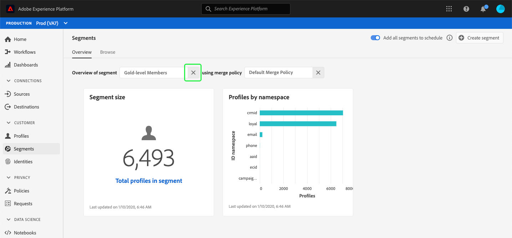

# (Alpha)段仪表板{#segment-dashboard}

>[!IMPORTANT]
>
>此文档中概述的仪表板功能当前位于alpha中，并且并非所有用户都可用。 文档和功能可能会发生变化。

Adobe Experience Platform用户界面(UI)提供了一个仪表板，您可以通过它视图有关区段的重要信息，这些信息是在每日快照中捕获的。 本指南概述了如何在UI中访问和使用区段仪表板，并提供了有关仪表板中显示的可视化的更多信息。

有关平台用户界面中所有Adobe Experience Platform分段服务功能的概述，请访问[分段服务UI指南](overview.md)。

## 细分仪表板数据

区段仪表板显示您的组织在Experience Platform中的用户档案存储中具有的属性（记录）数据的快照。 快照不包括任何事件（时间序列）数据。

快照中的属性数据与拍摄快照时在特定时间点显示的数据完全相同。 换言之，快照不是数据的近似值或样本，而且段仪表板不会实时更新。

>[!NOTE]
>
>自拍摄快照以来对数据所做的任何更改或更新将不会反映在仪表板中，直到拍摄下一个快照。

## 探索细分仪表板

要导航到平台UI中的段仪表板，请在左边栏中选择&#x200B;**[!UICONTROL 区段]**，然后选择&#x200B;**[!UICONTROL 概述]**&#x200B;选项卡以显示仪表板。

### 选择区段

要在仪表板中选择要视图的区段，请为&#x200B;**[!UICONTROL 选择区段]**&#x200B;文本框选择对话框选择器。

>[!NOTE]
>
>如果已选择区段，请首先使用`X`删除该区段，然后显示对话框选择器。
>
>

将打开&#x200B;**[!UICONTROL 选择段]**&#x200B;对话框，允许您选择要视图的段。 选择所需的区段后，使用&#x200B;**[!UICONTROL 选择]**&#x200B;返回仪表板。

### 合并策略

选择区段后，合并策略文本框将自动填充与该区段相关的合并策略。

要进一步了解如何在Experience Platform中构建区段，请访问[区段生成器UI指南](segment-builder.md)。 有关合并策略的详细信息，请首先阅读[实时客户用户档案概述](../../profile/home.md)。

### 构件和指标

区段仪表板由构件组成，构件是只读度量，提供与所选区段相关的重要信息。 构件上的“上次更新”日期和时间显示数据的最后快照拍摄的时间。

## 可用构件

Experience Platform提供多个构件，您可以使用这些构件来可视化与您的区段相关的不同指标。 选择下面构件的名称以了解更多信息：

* [[!UICONTROL 区段大小]](#segment-size)
* [[!UICONTROL 用户档案，按命名空间]](#profiles-by-namespace)

### [!UICONTROL 区段大小] {#segment-size}

**[!UICONTROL 区段大小]**&#x200B;构件显示拍摄快照时所选区段内合并用户档案的总数。 此数字是将用户档案合并策略应用于用户档案数据的结果，以便将片段合并到一起，为区段中的每个个人形成单个用户档案。

有关片段和合并用户档案的详细信息，请首先阅读[实时客户用户档案概述](../home.md)。

### [!UICONTROL 用户档案，按命名空间] {#profiles-by-namespace}

按命名空间&#x200B;]**的**[!UICONTROL &#x200B;用户档案构件显示选定区段中所有合并用户档案的命名空间细分。 按[!UICONTROL ID用户档案](换言之，将每个命名空间显示的值相加)列出的用户档案总数通常会高于段中的命名空间总数，因为一个用户档案可能具有与其关联的多个命名空间。 例如，如果客户在多个渠道上与您的品牌互动，则可能会有多个命名空间与该个别客户关联。

要了解有关身份命名空间的更多信息，请访问[Adobe Experience Platform身份服务文档](../../identity-service/home.md)。

## 其他仪表板

平台UI提供了更多仪表板，用于在Experience Platform内查看数据快照。 这些仪表板包括实时客户用户档案和[!UICONTROL 许可证使用情况]。 有关这些附加仪表板的详细信息，请从以下链接中进行选择：

* [[!DNL Profile] 仪表板](../../profile/ui/profile-dashboard.md)
* [[!UICONTROL 许可证] 用板](../../landing/license-usage-dashboard.md)

## 后续步骤

通过遵循此文档，您现在应能够找到区段仪表板并选择要视图的区段。 您还应了解可用构件中显示的度量。 要进一步了解如何在Experience PlatformUI中使用区段，请参阅[分段服务UI指南](overview.md)。