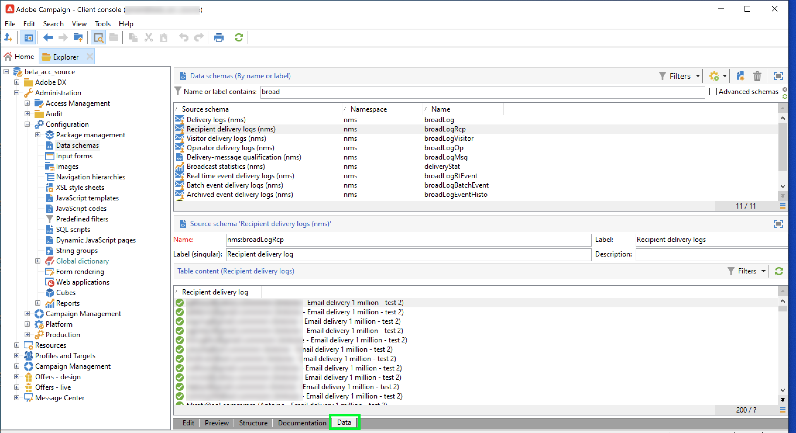
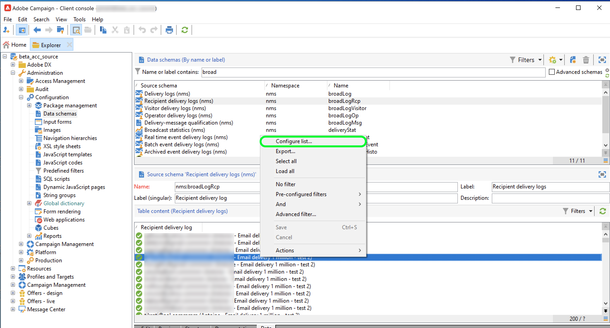

# Adobe Campaign Managed Cloud Services

Adobe Campaign Managed Cloud Services为跨渠道客户体验设计提供了一个托管平台，支持可视化活动编排、实时互动管理和跨渠道执行。 有关详细信息，请参阅[Adobe Campaign v8文档](https://experienceleague.adobe.com/docs/campaign/campaign-v8/campaign-home.html?lang=zh-Hans)。

Adobe Campaign Managed Cloud Services源连接器允许您将Adobe Campaign v8中的投放和跟踪日志数据摄取到Adobe Experience Platform中。 此连接器作为平台内的批处理源运行。

## 先决条件

在创建源连接以将Campaign v8引入Experience Platform之前，必须首先完成以下先决条件：

* [使用Adobe Campaign客户端控制台设置事件日志导入](#view-delivery-and-tracking-log-data)
* [创建XDM ExperienceEvent架构](#create-a-schema)
* [创建数据集](#create-a-dataset)

### 查看投放和跟踪日志数据 {#view-delivery-and-tracking-log-data}

>[!IMPORTANT]
>
>您必须有权访问Adobe Campaign v8客户端控制台，才能在Campaign中查看日志数据。 有关如何下载和安装客户端控制台的信息，请访问[Campaign v8文档](https://experienceleague.adobe.com/docs/campaign/campaign-v8/deploy/connect.html?lang=zh-Hans)。

通过客户端控制台登录到Campaign v8实例。 在[!DNL Explorer]选项卡下，选择[!DNL Administration]，然后选择[!DNL Configuration]。 接下来，选择[!DNL Data schemas]，然后为名称或标签应用`broadLog`筛选器。 在显示的列表中，选择名为`broadLogRcp`的收件人投放日志源架构。

接下来，选择&#x200B;**数据**&#x200B;选项卡。

在数据面板中右键单击/击键以打开上下文菜单。 从此处选择&#x200B;**配置列表……**

此时将显示列表配置窗口，为您提供一个界面，您可以在其中向预先存在的列表添加任何所需的字段以在数据面板中查看数据。

现在，您可以查看收件人投放日志，包括上一步中添加的配置字段。

>[!TIP]
>
>您可以重复相同的步骤，但筛选`tracking`以查看您的跟踪日志数据。

### 创建架构 {#create-a-schema}

接下来，为投放日志和跟踪日志创建XDM ExperienceEvent架构。 您必须将Campaign投放日志字段组应用于投放日志架构，并将Campaign跟踪日志字段组应用于跟踪日志架构。 您还必须将`externalID`字段定义为架构的主标识。

>[!NOTE]
>
>您的XDM ExperienceEvent架构必须启用Profile，才能将营销活动数据摄取到[!DNL Real-Time Customer Profile]。

有关如何创建架构的详细说明，请阅读有关[在UI中创建XDM架构](../../../xdm/tutorials/create-schema-ui.md)的指南。

### 创建数据集 {#create-a-dataset}

最后，必须为架构创建数据集。 有关如何创建数据集的详细说明，请阅读有关[在UI中创建数据集](../../../catalog/datasets/user-guide.md)的指南。

## Adobe Campaign Managed Cloud Services源的预期延迟 {#latency}

假设数据量正常且没有积压，在Experience Platform中，从Campaign事件到数据可用性的端到端延迟一般为15-30分钟，标准配置为（包括15分钟复制、微批次导出和计划的Experience Platform数据流）。 这是一个通过预定的微批次同步（通常为几十分钟）实现的近乎实时的过程，但它不是连续流式传输的。

| 场景 | 详细信息 | 预期延迟 |
| --- | --- | --- |
| 营销活动事件在中间源/消息中心实例中生成 | 在Campaign v8执行（mid/消息中心）节点上发生投放或跟踪事件（发送、打开、单击等）。 | Campaign运行时中的实时（当前在Experience Platform中不可见）。 |
| 从运行时复制到Campaign营销数据库 | 事件数据从中间/消息中心复制到Campaign营销数据库（[!DNL Snowflake]或[!DNL Postgres]，具体取决于客户规模）。 标准集成模式采用常规复制作业。 | 约15分钟，基于标准的15分钟复制节奏。 |
| 从Campaign营销数据库导出到登陆区域（如[!DNL Data Landing Zone]、[!DNL Amazon S3]或[!DNL Azure Blob]） | Campaign中的导出工作流（导出服务）按计划运行，以提取新的/更改的投放和跟踪日志，并将其作为微批次写入基于文件的登陆区域。 | 分钟，加上导出计划时间间隔。 |
| Experience Platform源数据流选取导出的文件 | Adobe Campaign Managed Cloud Services源在Experience Platform [!DNL Flow Service]中配置为批次数据流。 它定期扫描登陆区域，摄取新文件，并将它们写入配置的ExperienceEvent数据集中。 监控会公开“成功的批次”和“失败的批次”。 | 分钟，加上数据流计划时间间隔。 |
| 数据湖和实时客户资料中可用的数据 | 摄取批次后，记录将登陆数据湖，并（如果数据集启用了配置文件）更新插入实时客户配置文件中。 适用于批量摄取和配置文件摄取的标准Experience Platform SLA。 | 在与数据流相同的运行窗口内，即，在批处理运行完成后不久。 记录通常在几分钟内可用于下游服务。 |

{style="table-layout:auto"}

## 使用Adobe Campaign Managed Cloud Services UI创建Experience Platform源连接

现在，您已在Campaign客户端控制台中访问数据日志，创建了架构和数据集，接下来可继续创建源连接以将Campaign Managed Services数据导入Experience Platform。

有关如何将Campaign v8投放日志和跟踪日志数据引入Experience Platform的详细说明，请阅读有关在UI中创建Campaign Managed Services源连接的指南[&#128279;](../../tutorials/ui/create/adobe-applications/campaign.md)。

>[!IMPORTANT]
>
>在极端情况下，最近删除的电子邮件收件人与电子邮件的交互可能会将个人信息重新摄取到Experience Platform。 在某些情况下，这可以为该用户重新启用营销。
>
>* 此方案仅在Experience Platform中执行隐私请求到Adobe Campaign Classic中执行隐私请求之间处于活动状态。 在Campaign中执行请求后，会进行检查以确保未将记录导出到Campaign。 请在执行72小时后重新发出GDPR请求以解决此问题。
