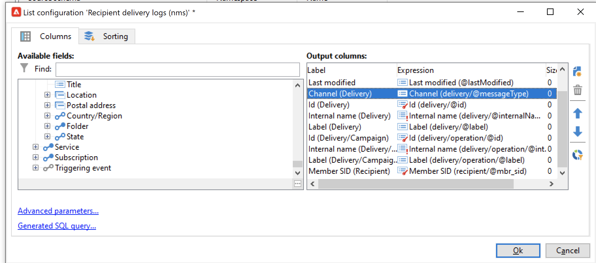
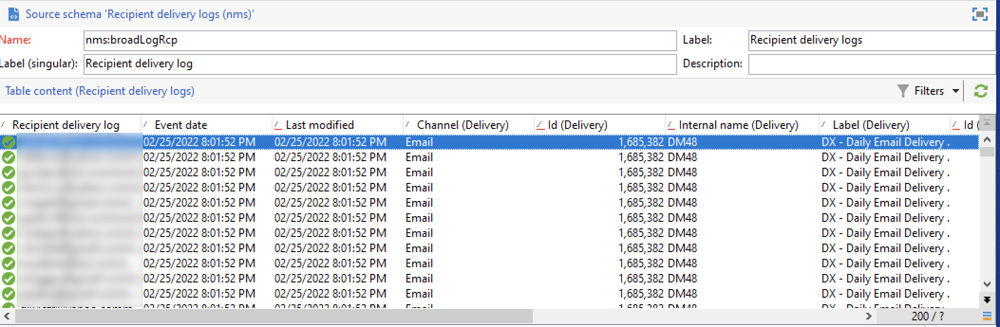

# Adobe Campaign Managed Cloud Services

Adobe Experience Platform允许从外部源摄取数据，同时让您能够使用Platform服务来构建、标记和增强传入数据。 您可以从各种来源(如Adobe应用程序、基于云的存储、数据库和许多其他来源)中摄取数据。

Adobe Campaign Managed Cloud Services为跨渠道客户体验设计提供了Managed Services平台，并为可视化的活动编排、实时互动管理和跨渠道执行提供了环境。 访问 [Adobe Campaign v8文档](https://experienceleague.adobe.com/docs/campaign/campaign-v8/campaign-home.html?lang=en) 了解更多信息。

Adobe Campaign Managed Cloud Services源允许您将Adobe Campaign v8投放日志和跟踪日志数据引入Adobe Experience Platform。

## 先决条件

在创建源连接以将Campaign v8Experience Platform之前，必须首先完成以下先决条件：

* [使用Adobe Campaign客户端控制台设置事件日志导入](#view-delivery-and-tracking-log-data)
* [创建XDM ExperienceEvent架构](#create-a-schema)
* [创建数据集](#create-a-dataset)

### 查看投放和跟踪日志数据 {#view-delivery-and-tracking-log-data}

>[!IMPORTANT]
>
>您必须有权访问Adobe Campaign v8客户端控制台，才能在Campaign中查看日志数据。 访问 [Campaign v8文档](https://experienceleague.adobe.com/docs/campaign/campaign-v8/deploy/connect.html?lang=en) 有关如何下载和安装客户端控制台的信息。

通过客户端控制台登录到Campaign v8实例。 在 [!DNL Explorer] 选项卡，选择 [!DNL Administration] 然后选择 [!DNL Configuration]. 接下来，选择 [!DNL Data schemas] 然后应用 `broadLog` 筛选名称或标签。 在显示的列表中，选择名为的收件人投放日志源架构 `broadLogRcp`.

接下来，选择 **数据** 选项卡。

在数据面板中右键单击/击键可打开上下文菜单。 从此处选择 **配置列表……**

此时将显示列表配置窗口，为您提供一个界面，您可以在其中将任何所需的字段添加到预先存在的列表，以在数据面板中查看数据。

现在，您可以查看收件人投放日志，包括上一步中添加的配置字段。

>[!TIP]
>
>您可以重复相同的步骤，但过滤 `tracking` 以查看您的跟踪日志数据。

### 创建架构 {#create-a-schema}

接下来，为投放日志和跟踪日志创建XDM ExperienceEvent架构。 您必须将Campaign投放日志字段组应用于投放日志架构，将Campaign跟踪日志字段组应用于跟踪日志架构。 您还必须定义 `externalID` 字段作为架构的主要标识。

>[!NOTE]
>
>您的XDM ExperienceEvent架构必须启用配置文件才能将Campaign数据摄取到 [!DNL Real-Time Customer Profile].

有关如何创建架构的详细说明，请阅读以下指南中的 [在UI中创建XDM架构](../../../xdm/tutorials/create-schema-ui.md).

### 创建数据集 {#create-a-dataset}

最后，必须为架构创建数据集。 有关如何创建数据集的详细说明，请阅读 [在UI中创建数据集](../../../catalog/datasets/user-guide.md).

## 使用Platform UI创建Adobe Campaign Managed Cloud Services源连接

现在，您已在Campaign客户端控制台中访问数据日志，创建了架构和数据集，接下来可以继续创建源连接以将Campaign Managed Services数据导入Platform。

有关如何将Campaign v8投放日志和跟踪日志数据导入Experience Platform的详细说明，请阅读以下指南： [在UI中创建营销活动Managed Services源连接](../../tutorials/ui/create/adobe-applications/campaign.md).
