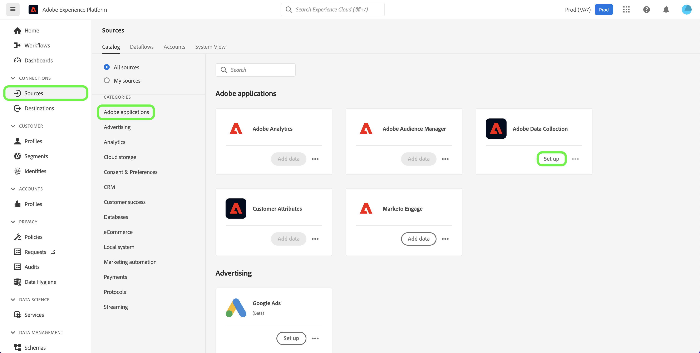

# Adobe数据收集

Adobe Experience Platform提供了一套技术，允许您从客户端源收集客户体验数据，并将其发送到Adobe Experience Platform边缘网络，在该网络中，可以在几秒内对数据进行扩充、转换并分发到Adobe或非Adobe目标。

Adobe数据收集的源集成允许您通过源目录访问数据收集Experience Edge数据，包括为数据收集进行数据准备，并改进了对警告的支持。

## 使用源工作区访问Adobe数据收集

在平台UI中，选择 **[!UICONTROL 源]** 从左侧导航栏访问 [!UICONTROL 源] 工作区。 的 [!UICONTROL 目录] 屏幕会显示您可以创建帐户的各种源。

您可以从屏幕左侧的目录中选择相应的类别。 或者，您可以使用搜索选项找到要处理的特定源。

在 [!UICONTROL Adobe应用程序] 类别，选择 **[!UICONTROL Adobe数据收集]**，然后选择 **[!UICONTROL 设置]**.

数据收集UI将显示在 **[!UICONTROL 数据流]** 选项卡。

数据流是一种配置，用于告知边缘网络您希望将数据发送到的位置。 具体而言，数据流指定要将数据发送到的Experience Cloud产品，以及希望如何处理数据并将其存储在每个产品中。

有关如何使用数据收集UI的完整步骤，请参阅 [数据收集端到端概述](../../../rtcdp-connections/e2e.md).

## 后续步骤

通过阅读本文档，您学习了如何使用源工作区访问数据收集UI。 有关数据收集的更多信息，请参阅 [数据收集概述](../../../rtcdp-connections/e2e.md).
