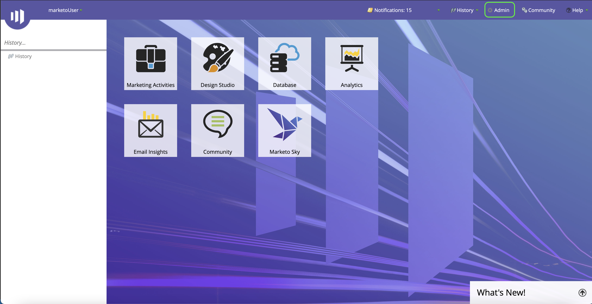
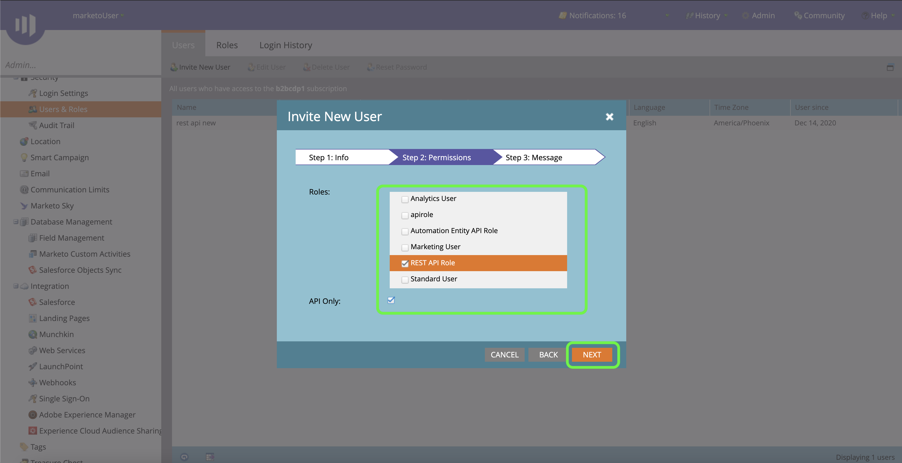
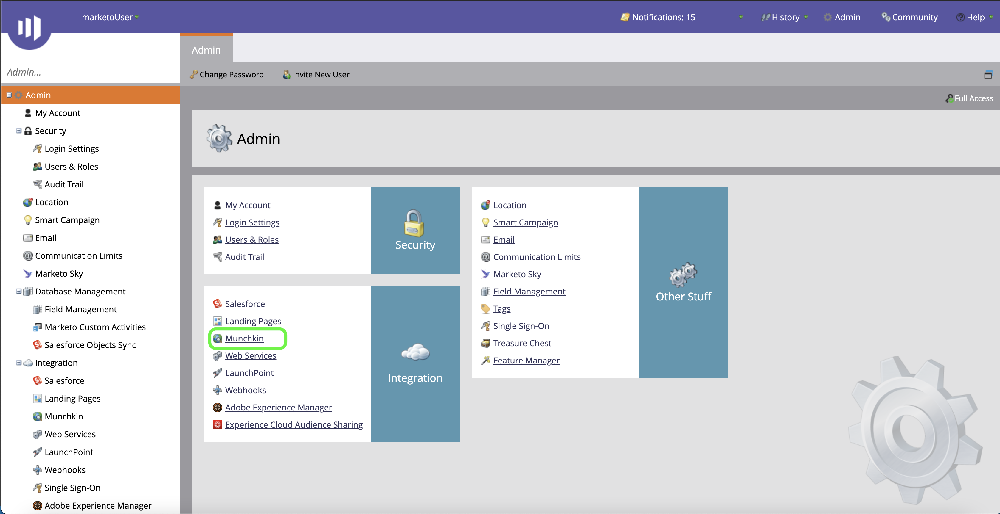

# 验证您的 [!DNL Marketo Engage] 源连接器

在创建 [!DNL Marketo Engage] (以下简称“ ”[!DNL Marketo]“)源连接器，您必须首先通过 [!DNL Marketo] 界面，以及检索Munchkin ID、客户端ID和客户端密钥的值。

以下文档提供了有关如何获取身份验证凭据以创建 [!DNL Marketo] 源连接器。

## 设置新角色

获取身份验证凭据的第一步是通过 [[!DNL Marketo]](https://app-sjint.marketo.com/#MM0A1) 界面。

登录 [!DNL Marketo] 并选择 **[!DNL Admin]** 从顶部导航栏中。

此 *[!DNL Users & Role]s* 页面包含有关用户、角色和登录历史记录的信息。 要创建新角色，请选择 **[!DNL Roles]** 从顶部标题中，然后选择 **[!DNL New Role]**.

此时会显示 **[!DNL Create New Role]** 对话框。提供名称和描述，然后选择要为此角色授予的权限。 权限仅限于特定工作区，用户只能在其具有权限的工作区中执行操作。

选择想要授予的权限后，选择 **[!DNL Create]**.

在使用创建角色时，您可以管理API上受限制的权限 [!DNL Marketo]. 您无需选择“访问API”，而是可以通过选择以下权限为角色提供最低级别的访问权限：

* [!DNL Read-Only Activity]
* [!DNL Read-Only Assets]
* [!DNL Read-Only Campaign]
* [!DNL Read-Only Company]
* [!DNL Read-Only Custom Object]
* [!DNL Read-Only Custom Object Type]
* [!DNL Read-Only Named Account]
* [!DNL Read-Only Named Account List]
* [!DNL Read-Only Opportunity]
* [!DNL Read-Only Person]
* [!DNL Read-Only Sales Person]

## 设置新用户

与角色类似，您可以通过 **[!DNL Users & Roles]** 页面。 此 **[!DNL Users]** 页面提供当前在Marketo中设置的活动用户的列表。 选择 **[!DNL Invite New User]** 以配置新用户。

弹出对话框菜单出现。 为您的电子邮件、名字、姓氏和原因提供适当的信息。 在此步骤中，您还可以为正在邀请的新用户帐户的访问设置一个到期日期。 完成后，选择 **[!DNL Next]**.

>[!IMPORTANT]
>
>在设置新用户时，必须向用户分配访问权限，并且该用户严格专用于您创建的自定义服务。

选择中的相应字段 **[!DNL Permissions]** 步骤，然后选择 **[!DNL API Only]** 用于为新用户提供API角色的复选框。 选择 **[!DNL Next]** 以继续。

要完成该过程，请选择 **[!DNL Send]**.

## 设置自定义服务

建立新用户后，您可以设置自定义服务以检索新凭据。 从管理页面中，选择 **[!DNL LaunchPoint]**.

此 **[!DNL Installed services]** 页面包含现有服务的列表，要创建新的自定义服务，请选择 **[!DNL New]** 然后选择 **[!DNL New Service]**.

为您的新服务提供一个描述性显示名称，然后选择 **[!DNL Custom]** 从 **[!DNL Service]** 下拉菜单。 提供适当的描述，然后从中选择要预配的用户 **[!DNL API Only User]** 下拉菜单。 填写完必要的详细信息后，选择 **[!DNL Create]** 以创建新的自定义服务。

## 获取您的客户端ID和客户端密钥

通过创建新的自定义服务，您现在可以检索客户端ID和客户端密钥的值。 从 **[!DNL Installed Services]** 菜单，找到要访问的自定义服务，然后选择 **[!DNL View Details]**.

此时将显示一个对话框，其中包含您的客户端ID和客户端密钥。

## 获取Munchkin ID

要验证您的身份，您必须完成的最后一个步骤 [!DNL Marketo] 源连接器用于检索您的Munchkin ID。 从管理页面中，选择 **[!DNL Munchkin]** 在 **[!DNL Integration]** 面板。

此 *[!DNL Munchkin]* 页面，您的唯一Munchkin ID列在面板顶部。

结合使用客户端ID和客户端密钥，您可以使用Munchkin ID配置新帐户和 [新建 [!DNL Marketo] 源连接](../../../tutorials/ui/create/adobe-applications/marketo.md) 在Experience Platform时。
