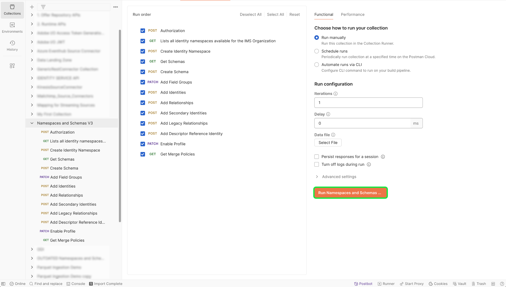

# B2B命名空间和架构

>[!AVAILABILITY]
>
>您必须有权访问[Adobe Real-Time Customer Data Platform B2B edition](../../../../rtcdp/b2b-overview.md)，您的B2B架构才能在[实时客户档案](../../../../profile/home.md)中获得资格。

>[!NOTE]
>
>您可以使用Adobe Experience Platform UI中的模板来加速B2B和B2C数据的资源创建。 有关详细信息，请参阅[在Experience Platform UI中使用模板](../../../tutorials/ui/templates.md)指南。

请阅读本文档，了解有关为要与B2B源一起使用的命名空间和模式设置的底层信息。 本文档还提供了有关设置生成B2B命名空间和架构所需的Postman自动化实用程序的详细信息。

## 设置B2B命名空间和模式自动生成实用程序

>[!IMPORTANT]
>
>已弃用服务帐户(JWT)凭据。 您必须确保在2025年1月27日之前将您的应用程序或集成迁移到新的OAuth服务器到服务器凭据。 请阅读以下文档，了解有关[如何将JWT凭据迁移到OAuth服务器到服务器凭据](https://developer.adobe.com/developer-console/docs/guides/authentication/ServerToServerAuthentication/migration/)的详细步骤。

请参阅以下文档，了解有关如何设置[!DNL Postman]环境以支持B2B命名空间和架构自动生成实用程序的先决条件信息。

- 您可以从此[GitHub存储库](https://github.com/adobe/experience-platform-postman-samples/tree/master/Postman%20Collections/CDP%20Namespaces%20and%20Schemas%20Utility)下载命名空间和架构自动生成实用程序集合和环境。
- 有关如何使用Experience Platform API的信息，包括有关如何收集所需标头的值和读取示例API调用的详细信息，请参阅[Experience Platform API快速入门](../../../../landing/api-guide.md)指南。
- 有关如何生成Experience Platform API凭据的信息，请参阅有关[身份验证和访问Experience Platform API](../../../../landing/api-authentication.md)的教程。
- 有关如何为Experience Platform API设置[!DNL Postman]的信息，请参阅[设置开发人员控制台和 [!DNL Postman]](../../../../landing/postman.md)上的教程。

设置Experience Platform开发人员控制台和[!DNL Postman]后，您现在可以开始将相应的环境值应用于您的[!DNL Postman]环境。

下表包含示例值以及有关填充[!DNL Postman]环境的其他信息：

| Variable | 描述 | 示例 |
| --- | --- | --- |
| `CLIENT_SECRET` | 用于生成`{ACCESS_TOKEN}`的唯一标识符。 有关如何检索[的信息，请参阅有关](../../../../landing/api-authentication.md)身份验证和访问Experience Platform API`{CLIENT_SECRET}`的教程。 | `{CLIENT_SECRET}` |
| `API_KEY` | 用于对调用Experience Platform API进行身份验证的唯一标识符。 有关如何检索[的信息，请参阅有关](../../../../landing/api-authentication.md)身份验证和访问Experience Platform API`{API_KEY}`的教程。 | `c8d9a2f5c1e03789bd22e8efdd1bdc1b` |
| `ACCESS_TOKEN` | 完成对Experience Platform API的调用所需的授权令牌。 有关如何检索[的信息，请参阅有关](../../../../landing/api-authentication.md)身份验证和访问Experience Platform API`{ACCESS_TOKEN}`的教程。 | `Bearer {ACCESS_TOKEN}` |
| `META_SCOPE` | 对于[!DNL Marketo]，此值是固定的，并且始终设置为： `ent_dataservices_sdk`。 | `ent_dataservices_sdk` |
| `CONTAINER_ID` | `global`容器包含所有标准Adobe和Experience Platform合作伙伴提供的类、架构字段组、数据类型和架构。 对于[!DNL Marketo]，此值是固定的，并且始终设置为`global`。 | `global` |
| `TECHNICAL_ACCOUNT_ID` | 用于集成到Adobe I/O的凭据。 | `D42AEVJZTTJC6LZADUBVPA15@techacct.adobe.com` |
| `IMS` | Identity Management System (IMS)提供了对Adobe服务进行身份验证的框架。 对于[!DNL Marketo]，此值是固定的，并且始终设置为： `ims-na1.adobelogin.com`。 | `ims-na1.adobelogin.com` |
| `IMS_ORG` | 公司实体，可以拥有产品或服务，也可以为其授予产品和服务许可证，并允许其成员访问。 有关如何检索[信息的说明，请参阅有关 [!DNL Postman]](../../../../landing/postman.md)设置开发人员控制台和`{ORG_ID}`的教程。 | `ABCEH0D9KX6A7WA7ATQE0TE@adobeOrg` |
| `SANDBOX_NAME` | 您正在使用的虚拟沙盒分区的名称。 | `prod` |
| `TENANT_ID` | 一个ID，用于确保您创建的资源被正确命名并包含在您的组织内。 | `b2bcdpproductiontest` |
| `PLATFORM_URL` | 您对其进行API调用的URL端点。 此值是固定的，并且始终设置为： `http://platform.adobe.io/`。 | `http://platform.adobe.io/` |

{style="table-layout:auto"}

### 运行脚本

设置了[!DNL Postman]收藏集和环境后，您现在可以通过[!DNL Postman]界面运行脚本。

在[!DNL Postman]界面中，选择自动生成器实用工具的根文件夹，然后从顶部标题中选择&#x200B;**[!DNL Run]**。

出现[!DNL Runner]接口。 在此处，确保选中所有复选框，然后选择&#x200B;**[!DNL Run Namespaces and Schemas Autogeneration Utility]**。

成功的请求将创建B2B所需的命名空间和架构。

## B2B命名空间

身份命名空间是[[!DNL Identity Service]](../../../../identity-service/home.md)的组件，用于区分身份的上下文。 完全限定的身份包括身份值和命名空间。 有关详细信息，请阅读[命名空间概述](../../../../identity-service/features/namespaces.md)。

B2B命名空间在实体的主标识中使用。

下表包含有关B2B命名空间的基础设置的信息。

>[!NOTE]
>
>请向左/向右滚动以查看表格的全部内容。

| 显示名称 | 身份标识符号 | 身份类型 |
| --- | --- | --- |
| B2B人员 | `b2b_person` | `CROSS_DEVICE` |
| B2B 帐户 | `b2b_account` | `B2B_ACCOUNT` |
| B2B 机会 | `b2b_opportunity` | `B2B_OPPORTUNITY` |
| B2B机会人员关系 | `b2b_opportunity_person_relation` | `B2B_OPPORTUNITY_PERSON` |
| B2B 营销活动 | `b2b_campaign` | `B2B_CAMPAIGN` |
| B2B 营销活动成员 | `b2b_campaign_member` | `B2B_CAMPAIGN_MEMBER` |
| B2B 营销列表 | `b2b_marketing_list` | `B2B_MARKETING_LIST` |
| B2B 营销列表成员 | `b2b_marketing_list_member` | `B2B_MARKETING_LIST_MEMBER` |
| B2B帐户人员关系 | `b2b_account_person_relation` | `B2B_ACCOUNT_PERSON` |

{style="table-layout:auto"}

## B2B架构

Experience Platform使用架构，以一致且可重用的方式描述数据结构。 通过在系统中以一致的方式定义数据，更容易保留含义并因此从数据中获取价值。

将数据引入Experience Platform之前，必须构建架构以描述数据的结构并对每个字段中可以包含的数据类型提供约束。 架构由一个基类以及零个或多个架构字段组组成。

有关架构组合模型的更多信息，包括设计原则和最佳实践，请参阅架构组合的[基础知识](../../../../xdm/schema/composition.md)。

下表包含有关B2B架构的基础设置的信息。

>[!NOTE]
>
>请向左/向右滚动以查看表格的全部内容。

| 架构名称 | 基类 | 字段组 | 架构中的[!DNL Profile] | 主要身份标识 | 主要身份标识命名空间 | 辅助标识 | 辅助身份命名空间 | 关系 | 注释 |
| --- | --- | --- | --- | --- | --- | --- | --- | --- | --- |
| B2B 帐户 | [XDM业务帐户](../../../../xdm/classes/b2b/business-account.md) | XDM业务帐户详细信息 | 已启用 | 基类中的`accountKey.sourceKey` | B2B 帐户 | 基类中的`extSourceSystemAudit.externalKey.sourceKey` | B2B 帐户 | <ul><li>XDM业务帐户详细信息字段组中的`accountParentKey.sourceKey`</li><li>目标属性： `/accountKey/sourceKey`</li><li>类型：一对一</li><li>引用架构：B2B帐户</li><li>命名空间： B2B帐户</li></ul> |  |
| B2B人员 | [XDM 轮廓](../../../../xdm/classes/individual-profile.md) | <ul><li>XDM业务人员详细信息</li><li>XDM业务人员组件</li><li>Identitymap</li><li>同意和偏好设置详细信息</li></ul> | 已启用 | XDM业务人员详细信息字段组中的`b2b.personKey.sourceKey` | B2B人员 | <ol><li>XDM业务人员详细信息字段组的`extSourceSystemAudit.externalKey.sourceKey`</li><li>XDM业务人员详细信息字段组的`workEmail.address`</ol></li> | <ol><li>B2B人员</li><li>电子邮件</li></ol> | <ul><li>XDM业务人员组件字段组的`personComponents.sourceAccountKey.sourceKey`</li><li>类型：多对一</li><li>引用架构：B2B帐户</li><li>命名空间： B2B帐户</li><li>目标属性： accountKey.sourceKey</li><li>来自当前架构的关系名称：帐户</li><li>引用架构中的关系名称：人员</li></ul> |  |
| B2B 机会 | [XDM业务机会](../../../../xdm/classes/b2b/business-opportunity.md) | XDM业务机会详细信息 | 已启用 | 基类中的`opportunityKey.sourceKey` | B2B 机会 | 基类中的`extSourceSystemAudit.externalKey.sourceKey` | B2B 机会 | <ul><li>基类中的`accountKey.sourceKey`</li><li>类型：多对一</li><li>引用架构：B2B帐户</li><li>命名空间： B2B帐户</li><li>目标属性： `accountKey.sourceKey`</li><li>来自当前架构的关系名称：帐户</li><li>引用架构中的关系名称：机会</li></ul> |  |
| B2B机会人员关系 | [XDM业务机会人员关系](../../../../xdm/classes/b2b/business-opportunity-person-relation.md) | None | 已启用 | 基类中的`opportunityPersonKey.sourceKey` | B2B机会人员关系 | | | **第一个关系**<ul><li>基类中的`personKey.sourceKey`</li><li>类型：多对一</li><li>引用架构：B2B人员</li><li>命名空间： B2B人员</li><li>目标属性： b2b.personKey.sourceKey</li><li>来自当前架构的关系名称：人员</li><li>引用架构中的关系名称：机会</li></ul>**第二个关系**<ul><li>基类中的`opportunityKey.sourceKey`</li><li>类型：多对一</li><li>引用架构：B2B机会 </li><li>命名空间： B2B机会 </li><li>目标属性： `opportunityKey.sourceKey`</li><li>来自当前架构的关系名称：机会</li><li>引用架构中的关系名称：人员</li></ul> |  |
| B2B 营销活动 | [XDM商业营销活动](../../../../xdm/classes/b2b/business-campaign.md) | XDM商业营销活动详细信息 | 已启用 | 基类中的`campaignKey.sourceKey` | B2B 营销活动 | | |  |
| B2B 营销活动成员 | [XDM商业营销活动成员](../../../../xdm/classes/b2b/business-campaign-members.md) | XDM商业营销活动成员详细信息 | 已启用 | 基类中的`ccampaignMemberKey.sourceKey` | B2B 营销活动成员 | | | **第一个关系**<ul><li>基类中的`personKey.sourceKey`</li><li>类型：多对一</li><li>引用架构：B2B人员</li><li>命名空间： B2B人员</li><li>目标属性： `b2b.personKey.sourceKey`</li><li>来自当前架构的关系名称：人员</li><li>引用架构中的关系名称：营销活动</li></ul>**第二个关系**<ul><li>基类中的`campaignKey.sourceKey`</li><li>类型：多对一</li><li>引用架构：B2B营销活动</li><li>命名空间： B2B营销活动</li><li>目标属性： `campaignKey.sourceKey`</li><li>来自当前架构的关系名称：营销活动</li><li>引用架构中的关系名称：人员</li></ul> |  |
| B2B 营销列表 | [XDM商业营销列表](../../../../xdm/classes/b2b/business-marketing-list.md) | None | 已启用 | 基类中的`marketingListKey.sourceKey` | B2B 营销列表 | None | None | None | 静态列表未从[!DNL Salesforce]同步，因此没有辅助标识。 |
| B2B 营销列表成员 | [XDM商业营销列表成员](../../../../xdm/classes/b2b/business-marketing-list-members.md) | None | 已启用 | 基类中的`marketingListMemberKey.sourceKey` | B2B 营销列表成员 | None | None | **第一个关系**<ul><li>基类中的`PersonKey.sourceKey`</li><li>类型：多对一</li><li>引用架构：B2B人员</li><li>命名空间： B2B人员</li><li>目标属性： `b2b.personKey.sourceKey`</li><li>来自当前架构的关系名称：人员</li><li>引用架构中的关系名称：营销列表</li></ul>**第二个关系**<ul><li>基类中的`marketingListKey.sourceKey`</li><li>类型：多对一</li><li>引用架构：B2B营销列表</li><li>命名空间： B2B营销列表</li><li>目标属性： `marketingListKey.sourceKey`</li><li>来自当前架构的关系名称：营销列表</li><li>引用架构中的关系名称：人员</li></ul> | 静态列表成员未从[!DNL Salesforce]同步，因此没有辅助标识。 |
| B2B帐户人员关系 | [XDM业务帐户人员关系](../../../../xdm/classes/b2b/business-account-person-relation.md) | 身份标识映射 | 已启用 | 基类中的`accountPersonKey.sourceKey` | B2B帐户人员关系 | None | None | **第一个关系**<ul><li>基类中的`personKey.sourceKey`</li><li>类型：多对一</li><li>引用架构：B2B人员</li><li>命名空间： B2B人员</li><li>目标属性： `b2b.personKey.SourceKey`</li><li>来自当前架构的关系名称：人员</li><li>引用架构中的关系名称：帐户</li></ul>**第二个关系**<ul><li>基类中的`accountKey.sourceKey`</li><li>类型：多对一</li><li>引用架构：B2B帐户</li><li>命名空间： B2B帐户</li><li>目标属性： `accountKey.sourceKey`</li><li>来自当前架构的关系名称：帐户</li><li>引用架构中的关系名称：人员</li></ul> |  |

{style="table-layout:auto"}

## 后续步骤

要了解如何将您的[!DNL Marketo]数据连接到Experience Platform，请参阅关于在UI中创建Marketo源连接器的教程。

<!--

| B2B Activity | [XDM ExperienceEvent](../../../../xdm/classes/experienceevent.md) | <ul><li>Visit WebPage</li><li>New Lead</li><li>Convert Lead</li><li>Add To List</li><li>Remove From List</li><li>Add To Opportunity</li><li>Remove From Opportunity</li><li>Form Filled Out</li><li>Link Clicks</li><li>Email Delivered</li><li>Email Opened</li><li>Email Clicked</li><li>Email Bounced</li><li>Email Bounced Soft</li><li>Email Unsubscribed</li><li>Score Changed</li><li>Opportunity Updated</li><li>Status in Campaign Progression Changed</li><li>Person Identifier</li><li>Marketo Web URL</li><li>Interesting Moment</li><li>Call Webhook</li><li>Change Campaign Cadence</li><li>Revenue Stage Changed</li><li>Merge Leads</li><li>Email Sent</li><li>Change Campaign Stream</li><li>Add to Campaign</li></ul> | Enabled | `personKey.sourceKey` of Person Identifier field group | B2B Person | None | None | | `ExperienceEvent` is different from entities. The identity of experience event is the person who did the activity. |

-->