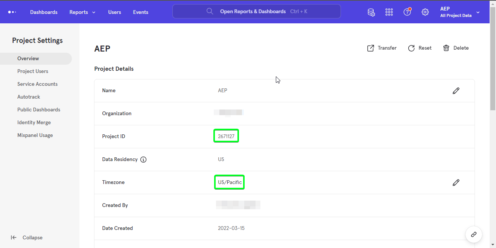
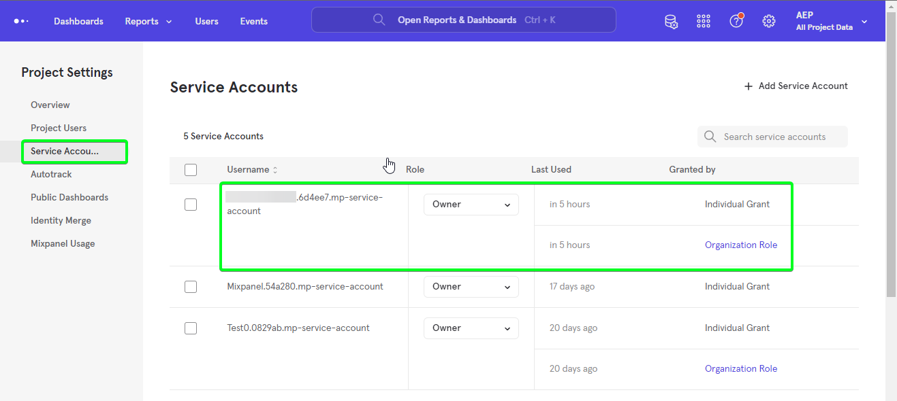

# （测试版） [!DNL Mixpanel]

>[!NOTE]
>
>的 [!DNL Mixpanel] 来源为测试版。 请参阅 [源概述](../../home.md#terms-and-conditions) 有关使用测试版标记的源的详细信息。

Adobe Experience Platform允许从外部源摄取数据，同时让您能够使用Platform服务来构建、标记和增强传入数据。 您可以从各种源摄取数据，如Adobe应用程序、基于云的存储、数据库和许多其他源。

Experience Platform支持从第三方分析应用程序摄取数据。 对分析提供商的支持包括 [!DNL Mixpanel].

[[!DNL Mixpanel]](https://www.mixpanel.com) 是一款产品分析工具，可用于捕获有关用户如何与数字产品交互的数据。 Mixpanel允许您通过简单的交互式报表分析此产品数据，通过该报表，您只需单击几下即可查询和可视化数据。

源可利用 [Mixpanel事件导出API >下载](https://developer.mixpanel.com/reference/raw-event-export) 在收到事件数据并将其存储在 [!DNL Mixpanel]，以及所有事件属性(包括 `distinct_id`)以及事件发送到Experience Platform的确切时间戳。 Mixpanel使用载体令牌作为验证机制与Mixpanel事件导出API通信。

## IP地址允许列表

在使用源连接器之前，必须将IP地址列表添加到允许列表。 无法将特定于区域的IP地址添加到允许列表，在使用源时可能会导致错误或性能不佳。 请参阅 [IP地址允许列表](../../ip-address-allow-list.md) 页面以了解更多信息。

## 验证 [!DNL Mixpanel] 帐户

本节概述了为验证您的帐户并引入您的帐户而需要完成的先决步骤 [!DNL Mixpanel] 数据到平台。

要创建 [!DNL Mixpanel] 源连接和数据流，您必须首先具有有效 [!DNL Mixpanel] 帐户。 如果您没有 [!DNL Mixpanel] 帐户，请参阅 [混合面板寄存器](https://mixpanel.com/register/) 页面创建您的帐户。

成功创建 [!DNL Mixpanel] 帐户，导航到 [!DNL Project Details] 选项卡 [!DNL Project Seettings] 页面 [!DNL Mixpanel] 用于检索项目ID并配置时区的UI。

接下来，导航到 [!DNL Service Accounts] 选项卡 [!DNL Project Settings] 页面 [!DNL Mixpanel] 用于检索服务帐户凭据的UI。

>[!TIP]
>
>为获得最佳实践，请选择一个服务帐户 [不会过期](https://developer.mixpanel.com/reference/service-accounts#service-account-expiration).

最后，创建平台 [模式](../../../xdm/schema/composition.md) 所需 [!DNL Mixpanel Event Export API]. 有关架构所需映射的更多信息，请参阅 [创建 [!DNL Mixpanel] UI中的源连接](../../tutorials/ui/create/analytics/mixpanel.md#additional-resources).

## 连接 [!DNL Mixpanel] 到使用API的平台

以下文档提供了有关如何连接的信息 [!DNL Mixpanel] 要使用API或用户界面实现平台，请执行以下操作：

* [创建源连接和数据流 [!DNL Mixpanel] 使用流量服务API](../../tutorials/api/create/analytics/mixpanel.md)

## 连接 [!DNL Mixpanel] 到使用UI的平台

* [创建 [!DNL Mixpanel] UI中的源连接](../../tutorials/ui/create/analytics/mixpanel.md)
* [在UI中为客户成功源连接创建数据流](../../tutorials/ui/dataflow/analytics.md)
