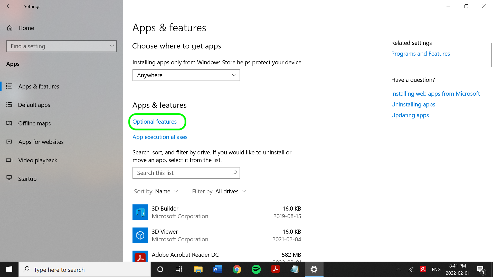

# SFTP连接器

Adobe Experience Platform允许从外部源摄取数据，同时让您能够使用Experience Platform服务来构建、标记和增强传入数据。 您可以从各种源(如Adobe应用程序、基于云的存储、数据库和许多其他源)中摄取数据。

请阅读本文档，了解成功将[!DNL SFTP]帐户连接到Experience Platform所需的先决步骤。

>[!TIP]
>
>在连接之前，必须在SFTP服务器配置中禁用键盘交互式身份验证。 禁用设置将允许手动输入密码，而不是通过服务或程序输入。

## 先决条件 {#prerequisites}

请阅读本节内容，了解成功将[!DNL SFTP]源连接到Experience Platform所必须完成的先决步骤。

### IP地址允许列表

在使用源连接器之前，必须将IP地址列表添加到允许列表中。 未能将特定于区域的IP地址添加到允许列表中，可能会导致使用源时出现错误或性能不佳。 有关详细信息，请参阅[IP地址允许列表](../../ip-address-allow-list.md)页。

### 文件和目录的命名约束

以下是命名云存储文件或目录时必须考虑的约束列表。

* 目录和文件组件名称不能超过255个字符。
* 目录和文件名不能以正斜杠(`/`)结尾。 如果提供，它将自动删除。
* 以下保留URL字符必须正确转义： `! ' ( ) ; @ & = + $ , % # [ ]`
* 不允许使用以下字符： `" \ / : | < > * ?`。
* 不允许使用非法的URL路径字符。 诸如`\uE000`之类的代码点虽然在NTFS文件名中有效，但不是有效的Unicode字符。 此外，不允许使用某些ASCII或Unicode字符，如控制字符（0x00到0x1F、\u0081等）。 有关HTTP/1.1中Unicode字符串的规则，请参阅[RFC 2616，第2.2节：基本规则](https://www.ietf.org/rfc/rfc2616.txt)和[RFC 3987](https://www.ietf.org/rfc/rfc3987.txt)。
* 不允许使用以下文件名：LPT1、LPT2、LPT3、LPT4、LPT5、LPT6、LPT7、LPT8、LPT9、COM1、COM2、COM3、COM4、COM5、COM6、COM7、COM8、COM9、PRN、AUX、NUL、CON、CLOCK$、点字符(.)和两个点字符(..)。

### 为[!DNL SFTP]设置Base64编码的OpenSSH私钥

[!DNL SFTP]源支持使用[!DNL Base64]编码的OpenSSH私钥进行身份验证。 有关如何生成Base64编码的OpenSSH私钥并将[!DNL SFTP]连接到Experience Platform的信息，请参阅以下步骤。

>[!BEGINTABS]

>[!TAB Windows]

### [!DNL Windows]用户

如果您使用的是[!DNL Windows]计算机，请打开&#x200B;**开始**&#x200B;菜单，然后选择&#x200B;**设置**。


从出现的&#x200B;**设置**&#x200B;菜单中，选择&#x200B;**应用程序**。


接下来，选择&#x200B;**可选功能**。



将显示可选功能列表。 如果您的计算机上已预安装了&#x200B;**OpenSSH客户端**，则它将包含在&#x200B;**可选功能**&#x200B;下的&#x200B;**已安装的功能**&#x200B;列表中。


如果未安装，请选择&#x200B;**安装**，然后打开&#x200B;**[!DNL Powershell]**&#x200B;并运行以下命令来生成私钥：

```shell
PS C:\Users\lucy> ssh-keygen -t rsa -m pem
Generating public/private rsa key pair.
Enter file in which to save the key (C:\Users\lucy/.ssh/id_rsa):
Enter passphrase (empty for no passphrase):
Enter same passphrase again:
Your identification has been saved in C:\Users\lucy/.ssh/id_rsa.
Your public key has been saved in C:\Users\lucy/.ssh/id_rsa.pub.
The key fingerprint is:
SHA256:osJ6Lg0TqK8nekNQyZGMoYwfyxNc+Wh0hYBtBylXuGk lucy@LAPTOP-FUJT1JEC
The key's randomart image is:
+---[RSA 3072]----+
|.=.*+B.o.        |
|=.O.O +          |
|+o+= B           |
|+o +E .          |
|.o=o  . S        |
|+... . .         |
| *o .            |
|o.B.             |
|=O..             |
+----[SHA256]-----+
```

接下来，在提供私钥的文件路径时运行以下命令，以在[!DNL Base64]中编码您的私钥：

```shell
C:\Users\lucy> [convert]::ToBase64String((Get-Content -path "C:\Users\lucy\.ssh\id_rsa" -Encoding byte)) > C:\Users\lucy\.ssh\id_rsa_base64
```

上述命令将[!DNL Base64]编码的私钥保存在您指定的文件路径中。 然后，您可以使用该私钥对[!DNL SFTP]进行身份验证并连接到Experience Platform。

>[!TAB Mac]

### [!DNL Mac]用户

如果您使用的是[!DNL Mac]，请打开&#x200B;**终端**&#x200B;并运行以下命令来生成私钥（在这种情况下，私钥将保存在`/Documents/id_rsa`中）：

```shell
ssh-keygen -t rsa -m pem -f ~/Documents/id_rsa
Generating public/private rsa key pair.
Enter passphrase (empty for no passphrase):
Enter same passphrase again:
Your identification has been saved in /Users/vrana/Documents/id_rsa.
Your public key has been saved in /Users/vrana/Documents/id_rsa.pub.
The key fingerprint is:
SHA256:s49PCaO4a0Ee8I7OOeSyhQAGc+pSUQnRii9+5S7pp1M vrana@vrana-macOS
The key's randomart image is:
+---[RSA 2048]----+
|o ==..           |
|.+..o            |
|oo.+             |
|=.. +            |
|oo = .  S        |
|+.+ +E . = .     |
|o*..*.. . o      |
|.o*=.+   +       |
|.oo=Oo  ..o      |
+----[SHA256]-----+
```

接下来，运行以下命令以在[!DNL Base64]中编码私钥：

```shell
base64 ~/Documents/id_rsa > ~/Documents/id_rsa_base64
 
 
# Print Content of base64 encoded file
cat ~/Documents/id_rsa_base64
LS0tLS1CRUdJTiBPUEVOU1NIIFBSSVZBVEUgS0VZLS0tLS0KYjNCbGJuTnphQzFyWlhrdGRqRUFBQUFBQkc1dmJtVUFBQUFFYm05dVpRQUFBQUFBQUFBQkFBQUJGd0FBQUFkemMyZ3RjbgpOaEFBQUFBd0VBQVFBQUFRRUF0cWFYczlXOUF1ZmtWazUwSXpwNXNLTDlOMU9VYklaYXVxbVM0Q0ZaenI1NjNxUGFuN244CmFxZWdvQTlCZnVnWDJsTVpGSFl5elEzbnp6NXdXMkdZa1hkdjFjakd0elVyNyt1NnBUeWRneGxrOGRXZWZsSzBpUlpYWW4KVFRwS0E5c2xXaHhjTXg3R2x5ejdGeDhWSzI3MmdNSzNqY1d1Q0VIU3lLSFR5SFFwekw0MEVKbGZJY1RGR1h1dW1LQjI5SwpEakhwT1grSDdGcG5Gd1pabTA4Uzc2UHJveTVaMndFalcyd1lYcTlyUDFhL0E4ejFoM1ZLdllzcG53c2tCcHFQSkQ1V3haCjczZ3M2OG9sVllIdnhWajNjS3ZsRlFqQlVFNWRNUnB2M0I5QWZ0SWlrYmNJeUNDaXV3UnJmbHk5eVNPQ2VlSEc0Z2tUcGwKL3V4YXNOT0h1d0FBQThqNnF6R1YrcXN4bFFBQUFBZHpjMmd0Y25OaEFBQUJBUUMycHBlejFiMEM1K1JXVG5Rak9ubXdvdgowM1U1UnNobHE2cVpMZ0lWbk92bnJlbzlxZnVmeHFwNkNnRDBGKzZCZmFVeGtVZGpMTkRlZlBQbkJiWVppUmQyL1Z5TWEzCk5TdnY2N3FsUEoyREdXVHgxWjUrVXJTSkZsZGlkTk9rb0QyeVZhSEZ3ekhzYVhMUHNYSHhVcmJ2YUF3cmVOeGE0SVFkTEkKb2RQSWRDbk12alFRbVY4aHhNVVplNjZZb0hiMG9PTWVrNWY0ZnNXbWNYQmxtYlR4THZvK3VqTGxuYkFTTmJiQmhlcjJzLwpWcjhEelBXSGRVcTlpeW1mQ3lRR21vOGtQbGJGbnZlQ3pyeWlWVmdlL0ZXUGR3cStVVkNNRlFUbDB4R20vY0gwQiswaUtSCnR3aklJS0s3Qkd0K1hMM0pJNEo1NGNiaUNST21YKzdGcXcwNGU3QUFBQUF3RUFBUUFBQVFBcGs0WllzMENSRnNRTk9WS0sKYWxjazlCVDdzUlRLRjFNenhrSGVydmpJYk9kL0lvRXpkcHlVa28rbm41RmpGK1hHRnNCUXZnOFdTaUlJTk1oU3BNYWI1agpvWXlka2gvd0ovWElOaDlZaE5QVXlURi9NNkFnMkNYd21KS2RxN1VKWjZyNjloV3V0VVN6U05QbkVYWTZLc29GeVUwTEFvCko0OHJMT1pMZldtMHFhWDBLNUgzNmJPaHFXSWJwMDNoZk94eno5M0MrSDM5MFJkRkp4bzJVZ0FVY3UvdHREb0REVldBdmEKVkVyMWEzak9LenVHbThrK21WeXpPZERjVFY4ckZIT0pwRnRBU3l6Q24yVld1MjV0TWtrcGRPRjNKcVdMZHdOY3loeG1URApXZGVDNWh4V0Fiano0WDZ5WXpHcFcwTmptVkFoWUVVZGNBSVlXWWM3OGEvQkFBQUFnRm8wakl4aGhwZkJ6QjF6b09FMDJBClpjTC9hcUNuYysrdmJ1a2V0aFg5Zzhlb0xQMTQyeUgzdlpLczl3c1RtbVVsZ0prZURaN2hUcklwOGY2eEwzdDRlMXByY1kKb2ZLd0gwckNGOTFyaldPbGZOUmxEempoR1NTTEVMczZoNlNzMEdBQXE2Z0ZQTVF2dTB4TDlQUTlGQ21YZVVKazJpRm1MWgpEWWJGc0NyVUxEQUFBQWdRRGF0a1pMamJaSTBFM0ZuY2dTOVF5Y3lVWmtkZ1dVNjBQcG9ud3BMQXdUdHRpOG1EQXE5cHYwClEvUlk1WE9UeGF3VXNHa0tYMjNtV1BYR0grdUlBSzhrelVVM2dGM1dRWGVkTWw4NHVCVFZCTEtUdStvVVAvZmIvMEE0dE0KSE9BSythbXZPMkZuYzFiSmVwd05USTE2cjZXWk9sZWV2ZklJQVpXcEgxVVpIdkVRQUFBSUVBMWNwcStDNUVXSFJwbnVPZQpiNHE4T0tKTlJhSUxIRUN6U0twWlFpZDFhRmJYWlVKUXpIQU85YzhINVZMcjBNUjFkcW1ORkNja2ZsZzI2Y3BEUEl3TjBYCm5HMFBxcmhKbXp0U3ZQZ3NGdkNPallncXF6U0RYUjkxd1JQTEN5cU8zcGMyM2kzZnp2WkhtMGhIdWdoNVJqV0loUlFZVkwKZUpDWHRqM08vY3p1SWdzQUFBQVJkbkpoYm1GQWRuSmhibUV0YldGalQxTUJBZz09Ci0tLS0tRU5EIE9QRU5TU0ggUFJJVkFURSBLRVktLS0tLQo=
```

将[!DNL Base64]编码的私钥保存到指定的文件夹后，必须将公钥文件的内容添加到[!DNL SFTP]主机授权密钥中的新行。 在命令行上运行以下命令：

```shell
cat ~/id_rsa.pub >> ~/.ssh/authorized_keys
```

要确认是否正确添加了公钥，您可以在命令行上运行以下命令：

```shell
more ~/.ssh/authorized_keys
```

>[!ENDTABS]

### 收集所需的凭据 {#credentials}

必须提供以下凭据的值，才能将您的[!DNL SFTP]服务器连接到Experience Platform。

>[!BEGINTABS]

>[!TAB 基本身份验证]

为以下凭据提供适当的值，以使用基本身份验证对您的[!DNL SFTP]服务器进行身份验证。

| 凭据 | 描述 |
| ---------- | ----------- |
| `host` | 与您的[!DNL SFTP]服务器关联的名称或IP地址。 |
| `port` | 您正在连接的[!DNL SFTP]服务器端口。 如果未提供，则值默认为`22`。 |
| `username` | 有权访问您的[!DNL SFTP]服务器的用户名。 |
| `password` | [!DNL SFTP]服务器的密码。 |
| `maxConcurrentConnections` | 利用此参数，可指定Experience Platform在连接到SFTP服务器时将创建的并发连接数的最大限制。 必须将此值设置为小于SFTP设置的限制。 **注意**：为现有SFTP帐户启用此设置时，它只影响未来的数据流，而不影响现有的数据流。 |
| `folderPath` | 要提供访问权限的文件夹的路径。 [!DNL SFTP]源，您可以提供文件夹路径，以指定用户对所选子文件夹的访问权限。 |
| `disableChunking` | 在数据摄取期间，[!DNL SFTP]源可以首先检索文件长度，将文件划分为多个部分，然后并行读取。 您可以启用或禁用此值以指定[!DNL SFTP]服务器是否可以检索文件长度或从特定偏移读取数据。 |
| `connectionSpec.id` | （仅限API）连接规范返回源的连接器属性，包括与创建基础连接和源连接相关的身份验证规范。 [!DNL SFTP]的连接规范ID为： `b7bf2577-4520-42c9-bae9-cad01560f7bc`。 |

>[!TAB SSH公钥身份验证]

为以下凭据提供适当的值，以使用SSH公钥身份验证对您的[!DNL SFTP]服务器进行身份验证。

| 凭据 | 描述 |
| ---------- | ----------- |
| `host` | 与您的[!DNL SFTP]服务器关联的名称或IP地址。 |
| `port` | 您正在连接的[!DNL SFTP]服务器端口。 如果未提供，则值默认为`22`。 |
| `username` | 有权访问您的[!DNL SFTP]服务器的用户名。 |
| `password` | [!DNL SFTP]服务器的密码。 |
| `privateKeyContent` | Base64编码的SSH私钥内容。 OpenSSH密钥类型必须分类为RSA或DSA。 |
| `passPhrase` | 如果密钥文件或密钥内容受密码词组保护，则使用密码词组或密码解密私钥。 如果PrivateKeyContent受密码保护，则此参数需要与PrivateKeyContent的密码短语（值）一起使用。 |
| `maxConcurrentConnections` | 利用此参数，可指定Experience Platform在连接到SFTP服务器时将创建的并发连接数的最大限制。 必须将此值设置为小于SFTP设置的限制。 **注意**：为现有SFTP帐户启用此设置时，它只影响未来的数据流，而不影响现有的数据流。 |
| `folderPath` | 要提供访问权限的文件夹的路径。 [!DNL SFTP]源，您可以提供文件夹路径，以指定用户对所选子文件夹的访问权限。 |
| `disableChunking` | 在数据摄取期间，[!DNL SFTP]源可以首先检索文件长度，将文件划分为多个部分，然后并行读取。 您可以启用或禁用此值以指定[!DNL SFTP]服务器是否可以检索文件长度或从特定偏移读取数据。 |
| `connectionSpec.id` | （仅限API）连接规范返回源的连接器属性，包括与创建基础连接和源连接相关的身份验证规范。 [!DNL SFTP]的连接规范ID为： `b7bf2577-4520-42c9-bae9-cad01560f7bc`。 |

>[!ENDTABS]

## 将SFTP连接到Experience Platform

以下文档提供了有关如何使用API或用户界面将SFTP服务器连接到Experience Platform的信息：

### 使用API

* [使用流服务API创建SFTP基本连接](../../tutorials/api/create/cloud-storage/sftp.md)
* [使用流量服务API浏览云存储源的数据结构和内容](../../tutorials/api/explore/cloud-storage.md)
* [使用流服务API为云存储源创建数据流](../../tutorials/api/collect/cloud-storage.md)

### 使用UI

* [在UI中创建SFTP源连接](../../tutorials/ui/create/cloud-storage/sftp.md)
* [在UI中为云存储连接创建数据流](../../tutorials/ui/dataflow/batch/cloud-storage.md)
