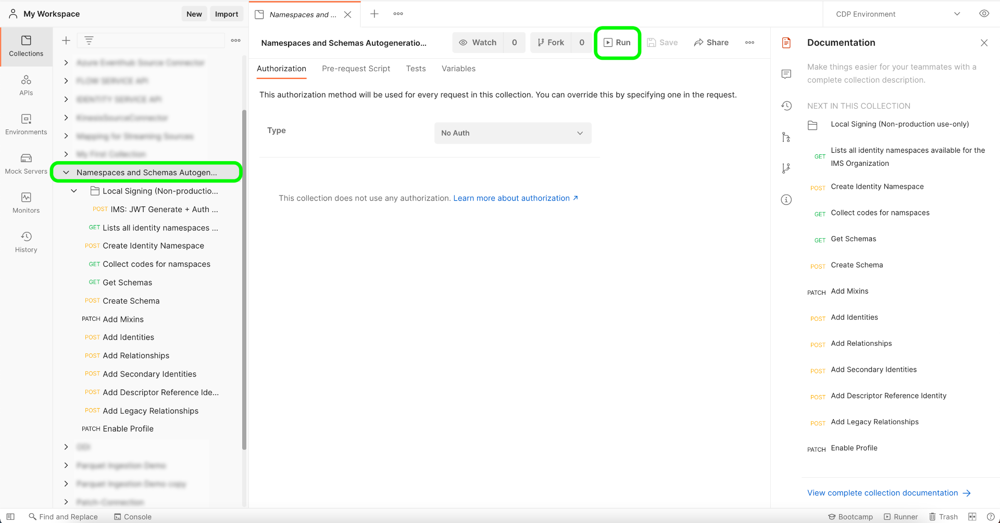

# [!DNL Salesforce]

Adobe Experience Platform允许从外部源摄取数据，同时让您能够使用Platform服务来构建、标记和增强传入数据。 您可以从各种来源(如Adobe应用程序、基于云的存储、数据库和许多其他来源)中摄取数据。

Experience Platform支持从第三方CRM系统中摄取数据。 CRM提供商的支持包括[!DNL Salesforce]。

## IP地址允许列表

在使用源连接器之前，必须将IP地址列表添加到允许列表中。 未能将特定于区域的IP地址添加到允许列表中，可能会导致使用源时出现错误或性能不佳。 有关详细信息，请参阅[IP地址允许列表](../../ip-address-allow-list.md)页。

## 从[!DNL Salesforce]到XDM的字段映射

要建立[!DNL Salesforce]与Platform之间的源连接，[!DNL Salesforce]源数据字段必须在被引入Platform之前映射到其相应的目标XDM字段。

有关[!DNL Salesforce]数据集与Platform之间的字段映射规则的详细信息，请参阅以下内容：

- [联系人](../adobe-applications/mapping/salesforce.md#contact)
- [潜在客户](../adobe-applications/mapping/salesforce.md#lead)
- [帐户](../adobe-applications/mapping/salesforce.md#account)
- [机会](../adobe-applications/mapping/salesforce.md#opportunity)
- [机会联系人角色](../adobe-applications/mapping/salesforce.md#opportunity-contact-role)
- [营销活动](../adobe-applications/mapping/salesforce.md#campaign)
- [营销活动成员](../adobe-applications/mapping/salesforce.md#campaign-member)
- [帐户联系人关系](../adobe-applications/mapping/salesforce.md#account-contact-relation)

## 设置[!DNL Salesforce]命名空间和架构自动生成实用程序

要将[!DNL Salesforce]源用作[!DNL B2B-CDP]的一部分，您必须首先设置[!DNL Postman]实用工具以自动生成您的[!DNL Salesforce]命名空间和架构。 以下文档提供了有关设置[!DNL Postman]实用工具的其他信息：

- 您可以从此[GitHub存储库](https://github.com/adobe/experience-platform-postman-samples/tree/master/Postman%20Collections/CDP%20Namespaces%20and%20Schemas%20Utility)下载命名空间和架构自动生成实用程序集合和环境。
- 有关如何使用Platform API的信息，包括有关如何收集所需标头的值和读取示例API调用的详细信息，请参阅[Platform API快速入门](../../../landing/api-guide.md)指南。
- 有关如何为平台API生成凭据的信息，请参阅有关[身份验证和访问Experience PlatformAPI](../../../landing/api-authentication.md)的教程。
- 有关如何为平台API设置[!DNL Postman]的信息，请参阅[设置开发人员控制台和 [!DNL Postman]](../../../landing/postman.md)上的教程。

通过平台开发人员控制台和[!DNL Postman]设置，您现在可以开始将相应的环境值应用到您的[!DNL Postman]环境。

下表包含示例值以及有关填充[!DNL Postman]环境的其他信息：

| Variable | 描述 | 示例 |
| --- | --- | --- |
| `CLIENT_SECRET` | 用于生成`{ACCESS_TOKEN}`的唯一标识符。 有关如何检索`{CLIENT_SECRET}`的信息，请参阅有关[身份验证和访问Experience PlatformAPI](../../../landing/api-authentication.md)的教程。 | `{CLIENT_SECRET}` |
| `JWT_TOKEN` | JSON Web令牌(JWT)是用于生成{ACCESS_TOKEN}的身份验证凭据。 有关如何生成`{JWT_TOKEN}`的信息，请参阅有关[身份验证和访问Experience PlatformAPI](../../../landing/api-authentication.md)的教程。 | `{JWT_TOKEN}` |
| `API_KEY` | 用于对调用Experience PlatformAPI进行身份验证的唯一标识符。 有关如何检索`{API_KEY}`的信息，请参阅有关[身份验证和访问Experience PlatformAPI](../../../landing/api-authentication.md)的教程。 | `c8d9a2f5c1e03789bd22e8efdd1bdc1b` |
| `ACCESS_TOKEN` | 完成对Experience PlatformAPI的调用所需的授权令牌。 有关如何检索`{ACCESS_TOKEN}`的信息，请参阅有关[身份验证和访问Experience PlatformAPI](../../../landing/api-authentication.md)的教程。 | `Bearer {ACCESS_TOKEN}` |
| `META_SCOPE` | 对于[!DNL Marketo]，此值是固定的，并且始终设置为： `ent_dataservices_sdk`。 | `ent_dataservices_sdk` |
| `CONTAINER_ID` | `global`容器包含所有标准Adobe和Experience Platform合作伙伴提供的类、架构字段组、数据类型和架构。 对于[!DNL Marketo]，此值是固定的，并且始终设置为`global`。 | `global` |
| `PRIVATE_KEY` | 用于向Experience PlatformAPI验证您的[!DNL Postman]实例的凭据。 有关如何检索{PRIVATE_KEY}的说明，请参阅有关设置开发人员控制台和[设置开发人员控制台和 [!DNL Postman]](../../../landing/postman.md)的教程。 | `{PRIVATE_KEY}` |
| `TECHNICAL_ACCOUNT_ID` | 用于集成到Adobe I/O的凭据。 | `D42AEVJZTTJC6LZADUBVPA15@techacct.adobe.com` |
| `IMS` | Identity Management System (IMS)提供了对Adobe服务进行身份验证的框架。 对于[!DNL Marketo]，此值是固定的，并且始终设置为： `ims-na1.adobelogin.com`。 | `ims-na1.adobelogin.com` |
| `IMS_ORG` | 公司实体，可以拥有产品或服务，也可以为其授予产品和服务许可证，并允许其成员访问。 有关如何检索`{ORG_ID}`信息的说明，请参阅有关[设置开发人员控制台和 [!DNL Postman]](../../../landing/postman.md)的教程。 | `ABCEH0D9KX6A7WA7ATQE0TE@adobeOrg` |
| `SANDBOX_NAME` | 您正在使用的虚拟沙盒分区的名称。 | `prod` |
| `TENANT_ID` | 一个ID，用于确保您创建的资源被正确命名并包含在您的组织内。 | `b2bcdpproductiontest` |
| `PLATFORM_URL` | 您对其进行API调用的URL端点。 此值是固定的，并且始终设置为： `http://platform.adobe.io/`。 | `http://platform.adobe.io/` |
| `munchkinId` | [!DNL Marketo]帐户的唯一ID。 有关如何检索`munchkinId`的信息，请参阅[验证 [!DNL Marketo] 实例](../adobe-applications/marketo/marketo-auth.md)的教程。 | `123-ABC-456` |
| `sfdc_org_id` | 您的[!DNL Salesforce]帐户的组织ID。 有关获取[!DNL Salesforce]组织ID的更多信息，请参阅以下[[!DNL Salesforce] 指南](https://help.salesforce.com/articleView?id=000325251&amp;type=1&amp;mode=1)。 | `00D4W000000FgYJUA0` |
| `has_abm` | 一个布尔值，指示您是否订阅了[!DNL Marketo Account-Based Marketing]。 | `false` |
| `has_msi` | 指示您是否订阅[!DNL Marketo Sales Insight]的布尔值。 | `false` |

{style="table-layout:auto"}

### 运行脚本

设置了[!DNL Postman]收藏集和环境后，您现在可以通过[!DNL Postman]界面运行脚本。

在[!DNL Postman]界面中，选择自动生成器实用工具的根文件夹，然后从顶部标题中选择&#x200B;**[!DNL Run]**。

出现[!DNL Runner]接口。 在此处，确保选中所有复选框，然后选择&#x200B;**[!DNL Run Namespaces and Schemas Autogeneration Utility]**。

成功的请求将根据测试版规范创建B2B命名空间和架构。

## 使用API将[!DNL Salesforce]连接到平台

以下文档提供了有关如何使用API或用户界面将[!DNL Salesforce]连接到Platform的信息：

- [使用流服务API创建Salesforce基本连接](../../tutorials/api/create/crm/salesforce.md)
- [使用流服务API浏览数据表](../../tutorials/api/explore/tabular.md)
- [使用流服务API为CRM源创建数据流](../../tutorials/api/collect/crm.md)

## 使用UI将[!DNL Salesforce]连接到平台

- [在UI中创建Salesforce源连接](../../tutorials/ui/create/crm/salesforce.md)
- [在用户界面中为CRM连接创建数据流](../../tutorials/ui/dataflow/crm.md)
