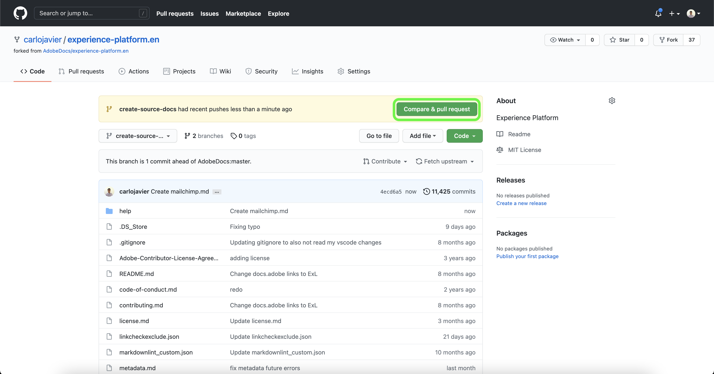

# 使用GitHub Web界面创建源文档页面

本文档提供了有关如何使用GitHub Web界面创作文档并提交拉取请求(PR)的步骤。

>[!TIP]
>
>可以使用Adobe参与指南中的以下文档来进一步支持您的文档流程： <ul><li>[安装Git和Markdown创作工具](https://experienceleague.adobe.com/docs/contributor/contributor-guide/setup/install-tools.html?lang=zh-Hans)</li><li>[在本地为文档设置Git存储库](https://experienceleague.adobe.com/docs/contributor/contributor-guide/setup/local-repo.html?lang=zh-Hans)</li><li>针对主要更改的[GitHub贡献工作流](https://experienceleague.adobe.com/docs/contributor/contributor-guide/setup/full-workflow.html?lang=zh-Hans)</li></ul>

## 设置GitHub环境

设置GitHub环境的第一步是导航到[Adobe Experience Platform GitHub存储库](https://github.com/AdobeDocs/experience-platform.zh-Hans)。

接下来，选择&#x200B;**分支**。

创建分支后，选择&#x200B;**master**，然后在出现的下拉菜单中为新分支输入名称。 请确保为分支提供描述性名称，因为这将用于包含您的工作，然后选择&#x200B;**创建分支**。

在分支存储库的GitHub文件夹结构中，导航到[`experience-platform.en/help/sources/tutorials/api/create/`](https://github.com/AdobeDocs/experience-platform.zh-Hans/tree/main/help/sources/tutorials/api/create)，然后从列表中选择适用于您的源的类别。 例如，如果要为新的CRM源创建文档，请选择&#x200B;**crm**。

>[!TIP]
>
>如果您正在创建UI文档，请导航到[`experience-platform.en/help/sources/tutorials/ui/create/`](https://github.com/AdobeDocs/experience-platform.zh-Hans/tree/main/help/sources/tutorials/ui/create)并为您的源选择适当的类别。 要添加图像，请导航到[`experience-platform.en/help/sources/images/tutorials/create/sdk`](https://github.com/AdobeDocs/experience-platform.zh-Hans/tree/main/help/sources/images/tutorials/create)，然后将屏幕截图添加到`sdk`文件夹。

此时将显示现有CRM源的文件夹。 要添加新源的文档，请选择&#x200B;**添加文件**，然后从出现的下拉菜单中选择&#x200B;**创建新文件**。

将源文件命名为`YOURSOURCE.md`，其中YOURSOURCE是您在Experience Platform中的源名称。 例如，如果您的公司是ACME CRM，则您的文件名应为`acme-crm.md`。

## 为您的源创作文档页面

要开始记录新源，请将[源文档模板](./template.md)的内容粘贴到GitHub Web编辑器中。 您还可以在[此处](../assets/api-template.zip)下载模板。

将模板复制到GitHub Web编辑器界面后，按照模板中列出的说明操作，并编辑包含源相关信息的值。

完成后，在分支中提交文件。

## 提交文档以供审阅

提交文件后，您可以打开拉取请求(PR)，将工作分支合并到Adobe文档存储库的主分支。 请确保已选择您正在处理的分支，然后选择&#x200B;**比较和拉取请求**。

确保基础分支和比较分支正确。 向PR添加描述更新的注释，然后选择&#x200B;**创建拉取请求**。 这将打开PR，以将您工作的工作分支合并到Adobe存储库的主分支。

>[!TIP]
>
>保留选中&#x200B;**允许维护者编辑**&#x200B;复选框，以确保Adobe文档团队可以对PR进行编辑。

此时，将显示一条通知，提示您签署Adobe参与者许可协议(CLA)。 这是强制步骤。 签署CLA后，刷新PR页面并提交拉取请求。

您可以通过检查https://github.com/AdobeDocs/experience-platform.en中的“拉取请求”选项卡，确认已提交拉取请求。

