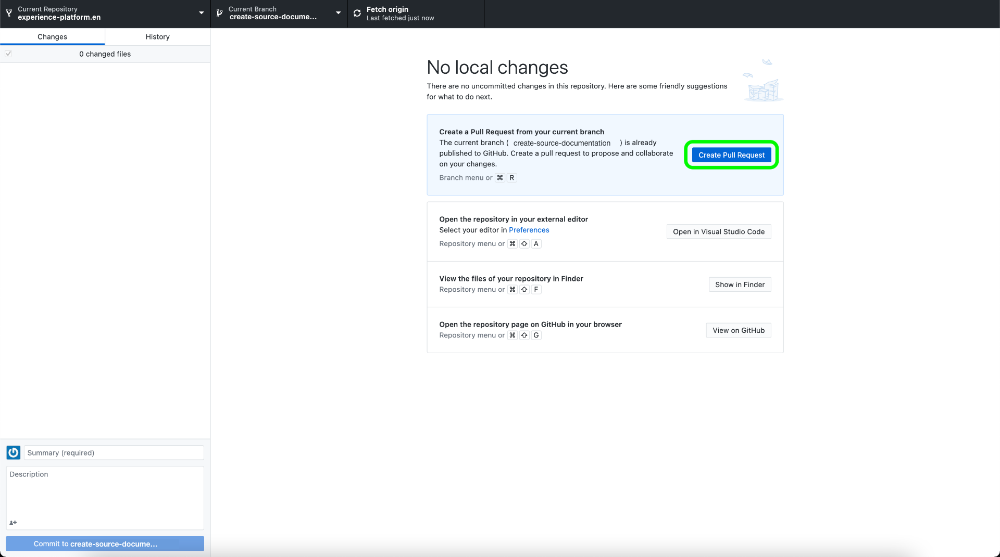

# 在本地环境中使用文本编辑器创建源文档页面

本文档提供了有关如何使用本地环境为源创作文档并提交拉取请求(PR)的步骤。

>[!TIP]
>
>可以使用Adobe参与指南中的以下文档来进一步支持您的文档流程： <ul><li>[安装Git和Markdown创作工具](https://experienceleague.adobe.com/docs/contributor/contributor-guide/setup/install-tools.html?lang=zh-Hans)</li><li>[在本地为文档设置Git存储库](https://experienceleague.adobe.com/docs/contributor/contributor-guide/setup/local-repo.html?lang=zh-Hans)</li><li>针对主要更改的[GitHub贡献工作流](https://experienceleague.adobe.com/docs/contributor/contributor-guide/setup/full-workflow.html?lang=zh-Hans)</li></ul>

## 先决条件

以下教程要求您在本机计算机上安装GitHub Desktop。 如果您没有GitHub Desktop，则可以在[此处](https://desktop.github.com/)下载应用程序。

## 连接到GitHub并设置本地创作环境

设置本地创作环境的第一步是导航到[Adobe Experience Platform GitHub存储库](https://github.com/AdobeDocs/experience-platform.zh-Hans)。

在Experience Platform GitHub存储库的主页上，选择&#x200B;**分支**。

要将存储库克隆到本地计算机，请选择&#x200B;**代码**。 从出现的下拉菜单中，选择&#x200B;**HTTPS**，然后选择&#x200B;**使用GitHub Desktop打开**。

>[!TIP]
>
>有关详细信息，请参阅有关[在本地为文档](https://experienceleague.adobe.com/docs/contributor/contributor-guide/setup/local-repo.html?lang=zh-Hans#create-a-local-clone-of-the-repository)设置Git存储库的教程。

接下来，让GitHub Desktop再花些时间克隆`experience-platform.en`存储库。

克隆过程完成后，转到GitHub Desktop以创建新分支。 从顶部导航中选择&#x200B;**母版**，然后选择&#x200B;**新建分支**

在显示的弹出面板中，输入分支的描述性名称，然后选择&#x200B;**创建分支**。

接下来，选择&#x200B;**发布分支**。

## 为您的源创作文档页面

将存储库克隆到本地计算机并创建新分支后，您现在可以通过所选的[文本编辑器](https://experienceleague.adobe.com/docs/contributor/contributor-guide/setup/install-tools.html?lang=zh-Hans#understand-markdown-editors)开始为新源创作文档页面。

Adobe建议您使用[Visual Studio Code](https://code.visualstudio.com/)，并安装Adobe Markdown创作扩展。 要安装扩展，请启动Visual Studio Code，然后从左侧导航中选择&#x200B;**扩展**&#x200B;选项卡。

接下来，在搜索栏中输入`Adobe Markdown Authoring`，然后从显示的页面中选择&#x200B;**安装**。

在本地计算机准备就绪后，下载[源文档模板](../assets/api-template.zip)并将文件解压到`experience-platform.en/help/sources/tutorials/api/create/...`，其中的[`...`]表示您选择的类别。 例如，如果要创建数据库源，请选择数据库文件夹。

最后，按照模板上列出的说明编辑模板，其中包含与您的源相关的信息。

## 提交文档以供审阅

要创建拉取请求(PR)并提交文档以供审阅，请首先在[!DNL Visual Studio Code]（或您选择的文本编辑器）中保存您所做的工作。 接下来，使用GitHub Desktop，输入提交消息并选择&#x200B;**提交以创建source-documentation**。

接下来，选择&#x200B;**推送来源**&#x200B;以将您的工作上传到远程分支。

要创建拉取请求，请选择&#x200B;**创建拉取请求**。

确保基础分支和比较分支正确。 向PR添加描述更新的注释，然后选择&#x200B;**创建拉取请求**。 这将打开PR，以将您工作的工作分支合并到Adobe存储库的主分支。

>[!TIP]
>
>保留选中&#x200B;**允许维护者编辑**&#x200B;复选框，以确保Adobe文档团队可以对PR进行编辑。

您可以通过检查https://github.com/AdobeDocs/experience-platform.en中的“拉取请求”选项卡，确认已提交拉取请求。

