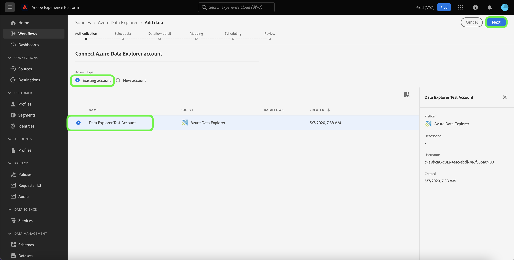

# 在UI中创建&#x200B;*YOURSOURCE*&#x200B;源连接

*浏览此模板时，替换或删除所有斜体段落（从此段落开始）。*

*从更新页面顶部的元数据（标题和描述）开始。 请忽略此页面上的所有UICONTROL实例。 此标记可帮助我们的机器翻译流程将页面正确翻译为我们支持的多种语言。 我们将在您提交文档后向文档中添加标记。*

本教程提供了使用Experience Platform用户界面创建&#x200B;*YOURSOURCE*&#x200B;源连接器的步骤。

## 概述

*提供贵公司的简短概述，包括贵公司为客户提供的价值。 包括产品文档主页的链接，以便进一步阅读。*

>[!IMPORTANT]
>
>此源连接器和文档页面由&#x200B;*YourSource*&#x200B;团队创建和维护。 对于任何查询或更新请求，请直接通过&#x200B;*插入链接或电子邮件地址与他们联系，您可以在此联系以获取更新*。

## 先决条件

*在此部分添加有关客户在Adobe Experience Platform用户界面中开始设置源之前需要了解的任何信息。 这可能大约为：*

* *需要添加到允许列表*
* 电子邮件散列的&#x200B;*要求*
* *你方的任何帐户详情*
* *如何获取身份验证凭据以连接到您的平台*

### 收集所需的凭据

要将&#x200B;*YOURSOURCE*&#x200B;连接到Experience Platform，必须提供以下连接属性的值：

| 凭据 | 描述 | 示例 |
| --- | --- | --- |
| *凭据1* | *请在此处*&#x200B;向源身份验证凭据添加简要说明 | *请在此处添加源身份验证凭据的示例* |
| *凭据二* | *请在此处*&#x200B;向源身份验证凭据添加简要说明 | *请在此处添加源身份验证凭据的示例* |
| *凭据三* | *请在此处*&#x200B;向源身份验证凭据添加简要说明 | *请在此处添加源身份验证凭据的示例* |

有关这些凭据的详细信息，请参阅&#x200B;*YOURSOURCE*&#x200B;身份验证文档。 *请在此处*&#x200B;添加指向您平台的身份验证文档的链接。

## 连接您的&#x200B;*YOURSOURCE*&#x200B;帐户

在Experience Platform UI中，从左侧导航栏中选择&#x200B;**[!UICONTROL Sources]**&#x200B;以访问[!UICONTROL Sources]工作区。 [!UICONTROL Catalog]屏幕显示您可以用来创建帐户的各种源。

您可以从屏幕左侧的目录中选择相应的类别。 或者，您可以使用搜索选项查找您要使用的特定源。

在&#x200B;*YOURSOURCE的类别*&#x200B;类别下，选择&#x200B;*YOURSOURCE*，然后选择&#x200B;**[!UICONTROL Add data]**。

>[!TIP]
>
>下面使用的屏幕截图是示例。 在创建文档时，请将图像替换为实际源的屏幕快照。 您可以使用相同的标记模式和颜色，也可以使用相同的文件名。 请确保屏幕截图会捕获整个Experience Platform UI屏幕。 有关如何上载屏幕截图的信息，请参阅[提交文档以供审阅](./github.md)上的指南。

此时会显示&#x200B;**[!UICONTROL Connect YOURSOURCE account]**&#x200B;页面。 在此页上，您可以使用新凭据或现有凭据。

### 现有账户

若要使用现有帐户，请选择您想要用来创建新数据流的&#x200B;*YOURSOURCE*&#x200B;帐户，然后选择&#x200B;**[!UICONTROL Next]**&#x200B;以继续。

### 新帐户

如果要创建新帐户，请选择&#x200B;**[!UICONTROL New account]**，然后提供名称、可选描述和凭据。 完成后，选择&#x200B;**[!UICONTROL Connect to source]**，然后留出一些时间来建立新连接。

## 后续步骤

*用于创建数据流的其余步骤的工作流将被模块化。 如果您想针对您的源发起任何特定的号召，请参阅下面的其他资源部分。*

通过学习本教程，您已建立与&#x200B;*YOURSOURCE*&#x200B;帐户的连接。 您现在可以继续下一教程，并[配置数据流以将数据导入Experience Platform](https://experienceleague.adobe.com/docs/experience-platform/sources/ui-tutorials/dataflow/crm.html?lang=zh-Hans)。

## 其他资源

*本部分是一个可选部分，您可以在此提供更多链接，以指向您的产品文档或任何其他您认为对客户取得成功很重要的步骤、屏幕截图和细微差别。 您可以使用此部分添加有关源整个工作流的信息或提示，尤其是当存在最终用户可能遇到的特定“疑问”时。*
