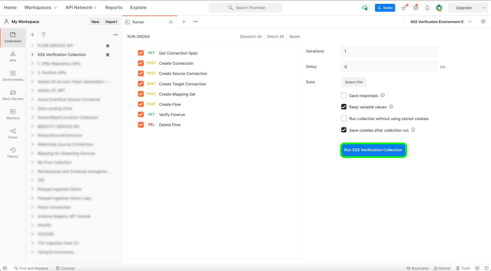
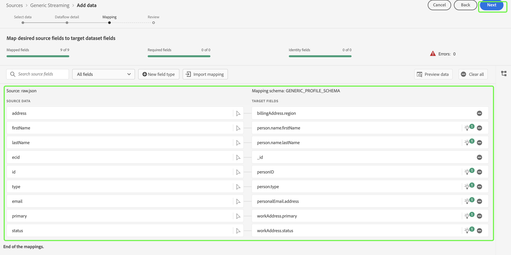

# 测试并提交源

>[!NOTE]
>
>自助来源流SDK处于测试阶段。 有关使用测试版标记源的更多信息，请阅读[源概述](../../home.md#terms-and-conditions)。

使用自助式源(流SDK)将新源集成到Adobe Experience Platform的最后步骤是测试和提交新源。 完成连接规范并更新流规范后，您可以通过API或UI开始测试源的功能。 成功后，您可以联系Adobe代表以提交新的源。

以下文档提供了有关如何使用[[!DNL Flow Service] API](https://www.adobe.io/experience-platform-apis/references/flow-service/)测试和调试源的步骤。

## 快速入门

* 有关如何成功调用Experience Platform API的信息，请参阅[Experience Platform API快速入门](../../../landing/api-guide.md)指南。
* 有关如何生成Experience Platform API凭据的信息，请参阅有关[身份验证和访问Experience Platform API](../../../landing/api-authentication.md)的教程。
* 有关如何为Experience Platform API设置[!DNL Postman]的信息，请参阅[设置开发人员控制台和 [!DNL Postman]](../../../landing/postman.md)上的教程。
* 为帮助进行测试和调试，请在此处[&#128279;](../assets/sdk-verification.zip)下载自助式源验证集合和环境，然后执行下面列出的步骤。

## 使用API测试您的源

要使用API测试您的源，您必须在[!DNL Postman]上运行[自助源验证集合和环境](../assets/sdk-verification.zip)，同时提供与您的源相关的相应环境变量。

要开始测试，您必须先在[!DNL Postman]上设置集合和环境。 接下来，指定要测试的连接规范ID。

>[!NOTE]
>
>以下所有示例变量都是必须更新的占位符值，但属于固定值的`flowSpecificationId`和`targetConnectionSpecId`除外。

| 参数 | 描述 | 示例 |
| --- | --- | --- |
| `x-api-key` | 用于对调用Experience Platform API进行身份验证的唯一标识符。 有关如何检索`x-api-key`的信息，请参阅有关[身份验证和访问Experience Platform API](../../../landing/api-authentication.md)的教程。 | `c8d9a2f5c1e03789bd22e8efdd1bdc1b` |
| `x-gw-ims-org-id` | 公司实体，可以拥有产品或服务，也可以为其授予产品和服务许可证，并允许其成员访问。 有关如何检索`x-gw-ims-org-id`信息的说明，请参阅有关[设置开发人员控制台和 [!DNL Postman]](../../../landing/postman.md)的教程。 | `ABCEH0D9KX6A7WA7ATQE0TE@adobeOrg` |
| `authorizationToken` | 完成对Experience Platform API的调用所需的授权令牌。 有关如何检索`authorizationToken`的信息，请参阅有关[身份验证和访问Experience Platform API](../../../landing/api-authentication.md)的教程。 | `Bearer authorizationToken` |
| `schemaId` | 为了在Experience Platform中使用源数据，必须创建目标架构，以根据您的需求构建源数据。 有关如何创建目标XDM架构的详细步骤，请参阅有关使用API [创建架构的教程](../../../xdm/api/schemas.md)。 | `https://ns.adobe.com/{TENANT_ID}.schemas.0ef4ce0d390f0809fad490802f53d30b` |
| `schemaVersion` | 与您的架构对应的唯一版本。 | `application/vnd.adobe.xed-full-notext+json; version=1` |
| `schemaAltId` | 创建新架构时与`schemaId`一起返回的`meta:altId`。 | `_{TENANT_ID}.schemas.0ef4ce0d390f0809fad490802f53d30b` |
| `dataSetId` | 有关如何创建目标数据集的详细步骤，请参阅有关[使用API创建数据集的教程](../../../catalog/api/create-dataset.md)。 | `5f3c3cedb2805c194ff0b69a` |
| `mappings` | 映射集可用于定义源架构中的数据如何映射到目标架构的数据。 有关如何创建映射的详细步骤，请参阅有关[使用API创建映射集的教程](../../../data-prep/api/mapping-set.md)。 | `[{"destinationXdmPath":"person.name.firstName","sourceAttribute":"email.email_id","identity":false,"version":0},{"destinationXdmPath":"person.name.lastName","sourceAttribute":"email.activity.action","identity":false,"version":0}]` |
| `mappingId` | 与映射集对应的唯一ID。 | `bf5286a9c1ad4266baca76ba3adc9366` |
| `connectionSpecId` | 与源对应的连接规范ID。 这是您在[创建新连接规范](./create.md)后生成的ID。 | `2e8580db-6489-4726-96de-e33f5f60295f` |
| `flowSpecificationId` | 流规范ID `GenericStreamingAEP`。 **这是一个固定值**。 | `e77fde5a-22a8-11ed-861d-0242ac120002` |
| `targetConnectionSpecId` | 摄取的数据登陆所在数据湖的目标连接ID。 **这是一个固定值**。 | `c604ff05-7f1a-43c0-8e18-33bf874cb11c` |
| `verifyWatTimeInSecond` | 检查流运行是否完成时要遵循的指定时间间隔。 | `40` |
| `startTime` | 为数据流指定的开始时间。 开始时间的格式必须为unix时间。 | `1597784298` |

提供所有环境变量后，即可使用[!DNL Postman]界面开始运行集合。 在[!DNL Postman]界面中，选择[!DNL Sources SSSs Verification Collection]旁边的省略号(**...**)，然后选择&#x200B;**运行收藏集**。

将显示[!DNL Runner]接口，允许您配置数据流的运行顺序。 选择&#x200B;**运行SSS验证集合**&#x200B;以运行该集合。

>[!NOTE]
>
>如果您希望在Experience Platform UI中使用源监视仪表板，则可以禁用运行订单清单中的&#x200B;**删除流**。 但是，测试完成后，必须确保删除测试流。

## 使用UI测试源

要在UI中测试源，请在Experience Platform UI中转到您组织的沙盒的源目录。 从这里，您应该看到新源显示在&#x200B;*流*&#x200B;类别下。

现在，您的沙盒中提供了新源，您必须按照源工作流测试功能。 要开始，请选择&#x200B;**[!UICONTROL 设置]**。

出现[!UICONTROL 添加数据]步骤。 要测试源是否可以流式传输数据，请使用界面的左侧上传[示例JSON数据](../assets/testing/raw.json.zip)。 上传数据后，界面的右侧会更新为数据的文件层级预览。 选择&#x200B;**[!UICONTROL 下一步]**&#x200B;以继续。

[!UICONTROL 数据流详细信息]页面允许您选择是要使用现有数据集，还是使用新数据集。 在此过程中，您还可以配置要摄取到配置文件的数据，并启用[!UICONTROL 错误诊断]和[!UICONTROL 部分摄取]等设置。

要进行测试，请选择&#x200B;**[!UICONTROL 新数据集]**&#x200B;并提供输出数据集名称。 在此步骤中，您还可以提供可选描述，以向数据集添加更多信息。 接下来，使用[!UICONTROL 高级搜索]选项或通过滚动下拉菜单中的现有架构列表来选择要映射到的架构。 选择架构后，为数据流提供名称和描述。

完成后，选择&#x200B;**[!UICONTROL 下一步]**。

此时将显示[!UICONTROL 映射]步骤，该步骤为您提供了一个接口，用于将源架构中的源字段映射到目标架构中相应的目标XDM字段。

Experience Platform根据您选择的目标架构或数据集，为自动映射的字段提供智能推荐。 您可以手动调整映射规则以适合您的用例。 根据需要，您可以选择直接映射字段，或使用数据准备函数转换源数据以派生计算值或计算值。 有关使用映射器界面和计算字段的全面步骤，请参阅[数据准备UI指南](../../../data-prep/ui/mapping.md)

成功映射源数据后，选择&#x200B;**[!UICONTROL 下一步]**。

将显示&#x200B;**[!UICONTROL 审核]**&#x200B;步骤，允许您在创建新数据流之前对其进行审核。 详细信息分为以下类别：

* **[!UICONTROL 连接]**：显示您的帐户名称、源类型以及您正在使用的流云存储源的其他特定信息。
* **[!UICONTROL 分配数据集和映射字段]**：显示用于数据流的目标数据集和架构。

查看数据流后，选择&#x200B;**[!UICONTROL 完成]**，然后等待一些时间来创建数据流。

最后，您必须检索数据流的流端点。 此端点将用于订阅您的webhook，允许您的流源与Experience Platform通信。 要检索您的流端点，请转到刚刚创建的数据流的[!UICONTROL 数据流活动]页面，并从[!UICONTROL 属性]面板的底部复制端点。

## 提交您的源

在您的源能够完成整个工作流后，您可以继续联系Adobe代表并提交您的源，以便在其他Experience Platform组织之间进行集成。
