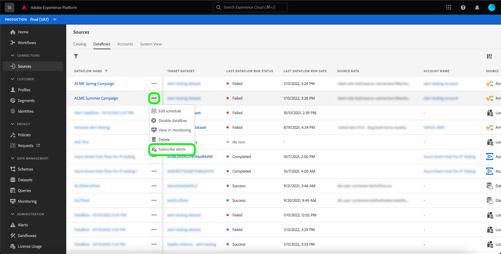

# 订阅UI中源数据流的警报

>[!NOTE]
>
>在非生产沙盒中不支持警报。 要订阅警报，您必须确保使用生产沙盒。

通过Adobe Experience Platform，可订阅有关Adobe Experience Platform活动的基于事件的警报。 警报减少或消除轮询警报的必要 [[!DNL Observability Insights] API](../../../observability/api/overview.md) 用于检查作业是否已完成、是否已到达工作流中的某个里程碑或者是否已发生任何错误。

在创建数据流以接收有关流运行的状态、成功或失败的警报消息时，您可以订阅警报。

本文档提供了有关如何订阅源数据流接收警报消息的步骤。

## 快速入门

本文档要求您对Adobe Experience Platform的以下组件有一定的了解：

* [源](../../home.md)： [!DNL Experience Platform] 允许从各种源摄取数据，同时让您能够使用以下内容构建、标记和增强传入数据： [!DNL Platform] 服务。
* [可观测性](../../../observability/home.md)： [!DNL Observability Insights] 允许您通过使用统计指标和事件通知来监控Platform活动。
   * [警报](../../../observability/alerts/overview.md)：当您的Platform操作达到特定条件集时（例如系统违反阈值时可能会出现问题），Platform可以向您组织中订阅了警报消息的任何用户发送警报消息。

## 在UI中订阅警报 {#subscribe-sources-alerts}

>[!CONTEXTUALHELP]
>id="platform_sources_alerts_subscribe"
>title="订阅源提醒"
>abstract="提醒可让您接收基于源数据流状态的通知。您可以设置提醒通知，以便在数据流已启动、成功、失败或未提取任何数据时获得更新。"
>text="Learn more in documentation"

>[!IMPORTANT]
>
>您必须启用Platform帐户的即时电子邮件通知，才能接收数据流基于电子邮件的警报通知。

您可以在以下期间为数据流启用警报： [!UICONTROL 数据流详细信息] 源工作区中源工作流的步骤。

源数据流的可用警报包括：

>[!NOTE]
>
>警报当前不支持流源。 您只能订阅批次来源的警报通知。

| 警报 | 描述 |
| --- | --- |
| 源流运行开始 | 此警报会在源数据流启动时向您发送消息。 |
| 源流运行成功 | 当源中的数据成功摄取到Platform时，此警报会向您发送消息。 |
| 源流运行失败 | 如果数据流中发生错误，此警报会向您发送消息。 |

选择要订阅的警报，然后选择 **[!UICONTROL 下一个]** 以查看并完成您的数据流。

有关在UI中创建源数据流的详细步骤，请参阅以下指南：

* [Advertising](./dataflow/advertising.md)
* [云存储](./dataflow/batch/cloud-storage.md)
* [CRM](./dataflow/crm.md)
* [数据库](./dataflow/databases.md)
* [电子商务](./dataflow/ecommerce.md)
* [本地文件](./create/local-system/local-file-upload.md)
* [营销自动化](./dataflow/marketing-automation.md)
* [支付](./dataflow/payments.md)
* [协议](./dataflow/protocols.md)

## 接收警报

数据流运行后，您可以通过UI或电子邮件接收警报。

### 在UI中

警报在UI中由Platform UI顶部标题中的通知图标表示。 选择通知图标可查看有关数据流的特定警报消息。

此时会显示通知面板，其中显示您创建的数据流中的状态更新列表。

您可以将鼠标悬停在警报消息上以将其标记为已读，也可以选择时钟图标以设置有关数据流状态的未来提醒。

选择警报消息可查看有关数据流的特定信息。

此 [!UICONTROL 数据流运行概述] 页面。 屏幕的上半部分显示有关数据流的概述，包括有关其属性、相应数据流运行ID和高级别错误摘要的信息。

页面下半部显示任何 [!UICONTROL 数据流运行错误] 在数据流运行阶段发生的错误。 在此处，您可以预览错误诊断或使用 [[!DNL Data Access] API](https://www.adobe.io/experience-platform-apis/references/data-access/) 以下载与您的数据流对应的错误诊断或文件清单。

有关处理数据流错误的更多信息，请参阅 [在UI中监控源数据流](../../../dataflows/ui/monitor-sources.md).

### 按电子邮件

您的数据流的警报也将通过电子邮件发送给您。 选择电子邮件正文中的数据流名称可查看有关数据流的更多信息。

与UI警报类似， [!UICONTROL 数据流运行概述] 页面显示，为您提供用于调查与数据流关联的任何错误的界面。

## 订阅和取消订阅警报

您可以为中的现有数据流订阅更多警报或取消订阅已建立的警报 [!UICONTROL 数据流] 页面。 从列表中找到创建的数据流，然后选择省略号(`...`)，以查看选项的下拉菜单。 接下来，选择 **[!UICONTROL 订阅警报]** 以修改数据流的警报设置。

此时会出现一个弹出窗口，为您提供源警报列表。 选择要订阅的任何警报，或取消选择要取消订阅的警报。 完成后，选择 **[!UICONTROL 保存]**.

## 后续步骤

本文档提供了有关如何订阅源数据流的上下文警报的分步指南。 欲了解更多信息，请参见 [警报UI指南](../../../observability/alerts/ui.md).