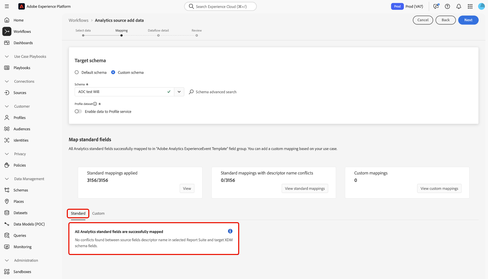

# 将Adobe Analytics连接到Experience Platform

阅读本指南，了解如何使用Adobe Analytics源将Analytics报表包数据摄取到Adobe Experience Platform。

## 快速入门

本教程需要对以下Experience Platform组件有一定的了解：

* [体验数据模型(XDM)系统](../../../../../xdm/home.md)： Experience Platform用于组织客户体验数据的标准化框架。
* [实时客户个人资料](../../../../../profile/home.md)：根据来自多个来源的汇总数据提供统一的实时客户个人资料。
* [沙盒](../../../../../sandboxes/home.md)： Experience Platform提供了将单个Experience Platform实例划分为多个单独的虚拟环境的虚拟沙盒，以帮助开发和改进数字体验应用程序。

### 关键术语

请务必了解本文档中使用的以下关键术语：

* **标准属性**：标准属性是Adobe预定义的任何属性。 它们对所有客户具有相同的含义，并且在Analytics源数据和Analytics架构字段组中可用。
* **自定义属性**：自定义属性是Analytics自定义变量层次结构中的任何属性。 在Adobe Analytics实施中使用自定义属性将特定信息捕获到报表包中，这些属性的使用因报表包而异。 自定义属性包括eVar、prop和列表。 有关eVar的更多信息，请参阅以下[有关转化变量](https://experienceleague.adobe.com/docs/analytics/admin/admin-tools/conversion-variables/conversion-var-admin.html)的Analytics文档。
* **自定义字段组中的任何属性**：源自客户创建的字段组的属性都是用户定义的属性，既不是标准属性，也不是自定义属性。

## 导航源目录

>[!NOTE]
>
>在生产沙盒中创建Analytics源数据流时，将创建两个数据流：
>
>* 一个数据流，将历史报表包数据回填到13个月的数据湖。 此数据流在回填完成后结束。
>* 将实时数据发送到数据湖和[!DNL Real-Time Customer Profile]的数据流流。 此数据流持续运行。

在Experience Platform UI中，从左侧导航中选择&#x200B;**[!UICONTROL Sources]**&#x200B;以访问[!UICONTROL Sources]工作区。 在&#x200B;*[!UICONTROL Adobe applications]*&#x200B;类别中，选择Adobe Analytics卡，然后选择&#x200B;**[!UICONTROL Add data]**。

## 选择数据

>[!IMPORTANT]
>
>* 屏幕上列出的报表包可能来自不同的区域。 您有责任了解您的数据限制和义务，以及如何跨地区在Adobe Experience Platform中使用这些数据。 请确保贵公司允许这样做。
>* 只有不存在数据冲突(例如两个含义不同的自定义属性（eVar、列表和prop）)，才能为实时客户资料启用多个报表包的数据。

报表包是构成Analytics报表基础的数据容器。 一个组织可以有多个报表包，每个报表包中包含不同的数据集。

您可以从任何区域（美国、英国或新加坡）摄取报告包，前提是它们映射到与Experience Platform沙盒实例（正在其中创建源连接）相同的组织。 只能使用单个活动数据流摄取报表包。 如果报表包为灰色并且无法选择，则表示已在您使用的沙盒或其他沙盒中摄取该报表包。

可以建立多个绑定内连接，将多个报表包纳入同一沙盒中。 如果报表包具有不同的变量架构（如eVar或事件），则应将它们映射到自定义字段组中的特定字段，并使用[数据准备](../../../../../data-prep/ui/mapping.md)避免数据冲突。 只能将报表包添加到单个沙盒中。

选择&#x200B;**[!UICONTROL Report suite]**，然后使用&#x200B;*[!UICONTROL Analytics source add data]*&#x200B;界面浏览列表并识别要摄取到Experience Platform的Analytics报表包。 选择&#x200B;**[!UICONTROL Next]**&#x200B;以继续。

&lt;!—Analytics报告包一次只能为一个沙盒配置。 要将同一报表包导入其他沙盒，必须通过对其他沙盒的配置删除数据集流并重新实例化。—>

## 映射 {#mapping}

>[!IMPORTANT]
>
>数据准备转换可能会增加整个数据流的延迟。 附加的延迟因转换逻辑的复杂性而异。

在将Analytics数据映射到目标XDM架构之前，必须首先确定是使用默认架构还是自定义架构。

>[!BEGINTABS]

>[!TAB 默认架构]

默认架构代表您创建新架构。 这个新创建的架构包含[!DNL Adobe Analytics ExperienceEvent Template]字段组。 要使用默认架构，请选择&#x200B;**[!UICONTROL Default schema]**。

>[!TAB 自定义架构]

使用自定义架构，您可以为Analytics数据选择任何可用的架构，前提是该架构具有[!DNL Adobe Analytics ExperienceEvent Template]字段组。 要使用自定义架构，请选择&#x200B;**[!UICONTROL Custom schema]**。

>[!ENDTABS]

使用&#x200B;*[!UICONTROL Mapping]*&#x200B;界面将源字段映射到其相应的目标架构字段。 您可以将自定义变量映射到新的架构字段组，并应用数据准备支持的计算。 选择目标架构以启动映射过程。

>[!TIP]
>
>架构选择菜单中仅显示具有[!DNL Adobe Analytics ExperienceEvent Template]字段组的架构。 忽略其他架构。 如果没有适合您的报表包数据的架构，则必须创建新架构。 有关创建架构的详细步骤，请参阅[在UI中创建和编辑架构指南](../../../../../xdm/ui/resources/schemas.md)。

您可以参考[!UICONTROL Map standard fields]面板以了解[!UICONTROL Standard mappings applied]中的量度。 [!UICONTROL Standard mappings with descriptor name conflicts]和[!DNL Custom mappings]。

| 映射标准字段 | 描述 |
| --- | --- |
| [!UICONTROL Standard mappings applied] | [!UICONTROL Standard mappings applied]面板显示映射属性的总数。 标准映射是指源Analytics数据中的所有属性与Analytics字段组中相应属性之间的映射。 它们是预映射的，无法编辑。 |
| [!UICONTROL Standard mappings with descriptor name conflicts] | [!UICONTROL Standard mappings with descriptor name conflicts]面板引用包含名称冲突的映射属性的数量。 如果您重复使用的架构已填充了来自其他报表包的字段描述符集，则会出现这些冲突。 即使存在名称冲突，您也可以继续处理Analytics数据流。 |
| [!UICONTROL Custom mappings] | [!UICONTROL Custom mappings]面板显示映射的自定义属性的数量，包括eVar、prop和列表。 自定义映射是指源Analytics数据中的自定义属性与选定架构中包含的自定义字段组中的属性之间的映射。 |

### 标准映射 {#standard-mappings}

Experience Platform会自动检测您的映射是否存在任何名称冲突。 如果映射没有冲突，请选择&#x200B;**[!UICONTROL Next]**&#x200B;以继续。

>[!TIP]
>
>如果源报表包与所选架构之间存在名称冲突，您仍可以继续使用Analytics数据流，同时确认不会更改字段描述符。 或者，您可以选择使用一组空白描述符创建新架构。

## 自定义映射 {#custom-mappings}

您可以使用数据准备函数为自定义属性添加新自定义映射或计算字段。 要添加自定义映射，请选择&#x200B;**[!UICONTROL Custom]**。

* **[!UICONTROL Filter fields]**：使用[!UICONTROL Filter fields]文本输入筛选映射中的特定映射字段。
* **[!UICONTROL Add new mapping]**：若要添加新的源字段和目标字段映射，请选择&#x200B;**[!UICONTROL Add new mapping]**。
* **[!UICONTROL Add calculated field]**：如果需要，您可以选择&#x200B;**[!UICONTROL Add calculated field]**&#x200B;为映射创建新的计算字段。
* **[!UICONTROL Import mapping]**：通过使用数据准备的导入映射功能，您可以缩短数据摄取过程的手动配置时间并限制错误。 选择&#x200B;**[!UICONTROL Import mapping]**&#x200B;以从现有流或导出的文件导入映射。 有关详细信息，请阅读[导入和导出映射指南](../../../../../data-prep/ui/mapping.md#import-mapping)。
* **[!UICONTROL Download template]**：您还可以下载映射的CSV副本，并在本地设备中配置映射。 选择&#x200B;**[!UICONTROL Download template]**&#x200B;以下载映射的CSV副本。 您必须确保仅使用源文件和目标架构中提供的字段。

有关数据准备的更多信息，请参阅以下文档。

* [数据准备概述](../../../../../data-prep/home.md)
* [数据准备映射函数](../../../../../data-prep/functions.md)
* [添加计算字段](../../../../../data-prep/ui/mapping.md#calculated-fields)

<!-- 
To use Data Prep functions and add new mapping or calculated fields for custom attributes, select **[!UICONTROL View custom mappings]**.

Next, select **[!UICONTROL Add new mapping]**.

Depending on your needs, you can select either **[!UICONTROL Add new mapping]** or **[!UICONTROL Add calculated field]** from the options that appear. 

An empty mapping set appears. Select the mapping icon to add a source field.

You can use the interface to navigate through the source schema structure and identify the new source field that you want to use. Once you have selected the source field that you want to map, select **[!UICONTROL Select]**.

Next, select the mapping icon under [!UICONTROL Target Field] to map your selected source field to its appropriate target field.

Similar to the source schema, you can use the interface to navigate through the target schema structure and select the target field you want to map to. Once you have selected the appropriate target field, select **[!UICONTROL Select]**.

With your custom mapping set completed, select **[!UICONTROL Next]** to proceed.

 -->

## 筛选实时客户轮廓 {#filtering-for-profile}

>[!CONTEXTUALHELP]
>id="platform_data_prep_analytics_filtering"
>title="创建筛选规则"
>abstract="在将数据发送到实时客户轮廓时定义行级和列级筛选规则。使用行级筛选来应用条件并指示要&#x200B;**为轮廓提取包含**&#x200B;的数据。使用列级筛选来选择要&#x200B;**为轮廓提取排除**&#x200B;的数据列。筛选规则不适用于发送到数据湖的数据。"

完成Analytics报表包数据的映射后，您可以应用筛选规则和条件以选择性地将数据包含或排除在摄取到Real-time Customer Profile之外。 仅支持筛选Analytics数据，并且仅在输入[!DNL Profile.]之前筛选数据。所有数据都已摄取到数据湖中。

>[!BEGINSHADEBOX]

**有关为实时客户个人资料准备和筛选Analytics数据的更多信息**

* 您可以将筛选功能用于流向个人资料的数据，但不能用于流向数据湖的数据。
* 可以对实时数据使用筛选，但无法筛选回填数据。
   * Analytics源不会将数据回填到配置文件。
* 如果您在Analytics流的初始设置期间使用数据准备配置，则这些更改也会应用于13个月的自动回填。
   * 但是，不适用于筛选，因为筛选仅保留用于实时数据。
* 数据准备会同时应用于流摄取路径和批量摄取路径。 如果您修改了现有的数据准备配置，则这些更改会应用到流摄取和批量摄取路径中的新传入数据。
   * 但是，任何数据准备配置均不适用于已摄取到Experience Platform中的数据，无论它是流数据还是批量数据。
* Analytics中的标准属性始终会自动映射。 因此，不能将转换应用于标准属性。
   * 但是，您可以筛选掉标准属性，只要Identity Service或配置文件中不需要这些属性。
* 无法使用列级筛选来筛选必填字段和标识字段。
* 虽然您可以过滤掉次要身份，特别是AAID和AACustomID，但无法过滤ECID。
* 发生转换错误时，相应的列将导致NULL。

>[!ENDSHADEBOX]

### 行级筛选

>[!IMPORTANT]
>
>使用行级筛选来应用条件并指示要&#x200B;**为轮廓提取包含**&#x200B;的数据。使用列级筛选选择要&#x200B;**排除以进行配置文件摄取**&#x200B;的数据列。

您可以在行级别和列级别筛选用于配置文件摄取的数据。 使用行级筛选来定义字符串包含、等于、开始或结束于等条件。 您还可以使用行级筛选来使用`AND`和`OR`连接条件，并使用`NOT`否定条件。

要在行级别筛选Analytics数据，请选择&#x200B;**[!UICONTROL Row filter]**&#x200B;并使用左边栏浏览架构层次结构并标识要选择的架构属性。

标识要配置的属性后，选择属性并将其从左边栏拖到筛选面板。

要配置不同的条件，请选择&#x200B;**[!UICONTROL equals]**，然后从显示的下拉窗口中选择条件。

可配置条件列表包括：

* [!UICONTROL equals]
* [!UICONTROL does not equal]
* [!UICONTROL starts with]
* [!UICONTROL ends with]
* [!UICONTROL does not end with]
* [!UICONTROL contains]
* [!UICONTROL does not contain]
* [!UICONTROL exists]
* [!UICONTROL does not exist]

接下来，根据所选的属性输入要包括的值。 在以下示例中，选择[!DNL Apple]和[!DNL Google]作为&#x200B;**[!UICONTROL Manufacturer]**&#x200B;属性的一部分进行摄取。

要进一步指定筛选条件，请从架构中添加其他属性，然后根据该属性添加值。 在以下示例中，添加了&#x200B;**[!UICONTROL Model]**&#x200B;属性，并筛选了诸如[!DNL iPhone 16]和[!DNL Google Pixel 9]之类的模型以供摄取。

要添加新容器，请选择筛选界面右上角的省略号(`...`)，然后选择&#x200B;**[!UICONTROL Add container]**。

添加新容器后，选择&#x200B;**[!UICONTROL Include]**，然后从下拉菜单中选择&#x200B;**[!UICONTROL Exclude]**。 添加要排除的属性和值，完成后，选择&#x200B;**[!UICONTROL Next]**。

### 列级筛选

从标题中选择&#x200B;**[!UICONTROL Column filter]**&#x200B;以应用列级筛选。

页面将更新为交互式架构树，在列级别显示架构属性。 在此处，您可以选择要从配置文件摄取中排除的数据列。 或者，您可以展开列并选择特定的排除属性。

默认情况下，所有Analytics都将转到配置文件，此过程允许从配置文件摄取中排除XDM数据的分支。

### 筛选次要身份

使用列筛选器从配置文件摄取中排除辅助身份。 要筛选次要身份，请选择&#x200B;**[!UICONTROL Column filter]**，然后选择&#x200B;**[!UICONTROL _identities]**。

仅当标识被标记为次要标识时，该过滤器才适用。 如果选择了身份，但某个事件到达时带有标记为主ID之一，则不会过滤掉这些身份。

### 提供数据流详细信息

此时将显示&#x200B;**[!UICONTROL Dataflow detail]**&#x200B;步骤，您必须在该步骤中为数据流提供名称和可选描述。 完成后，选择 **[!UICONTROL Next]**。

### 审查

此时将显示[!UICONTROL Review]步骤，允许您在创建新的Analytics数据流之前对其进行审核。 连接的详细信息按类别分组，包括：

* [!UICONTROL Connection]：显示连接的源平台。
* [!UICONTROL Data type]：显示选定的报表包及其对应的报表包ID。

>[!TIP]
>
>请按照以下最佳实践操作，避免超出您的许可证权利范围，并避免超出您的总存储和数据丰富度指标：
>
>* 一开始就设置体验事件数据集保留生存时间(TTL) ，以优化数据生命周期管理和存储效率。 有关更多详细信息，请参阅有关使用TTL在数据湖中管理Experience Event数据集保留的指南。
>
>* 创建Analytics源数据流时，首先要将连接器配置为仅将数据摄取到数据湖中。 确认数据流可以正常工作后，您可以为数据集启用配置文件摄取。 当行和列过滤器有效地减少数据量时，这种方法效果最佳。

## 监测数据流 {#monitor-your-dataflow}

数据流完成后，您可以使用&#x200B;*[!UICONTROL Dataflows]*&#x200B;界面监视Analytics数据流的状态。

使用[!UICONTROL Dataset activity]界面了解有关从Analytics发送到Experience Platform的数据进度的信息。 界面会显示一些量度，例如上个月的总记录数、过去七天摄取的记录数总数以及上个月的数据大小。

源实例化两个数据集流。 一个流表示回填数据，另一个流表示实时数据。 回填数据未配置为摄取到Real-time Customer Profile，而是发送到数据湖，以用于分析和数据科学用例。

有关回填、实时数据及其各自延迟的更多信息，请阅读[Analytics源概述](../../../../connectors/adobe-applications/analytics.md)。

>[!NOTE]
>
>数据集活动页面不显示有关批次的信息，因为Analytics源连接器完全由Adobe管理。 您可以通过查看所摄取记录的相关量度来监控数据流动。

## 删除您的数据流 {#delete-dataflow}

>[!NOTE]
>
>您无法禁用Analytics数据流。 要停止Analytics数据流，您必须&#x200B;**删除**&#x200B;整个数据流。

要删除您的Analytics数据流，请从源工作区的顶部标题中选择&#x200B;**[!UICONTROL Dataflows]**。 使用数据流页面查找要删除的Analytics数据流，然后选择它旁边的省略号(`...`)。 接下来，使用下拉菜单并选择&#x200B;**[!UICONTROL Delete]**。

* 删除实时Analytics数据流也将删除其基础数据集。
* 删除回填Analytics数据流不会删除基础数据集，但将停止其相应报表包的回填过程。 如果删除回填数据流，则摄取的数据可能仍会通过数据集查看。

## 后续步骤和其他资源

创建连接后，将自动创建数据流以包含传入数据并使用您选择的架构填充数据集。 此外，还会进行数据回填，并摄取至多13个月的历史数据。 完成初始摄取后，Analytics数据将被下游Experience Platform服务（如[!DNL Real-Time Customer Profile]和分段服务）使用。 有关更多详细信息，请参阅以下文档：

* [[!DNL Real-Time Customer Profile] 概述](../../../../../profile/home.md)
* [[!DNL Segmentation Service] 概述](../../../../../segmentation/home.md)
* [[!DNL Data Science Workspace] 概述](../../../../../data-science-workspace/home.md)
* [[!DNL Query Service] 概述](../../../../../query-service/home.md)

以下视频旨在支持您了解如何使用Adobe Analytics Source Connector摄取数据：

>[!WARNING]
>
> 以下视频中显示的[!DNL Experience Platform] UI已过期。 有关最新的UI屏幕截图和功能，请参阅上述文档。

>[!VIDEO](https://video.tv.adobe.com/v/29687?quality=12&learn=on)

