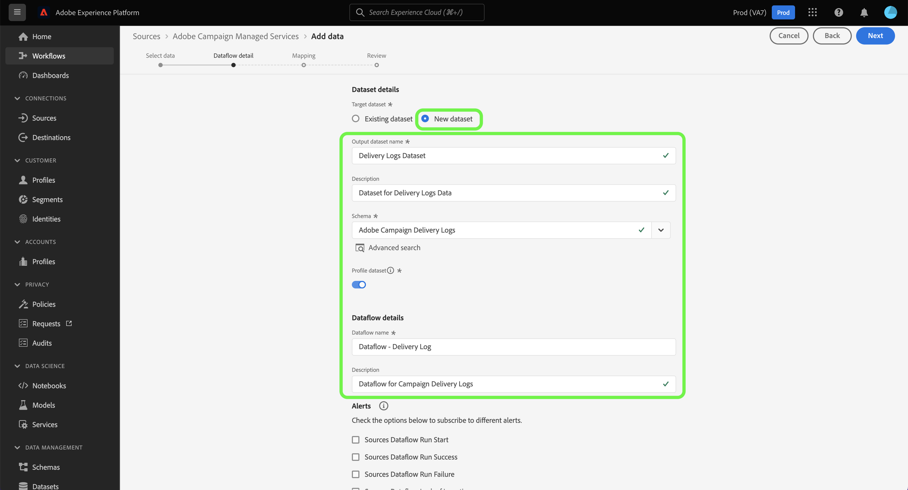

# 使用Experience Platform UI创建Adobe Campaign Managed Cloud Services源连接

本教程提供了创建源连接以将Adobe Campaign Managed Cloud Services数据引入到Adobe Experience Platform的步骤。

## 快速入门

本指南要求您对Experience Platform的以下组件有一定的了解：

* [源](../../../../home.md)： Experience Platform允许从各种源摄取数据，同时让您能够使用Experience Platform服务来构建、标记和增强传入数据。
* [[!DNL Experience Data Model (XDM)] 系统](../../../../../xdm/home.md)： Experience Platform用于组织客户体验数据的标准化框架。
   * [架构组合的基础知识](../../../../../xdm/schema/composition.md)：了解XDM架构的基本构建块，包括架构组合中的关键原则和最佳实践。
   * [架构编辑器教程](../../../../../xdm/tutorials/create-schema-ui.md)：了解如何使用架构编辑器UI创建自定义架构。
* [沙盒](../../../../../sandboxes/home.md)： Experience Platform提供了将单个Experience Platform实例划分为多个单独的虚拟环境的虚拟沙盒，以帮助开发和改进数字体验应用程序。

## 将Adobe Campaign Managed Cloud Services连接到Experience Platform

在Experience Platform UI中，从左侧导航中选择&#x200B;**[!UICONTROL 源]**&#x200B;以访问[!UICONTROL 源]工作区。 [!UICONTROL Catalog]屏幕显示您可以用来创建帐户的各种源。

您可以从屏幕左侧的目录中选择相应的类别。 您还可以使用搜索栏缩小显示的源。

在&#x200B;**[!UICONTROL Adobe应用程序]**&#x200B;类别下，选择&#x200B;**[!UICONTROL Adobe Campaign Managed Cloud Services]**，然后选择&#x200B;**[!UICONTROL 添加数据]**。

### 选择数据 {#select-data}

>[!CONTEXTUALHELP]
>id="platform_sources_campaign_instance"
>title="Adobe Campaign 环境实例"
>abstract="要使用的 Adobe Campaign 环境的名称。"
>text="Learn more in documentation"

>[!CONTEXTUALHELP]
>id="platform_sources_campaign_mapping"
>title="目标映射"
>abstract="目标映射是 Campaign 用于传递消息的技术对象，并包含发送投放内容所需的所有技术设置（地址、电话号码、选择加入指示器、附加标识符...）。"
>text="Learn more in documentation"

>[!CONTEXTUALHELP]
>id="platform_sources_campaign_schema"
>title="架构名称"
>abstract="Adobe Campaign 数据库中定义的实体的名称。"
>text="Learn more in documentation"

此时将显示[!UICONTROL 选择数据]步骤，该步骤为您提供了一个用于配置[!UICONTROL Adobe Campaign实例]、[!UICONTROL 目标映射]和[!UICONTROL 架构名称]的界面。

| 属性 | 描述 |
| --- | --- |
| Adobe Campaign实例 | 您正在使用的Adobe Campaign环境实例的名称。 |
| 目标映射 | Campaign用于投放消息的技术对象，包含发送投放所需的所有技术设置。 |
| 架构名称 | 您带到Experience Platform的架构实体的名称。 选项包括投放日志和跟踪日志。 |

为Campaign实例、目标映射和架构名称提供值后，屏幕会更新以显示架构预览和示例数据集。 完成后，选择&#x200B;**[!UICONTROL 下一步]**。

### 使用现有数据集

[!UICONTROL 数据流详细信息]页面允许您选择是要使用现有数据集，还是要为数据流配置新数据集。

要使用现有数据集，请选择&#x200B;**[!UICONTROL 现有数据集]**。 您可以使用[!UICONTROL 高级搜索]选项或通过滚动下拉菜单中的现有数据集列表来检索现有数据集。

选择数据集后，为数据流提供名称和可选描述。

### 使用新数据集

若要使用新数据集，请选择&#x200B;**[!UICONTROL 新数据集]**，然后提供输出数据集名称和可选描述。 接下来，使用[!UICONTROL 高级搜索]选项或通过滚动下拉菜单中的现有架构列表来选择要映射到的架构。 完成后，选择&#x200B;**[!UICONTROL 下一步]**。

### 启用警报

您可以启用警报以接收有关数据流状态的通知。 从列表中选择警报以订阅并接收有关数据流状态的通知。 有关警报的详细信息，请参阅[使用UI订阅源警报指南](../../alerts.md)。

完成向数据流提供详细信息后，选择&#x200B;**[!UICONTROL 下一步]**。

### 将数据字段映射到XDM架构

此时将显示[!UICONTROL 映射]步骤，该步骤为您提供了一个接口，用于将源架构中的源字段映射到目标架构中相应的目标XDM字段。

Experience Platform根据您选择的目标架构或数据集，为自动映射的字段提供智能推荐。 您可以手动调整映射规则以适合您的用例。 根据需要，您可以选择直接映射字段，或使用数据准备函数转换源数据以派生计算值或计算值。 有关使用映射器界面和计算字段的全面步骤，请参阅[数据准备UI指南](../../../../../data-prep/ui/mapping.md)。

>[!IMPORTANT]
>
>将源字段映射到目标XDM字段时，必须确保将指定的主标识字段映射到其相应的目标XDM字段。
>
>对于每个受众，您最多可以添加20个要映射到Adobe Campaign的字段。 您可以通过更新Campaign资源管理器的“管理” > “平台” > “选项”文件夹中`NmsCdp_Aep_Sources_Max_Columns`选项的值来更改此限制。

成功映射源数据后，选择&#x200B;**[!UICONTROL 下一步]**。

### 查看您的数据流

将显示&#x200B;**[!UICONTROL 审核]**&#x200B;步骤，允许您在创建新数据流之前对其进行审核。 详细信息分为以下类别：

* **[!UICONTROL 连接]**：显示源类型、所选源文件的相关路径以及该源文件中的列数。
* **[!UICONTROL 分配数据集和映射字段]**：显示要将源数据摄取到哪个数据集，包括数据集所遵循的架构。

查看数据流后，选择&#x200B;**[!UICONTROL 完成]**，然后等待一些时间来创建数据流。

### 监测数据集活动

创建数据流后，您可以监视通过该数据流摄取的数据，以查看有关摄取率以及成功和失败的批次的信息。

要开始查看数据集活动，请在源目录中选择&#x200B;**[!UICONTROL 数据流]**。

接下来，从出现的数据流列表中选择目标数据集。

此时将显示数据集活动页面。 从此处，您可以查看有关数据流性能的信息，包括摄取率、成功的批次和失败的批次。

此页面还提供一个界面来更新数据流的元数据描述，启用部分摄取和错误诊断，以及向数据集添加新数据。

>[!IMPORTANT]
>
>无法使用Adobe Campaign Managed Cloud Services源回填旧的事件日志。 如果需要回填，请使用自定义工作流或自定义实现将数据导出到Amazon S3或Azure Blob，或者从Amazon S3或Azure Blob导出到Adobe Experience Platform数据集。

## 后续步骤

通过学习本教程，您已成功创建了一个数据流，将Campaign v8投放日志和跟踪日志数据引入到Experience Platform。 传入数据现在可供下游Experience Platform服务（如[!DNL Real-Time Customer Profile]和[!DNL Data Science Workspace]）使用。 有关更多详细信息，请参阅以下文档：

* [[!DNL Real-Time Customer Profile] 概述](../../../../../profile/home.md)
* [[!DNL Data Science Workspace] 概述](../../../../../data-science-workspace/home.md)
