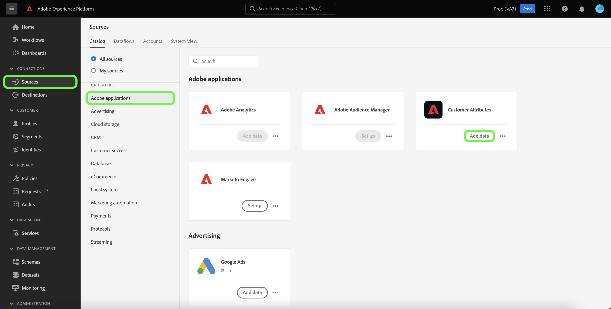

# 在UI中创建客户属性源连接

本教程提供了在UI中创建源连接以将客户属性配置文件数据引入Adobe Experience Platform的步骤。 有关客户属性的更多信息，请参阅[客户属性概述](https://experienceleague.adobe.com/docs/core-services/interface/customer-attributes/attributes.html?lang=zh-Hans)。

>[!IMPORTANT]
>
>客户属性源当前不支持启用或禁用数据流。

## 创建源连接

>[!NOTE]
>
>如果您已经为客户属性配置文件数据建立了源连接，则禁用与源连接的选项。

在Experience Platform UI中，从左侧导航中选择&#x200B;**[!UICONTROL 源]**&#x200B;以访问[!UICONTROL 源]工作区。 [!UICONTROL Catalog]屏幕显示您可以创建连接的各种源。

您可以从屏幕左侧的目录中选择相应的类别。 或者，您可以使用搜索栏查找要使用的特定源。

在[!UICONTROL Adobe应用程序]类别下，选择&#x200B;**[!UICONTROL 客户属性]**，然后选择&#x200B;**[!UICONTROL 添加数据]**。

### 选择客户属性数据源

[!UICONTROL 添加数据]屏幕列出了客户属性的所有可用数据源。 每个客户属性源连接只能选择一个数据集。

>[!NOTE]
>
>字段组、架构和数据集是现成创建的，作为流配置的一部分。 它们将保持不变，如果需要，您必须手动删除它们。

客户属性源不支持架构演变。 如果客户属性数据源的架构输入发生更改，则它将变得与Experience Platform不兼容。 作为解决方法，您可以删除现有的客户属性数据流及其关联的数据集、架构和字段组，然后使用更新的架构和数据源创建新客户属性数据流。

>[!IMPORTANT]
>
>虽然您可以删除客户属性数据流，但即使在删除数据流后，其相应的数据集仍将保留。 有关如何手动删除数据集的步骤，请参阅[删除数据集](../../../../../catalog/datasets/user-guide.md)指南。

若要创建新连接，请从列表中选择数据源，然后选择&#x200B;**[!UICONTROL 下一步]**。

### 提供数据流详细信息

此时将显示[!UICONTROL 数据流详细信息]步骤，该步骤允许您为数据流提供名称和简要说明。 在此过程中，您还可以配置[!UICONTROL 错误诊断]、[!UICONTROL 部分摄取]和[!UICONTROL 警报]的设置。

[!UICONTROL 错误诊断]允许为数据流中发生的任何错误记录生成详细的错误消息，而[!UICONTROL 部分摄取]允许您摄取包含错误的数据，摄取阈值为您手动定义的某个阈值。 有关详细信息，请参阅[部分批次摄取概述](../../../../../ingestion/batch-ingestion/partial.md)。

您可以启用警报以接收有关数据流状态的通知。 从列表中选择警报以订阅接收有关数据流状态的通知。 有关警报的详细信息，请参阅[使用UI订阅源警报指南](../../alerts.md)。

完成向数据流提供详细信息后，选择&#x200B;**[!UICONTROL 下一步]**。

### 查看数据流

将显示[!UICONTROL 审核]步骤，允许您在创建新数据流之前对其进行审核。 详细信息分为以下类别：

* **[!UICONTROL 连接]**：显示源类型、所选源文件的相关路径以及该源文件中的列数。
* **[!UICONTROL 分配数据集和映射字段]**：显示要将源数据摄取到哪个数据集，包括数据集所遵循的架构。

## 后续步骤

创建连接后，将自动创建目标架构和数据集以包含传入数据。 完成初始摄取后，下游Experience Platform服务（如[!DNL Real-Time Customer Profile]和[!DNL Segmentation Service]）可以使用客户属性配置文件数据。 有关更多详细信息，请参阅以下文档：

* [[!DNL Real-Time Customer Profile] 概述](../../../../../profile/home.md)
* [[!DNL Segmentation Service] 概述](../../../../../segmentation/home.md)
