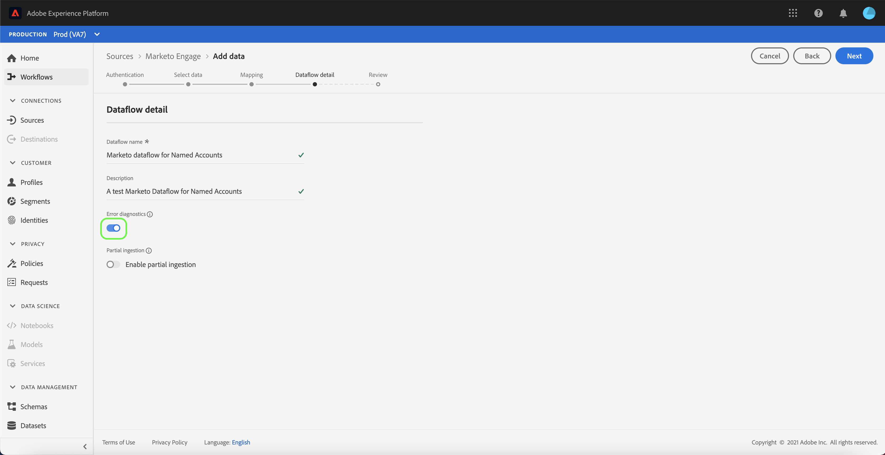

# 创建 [!DNL Marketo Engage] UI中的源连接器

本教程提供了创建 [!DNL Marketo Engage] (以下简称“[!DNL Marketo]“)UI中的源连接器，将B2B数据导入Adobe Experience Platform。

## 快速入门

本教程需要对Adobe Experience Platform的以下组件有一定的了解：

* [源](../../../../home.md):Experience Platform允许从各种源摄取数据，同时让您能够使用Platform服务来构建、标记和增强传入数据。
* [体验数据模型(XDM)](../../../../../xdm/home.md):Experience Platform组织客户体验数据的标准化框架。
   * [在UI中创建和编辑架构](../../../../../xdm/ui/resources/schemas.md):了解如何在UI中创建和编辑模式。
* [身份命名空间](../../../../../identity-service/namespaces.md):身份命名空间是 [!DNL Identity Service] 作为身份相关背景的指标。 完全限定的标识包括ID值和命名空间。
* [[!DNL Real-time Customer Profile]](/help/profile/home.md):根据来自多个来源的汇总数据提供统一的实时客户资料。
* [沙箱](../../../../../sandboxes/home.md):Experience Platform提供将单个Platform实例分区为单独虚拟环境的虚拟沙盒，以帮助开发和改进数字体验应用程序。

### 收集所需的凭据

为了访问 [!DNL Marketo] 帐户时，必须提供以下值：

| 凭据 | 描述 |
| ---------- | ----------- |
| `munchkinId` | Munchkin ID是特定 [!DNL Marketo] 实例。 |
| `clientId` | 您的 [!DNL Marketo] 实例。 |
| `clientSecret` | 您的唯一客户端密钥 [!DNL Marketo] 实例。 |

有关获取这些值的更多信息，请参阅 [[!DNL Marketo] 身份验证指南](../../../../connectors/adobe-applications/marketo/marketo-auth.md).

收集所需的凭据后，即可执行下一节中的步骤。

## 连接 [!DNL Marketo] 帐户

在平台UI中，选择 **[!UICONTROL 源]** 从左侧导航栏访问 [!UICONTROL 源] 工作区。 的 [!UICONTROL 目录] 屏幕会显示您可为其创建帐户的各种源。

您可以从屏幕左侧的目录中选择相应的类别。 或者，您也可以使用搜索栏找到要使用的特定源。

在 [!UICONTROL Adobe应用程序] 类别，选择 **[!UICONTROL Marketo Engage]**. 然后，选择 **[!UICONTROL 添加数据]** 创建新 [!DNL Marketo] 数据流。

的 **[!UICONTROL 连接到Marketo Engage]** 页面。 在此页面上，您可以使用新帐户或访问现有帐户。

### 新帐户

如果要创建新帐户，请选择 **[!UICONTROL 新帐户]**. 在显示的输入窗体中，提供帐户名称、可选描述和 [!DNL Marketo] 身份验证凭据。 完成后，选择 **[!UICONTROL 连接到源]** 然后，再留出一些时间建立新连接。

### 现有帐户

要使用现有帐户创建数据流，请选择 **[!UICONTROL 现有帐户]** ，然后选择 [!DNL Marketo] 帐户。 选择 **[!UICONTROL 下一个]** 以继续。

## 选择数据集

创建 [!DNL Marketo] 帐户，下一步会提供一个界面供您浏览 [!DNL Marketo] 数据集。

界面的左半部分是目录浏览器，显示 [!DNL Marketo] 数据集。 功能齐全 [!DNL Marketo] 源连接需要摄取九个不同的数据集。 如果您还在使用 [!DNL Marketo] 基于帐户的营销(ABM)功能，则还必须创建第10个数据流以引入 [!UICONTROL 指定帐户] 数据集。

>[!NOTE]
>
>为简短起见，以下教程使用 [!UICONTROL 指定帐户] 例如，但下面列出的步骤适用于以下10个 [!DNL Marketo] 数据集。

选择要先摄取的数据集，然后选择 **[!UICONTROL 下一个]**.

## 地图 [!DNL Marketo] 平台模式

的 [!UICONTROL 映射] 显示步骤，提供要映射的界面 [!DNL Marketo] 模式到平台。

为要摄取到的入站数据选择数据集。 您可以使用现有数据集或创建新数据集。

### 使用现有数据集

要将数据摄取到现有数据集，请选择 **[!UICONTROL 现有数据集]**，然后选择数据集图标。

的 **[!UICONTROL 选择数据集]** 对话框。 查找包含您要使用的相应架构的数据集，将其选中，然后选择 **[!UICONTROL 确认]**.

### 使用新数据集

要将数据引入新数据集，请选择 **[!UICONTROL 新数据集]** 并在提供的字段中输入数据集的名称和描述。

您可以通过在 **[!UICONTROL 选择架构]** 搜索栏。 您还可以选择下拉图标以查看现有架构的列表。 或者，您也可以选择 **[!UICONTROL 高级搜索]** 访问现有架构的页面，包括其各自的详细信息。

切换 **[!UICONTROL 配置文件数据集]** 按钮为 [!DNL Profile]，使您能够创建实体属性和行为的整体视图。 所有数据 [!DNL Profile]-enabled数据集将包含在 [!DNL Profile] 和更改将在您保存数据流时应用。

选择架构后，向下滚动以查看映射对话框以开始映射 [!DNL Marketo] 数据集字段映射到相应的目标XDM字段。

### 映射 [!DNL Marketo] 用于定位XDM字段的数据集源字段

每个 [!DNL Marketo] 数据集有其自己的特定映射规则可遵循。 有关如何映射的更多信息，请参阅以下内容 [!DNL Marketo] 数据集到XDM:

* [活动](../../../../connectors/adobe-applications/mapping/marketo.md#activities)
* [程序](../../../../connectors/adobe-applications/mapping/marketo.md#programs)
* [方案成员资格](../../../../connectors/adobe-applications/mapping/marketo.md#program-memberships)
* [公司](../../../../connectors/adobe-applications/mapping/marketo.md#companies)
* [静态列表](../../../../connectors/adobe-applications/mapping/marketo.md#static-lists)
* [静态列表成员关系](../../../../connectors/adobe-applications/mapping/marketo.md#static-list-memberships)
* [指定帐户](../../../../connectors/adobe-applications/mapping/marketo.md#named-accounts)
* [机会](../../../../connectors/adobe-applications/mapping/marketo.md#opportunities)
* [机会联系角色](../../../../connectors/adobe-applications/mapping/marketo.md#opportunity-contact-roles)
* [人员](../../../../connectors/adobe-applications/mapping/marketo.md#persons)

选择 **[!UICONTROL 预览数据]** 查看基于选定数据集的映射结果。

的 [!UICONTROL 预览] 弹出窗口提供了一个界面，用于浏览选定数据集中最多100行示例数据的映射结果。

将源字段映射到相应的目标字段后，请选择 **[!UICONTROL 关闭]**.

## 提供数据流详细信息

的 [!UICONTROL 数据流详细信息] 步骤，以便提供新数据流的名称和简要说明。

启用 **[!UICONTROL 错误诊断]** 切换以允许为新摄取的批次生成详细错误消息，您可以使用API下载这些批次。 有关更多信息，请参阅 [检索数据摄取错误诊断](../../../../../ingestion/quality/error-diagnostics.md).

的 [!DNL Marketo] 连接器使用批量摄取来摄取所有历史记录，并使用流式摄取来进行实时更新。 这允许连接器在摄取任何错误记录时继续流式传输。 启用 **[!UICONTROL 部分摄取]** 切换，然后设置 [!UICONTROL 错误阈值%] 以防止数据流失败。

**[!UICONTROL 部分摄取]** 能够摄取包含错误且最高达特定阈值的数据。 有关更多信息，请参阅 [部分批量摄取概述](../../../../../ingestion/batch-ingestion/partial.md).

提供数据流详细信息并将错误阈值设置为max后，请选择 **[!UICONTROL 下一个]**.

## 查看数据流

的 **[!UICONTROL 审阅]** 步骤，允许您在创建新数据流之前查看新数据流。 详细信息按以下类别分组：

* **[!UICONTROL 连接]**:显示源类型、所选源实体的相关路径以及该源实体中的列数。
* **[!UICONTROL 分配数据集和映射字段]**:显示源数据被摄取到的数据集，包括该数据集附加的架构。

审核数据流后，选择 **[!UICONTROL 完成]** 并为创建数据流留出一些时间。

## 监控数据流

创建数据流后，您可以监控通过其摄取的数据，以查看有关摄取率、成功和错误的信息。 有关如何监视数据流的更多信息，请参阅 [监控UI中的数据流](../../../../../dataflows/ui/monitor-sources.md).

## 删除属性

数据集中的自定义属性不能以追溯方式隐藏或删除。 如果要隐藏或删除现有数据集中的自定义属性，则必须创建一个没有此自定义属性的新数据集、一个新的XDM架构，并为您创建的新数据集配置新的数据流。 您还必须禁用或删除原始数据流，该数据流包含具有您要隐藏或删除的自定义属性的数据集。

## 删除数据流

您可以删除不再需要或使用错误创建的数据流 **[!UICONTROL 删除]** 函数 [!UICONTROL 数据流] 工作区。 有关如何删除数据流的更多信息，请参阅 [删除UI中的数据流](../../delete.md).

## 后续步骤

通过阅读本教程，您已成功创建了要引入的数据流 [!DNL Marketo] 数据。 传入数据现在可由下游Platform服务使用，例如 [!DNL Real-time Customer Profile] 和 [!DNL Data Science Workspace]. 有关更多详细信息，请参阅以下文档：

* [[!DNL Real-time Customer Profile] 概述](/help/profile/home.md)
* [[!DNL Data Science Workspace] 概述](/help/data-science-workspace/home.md)
