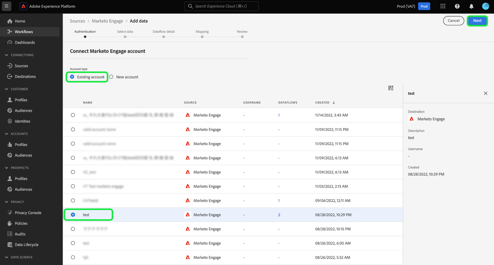

# 创建 [!DNL Marketo Engage] UI中的源连接和数据流

>[!IMPORTANT]
>
>创建之前 [!DNL Marketo Engage] 源连接和数据流，您必须首先确保 [已映射您的Adobe组织ID](https://experienceleague.adobe.com/docs/marketo/using/product-docs/core-marketo-concepts/miscellaneous/set-up-adobe-organization-mapping.html?lang=en) 在 [!DNL Marketo]. 此外，您还必须确保已完成 [自动填充 [!DNL Marketo] B2B命名空间和架构](../../../../connectors/adobe-applications/marketo/marketo-namespaces.md) ，然后再创建源连接和数据流。

本教程提供了用于创建 [!DNL Marketo Engage] (以下简称“ ”[!DNL Marketo]&quot;) UI中的源连接器，用于将B2B数据引入Adobe Experience Platform。

## 快速入门

本教程需要深入了解Adobe Experience Platform的以下组件：

* [B2B命名空间和模式自动生成实用程序](../../../../connectors/adobe-applications/marketo/marketo-namespaces.md)：通过B2B命名空间和模式自动生成实用程序，您可以使用 [!DNL Postman] 自动生成B2B命名空间和架构的值。 必须先完成B2B命名空间和架构，然后才能创建 [!DNL Marketo] 源连接和数据流。
* [源](../../../../home.md)：Experience Platform允许从各种源摄取数据，同时让您能够使用Platform服务来构建、标记和增强传入数据。
* [体验数据模型(XDM)](../../../../../xdm/home.md)：Experience Platform用于组织客户体验数据的标准化框架。
   * [在UI中创建和编辑架构](../../../../../xdm/ui/resources/schemas.md)：了解如何在UI中创建和编辑架构。
* [身份命名空间](../../../../../identity-service/namespaces.md)：身份命名空间是的组件 [!DNL Identity Service] 用作与身份相关的上下文的指示器。 完全限定的身份包括ID值和命名空间。
* [[!DNL Real-Time Customer Profile]](/help/profile/home.md)：根据来自多个来源的汇总数据提供统一的实时使用者个人资料。
* [沙盒](../../../../../sandboxes/home.md)：Experience Platform提供可将单个Platform实例划分为多个单独的虚拟环境的虚拟沙箱，以帮助开发和改进数字体验应用程序。

### 收集所需的凭据

要访问您的 [!DNL Marketo] 帐户，您必须提供以下值：

| 凭据 | 描述 |
| ---------- | ----------- |
| `munchkinId` | Munchkin ID是特定对象的唯一标识符 [!DNL Marketo] 实例。 |
| `clientId` | 的唯一客户端ID [!DNL Marketo] 实例。 |
| `clientSecret` | 您的唯一客户端密码 [!DNL Marketo] 实例。 |

有关获取这些值的详细信息，请参阅 [[!DNL Marketo] 身份验证指南](../../../../connectors/adobe-applications/marketo/marketo-auth.md).

收集完所需的凭据后，您可以执行下一节中的步骤。

## 连接您的 [!DNL Marketo] 帐户

在Platform UI中，选择 **[!UICONTROL 源]** 以访问 [!UICONTROL 源] 工作区。 此 [!UICONTROL 目录] 屏幕显示您可以用来创建帐户的各种源。

您可以从屏幕左侧的目录中选择相应的类别。 或者，您可以使用搜索栏查找要使用的特定源。

在 [!UICONTROL Adobe应用程序] 类别，选择 **[!UICONTROL Marketo Engage]**. 然后，选择 **[!UICONTROL 添加数据]** 以新建 [!DNL Marketo] 数据流。

此 **[!UICONTROL 连接Marketo Engage帐户]** 页面。 在此页面上，您可以使用新帐户或访问现有帐户。

### 现有帐户

要使用现有帐户创建数据流，请选择 **[!UICONTROL 现有帐户]** 然后选择 [!DNL Marketo] 要使用的帐户。 选择 **[!UICONTROL 下一个]** 以继续。

### 新帐户

如果要创建新帐户，请选择 **[!UICONTROL 新帐户]**. 在显示的输入表单上，提供帐户名称、可选描述以及 [!DNL Marketo] 身份验证凭据。 完成后，选择 **[!UICONTROL 连接到源]** 然后留出一些时间来建立新连接。

## 选择数据集

创建之后 [!DNL Marketo] 帐户，下一步为您提供了一个浏览界面 [!DNL Marketo] 数据集。

界面的左半部分是一个目录浏览器，显示10 [!DNL Marketo] 数据集。 功能齐全的 [!DNL Marketo] 源连接需要摄取9个不同的数据集。 如果您还使用 [!DNL Marketo] 基于帐户的营销(ABM)功能，则还必须创建第10个数据流来摄取 [!UICONTROL 指定帐户] 数据集。

>[!NOTE]
>
>为了简单起见，以下教程使用 [!UICONTROL 机会] 例如，下面列出的步骤适用于10项中的任意一项 [!DNL Marketo] 数据集。

选择要首先摄取的数据集，然后选择 **[!UICONTROL 下一个]**.

## 提供数据流详细信息 {#provide-dataflow-details}

此 [!UICONTROL 数据流详细信息] 页面允许您选择是要使用现有数据集，还是新数据集。 在此过程中，您还可以配置设置 [!UICONTROL 配置文件数据集]， [!UICONTROL 错误诊断]， [!UICONTROL 部分摄取]、和 [!UICONTROL 警报].

>[!BEGINTABS]

>[!TAB 使用现有数据集]

要将数据摄取到现有数据集，请选择 **[!UICONTROL 现有数据集]**. 您可以使用检索现有数据集 [!UICONTROL 高级搜索] 选项中进行选择，或者通过滚动下拉菜单中的现有数据集列表来进行选择。 选择数据集后，为数据流提供名称和描述。

>[!TAB 使用新数据集]

要摄取到新数据集中，请选择 **[!UICONTROL 新建数据集]** 然后提供输出数据集名称和可选描述。 接下来，使用选择要映射到的架构 [!UICONTROL 高级搜索] 选项中进行选择，或者通过滚动下拉菜单中的现有架构列表来进行选择。 选择架构后，为数据流提供名称和描述。

>[!ENDTABS]

### 启用 [!DNL Profile] 和错误诊断

接下来，选择 **[!UICONTROL 配置文件数据集]** 切换以启用您的数据集 [!DNL Profile]. 这允许您创建实体的属性和行为的整体视图。 来自所有客户的数据 [!DNL Profile] — 启用的数据集将包含在 [!DNL Profile] 在保存数据流时，将应用更改。

[!UICONTROL 错误诊断] 为数据流中发生的任何错误记录启用详细的错误消息生成，而 [!UICONTROL 部分摄取] 允许您摄取包含错误的数据，摄取到手动定义的特定阈值为止。 请参阅 [部分批量摄取概述](../../../../../ingestion/batch-ingestion/partial.md) 了解更多信息。

>[!IMPORTANT]
>
>此 [!DNL Marketo] 源使用批量摄取来摄取所有历史记录，并使用流式摄取进行实时更新。 这允许源在摄取任何错误记录时继续流式传输。 启用 **[!UICONTROL 部分摄取]** 切换，然后设置 [!UICONTROL 错误阈值%] 最大，以防止数据流失败。

### 启用警报

您可以启用警报以接收有关数据流状态的通知。 从列表中选择警报以订阅接收有关数据流状态的通知。 有关警报的更多信息，请参阅以下指南中的 [使用UI订阅源警报](../../alerts.md).

完成向数据流提供详细信息后，选择 **[!UICONTROL 下一个]**.

### 摄取公司数据时跳过无人认领的帐户

在创建数据流以从公司数据集摄取数据时，您可以配置 [!UICONTROL 排除无人认领的帐户] 从引入中排除或包括无人认领的帐户。

当个人填写表格时， [!DNL Marketo] 根据不包含其他数据的公司名称创建虚拟帐户记录。 对于新数据流，默认情况下会启用排除无人认领帐户的切换。 对于现有数据流，您可以启用或禁用该功能，所做的更改将应用于新摄取的数据，而不应用于现有数据。

## 映射您的 [!DNL Marketo] 数据集源字段到目标XDM字段

此 [!UICONTROL 映射] 步骤随即显示，为您提供了一个界面，用于将源架构中的源字段映射到目标架构中相应的目标XDM字段。

每个 [!DNL Marketo] 数据集有自己的特定映射规则要遵循。 有关如何映射的更多信息，请参阅以下内容 [!DNL Marketo] 数据集到XDM：

* [活动](../../../../connectors/adobe-applications/mapping/marketo.md#activities)
* [项目](../../../../connectors/adobe-applications/mapping/marketo.md#programs)
* [计划成员资格](../../../../connectors/adobe-applications/mapping/marketo.md#program-memberships)
* [公司](../../../../connectors/adobe-applications/mapping/marketo.md#companies)
* [静态列表](../../../../connectors/adobe-applications/mapping/marketo.md#static-lists)
* [静态列表成员资格](../../../../connectors/adobe-applications/mapping/marketo.md#static-list-memberships)
* [指定帐户](../../../../connectors/adobe-applications/mapping/marketo.md#named-accounts)
* [机会](../../../../connectors/adobe-applications/mapping/marketo.md#opportunities)
* [机会联系人角色](../../../../connectors/adobe-applications/mapping/marketo.md#opportunity-contact-roles)
* [人员](../../../../connectors/adobe-applications/mapping/marketo.md#persons)

根据需要，您可以选择直接映射字段，或使用数据准备函数转换源数据以派生计算值或计算值。 有关使用映射界面的完整步骤，请参阅 [数据准备UI指南](../../../../../data-prep/ui/mapping.md).

映射集准备就绪后，选择 **[!UICONTROL 下一个]** 并留出一些时间以便创建新数据流。

## 查看您的数据流

此 **[!UICONTROL 审核]** 步骤，允许您在创建新数据流之前对其进行查看。 详细信息分为以下类别：

* **[!UICONTROL 连接]**：显示源类型、所选源实体的相关路径以及源实体中的列数。
* **[!UICONTROL 分配数据集和映射字段]**：显示要将源数据摄取到哪个数据集，包括该数据集所遵循的架构。

查看数据流后，选择 **[!UICONTROL 保存并摄取]** 并留出一些时间来创建数据流。

## 监测数据流

创建数据流后，您可以监视通过它摄取的数据，以查看有关摄取率、成功和错误的信息。 有关如何监视数据流的更多信息，请参阅关于的教程 [在UI中监控数据流](../../../../../dataflows/ui/monitor-sources.md).

## 删除您的属性

不能以追溯方式隐藏或删除数据集中的自定义属性。 如果要从现有数据集中隐藏或移除自定义属性，则必须创建一个没有此自定义属性的新数据集、一个新的XDM架构，并为您创建的新数据集配置新的数据流。 您还必须禁用或删除原始数据流，该数据流包含要隐藏或删除的具有自定义属性的数据集。

## 删除数据流

您可以删除不再必需或之前使用错误创建的数据流 **[!UICONTROL 删除]** 函数位于 [!UICONTROL 数据流] 工作区。 有关如何删除数据流的更多信息，请参阅关于的教程 [在UI中删除数据流](../../delete.md).

## 后续步骤

通过学习本教程，您已成功地创建了要引入的数据流 [!DNL Marketo] 数据。 传入数据现在可供下游平台服务使用，例如 [!DNL Real-Time Customer Profile] 和 [!DNL Data Science Workspace]. 有关更多详细信息，请参阅以下文档：

* [[!DNL Real-Time Customer Profile] 概述](/help/profile/home.md)
* [[!DNL Data Science Workspace] 概述](/help/data-science-workspace/home.md)

## 附录 {#appendix}

以下部分提供了在使用时，您可以遵循的其他准则 [!DNL Marketo] 源。

### UI中的错误消息 {#error-messages}

当Platform检测到设置问题时，UI中会显示以下错误消息：

#### [!DNL Munchkin ID] 未映射到相应的组织

在以下情况下，身份验证将被拒绝： [!DNL Munchkin ID] 未映射到您正在使用的Platform组织。 配置以下对象之间的映射： [!DNL Munchkin ID] 以及您的组织 [[!DNL Marketo] 界面](https://app-sjint.marketo.com/#MM0A1).

#### 缺少主要身份

如果缺少主标识，数据流将无法保存和摄取。 确保 [XDM架构中存在主标识](../../../../../xdm/tutorials/create-schema-ui.md)，然后尝试配置数据流。

