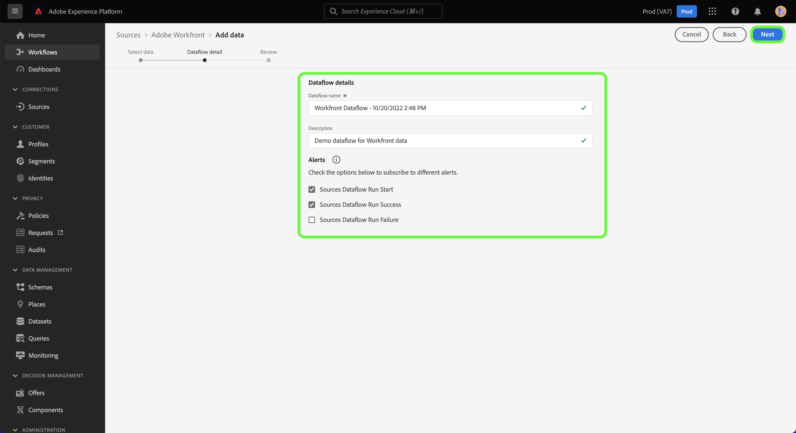

# （测试版）在UI中创建Adobe Workfront源连接

>[!NOTE]
>
>Adobe Workfront源为测试版。 请参阅 [源概述](../../../../home.md#terms-and-conditions) 有关使用测试版标记源的更多信息。

本教程提供了创建Adobe Workfront源连接的步骤，以便使用用户界面将Workfront数据引入到Adobe Experience Platform。

## 快速入门

>[!IMPORTANT]
>
>您必须在Adobe Admin Console中配置为管理员才能访问Workfront源。

本教程需要对以下Experience Platform组件有一定的了解：

* [Experience Data Model (XDM)系统](../../../../../xdm/home.md)：Experience Platform用于组织客户体验数据的标准化框架。
* [Real-time Customer Profile](../../../../../profile/home.md)：根据来自多个来源的汇总数据提供统一的实时使用者个人资料。
* [沙盒](../../../../../sandboxes/home.md)：Experience Platform提供可将单个Platform实例划分为多个单独的虚拟环境的虚拟沙箱，以帮助开发和改进数字体验应用程序。

## 在UI中创建Workfront源连接

在Platform UI中，选择 **[!UICONTROL 源]** 从左侧导航访问 [!UICONTROL 源] 工作区。 此 [!UICONTROL 目录] 屏幕显示可用于创建帐户的各种源。

您可以从屏幕左侧的目录中选择相应的类别。 您还可以使用搜索栏缩小显示的源范围。

在 **[!UICONTROL Adobe应用程序]** 类别，选择 **[!UICONTROL Adobe Workfront]** 然后选择 **[!UICONTROL 添加数据]**.

## 选择数据

此 [!UICONTROL 选择数据] 步骤。 在这里，您必须提供Workfront子域和Datalane的值。 例如，您的Workfront子域就是用于访问Workfront实例的相同URL `https://acme.workfront.com/`，而您的datalane表示您要使用的workfront环境。

添加子域和datalane后，选择 **[!UICONTROL 下一个]**.

## 提供数据流详细信息

数据流详细信息步骤允许您为数据流提供名称和可选描述。 在此步骤中，您还可以订阅警报以接收有关数据流状态的通知。 有关警报的更多信息，请访问以下教程： [在源UI中订阅警报](../../alerts.md).

提供数据流详细信息并配置所需的警报设置后，选择 **[!UICONTROL 下一个]**.

## 请查看

此 **[!UICONTROL 审核]** 步骤，允许您在创建新数据流之前对其进行查看。 详细信息分为以下类别：

* **[!UICONTROL 连接]**：显示源类型、所选源文件的相关路径以及该源文件中的列数。
* **[!UICONTROL 分配数据集和映射字段]**：显示要将源数据摄取到哪个数据集，包括该数据集所遵循的架构。

查看数据流后，选择 **[!UICONTROL 完成]** 并留出一些时间来创建数据流。

## 附录

以下部分提供有关Workfront源的其他信息。

### Workfront更改事件架构

Platform中的Workfront数据表示为时间序列记录数据，数据中的每一行都有一个时间戳，该时间戳显示事件发生的时间以及与该事件相关的属性。

在设置过程中，会创建一个名为Workfront Change Events from Flow的架构。

| 架构字段 | 描述 |
| --- | --- |
| `timestamp` | 选定事件发生的时段。 时间戳以GTM时区表示。 |
| `_workfront.objectType` | 对象类型。 可用的值可以包括 `project`， `task`， `portfolio`和其他对象，具体取决于更改或创建的对象。 |
| `_workfront.objectID` | 对应于对象类型的ID。 |
| `_workfront.created` | 此值设置为 `1` 如果事件表示对象创建。 |
| `_workfront.deleted` | 此值设置为 `1` 如果删除了对象。 |
| `_worfkront.updated` | 此值设置为 `1` 如果对象已更新。 |
| `_workfront.completed` | 此值设置为 `1` 对象是否标记为已完成。 |
| `_workfront.parentObjectType` | （可选）对应于对象父级的对象类型。 |
| `_workfront.parentID` | 父对象的ID。 |
| `_workfront.customData` | 事件期间填充的所有自定义表单字段和值的映射。 |

>[!IMPORTANT]
>
>仅填充已更改或作为事件的一部分创建的属性。 例如，如果仅更改对象的名称，则只会填充以下字段：<ul><li>`timestamp`</li><li>`_workfront.update (=1)`</li><li>`_workfront.objectType`</li><li>`_workfront.objectID`</li><li>`_workfront.objectName`</li></ul>

## 后续步骤

按照本教程，您现在已创建了一个数据流，用于将数据从Workfront引入Experience Platform。 您现在可以使用以下服务 [查询服务](../../../../../query-service/home.md) 以进一步分析您的数据。 有关Workfront的更多信息，请阅读 [Workfront概述](../../../../connectors/adobe-applications/workfront.md).
