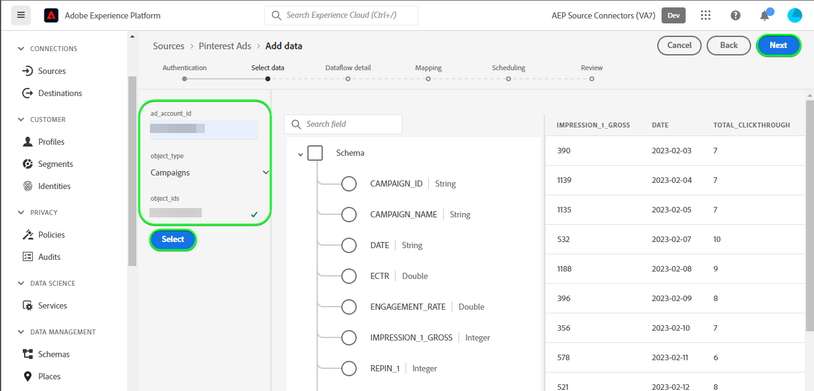
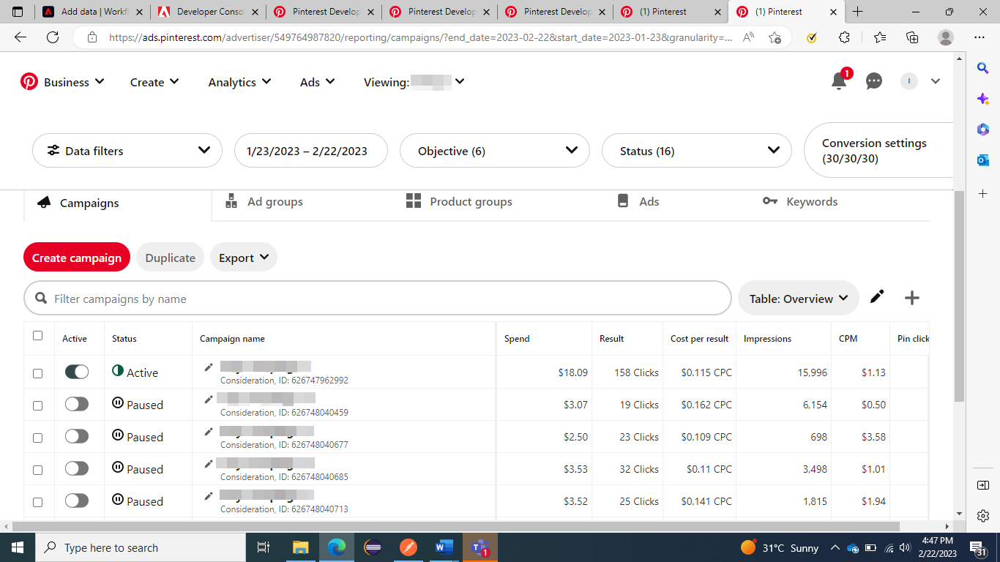

# 创建 [!DNL Pinterest Ads] UI中的源连接

>[!NOTE]
>
>此 [!DNL Pinterest Ads] 源为测试版。 阅读 [源概述](../../../../home.md#terms-and-conditions) 有关使用测试版标记源代码的更多信息。

本教程提供了用于创建 [!DNL Pinterest Ads] 源连接器，使用Adobe Experience Platform用户界面。

## 快速入门 {#getting-started}

本教程需要对以下Experience Platform组件有一定的了解：

* [[!DNL Experience Data Model (XDM)] 系统](../../../../../xdm/home.md)：Experience Platform用于组织客户体验数据的标准化框架。
   * [模式组合基础](../../../../../xdm/schema/composition.md)：了解XDM架构的基本构建基块，包括架构构成中的关键原则和最佳实践。
   * [架构编辑器教程](../../../../../xdm/tutorials/create-schema-ui.md)：了解如何使用架构编辑器UI创建自定义架构。
* [[!DNL Real-Time Customer Profile]](../../../../../profile/home.md)：根据来自多个来源的汇总数据提供统一的实时使用者个人资料。

## 先决条件 {#prerequisites}

为了连接 [!DNL Pinterest Ads] 要Experience Platform，必须提供以下连接属性的值：

* 此 [!DNL Pinterest] 访问令牌。
* 此 [!DNL Pinterest] 广告帐户ID。
* 其中之一 [!DNL Pinterest] 活动、广告组或广告ID。

有关这些连接属性的详细信息，请阅读 [[!DNL Pinterest Ads] 概述](../../../../connectors/advertising/pinterest-ads.md#prerequisites).

### 创建Platform架构 {#create-platform-schema}

您还必须确保首先创建一个平台架构以用于您的 [!DNL Pinterst Ads] 源。 阅读有关的教程 [创建平台架构](../../../../../xdm/schema/composition.md) 以了解有关如何创建模式的完整步骤。


有关支持的字段列表， [!DNL Pinterest] 促销活动、广告组和广告API，请参阅 [[!DNL Pinterest] 字段](#pinterest-fields) 部分。

## 连接您的 [!DNL Pinterest Ads] 帐户 {#connect-account}

在Platform UI中，选择 **[!UICONTROL 源]** 从左侧导航栏访问 [!UICONTROL 源] 工作区。 此 [!UICONTROL 目录] 屏幕显示了您可以用来创建帐户的各种来源。

您可以从屏幕左侧的目录中选择相应的类别。 或者，您可以使用搜索选项查找您要使用的特定源。

在 *广告* 类别，选择 **[!UICONTROL pinterest Ads]**，然后选择 **[!UICONTROL 添加数据]**.


此 **[!UICONTROL 连接Pinterest Ads帐户]** 页面。 在此页上，您可以使用新凭据或现有凭据。

### 现有帐户 {#existing-account}

要使用现有帐户，请选择 [!DNL Pinterest Ads] 要用于创建新数据流的帐户，然后选择 **[!UICONTROL 下一个]** 以继续。


### 新帐户 {#new-account}

如果要创建新帐户，请选择 **[!UICONTROL 新帐户]**，然后提供名称、可选描述和您的凭据。 完成后，选择 **[!UICONTROL 连接到源]** 然后等待一段时间以建立新连接。


## 选择数据 {#select-data}

此 **[!UICONTROL 选择数据]** 此时会显示步骤，提供一个界面以供您输入将传递到API的信息，以便将您需要的数据传送到Platform。

| 字段 | 描述 |
| --- | --- |
| [!UICONTROL ad_account_id] | 您的 [!DNL Pinterest Ads] 广告帐户ID。 请参阅 [[!DNL Pinterest] 有关在广告管理器中查找ID的指南](https://help.pinterest.com/en/business/article/find-ids-in-ads-manager) 如果你需要任何指导。 |
| [!UICONTROL 对象类型] | 选择其中一项 **营销活动**， **广告组** 或 **广告** 根据 [!DNL Pinterest] 要从其中获取信息的Analytics API。 |
| [!UICONTROL object_ids] | 所选对象的ID。 导航至 [!DNL Pinterest] 第页对象 **pinterest业务中心** > **广告帐户摘要** > **营销活动** / **广告组** / **广告** 并复制每个名称下方提到的所需ID。 |

>[!TIP]
>
>您可以提供多个 `object_ids` 通过传递逗号分隔的值。 您可以在单个请求中传递的最大ID数为100。 如果传递的值不正确，Platform将显示以下消息： `The request could not be processed. Error from flow provider: Unknown error while processing request.`

提供值后，选择 **[!UICONTROL 选择]**. 如果提供的值有效，将填充界面的右侧部分，即预览数据。



## 后续步骤 {#next-steps}

通过学习本教程，您已建立与的连接 [!DNL Pinterest Ads] 帐户。 您现在可以继续下一教程和 [配置数据流以将广告数据引入Platform](../../dataflow/advertising.md).

## 其他资源 {#additional-resources}

以下各节提供了在使用时，您可以参考的其他资源 [!DNL Pinterest Ads] 源。

## 计划 {#scheduling}

安排您的 [!DNL Pinterest Ads] 数据流进行摄取，必须选择以下频率和间隔配置之一：

| 频度 | 间隔 |
| --- | --- |
| `Day` | 1 |
| `Hour` | 24 |

欲知关于您的计划 [!DNL Pinterest Ads] 数据流，阅读 [护栏部分 [!DNL Pinterest Ads] 概述](../../../../connectors/advertising/pinterest-ads.md#guardrails).

为您的计划提供值后，选择 **[!UICONTROL 下一个]**.


### 验证 {#validation}

验证是否已正确设置源和 [!DNL Pinterest Ads] 正在摄取数据，请执行以下步骤：

在Platform UI中，选择 **[!UICONTROL 查看数据流]** 在 [!DNL Pinterest Ads] 目录页面上的信息卡菜单。 然后，您可以选择 [!UICONTROL 预览数据集] 以验证已摄取的数据。


您可以根据上显示的计数验证数据 [!DNL Pinterest] UI

>[!BEGINTABS]

>[!TAB 营销活动]



>[!TAB 广告组]


>[!TAB 广告]


>[!ENDTABS]


### [!DNL Pinterest] 字段 {#pinterest-fields}

支持的字段 [!DNL Pinterest] 促销活动、广告组和广告API如下所示：

+++ 查看有效负荷

```json
{
  "items": [
    {
      "name": "AD_GROUP_ID",
      "category": "ADS",
      "definition": "Unique ID for your ad group",
      "display_name": "Ad group ID"
    },
    {
      "name": "AD_ID",
      "category": "ADS",
      "definition": "Unique ID for your ad",
      "display_name": "Ad ID"
    },
    {
      "name": "CAMPAIGN_BOOKING_REFERENCE",
      "category": "ADS",
      "definition": "Campaign booking reference number",
      "display_name": "Campaign booking reference"
    },
    {
      "name": "CAMPAIGN_DAILY_SPEND_CAP",
      "category": "ADS",
      "definition": "The maximum amount you're willing to spend in one day",
      "display_name": "Daily budget"
    },
    {
      "name": "CAMPAIGN_ID",
      "category": "ADS",
      "definition": "Unique ID for your campaign",
      "display_name": "Campaign ID"
    },
    {
      "name": "CAMPAIGN_LIFETIME_SPEND_CAP",
      "category": "ADS",
      "definition": "The maximum amount you're willing to spend over the lifetime of your campaign",
      "display_name": "Lifetime budget"
    },
    {
      "name": "CAMPAIGN_NAME",
      "category": "ADS",
      "definition": "Name, objective and ID of your campaign",
      "display_name": "Campaign name"
    },
    {
      "name": "CHECKOUT_ROAS",
      "category": "ADS",
      "definition": "Average return on ad spend for checkout events. This metric may include conversions that are modeled.",
      "display_name": "ROAS (Checkout)"
    },
    {
      "name": "CLICKTHROUGH_1",
      "category": "ADS",
      "definition": "The total number of clicks on your Pin to content on or off of Pinterest",
      "display_name": "Paid Pin clicks"
    },
    {
      "name": "CLICKTHROUGH_1_GROSS",
      "category": "ADS",
      "definition": "Unfiltered number of times someone clicks your ad (paid)",
      "display_name": "Gross Pin clicks"
    },
    {
      "name": "CLICKTHROUGH_2",
      "category": "ADS",
      "definition": "Total number of Pin clicks from ads saved to another person's board",
      "display_name": "Earned Pin clicks"
    },
    {
      "name": "CPC_IN_MICRO_DOLLAR",
      "category": "ADS",
      "definition": "The cost per click in micro dollars"
    },
    {
      "name": "CPM_IN_DOLLAR",
      "category": "ADS",
      "definition": "Average cost per 1k paid impressions",
      "display_name": "CPM"
    },
    {
      "name": "CPM_IN_MICRO_DOLLAR",
      "category": "ADS",
      "definition": "Cost per thousand first-order impressions in micro dollars"
    },
    {
      "name": "CPW_IN_DOLLAR",
      "category": "ADS",
      "definition": "The cost per web session in dollars"
    },
    {
      "name": "CPW_IN_MICRO_DOLLAR",
      "category": "ADS",
      "definition": "The cost per web session in micro dollars"
    },
    {
      "name": "CTR",
      "category": "ADS",
      "definition": "Paid Pin clicks divided by paid impressions",
      "display_name": "Paid CTR"
    },
    {
      "name": "CTR_2",
      "category": "ADS",
      "definition": "Earned Pin clicks divided by earned impressions",
      "display_name": "Earned CTR"
    },
    {
      "name": "ECPCV_IN_DOLLAR",
      "category": "ADS",
      "definition": "Average cost per video view that was watched to completion",
      "display_name": "CPCV (100%)"
    },
    {
      "name": "ECPCV_P95_IN_DOLLAR",
      "category": "ADS",
      "definition": "Average cost per video that was watched until 95% of its length",
      "display_name": "CPCV (95%)"
    },
    {
      "name": "ECPC_IN_DOLLAR",
      "category": "ADS",
      "definition": "Average cost per click",
      "display_name": "CPC"
    },
    {
      "name": "ECPC_IN_MICRO_DOLLAR",
      "category": "ADS",
      "definition": "Effective CPC (including first-order and downstream clicks) in micro dollars"
    },
    {
      "name": "ECPE_IN_DOLLAR",
      "category": "ADS",
      "definition": "Cost per engagement",
      "display_name": "CPE"
    },
    {
      "name": "ECPM_IN_MICRO_DOLLAR",
      "category": "ADS",
      "definition": "Effective CPM (including first-order and downstream impressions) in micro dollars"
    },
    {
      "name": "ECPV_IN_DOLLAR",
      "category": "ADS",
      "definition": "Average cost per video view",
      "display_name": "CPV"
    },
    {
      "name": "ECTR",
      "category": "ADS",
      "definition": "Total Pin clicks divided by total impressions",
      "display_name": "CTR"
    },
    {
      "name": "EENGAGEMENT_RATE",
      "category": "ADS",
      "definition": "Total engagements divided by total impressions",
      "display_name": "Engagement rate"
    },
    {
      "name": "ENGAGEMENT",
      "category": "ORGANIC",
      "definition": "The total number of engagements on your Pins. This includes saves, Pin clicks, outbound clicks, carousel card swipes, secondary creative (collections) clicks and Idea Pin forward/backward swipes.",
      "display_name": "Engagement"
    },
    {
      "name": "ENGAGEMENT_1",
      "category": "ADS",
      "definition": "Paid actions taken as a result of your ads",
      "display_name": "Paid engagements"
    },
    {
      "name": "ENGAGEMENT_2",
      "category": "ADS",
      "definition": "Earned actions from ads saved to boards",
      "display_name": "Earned engagements"
    },
    {
      "name": "ENGAGEMENT_RATE",
      "category": "ADS",
      "definition": "Paid engagements divided by paid impressions"
    },
    {
      "name": "ENGAGEMENT_RATE",
      "category": "ORGANIC",
      "definition": "The total engagements with your Pins divided by the total number of times your Pins were seen. Engagements include saves, Pin clicks, and outbound clicks.",
      "display_name": "Engagement rate"
    },
    {
      "name": "IDEA_PIN_PAGE_BACKWARD_1",
      "category": "ADS",
      "definition": "The number of times someone goes back to a previous page within an Idea Pin you promoted"
    },
    {
      "name": "IDEA_PIN_PAGE_BACKWARD_2",
      "category": "ADS",
      "definition": "The number of times someone goes back to a previous page within your Idea Pin on someone else's board"
    },
    {
      "name": "IDEA_PIN_PAGE_FORWARD_1",
      "category": "ADS",
      "definition": "The number of times someone advances to a new page within an Idea Pin you promoted"
    },
    {
      "name": "IDEA_PIN_PAGE_FORWARD_2",
      "category": "ADS",
      "definition": "The number of times someone advances to a new page within your Idea Pin on someone else's board"
    },
    {
      "name": "IDEA_PIN_PRODUCT_TAG_VISIT_1",
      "category": "ADS",
      "definition": "The number of times someone taps on a product tagged within an Idea Pin you promoted"
    },
    {
      "name": "IDEA_PIN_PRODUCT_TAG_VISIT_2",
      "category": "ADS",
      "definition": "The number of times someone taps on a product tagged within an Idea ad saved to another person's board"
    },
    {
      "name": "IMPRESSION",
      "category": "ORGANIC",
      "definition": "The number of times your Pins were on screen.",
      "display_name": "Impressions"
    },
    {
      "name": "IMPRESSION_1",
      "category": "ADS",
      "definition": "The number of times your ad was seen",
      "display_name": "Paid impressions"
    },
    {
      "name": "IMPRESSION_1_GROSS",
      "category": "ADS",
      "definition": "Unfiltered number of times your ad was on screen (paid)",
      "display_name": "Gross impressions"
    },
    {
      "name": "IMPRESSION_2",
      "category": "ADS",
      "definition": "Total number of times your ad was viewed after being saved to another person's board",
      "display_name": "Earned impressions"
    },
    {
      "name": "INAPP_CHECKOUT_COST_PER_ACTION",
      "category": "ADS",
      "definition": "Average cost per in-app checkout event",
      "display_name": "In-app CPA (Checkout)"
    },
    {
      "name": "OUTBOUND_CLICK",
      "category": "ORGANIC",
      "definition": "The number of times people perform actions that lead them to a destination off Pinterest.",
      "display_name": "Outbound clicks"
    },
    {
      "name": "OUTBOUND_CLICK_1",
      "category": "ADS",
      "definition": "The total number of clicks to the destination URL associated with your ad",
      "display_name": "Paid outbound clicks"
    },
    {
      "name": "OUTBOUND_CLICK_2",
      "category": "ADS",
      "definition": "The total number of clicks to the destination URL associated with your ad saved to another person's board",
      "display_name": "Earned outbound clicks"
    },
    {
      "name": "OUTBOUND_CLICK_RATE",
      "category": "ORGANIC",
      "definition": "The total number of clicks to the destination URL associated with your Pin divided by the total number of times your Pins were on screen.",
      "display_name": "Outbound click rate"
    },
    {
      "name": "PAGE_VISIT_COST_PER_ACTION",
      "category": "ADS",
      "definition": "Average cost per page visit event. This metric may include conversions that are modeled.",
      "display_name": "CPA (Page visit)"
    },
    {
      "name": "PAGE_VISIT_ROAS",
      "category": "ADS",
      "definition": "Average return on ad spend for page visit events. This metric may include conversions that are modeled.",
      "display_name": "ROAS (Page visit)"
    },
    {
      "name": "PAID_IMPRESSION",
      "category": "ADS",
      "definition": "The number of impressions that you paid for",
      "display_name": "Paid Impressions"
    },
    {
      "name": "PINTEREST_CHECKOUT_COST_PER_ACTION",
      "category": "ADS",
      "definition": "Average cost per Pinterest checkout event",
      "display_name": "Pinterest CPA (Checkout)"
    },
    {
      "name": "PINTEREST_CHECKOUT_ROAS",
      "category": "ADS",
      "definition": "Average return on ad spend for Pinterest checkout events",
      "display_name": "Pinterest ROAS (Checkout)"
    },
    {
      "name": "PIN_CLICK",
      "category": "ORGANIC",
      "definition": "The total number of clicks on your Pin so it opens in closeup.",
      "display_name": "Pin click"
    },
    {
      "name": "PIN_CLICK_RATE",
      "category": "ORGANIC",
      "definition": "The total number of clicks from your Pin to content on or off Pinterest, divided by the total number of times your Pins were on screen.",
      "display_name": "Pin click rate"
    },
    {
      "name": "PIN_ID",
      "category": "ADS",
      "definition": "Thumbnail of your ad's image or video",
      "display_name": "Organic pin ID"
    },
    {
      "name": "PIN_PROMOTION_ID",
      "category": "ADS",
      "definition": "Unique ID for your ad",
      "display_name": "Ad ID"
    },
    {
      "name": "QUARTILE_95_PERCENT_VIEW",
      "category": "ORGANIC",
      "definition": "The number of times your video was viewed to 95% of its length.",
      "display_name": "Played to 95%"
    },
    {
      "name": "REPIN_1",
      "category": "ADS",
      "definition": "Total number of saves for your ad",
      "display_name": "Paid saves"
    },
    {
      "name": "REPIN_2",
      "category": "ADS",
      "definition": "Number of times your ad was saved from another person's board",
      "display_name": "Earned saves"
    },
    {
      "name": "REPIN_RATE",
      "category": "ADS",
      "definition": "Paid saves divided by paid impressions",
      "display_name": "Paid save rate"
    },
    {
      "name": "SAVE",
      "category": "ORGANIC",
      "definition": "The number of times people saved your Pin to a board.",
      "display_name": "Saves"
    },
    {
      "name": "SAVE_RATE",
      "category": "ORGANIC",
      "definition": "The total saves of your Pins divided by the total number of times your Pins were on screen.",
      "display_name": "Save rate"
    },
    {
      "name": "SPEND_IN_DOLLAR",
      "category": "ADS",
      "definition": "Total amount you've spent during the reporting time period",
      "display_name": "Spend"
    },
    {
      "name": "SPEND_IN_MICRO_DOLLAR",
      "category": "ADS",
      "definition": "The money you spend for promoted Pins, in micro dollars",
      "display_name": "Spend in account currency"
    },
    {
      "name": "SPEND_IN_MICRO_US_DOLLAR",
      "category": "ADS",
      "definition": "The money you spend for promoted Pins, in micro USD",
      "display_name": "Spend in micro USD"
    },
    {
      "name": "SPEND_IN_US_DOLLAR",
      "category": "ADS",
      "definition": "Total amount you've spent during the reporting time period (in USD)",
      "display_name": "Spend In USD"
    },
    {
      "name": "TOTAL_CHECKOUT",
      "category": "ADS",
      "definition": "Total number of checkout events that resulted from interactions with your ad. This metric may include conversions that are modeled.",
      "display_name": "Conversions (Checkout)"
    },
    {
      "name": "TOTAL_CHECKOUT_VALUE_IN_MICRO_DOLLAR",
      "category": "ADS",
      "definition": "Total value of checkout events resulting from interactions with your ad. This metric may include conversions that are modeled.",
      "display_name": "Order value (Checkout)"
    },
    {
      "name": "TOTAL_CLICKTHROUGH",
      "category": "ADS",
      "definition": "The total number of clicks on your Pin to content on or off of Pinterest (paid and earned)",
      "display_name": "Pin clicks"
    },
    {
      "name": "TOTAL_CLICK_ADD_TO_CART",
      "category": "ADS",
      "definition": "The number of add to cart events resulting from clicks on your ad. This metric may include conversions that are modeled.",
      "display_name": "Click-through conversions (Add to cart)"
    },
    {
      "name": "TOTAL_CLICK_CHECKOUT",
      "category": "ADS",
      "definition": "Total number of checkout events resulting from clicks on your ad. This metric may include conversions that are modeled.",
      "display_name": "Click-through conversions (Checkout)"
    },
    {
      "name": "TOTAL_CLICK_CHECKOUT_VALUE_IN_MICRO_DOLLAR",
      "category": "ADS",
      "definition": "Total value of checkout events resulting from clicks on your ad. This metric may include conversions that are modeled.",
      "display_name": "Click-through order value (Checkout)"
    },
    {
      "name": "TOTAL_CLICK_LEAD",
      "category": "ADS",
      "definition": "Total number of lead events resulting from clicks on your ad. This metric may include conversions that are modeled.",
      "display_name": "Click-through conversions (Lead)"
    },
    {
      "name": "TOTAL_CLICK_SIGNUP",
      "category": "ADS",
      "definition": "Number of signup events resulting from clicks on your ad. This metric may include conversions that are modeled.",
      "display_name": "Click-through conversions (Signup)"
    },
    {
      "name": "TOTAL_CLICK_SIGNUP_VALUE_IN_MICRO_DOLLAR",
      "category": "ADS",
      "definition": "Total value of signup events resulting from clicks on your ad. This metric may include conversions that are modeled.",
      "display_name": "Click-through value (Signup)"
    },
    {
      "name": "TOTAL_CONVERSIONS",
      "category": "ADS",
      "definition": "Total number of conversions for all event types using the Pinterest Tag integration after an ad interaction. This metric may include conversions that are modeled.",
      "display_name": "Conversions"
    },
    {
      "name": "TOTAL_CUSTOM",
      "category": "ADS",
      "definition": "Total number of custom events resulting from interactions with your ad. This metric may include conversions that are modeled.",
      "display_name": "Conversions (Custom)"
    },
    {
      "name": "TOTAL_ENGAGEMENT",
      "category": "ADS",
      "definition": "The total number of engagements on your ads, including clicks, saves, carousel swipes, and collections secondary saves",
      "display_name": "Engagements"
    },
    {
      "name": "TOTAL_ENGAGEMENT_CHECKOUT",
      "category": "ADS",
      "definition": "Total number of checkout events resulting from engagements with your ad. Engagements includes saves, closeups, carousel swipes, collection secondary closeups, and collection secondary saves. This metric may include conversions that are modeled.",
      "display_name": "Engagement conversions (Checkout)"
    },
    {
      "name": "TOTAL_ENGAGEMENT_CHECKOUT_VALUE_IN_MICRO_DOLLAR",
      "category": "ADS",
      "definition": "Total value of checkout events resulting from engagements with your ad. Engagements includes saves, closeups, carousel swipes, collection secondary closeups, and collection secondary saves. This metric may include conversions that are modeled.",
      "display_name": "Engagement order value (Checkout)"
    },
    {
      "name": "TOTAL_ENGAGEMENT_LEAD",
      "category": "ADS",
      "definition": "Total number of lead events resulting from engagement with your ad. Engagements includes saves, closeups, carousel swipes, collection secondary closeups, and collection secondary saves. This metric may include conversions that are modeled.",
      "display_name": "Engagement conversions (Lead)"
    },
    {
      "name": "TOTAL_ENGAGEMENT_SIGNUP",
      "category": "ADS",
      "definition": "Total number of signup events resulting from engagements with your ad. Engagements includes saves, closeups, carousel swipes, collection secondary closeups, and collection secondary saves. This metric may include conversions that are modeled.",
      "display_name": "Engagement conversions (Signup)"
    },
    {
      "name": "TOTAL_ENGAGEMENT_SIGNUP_VALUE_IN_MICRO_DOLLAR",
      "category": "ADS",
      "definition": "Total value of signup events resulting from engagements with your ad. Engagements includes saves, closeups, carousel swipes, collection secondary closeups, and collection secondary saves. This metric may include conversions that are modeled.",
      "display_name": "Engagement value (Signup)"
    },
    {
      "name": "TOTAL_IDEA_PIN_PAGE_BACKWARD",
      "category": "ADS",
      "definition": "The total number of times someone goes back to a previous page within an Idea Pin, including paid and earned",
      "display_name": "Total Idea Pin page backward"
    },
    {
      "name": "TOTAL_IDEA_PIN_PAGE_FORWARD",
      "category": "ADS",
      "definition": "The total number of times someone advances to a new page within an Idea Pin, including paid and earned",
      "display_name": "Total Idea Pin page forward"
    },
    {
      "name": "TOTAL_IDEA_PIN_PRODUCT_TAG_VISIT",
      "category": "ADS",
      "definition": "The number of times someone taps on a product tagged within an Idea Pin, paid and earned.",
      "display_name": "Total Idea Pin product tag visits"
    },
    {
      "name": "TOTAL_IMPRESSION_FREQUENCY",
      "category": "ADS",
      "definition": "The average number of times each user saw your ad.",
      "display_name": "Frequency"
    },
    {
      "name": "TOTAL_IMPRESSION_USER",
      "category": "ADS",
      "definition": "Total number of unique users who saw your ads",
      "display_name": "Reach"
    },
    {
      "name": "TOTAL_LEAD",
      "category": "ADS",
      "definition": "Total number of lead events resulting from interactions with your ad. This metric may include conversions that are modeled.",
      "display_name": "Conversions (Lead)"
    },
    {
      "name": "TOTAL_OFFLINE_CHECKOUT",
      "category": "ADS",
      "definition": "Total number of offline checkout events resulting from clicks on your ad",
      "display_name": "Offline conversions (Checkout)"
    },
    {
      "name": "TOTAL_PAGE_VISIT",
      "category": "ADS",
      "definition": "Total number of page visit events resulting from interactions with your ad. This metric may include conversions that are modeled.",
      "display_name": "Conversions (Page visit)"
    },
    {
      "name": "TOTAL_PINTEREST_CHECKOUT",
      "category": "ADS",
      "definition": "Total number of Pinterest checkout events resulting from clicks on your ad",
      "display_name": "Pinterest conversions (Checkout)"
    },
    {
      "name": "TOTAL_PINTEREST_CHECKOUT_VALUE_IN_MICRO_DOLLAR",
      "category": "ADS",
      "definition": "Total value of Pinterest checkout events resulting from interactions with your ad",
      "display_name": "Pinterest order value (Checkout)"
    },
    {
      "name": "TOTAL_REPIN_RATE",
      "category": "ADS",
      "definition": "Total saves divided by total impressions",
      "display_name": "Total save rate"
    },
    {
      "name": "TOTAL_SIGNUP",
      "category": "ADS",
      "definition": "Total number of signup events resulting from interactions with your ad. This metric may include conversions that are modeled.",
      "display_name": "Conversions (Signup)"
    },
    {
      "name": "TOTAL_SIGNUP_VALUE_IN_MICRO_DOLLAR",
      "category": "ADS",
      "definition": "Total value of signup events resulting from interactions with your ad. This metric may include conversions that are modeled.",
      "display_name": "Value (Signup)"
    },
    {
      "name": "TOTAL_VIDEO_3SEC_VIEWS",
      "category": "ADS",
      "definition": "Total number of times your video ad played continuously for at least 3 seconds while 50% visible (paid and earned)",
      "display_name": "Total 3-Second Video Views"
    },
    {
      "name": "TOTAL_VIDEO_AVG_WATCHTIME_IN_SECOND",
      "category": "ADS",
      "definition": "Averaged across all videos that begin playback, including seeks and loops. Start time triggered when video begins playback.",
      "display_name": "Average Watch Time In Seconds"
    },
    {
      "name": "TOTAL_VIDEO_MRC_VIEWS",
      "category": "ADS",
      "definition": "Total number of times your video ad played continuously for at least 2 seconds while 50% visible (paid and earned)",
      "display_name": "Video views"
    },
    {
      "name": "TOTAL_VIDEO_P0_COMBINED",
      "category": "ADS",
      "definition": "Total number of times your video ad started playing (paid and earned)",
      "display_name": "Total video starts"
    },
    {
      "name": "TOTAL_VIDEO_P100_COMPLETE",
      "category": "ADS",
      "definition": "Total number of times your video ad played 100% of its length, including views that skipped ahead to this point (paid and earned)",
      "display_name": "Total video played at 100%"
    },
    {
      "name": "TOTAL_VIDEO_P25_COMBINED",
      "category": "ADS",
      "definition": "Total number of times your video ad played 25% of its length, including views that skipped ahead to this point (paid and earned)",
      "display_name": "Total video played at 25%"
    },
    {
      "name": "TOTAL_VIDEO_P50_COMBINED",
      "category": "ADS",
      "definition": "Total number of times your video ad played 50% of its length, including views that skipped ahead to this point (paid and earned)",
      "display_name": "Total video played at 50%"
    },
    {
      "name": "TOTAL_VIDEO_P75_COMBINED",
      "category": "ADS",
      "definition": "Total number of times your video ad played 75% of its length, including views that skipped ahead to this point (paid and earned)",
      "display_name": "Total video played at 75%"
    },
    {
      "name": "TOTAL_VIDEO_P95_COMBINED",
      "category": "ADS",
      "definition": "Total number of times your video ad played 95% of its length, including views that skipped ahead to this point (paid and earned)",
      "display_name": "Total video played at 95%"
    },
    {
      "name": "TOTAL_VIEW_ADD_TO_CART",
      "category": "ADS",
      "definition": "Total number of add to cart events resulting from views of your ad. This metric may include conversions that are modeled.",
      "display_name": "View-through conversions (Add to cart)"
    },
    {
      "name": "TOTAL_VIEW_CHECKOUT",
      "category": "ADS",
      "definition": "Total number of checkout events resulting from views of your ad. This metric may include conversions that are modeled.",
      "display_name": "View-through conversions (Checkout)"
    },
    {
      "name": "TOTAL_VIEW_CHECKOUT_VALUE_IN_MICRO_DOLLAR",
      "category": "ADS",
      "definition": "Total value of checkout events resulting from views of your ad. This metric may include conversions that are modeled.",
      "display_name": "View-through order value (Checkout)"
    },
    {
      "name": "TOTAL_VIEW_LEAD",
      "category": "ADS",
      "definition": "Total number of lead events resulting from views of your ad. This metric may include conversions that are modeled.",
      "display_name": "View-through conversions (Lead)"
    },
    {
      "name": "TOTAL_VIEW_SIGNUP",
      "category": "ADS",
      "definition": "Number of signup events resulting from views of your ad. This metric may include conversions that are modeled.",
      "display_name": "View-through conversions (Signup)"
    },
    {
      "name": "TOTAL_VIEW_SIGNUP_VALUE_IN_MICRO_DOLLAR",
      "category": "ADS",
      "definition": "Total value of signup events resulting from views of your ad. This metric may include conversions that are modeled.",
      "display_name": "View-through value (Signup)"
    },
    {
      "name": "TOTAL_WEB_CHECKOUT",
      "category": "ADS",
      "definition": "Total number of web checkout events resulting from clicks on your ad. This metric may include conversions that are modeled.",
      "display_name": "Web conversions (Checkout)"
    },
    {
      "name": "TOTAL_WEB_CHECKOUT_VALUE_IN_MICRO_DOLLAR",
      "category": "ADS",
      "definition": "Total value of web checkout events resulting from interactions with your ad. This metric may include conversions that are modeled.",
      "display_name": "Web order value (Checkout)"
    },
    {
      "name": "TOTAL_WEB_CLICK_CHECKOUT",
      "category": "ADS",
      "definition": "Total number of web checkout events resulting from clicks on your ad. This metric may include conversions that are modeled.",
      "display_name": "Web click-through conversions (Checkout)"
    },
    {
      "name": "TOTAL_WEB_CLICK_CHECKOUT_VALUE_IN_MICRO_DOLLAR",
      "category": "ADS",
      "definition": "Total value of web checkout events resulting from clicks on your ad. This metric may include conversions that are modeled.",
      "display_name": "Web click-through order value (Checkout)"
    },
    {
      "name": "TOTAL_WEB_ENGAGEMENT_CHECKOUT",
      "category": "ADS",
      "definition": "Total number of web checkout events resulting from engagements with your ad (save, closeup or carousel swipe). This metric may include conversions that are modeled.",
      "display_name": "Web engagement conversions (Checkout)"
    },
    {
      "name": "TOTAL_WEB_ENGAGEMENT_CHECKOUT_VALUE_IN_MICRO_DOLLAR",
      "category": "ADS",
      "definition": "Total value of web checkout events resulting from engagements with your ad (save, closeup or carousel swipe). This metric may include conversions that are modeled.",
      "display_name": "Web engagement order value (Checkout)"
    },
    {
      "name": "TOTAL_WEB_SESSIONS",
      "category": "ADS",
      "definition": "Total number of sessions loaded in a browser",
      "display_name": "Web sessions"
    },
    {
      "name": "TOTAL_WEB_VIEW_CHECKOUT",
      "category": "ADS",
      "definition": "Total number of web checkout events resulting from views of your ad. This metric may include conversions that are modeled.",
      "display_name": "Web view-through conversions (Checkout)"
    },
    {
      "name": "TOTAL_WEB_VIEW_CHECKOUT_VALUE_IN_MICRO_DOLLAR",
      "category": "ADS",
      "definition": "Total value of web checkout events resulting from views of your ad. This metric may include conversions that are modeled.",
      "display_name": "Web view-through order value (Checkout)"
    },
    {
      "name": "VIDEO_10S_VIEW",
      "category": "ORGANIC",
      "definition": "The number of times your video was viewed for at least 10 seconds.",
      "display_name": "10-second plays"
    },
    {
      "name": "VIDEO_3SEC_VIEWS_2",
      "category": "ADS",
      "definition": "The number of times your video ad played continuously for 3 seconds while 50% in view after being saved to another person's board",
      "display_name": "Earned 3-Second Video Views"
    },
    {
      "name": "VIDEO_AVG_WATCH_TIME",
      "category": "ORGANIC",
      "definition": "The average time someone spent playing the video and static image cards included in your pin.",
      "display_name": "Average video play time"
    },
    {
      "name": "VIDEO_LENGTH",
      "category": "ADS",
      "definition": "Runtime of your video ad",
      "display_name": "Video length"
    },
    {
      "name": "VIDEO_MRC_VIEW",
      "category": "ORGANIC",
      "definition": "The amount of views for at least 2 seconds with 50% of video in view.",
      "display_name": "Video views"
    },
    {
      "name": "VIDEO_MRC_VIEWS_2",
      "category": "ADS",
      "definition": "The number of times your video ad played continuously for 2 seconds while 50% in view after being saved to another person's board",
      "display_name": "Earned video views"
    },
    {
      "name": "VIDEO_P0_COMBINED_2",
      "category": "ADS",
      "definition": "Total number of times your video ad started playing after it was saved to another person's board",
      "display_name": "Earned video starts"
    },
    {
      "name": "VIDEO_P100_COMPLETE_2",
      "category": "ADS",
      "definition": "Total number of times your video ad reached 100% of its length after it was saved to another person's board, including views that skipped ahead to this point",
      "display_name": "Earned video played at 100%"
    },
    {
      "name": "VIDEO_P25_COMBINED_2",
      "category": "ADS",
      "definition": "Total number of times your video ad reached 25% of its length after it was saved to another person's board, including views that skipped ahead to this point",
      "display_name": "Earned video played at 25%"
    },
    {
      "name": "VIDEO_P50_COMBINED_2",
      "category": "ADS",
      "definition": "Total number of times your video ad reached 50% of its length after it was saved to another person's board, including views that skipped ahead to this point",
      "display_name": "Earned video played at 50%"
    },
    {
      "name": "VIDEO_P75_COMBINED_2",
      "category": "ADS",
      "definition": "Total number of times your video ad reached 75% of its length after it was saved to another person's board, including views that skipped ahead to this point",
      "display_name": "Earned video played at 75%"
    },
    {
      "name": "VIDEO_P95_COMBINED_2",
      "category": "ADS",
      "definition": "Total number of times your video ad reached 95% of its length after it was saved to another person's board, including views that skipped ahead to this point",
      "display_name": "Earned video played at 95%"
    },
    {
      "name": "VIDEO_START",
      "category": "ORGANIC",
      "definition": "Total number of video starts."
    },
    {
      "name": "VIDEO_V50_WATCH_TIME",
      "category": "ORGANIC",
      "definition": "The total play time for your video in minutes.",
      "display_name": "Total play time (minutes)"
    },
    {
      "name": "WEB_CHECKOUT_COST_PER_ACTION",
      "category": "ADS",
      "definition": "Average cost per web checkout event. This metric may include conversions that are modeled.",
      "display_name": "Web CPA (Checkout)"
    },
    {
      "name": "WEB_CHECKOUT_ROAS",
      "category": "ADS",
      "definition": "Average return on ad spend for web checkout events. This metric may include conversions that are modeled.",
      "display_name": "Web ROAS (Checkout)"
    },
    {
      "name": "WEB_SESSIONS_1",
      "category": "ADS",
      "definition": "Number of paid sessions loaded in a browser",
      "display_name": "Paid web sessions"
    },
    {
      "name": "WEB_SESSIONS_2",
      "category": "ADS",
      "definition": "Number of earned sessions loaded in a browser",
      "display_name": "Earned web sessions"
    }
  ]
}
```

+++
