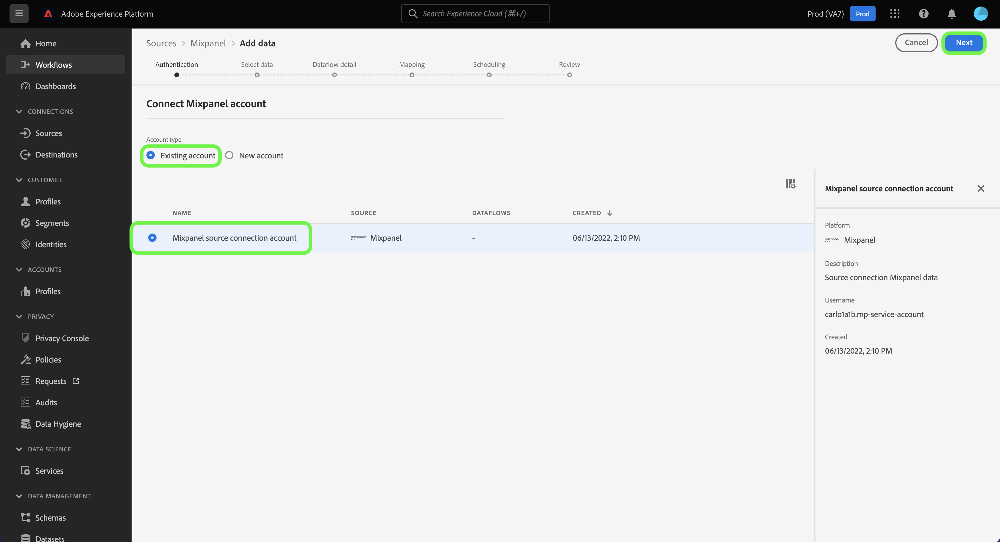
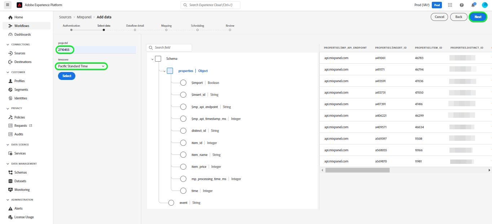

# 在用户界面中创建[!DNL Mixpanel]源连接

本教程提供了使用Adobe Experience Platform Experience Platform用户界面创建[!DNL Mixpanel]源连接的步骤。

## 快速入门

本教程需要对以下Experience Platform组件有一定的了解：

* [[!DNL Experience Data Model (XDM)] 系统](../../../../../xdm/home.md)： [!DNL Experience Platform]用于组织客户体验数据的标准化框架。
   * [架构组合的基础知识](../../../../../xdm/schema/composition.md)：了解XDM架构的基本构建块，包括架构组合中的关键原则和最佳实践。
   * [架构编辑器教程](../../../../../xdm/tutorials/create-schema-ui.md)：了解如何使用架构编辑器UI创建自定义架构。
* [[!DNL Real-Time Customer Profile]](../../../../../profile/home.md)：根据来自多个源的汇总数据，提供统一的实时使用者个人资料。

### 收集所需的凭据

为了将[!DNL Mixpanel]连接到Experience Platform，您必须提供以下连接属性的值：

| 凭据 | 描述 | 示例 |
| --- | --- | --- |
| 用户名 | 与您的[!DNL Mixpanel]帐户对应的服务帐户用户名。 有关详细信息，请参阅[[!DNL Mixpanel] 服务帐户文档](https://developer.mixpanel.com/reference/service-accounts#authenticating-with-a-service-account)。 | `Test8.6d4ee7.mp-service-account` |
| 密码 | 与您的[!DNL Mixpanel]帐户对应的服务帐户密码。 | `dLlidiKHpCZtJhQDyN2RECKudMeTItX1` |
| 项目编号 | 您的[!DNL Mixpanel]项目ID。 创建源连接需要此ID。 有关详细信息，请参阅[[!DNL Mixpanel] 项目设置文档](https://help.mixpanel.com/hc/en-us/articles/115004490503-Project-Settings)和关于创建和管理项目的[[!DNL Mixpanel] 指南](https://help.mixpanel.com/hc/en-us/articles/115004505106-Create-and-Manage-Projects)。 | `2384945` |
| 时区 | 与您的[!DNL Mixpanel]项目对应的时区。 创建源连接需要时区。 有关详细信息，请参阅[Mixpanel项目设置文档](https://help.mixpanel.com/hc/en-us/articles/115004490503-Project-Settings)。 | `Pacific Standard Time` |

有关验证[!DNL Mixpanel]源的更多信息，请参阅[[!DNL Mixpanel] 源概述](../../../../connectors/analytics/mixpanel.md)。

## 连接您的[!DNL Mixpanel]帐户

在Experience Platform UI中，从左侧导航栏中选择&#x200B;**[!UICONTROL 源]**&#x200B;以访问[!UICONTROL 源]工作区。 [!UICONTROL Catalog]屏幕显示您可以用来创建帐户的各种源。

您可以从屏幕左侧的目录中选择相应的类别。 或者，您可以使用搜索选项查找您要使用的特定源。

在&#x200B;*Analytics*&#x200B;类别下，选择[!DNL Mixpanel]，然后选择&#x200B;**[!UICONTROL 添加数据]**。

出现&#x200B;**[!UICONTROL Connect Mixpanel帐户]**&#x200B;页面。 在此页上，您可以使用新凭据或现有凭据。

### 现有账户

要使用现有帐户，请选择要用于创建新数据流的[!DNL Mixpanel]帐户，然后选择&#x200B;**[!UICONTROL 下一步]**&#x200B;以继续。

### 新帐户

如果要创建新帐户，请选择&#x200B;**[!UICONTROL 新建帐户]**，然后提供名称、可选描述和凭据。 完成后，选择&#x200B;**[!UICONTROL 连接到源]**，然后留出一些时间来建立新连接。

## 选择项目 ID 和时区 {#project-id-and-timezone}

>[!CONTEXTUALHELP]
>id="platform_sources_mixpanel_timezone"
>title="为 Mixpanel 提取设置时区"
>abstract="时区必须与您的Mixpanel用户档案时区设置相同，因为Experience Platform使用指定的项目时区从Mixpanel中摄取相关数据。 在将事件记录到 Mixpanel 数据存储之前，Mixpanel 将调整其时区以与您的项目时区协调。"
>additional-url="https://experienceleague.adobe.com/docs/experience-platform/sources/ui-tutorials/create/analytics/mixpanel.html#project-id-and-timezone" text="请在文档中了解详情"

源通过身份验证后，请提供项目ID和时区，然后选择&#x200B;**[!UICONTROL 选择]**。

在将[!DNL Mixpanel]数据摄取到Experience Platform之前您指定的时区必须与您的[!DNL Mixpanel]配置文件时区设置相同。 对数据时区所做的任何更改将仅适用于新事件，旧事件将保留在您之前指定的时区中。 [!DNL Mixpanel]采用夏令时，并将相应地调整您的摄取时间戳。 有关时区如何影响您的数据的更多信息，请参阅[管理项目时区](https://help.mixpanel.com/hc/en-us/articles/115004547203-Manage-Timezones-for-Projects-in-Mixpanel)的[!DNL Mixpanel]指南。

片刻后，正确的界面将更新为预览面板，允许您在创建数据流之前检查架构。 完成后，选择&#x200B;**[!UICONTROL 下一步]**。

## 后续步骤

通过学习本教程，您已建立与[!DNL Mixpanel]帐户的连接。 您现在可以继续下一教程并[配置数据流以将Analytics数据引入Experience Platform](../../dataflow/analytics.md)。

## 其他资源 {#additional-resources}

以下部分提供了在使用[!DNL Mixpanel]源时可以参考的其他资源。

### 验证 {#validation}

下面概述了验证是否成功连接[!DNL Mixpanel]源以及是否正在将[!DNL Mixpanel]事件摄取到Experience Platform可以采取的步骤。

在Experience Platform UI中，从左侧导航栏中选择&#x200B;**[!UICONTROL 数据集]**&#x200B;以访问[!UICONTROL 数据集]工作区。 [!UICONTROL 数据集活动]屏幕显示执行的详细信息。

接下来，选择要查看的数据流的数据流运行ID，以查看有关该数据流运行的特定详细信息。

最后，选择&#x200B;**[!UICONTROL 预览数据集]**&#x200B;以显示已摄取的数据。

您可以根据[!DNL Mixpanel] > [!DNL Events]页面上的数据验证此数据。 有关详细信息，请参阅关于事件](https://help.mixpanel.com/hc/en-us/articles/4402837164948-Events-formerly-Live-View-)的[[!DNL Mixpanel] 文档。

### Mixpanel架构

下表列出了必须为[!DNL Mixpanel]设置的受支持的映射。

>[!TIP]
>
>有关API的更多信息，请参阅[事件导出API >下载](https://developer.mixpanel.com/reference/raw-event-export)。

| 来源 | 类型 |
|---|---|
| `distinct_id` | 字符串 |
| `event_name` | 字符串 |
| `import` | 布尔 |
| `insert_id` | 字符串 |
| `item_id` | 字符串 |
| `item_name` | 字符串 |
| `item_price` | 字符串 |
| `mp_api_endpoint` | 字符串 |
| `mp_api_timestamp_ms` | 整数 |
| `mp_processing_time_ms` | 整数 |
| `time` | 整数 |

### 限制 {#limits}

* 根据[导出API速率限制](https://help.mixpanel.com/hc/en-us/articles/115004602563-Rate-Limits-for-API-Endpoints)中的说明，每小时最多有100个并发查询和60个查询。
