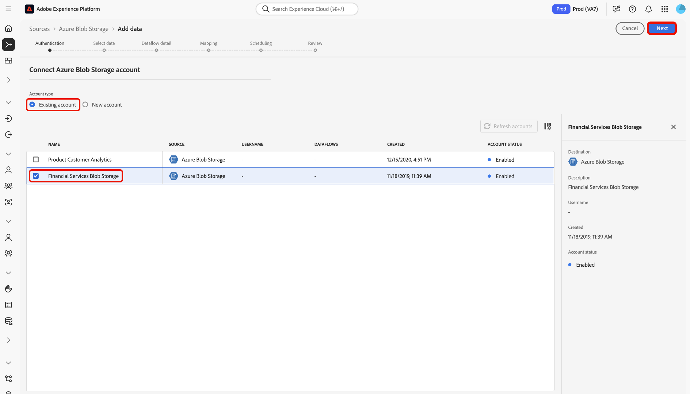

# 在用户界面中创建[!DNL Azure Blob]源连接

本教程提供了使用Experience Platform用户界面创建[!DNL Azure Blob]（以下称为“[!DNL Blob]”）源连接的步骤。

## 快速入门

本教程需要对以下Adobe Experience Platform组件有一定的了解：

* [[!DNL Experience Data Model (XDM)] 系统](../../../../../xdm/home.md)：用于在Experience Platform中组织客户体验数据的标准化框架。
   * [架构组合的基础知识](../../../../../xdm/schema/composition.md)：了解XDM架构的基本构建块，包括架构组合中的关键原则和最佳实践。
   * [架构编辑器教程](../../../../../xdm/tutorials/create-schema-ui.md)：了解如何使用架构编辑器UI创建自定义架构。
* [[!DNL Real-Time Customer Profile]](../../../../../profile/home.md)：根据来自多个源的汇总数据，提供统一的实时使用者个人资料。

如果您已经拥有有效的[!DNL Blob]连接，则可以跳过本文档的其余部分，并转到有关[配置数据流](../../dataflow/batch/cloud-storage.md)的教程。

### 支持的文件格式

Experience Platform支持从外部存储摄取以下文件格式：

* 分隔符分隔值(DSV)：可使用任何单列分隔符（如制表符、逗号、竖线、分号或哈希）收集任何格式的平面文件。
* JavaScript对象表示法(JSON)： JSON格式的数据文件必须符合XDM。
* Apache Parquet： Parquet格式的数据文件必须符合XDM。

### 收集所需的凭据

要访问Experience Platform上的[!DNL Blob]存储空间，必须为以下凭据提供有效值：

>[!BEGINTABS]

>[!TAB 连接字符串身份验证]

| 凭据 | 描述 |
| --- | --- |
| 连接字符串 | 一个字符串，其中包含向Experience Platform验证[!DNL Blob]所需的授权信息。 [!DNL Blob]连接字符串模式为： `DefaultEndpointsProtocol=https;AccountName={ACCOUNT_NAME};AccountKey={ACCOUNT_KEY}`。 有关连接字符串的详细信息，请参阅[配置连接字符串](https://docs.microsoft.com/en-us/azure/storage/common/storage-configure-connection-string)上的此[!DNL Blob]文档。 |

>[!TAB SAS URI身份验证]

| 凭据 | 描述 |
| --- | --- |
| SAS URI | 共享访问签名URI，您可以将其用作替代身份验证类型来连接您的[!DNL Blob]帐户。 [!DNL Blob] SAS URI模式为： `https://{ACCOUNT_NAME}.blob.core.windows.net/?sv=<storage version>&st={START_TIME}&se={EXPIRE_TIME}&sr={RESOURCE}&sp={PERMISSIONS}>&sip=<{IP_RANGE}>&spr={PROTOCOL}&sig={SIGNATURE}>`有关详细信息，请参阅[共享访问签名URI](https://docs.microsoft.com/en-us/azure/data-factory/connector-azure-blob-storage#shared-access-signature-authentication)上的此[!DNL Blob]文档。 |
| 容器 | 要为其指定访问权限的容器的名称。 在使用[!DNL Blob]源创建新帐户时，您可以提供容器名称以指定用户对您选择的子文件夹的访问权限。 |
| 文件夹路径 | 要提供访问权限的文件夹的路径。 |

>[!ENDTABS]

收集所需的凭据后，您可以按照以下步骤将[!DNL Blob]存储连接到Experience Platform

## 连接您的[!DNL Blob]帐户

在Experience Platform UI中，从左侧导航栏中选择&#x200B;**[!UICONTROL 源]**&#x200B;以访问[!UICONTROL 源]工作区。 [!UICONTROL Catalog]屏幕显示您可以用来创建帐户的各种源。

您可以从屏幕左侧的目录中选择相应的类别。 或者，您可以使用搜索栏查找要使用的特定源。

在[!UICONTROL 云存储]类别下，选择&#x200B;**[!UICONTROL Azure Blob存储]**，然后选择&#x200B;**[!UICONTROL 添加数据]**。

将显示&#x200B;**[!UICONTROL 连接到Azure Blob存储]**&#x200B;页。 在此页上，您可以使用新凭据或现有凭据。

### 现有账户

要使用现有帐户，请选择要用于创建新数据流的[!DNL Blob]帐户，然后选择&#x200B;**[!UICONTROL 下一步]**&#x200B;以继续。

### 新帐户

>[!TIP]
>
>创建后，无法更改[!DNL Blob]基本连接的身份验证类型。 要更改身份验证类型，必须创建新的基本连接。

如果要创建新帐户，请选择&#x200B;**[!UICONTROL 新帐户]**，然后为您的新[!DNL Blob]帐户提供名称和可选描述。

[!DNL Blob]源同时支持帐户密钥身份验证和共享访问签名(SAS)身份验证。 基于帐户密钥的身份验证需要使用连接字符串进行验证，而SAS身份验证使用允许对帐户进行安全委托授权的URI。

在此步骤中，您还可以通过定义容器名称和子文件夹的路径来指定帐户将有权访问的子文件夹。

>[!BEGINTABS]

>[!TAB 连接字符串]

若要使用帐户密钥进行身份验证，请选择&#x200B;**[!UICONTROL 帐户密钥身份验证]**&#x200B;并提供连接字符串。 在此步骤中，您还可以指定容器名称和要访问的子文件夹的路径。 完成后，选择&#x200B;**[!UICONTROL 连接到源]**。

>[!TAB SAS URI]

您可以使用SAS创建具有不同访问级别的身份验证凭据，因为基于SAS的身份验证允许您设置权限、开始和到期日期，以及配置给特定资源。

若要使用共享访问签名进行身份验证，请选择&#x200B;**[!UICONTROL 共享访问签名身份验证]**，然后提供您的SAS URI。 在此步骤中，您还可以指定容器名称和要访问的子文件夹的路径。 完成后，选择&#x200B;**[!UICONTROL 连接到源]**。

>[!ENDTABS]

## 后续步骤

通过学习本教程，您已建立与[!DNL Blob]帐户的连接。 您现在可以继续阅读下一教程，并[配置数据流以将数据从云存储引入Experience Platform](../../dataflow/batch/cloud-storage.md)。
