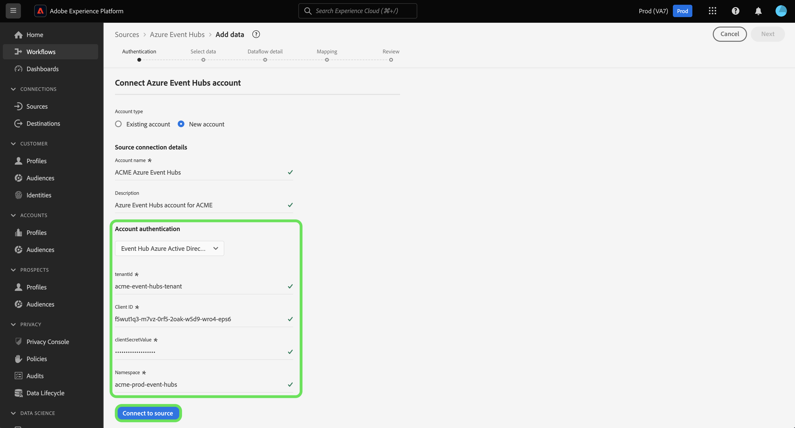

# 在用户界面中创建[!DNL Azure Event Hubs]源连接

>[!IMPORTANT]
>
>[!DNL Azure Event Hubs]源在源目录中可供已购买Real-Time Customer Data Platform Ultimate的用户使用。

阅读本教程，了解如何使用Adobe Experience Platform用户界面创建[!DNL Azure Event Hubs]帐户。

## 快速入门

本教程需要对以下Adobe Experience Platform组件有一定的了解：

* [[!DNL Experience Data Model (XDM)] 系统](../../../../../xdm/home.md)： [!DNL Experience Platform]用于组织客户体验数据的标准化框架。
   * [架构组合的基础知识](../../../../../xdm/schema/composition.md)：了解XDM架构的基本构建块，包括架构组合中的关键原则和最佳实践。
   * [架构编辑器教程](../../../../../xdm/tutorials/create-schema-ui.md)：了解如何使用架构编辑器UI创建自定义架构。
* [[!DNL Real-Time Customer Profile]](../../../../../profile/home.md)：根据来自多个源的汇总数据，提供统一的实时使用者个人资料。

如果您已经拥有有效的[!DNL Event Hubs]连接，则可以跳过本文档的其余部分，并转到有关[配置数据流](../../dataflow/streaming/cloud-storage-streaming.md)的教程。

### 收集所需的凭据

为了验证您的[!DNL Event Hubs]源连接器，您必须提供以下连接属性的值：

>[!BEGINTABS]

>[!TAB 标准身份验证]

| 凭据 | 描述 |
| --- | --- |
| SAS 密钥名称 | 授权规则的名称，也称为SAS密钥名称。 |
| SAS 键 | [!DNL Event Hubs]命名空间的主键。 `sasKey`对应的`sasPolicy`必须配置`manage`权限才能填充[!DNL Event Hubs]列表。 |
| 命名空间 | 您正在访问的[!DNL Event Hub]的命名空间。 [!DNL Event Hub]命名空间提供了一个唯一的范围容器，您可以在其中创建一个或多个[!DNL Event Hubs]。 |

>[!TAB SAS身份验证]

| 凭据 | 描述 |
| --- | --- |
| SAS 密钥名称 | 授权规则的名称，也称为SAS密钥名称。 |
| SAS 键 | [!DNL Event Hub]命名空间的主键。 `sasKey`对应的`sasPolicy`必须配置`manage`权限才能填充[!DNL Event Hubs]列表。 |
| 命名空间 | 您正在访问的[!DNL Event Hub]的命名空间。 [!DNL Event Hub]命名空间提供了一个唯一的范围容器，您可以在其中创建一个或多个[!DNL Event Hubs]。 |
| 事件中心名称 | 填写您的[!DNL Azure Event Hub]名称。 有关[!DNL Event Hub]名称的详细信息，请阅读[Microsoft文档](https://learn.microsoft.com/en-us/azure/event-hubs/event-hubs-create#create-an-event-hub)。 |

>[!TAB 事件中心Azure Active Directory身份验证]

| 凭据 | 描述 |
| --- | --- |
| 租户 ID | 要从中请求权限的租户ID。 可以将您的租户ID格式化为GUID或友好名称。 **注意**：租户ID在[!DNL Microsoft Azure]界面中称为“目录ID”。 |
| 客户端 ID | 分配给您应用程序的应用程序ID。 您可以从注册[!DNL Azure Active Directory]的[!DNL Microsoft Entra ID]门户检索此ID。 |
| 客户端密钥值 | 与客户端ID一起用于对应用程序进行身份验证的客户端密码。 您可以从注册[!DNL Azure Active Directory]的[!DNL Microsoft Entra ID]门户中检索客户端密钥。 |
| 命名空间 | 您正在访问的[!DNL Event Hub]的命名空间。 [!DNL Event Hub]命名空间提供了一个唯一的范围容器，您可以在其中创建一个或多个[!DNL Event Hubs]。 |

有关[!DNL Azure Active Directory]的详细信息，请阅读有关使用Microsoft Entra ID[&#128279;](https://learn.microsoft.com/en-us/azure/healthcare-apis/register-application)的Azure指南。

>[!TAB 事件中心范围的Azure Active Directory身份验证]

| 凭据 | 描述 |
| --- | --- |
| 租户 ID | 要从中请求权限的租户ID。 可以将您的租户ID格式化为GUID或友好名称。 **注意**：租户ID在[!DNL Microsoft Azure]界面中称为“目录ID”。 |
| 客户端 ID | 分配给您应用程序的应用程序ID。 您可以从注册[!DNL Azure Active Directory]的[!DNL Microsoft Entra ID]门户检索此ID。 |
| 客户端密钥值 | 与客户端ID一起用于对应用程序进行身份验证的客户端密码。 您可以从注册[!DNL Azure Active Directory]的[!DNL Microsoft Entra ID]门户中检索客户端密钥。 |
| 命名空间 | 您正在访问的[!DNL Event Hub]的命名空间。 [!DNL Event Hub]命名空间提供了一个唯一的范围容器，您可以在其中创建一个或多个[!DNL Event Hubs]。 |
| 事件中心名称 | 填写您的[!DNL Azure Event Hub]名称。 有关[!DNL Event Hub]名称的详细信息，请阅读[Microsoft文档](https://learn.microsoft.com/en-us/azure/event-hubs/event-hubs-create#create-an-event-hub)。 |

有关[!DNL Azure Active Directory]的详细信息，请阅读有关使用Microsoft Entra ID[&#128279;](https://learn.microsoft.com/en-us/azure/healthcare-apis/register-application)的Azure指南。

>[!ENDTABS]

收集所需的凭据后，您可以按照以下步骤将您的[!DNL Event Hubs]帐户关联到Experience Platform。

## 连接您的[!DNL Event Hubs]帐户

在Experience Platform UI中，从左侧导航中选择&#x200B;**[!UICONTROL 源]**&#x200B;以访问[!UICONTROL 源]工作区。 [!UICONTROL 目录]屏幕显示您可以用来创建帐户的各种来源。

您可以从屏幕左侧的目录中选择相应的类别。 或者，您可以使用搜索选项查找您要使用的特定源。

在[!UICONTROL 云存储]类别下，选择&#x200B;**[!UICONTROL Azure事件中心]**，然后选择&#x200B;**[!UICONTROL 添加数据]**。

出现&#x200B;**[!UICONTROL 连接到Azure事件中心]**&#x200B;对话框。 在此页上，您可以使用新凭据或现有凭据。

### 现有账户

若要使用现有帐户，请选择要使用的[!DNL Event Hubs]帐户，然后选择&#x200B;**[!UICONTROL 下一步]**&#x200B;以继续。

### 新帐户

>[!TIP]
>
>创建后，无法更改[!DNL Event Hubs]基本连接的身份验证类型。 要更改身份验证类型，必须创建新的基本连接。

要创建新帐户，请选择&#x200B;**[!UICONTROL 新帐户]**，然后为您的新[!DNL Event Hubs]帐户提供名称和可选描述。

>[!BEGINTABS]

>[!TAB 标准身份验证]

若要使用标准身份验证创建[!DNL Event Hubs]帐户，请使用[!UICONTROL 帐户身份验证]下拉菜单，然后选择&#x200B;**[!UICONTROL 标准身份验证]**。 接下来，为您的[!UICONTROL SAS密钥名称]、[!UICONTROL SAS密钥]和[!UICONTROL 命名空间]提供值。

输入身份验证凭据后，选择&#x200B;**[!UICONTROL 连接到源]**。

>[!TAB SAS身份验证]

若要创建具有SAS身份验证的[!DNL Event Hubs]帐户，请使用[!UICONTROL 帐户身份验证]下拉菜单，然后选择&#x200B;**[!UICONTROL SAS身份验证]**。 接下来，为您的[!UICONTROL SAS密钥名称]、[!UICONTROL SAS密钥]、[!UICONTROL 命名空间]和[!UICONTROL 事件中心名称]提供值。

输入身份验证凭据后，选择&#x200B;**[!UICONTROL 连接到源]**。

>[!TAB 事件中心Azure Active Directory身份验证]

若要使用事件中心Azure Active Directory身份验证创建[!DNL Event Hubs]帐户，请使用[!UICONTROL 帐户身份验证]下拉菜单，然后选择&#x200B;**[!UICONTROL 事件中心Azure Active Directory]**。 接下来，为你的[!UICONTROL 租户ID]、[!UICONTROL 客户端ID]、[!UICONTROL 客户端密钥值]和[!UICONTROL 命名空间]提供值。

>[!TAB 事件中心范围的Azure Active Directory身份验证]

若要使用事件中心范围的Azure Active Directory身份验证创建[!DNL Event Hubs]帐户，请使用[!UICONTROL 帐户身份验证]下拉菜单，然后选择&#x200B;**[!UICONTROL 事件中心范围的Azure Active Directory]**。 接下来，为你的[!UICONTROL 租户ID]、[!UICONTROL 客户端ID]、[!UICONTROL 客户端密钥值]、[!UICONTROL 命名空间]和[!UICONTROL 事件中心名称]提供值。

>[!ENDTABS]

## 后续步骤

通过学习本教程，您已将[!DNL Event Hubs]帐户连接到Experience Platform。 您现在可以继续阅读下一教程，并[配置数据流以将数据从云存储引入Experience Platform](../../dataflow/streaming/cloud-storage-streaming.md)。
