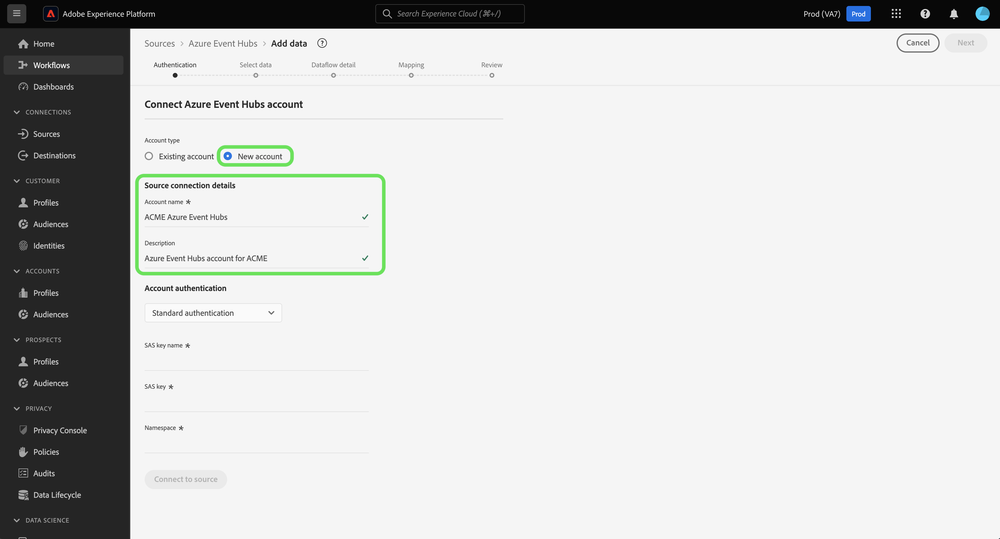

# 在UI中创建Azure事件集线器源连接器

>[!NOTE]
> Azure事件集线器连接器处于测试状态。 功能和文档可能会发生更改。

Adobe Experience Platform中的源连接器提供按计划收集外部源数据的能力。 本教程提供了使用平台用户界面验证Azure事件集线器(以下称“事件集线器”)源连接器的步骤。

## 入门指南

本教程需要对Adobe Experience Platform的以下组件有充分的了解：

- [体验数据模型(XDM)系统](../../../../../xdm/home.md): Experience Platform组织客户体验数据的标准化框架。
   - [模式合成基础](../../../../../xdm/schema/composition.md): 了解XDM模式的基本构件，包括模式构成的主要原则和最佳做法。
   - [模式编辑器教程](../../../../../xdm/tutorials/create-schema-ui.md): 了解如何使用模式编辑器UI创建自定义模式。
- [实时客户用户档案](../../../../../profile/home.md): 基于来自多个来源的聚集数据提供统一、实时的消费者用户档案。

如果您已经有事件中心帐户，您可以跳过此文档的其余部分，继续学习配置数据 [流的教程](../../dataflow/streaming/cloud-storage.md)。

### 收集所需的凭据

要验证事件集线器源连接器的身份，必须为以下连接属性提供值：

| 凭据 | 描述 |
| ---------- | ----------- |
| `sasKeyName` | 授权规则的名称，也称为SAS密钥名称。 |
| `sasKey` | 生成的共享访问签名。 |
| `namespace` | 您访问的事件中心的命名空间。 |

有关这些值的详细信息，请参阅 [此事件中心文档](https://docs.microsoft.com/en-us/azure/event-hubs/authenticate-shared-access-signature)。

## 连接事件中心帐户

收集所需凭据后，您可以按照以下步骤将事件中心帐户关联到平台。

登录到 [Adobe Experience Platform](https://platform.adobe.com) ，然后从左 **侧导航栏** 中 *选择“源* ”以访问“源”工作区。 “目 *录* ”选项卡显示可连接到平台的各种源。 每个来源显示与其关联的现有帐户数。

在云 *存储* 类别下，选 **择Azure事件集线器** ，然 **** 后单击+图标(+)以创建新的事件集线器连接器。

将显 *示“连接到Azure事件集线器* ”对话框。 在此页上，您可以使用新凭据或现有凭据。

### 新帐户

如果您使用新凭据，请选择“ **新帐户**”。 在显示的输入表单上，提供名称、可选说明和您的事件中心凭据。 完成后，选 **择** Connect，然后允许一段时间建立新连接。

### 现有帐户

要连接现有帐户，请选择要连接的事件中心帐户，然后选择下 **一步** 以继续。

## 后续步骤

通过本教程，您已将事件中心帐户连接到平台。 您现在可以继续阅读下一个教程 [并配置数据流，将数据从云存储引入平台](../../dataflow/streaming/cloud-storage.md)。