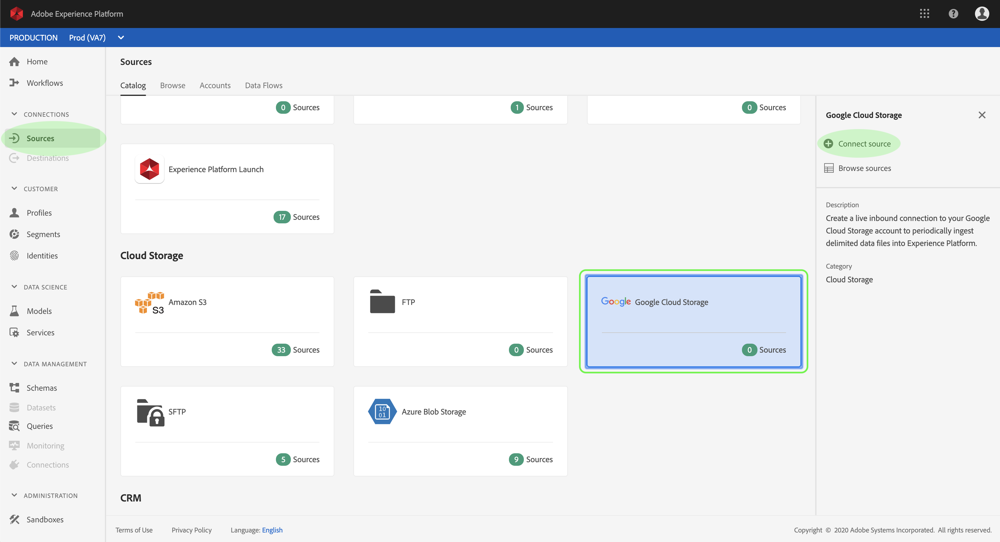
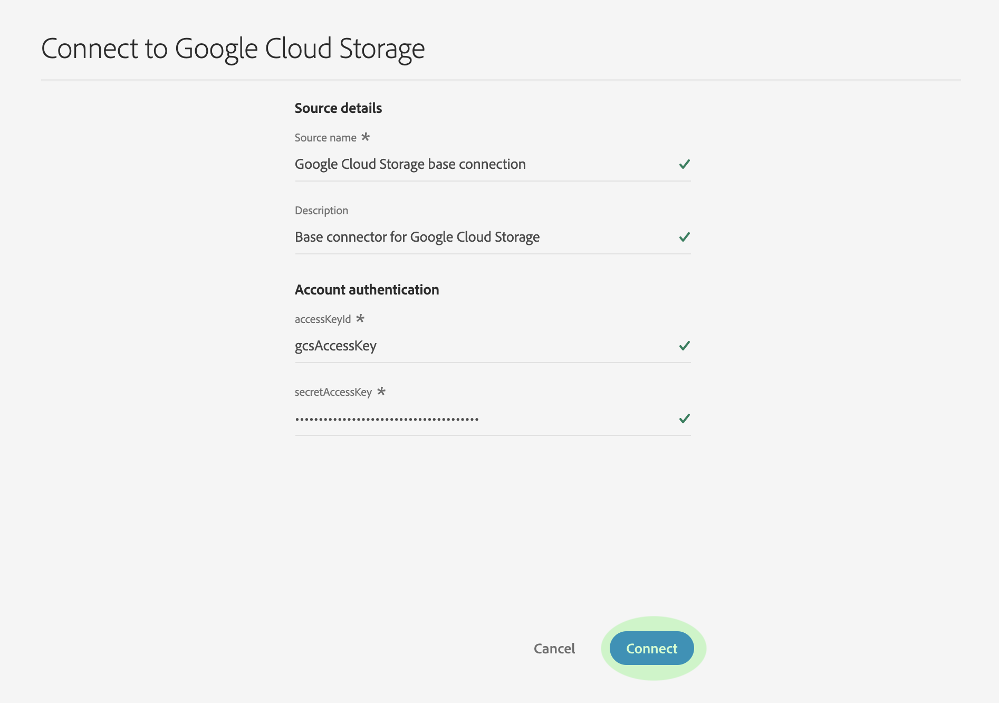

# 在UI中创建Google Cloud存储源连接器

Adobe Experience Platform中的源连接器提供按计划收集外部源数据的能力。 本教程提供了使用平台用户界面创建Google Cloud存储（以下称“GCS”）源连接器的步骤。

## 入门指南

本教程需要对Adobe Experience Platform的以下组件有充分的了解：

* [体验数据模型(XDM)系统](../../../../../xdm/home.md): Experience Platform组织客户体验数据的标准化框架。
   * [模式合成基础](../../../../../xdm/schema/composition.md): 了解XDM模式的基本构件，包括模式构成的主要原则和最佳做法。
   * [模式编辑器教程](../../../../../xdm/tutorials/create-schema-ui.md): 了解如何使用模式编辑器UI创建自定义模式。
* [实时客户用户档案](../../../../../profile/home.md): 基于来自多个来源的聚集数据提供统一、实时的消费者用户档案。

如果已有GCS基础连接，您可以跳过本文档的其余部分，继续学习有关配置 [数据流的教程](../../dataflow/batch/cloud-storage.md)。

### 支持的文件格式

Experience Platform支持从外部存储摄取的以下文件格式：

* 分隔符分隔值(DSV): 目前，对DSV格式化数据文件的支持仅限于逗号分隔的值。 DSV格式化文件中字段标题的值只能由字母数字字符和下划线组成。 今后将提供对一般DSV文件的支持。
* JavaScript对象表示法(JSON): JSON格式数据文件必须符合XDM。
* Apache Parke: 必须符合XDM规范，但必须符合XDM格式。

### 收集所需的凭据

要在平台上访问GCS数据，您必须提供有效的GCS **访问密钥ID** 和 **机密**。 您可以阅读Google Cloud的服务器对服务器身份验证指 <a href="https://cloud.google.com/docs/authentication/production" target="_blank">南，进一步了解如何获取这些</a> 值。

## 连接您的GCS帐户

收集所需凭据后，您可以按照以下步骤创建新的入站基础连接，将GCS帐户链接到平台。

登录到 <a href="https://platform.adobe.com" target="_blank">Adobe Experience Platform</a> ，然后从左 **侧导航栏** 中 *选择“源* ”以访问“源”工作区。 “目 *录* ”屏幕显示可为其创建入站基本连接的各种源，每个源显示与它们关联的现有基本连接数。

在“ *云存储* ”类别下 **，选择** “Google Cloud存储”，在屏幕右侧显示一个信息栏。 信息栏提供所选源的简短描述，以及与源视图连接其文档或与源连接的选项。 要创建新的入站基本连接，请单击“ **连接源”**。

将显 _示“连接到Google Cloud存储_ ”对话框。 在输入表单中，为基本连接提供名称、可选说明和GCS凭据。 完成后，单 **击** “连接”，然后允许一些时间建立新的基本连接。

建立基本连接后，您可以继续下一节并配置数据流以将数据引入平台。

## 后续步骤

通过遵循本教程，您已建立了与GCS帐户的基本连接。 您现在可以继续阅读下一个教程， [并配置数据流以将数据引入平台](../../dataflow/batch/cloud-storage.md)。