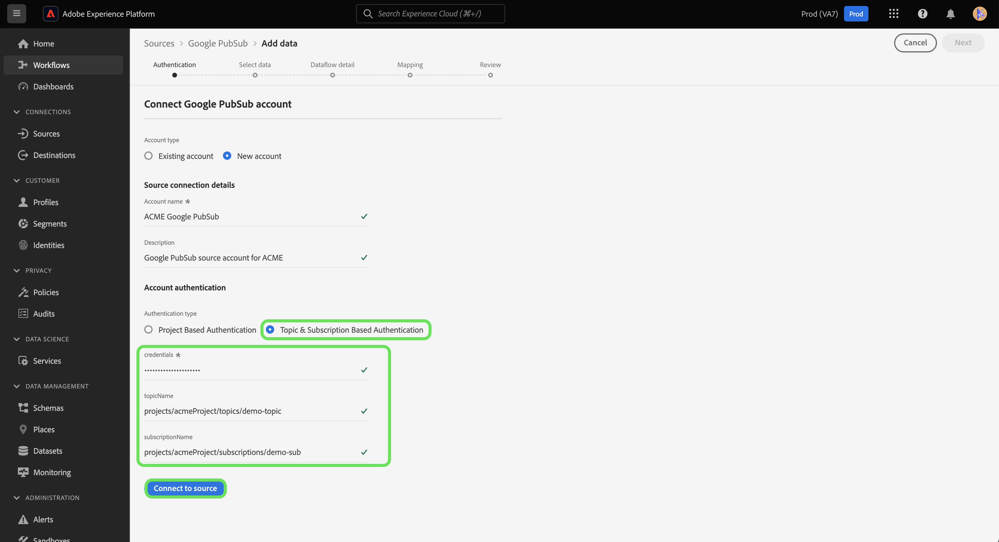

# 在用户界面中创建[!DNL Google PubSub]源连接

>[!IMPORTANT]
>
>[!DNL Google PubSub]源在源目录中可供已购买Real-Time Customer Data Platform Ultimate的用户使用。

本教程提供了使用Experience Platform用户界面创建[!DNL Google PubSub]（以下称为“[!DNL PubSub]”）的步骤。

## 快速入门

本教程需要对以下Adobe Experience Platform组件有一定的了解：

* [源](../../../../home.md)： Experience Platform允许从各种源摄取数据，同时让您能够使用Experience Platform服务来构建、标记和增强传入数据。
* [沙盒](../../../../../sandboxes/home.md)： Experience Platform提供了将单个Experience Platform实例划分为多个单独的虚拟环境的虚拟沙盒，以帮助开发和改进数字体验应用程序。

如果您已经拥有有效的[!DNL PubSub]连接，则可以跳过本文档的其余部分，并转到有关[配置数据流](../../dataflow/batch/cloud-storage.md)的教程。

### 收集所需的凭据

您必须提供下面列出的连接属性的值，才能将您的[!DNL PubSub]帐户连接到Experience Platform。 有关身份验证和先决条件设置的详细信息，请阅读[[!DNL PubSub source] 概述](../../../../connectors/cloud-storage/google-pubsub.md#prerequisites)。

>[!BEGINTABS]

>[!TAB 基于项目的身份验证]

| 凭据 | 描述 |
| --- | --- |
| 项目编号 | 验证[!DNL PubSub]时需要项目ID。 |
| 凭据 | 验证[!DNL PubSub]所需的凭据。 您必须确保从凭据中删除空格后放入完整的JSON文件。 |

>[!TAB 基于主题和订阅的身份验证]

| 凭据 | 描述 |
| --- | --- |
| 凭据 | 验证[!DNL PubSub]所需的凭据。 您必须确保从凭据中删除空格后放入完整的JSON文件。 |
| 主题名称 | [!DNL PubSub]订阅的名称。 在[!DNL PubSub]中，订阅允许您通过订阅消息已发布到的主题来接收消息。 **注意**：单个[!DNL PubSub]订阅只能用于一个数据流。 要创建多个数据流，您必须有多个订阅。 |
| 订阅名称 | [!DNL PubSub]订阅的名称。 在[!DNL PubSub]中，订阅允许您通过订阅消息已发布到的主题来接收消息。 |

>[!ENDTABS]

有关这些值的详细信息，请参阅以下[PubSub身份验证](https://cloud.google.com/pubsub/docs/authentication)文档。 如果您使用基于服务帐户的身份验证，请参阅以下[PubSub指南](https://cloud.google.com/docs/authentication/production#create_service_account)以了解如何生成凭据的步骤。

>[!TIP]
>
>如果您使用的是基于服务帐户的身份验证，请确保在复制和粘贴凭据时，您已经向服务帐户授予了足够的用户访问权限，并且JSON中没有额外的空格。

收集所需的凭据后，您可以按照以下步骤将您的[!DNL PubSub]帐户关联到Experience Platform。

## 连接您的[!DNL PubSub]帐户

在Experience Platform UI中，从左侧导航中选择&#x200B;**[!UICONTROL 源]**&#x200B;以访问[!UICONTROL 源]工作区。 [!UICONTROL 目录]屏幕显示您可以用来创建帐户的各种来源。

您可以从屏幕左侧的目录中选择相应的类别。 或者，您可以使用搜索选项查找您要使用的特定源。

在[!UICONTROL Cloud Storage]类别下，选择&#x200B;**[!UICONTROL Google PubSub]**，然后选择&#x200B;**[!UICONTROL 添加数据]**。

此时会显示&#x200B;**[!UICONTROL 连接到Google PubSub]**&#x200B;页。 在此页上，您可以使用新凭据或现有凭据。

### 现有账户

要使用现有帐户，请选择要用于创建新数据流的[!DNL PubSub]帐户，然后选择&#x200B;**[!UICONTROL 下一步]**&#x200B;以继续。

### 新帐户

>[!TIP]
>
>* 在创建具有受限访问权限的帐户时，您必须至少提供一个主题名称或订阅名称。 如果缺少这两个值，身份验证将失败。
>* 创建后，无法更改[!DNL Google PubSub]基本连接的身份验证类型。 要更改身份验证类型，必须创建新的基本连接。

如果要创建新帐户，请选择&#x200B;**[!UICONTROL 新帐户]**，然后为您的新[!DNL PubSub]帐户提供名称和可选描述。

[!DNL PubSub]源允许您指定身份验证期间允许的访问类型。 您可以将帐户设置为使用基于项目的身份验证或基于主题和基于订阅的身份验证。 基于项目的身份验证允许您授予对帐户中根级别项目的访问权限，而基于主题和订阅的身份验证允许您限制对特定[!DNL PubSub]主题和订阅的访问权限。

>[!BEGINTABS]

>[!TAB 基于项目的身份验证]

创建有权访问您的根[!DNL PubSub]项目文件夹的帐户。 选择&#x200B;**[!UICONTROL Google PubSub身份验证凭据]**&#x200B;作为您的身份验证类型，并提供项目ID和凭据。 完成后，选择&#x200B;**[!UICONTROL 连接到源]**，然后留出一些时间来建立新连接。

>[!TAB 基于主题和订阅的身份验证]

若要创建仅对特定[!DNL PubSub]主题和订阅具有受限访问权限的帐户，请选择&#x200B;**[!UICONTROL Google PubSub作用域身份验证凭据]**，然后提供您的凭据、主题名和/或订阅名。 完成后，选择&#x200B;**[!UICONTROL 连接到源]**，然后留出一些时间来建立新连接。

>[!ENDTABS]

>[!NOTE]
>
>分配给[!DNL PubSub]项目的主体（角色）在[!DNL PubSub]项目内创建的所有主题和订阅中被继承。 如果希望主体（角色）可以访问特定主题，则还必须将该主体（角色）添加到主题的相应订阅中。 有关详细信息，请阅读有关访问控制](<https://cloud.google.com/pubsub/docs/access-control>)的[[!DNL PubSub] 文档。

## 选择数据

成功的身份验证将您带入[!UICONTROL 选择数据]步骤，您可以在该步骤中导航[!DNL PubSub]数据层次结构并选择要带入Experience Platform的数据。

>[!BEGINTABS]

>[!TAB 基于项目的身份验证]

如果您已通过基于项目的访问验证，则[!UICONTROL Select data]界面将显示您的项目中具有附加主题的所有订阅。

>[!TAB 基于主题和订阅的身份验证]

如果您已通过主题和基于订阅的访问权限的身份验证，则根据您提供的信息，[!UICONTROL 选择数据]界面显示可能会有所不同。

* 如果只提供主题名称，则界面将显示与所提供主题对应的所有主题订阅对。
* 如果仅提供订阅名称，则界面将显示与提供的订阅名称对应的所有主题订阅对。
* 如果同时提供了主题和预订名称，则界面将显示与两个提供的值对应的主题 — 预订对。

>[!ENDTABS]

## 后续步骤

通过学习本教程，您已在[!DNL PubSub]帐户与Experience Platform之间创建了连接。 您现在可以继续下一教程并[配置数据流以将流数据从云存储引入Experience Platform](../../dataflow/streaming/cloud-storage-streaming.md)。
