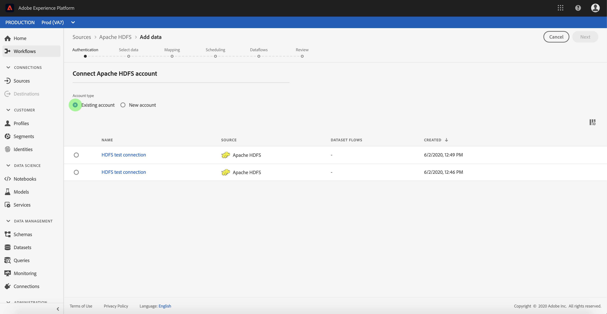

# 在用户界面中创建[!DNL Apache] HDFS源连接

>[!NOTE]
>
>[!DNL Apache] HDFS连接器处于Beta版。 有关使用带有Beta标记的连接器的更多信息，请参阅[源概述](../../../../home.md#terms-and-conditions)。

[!DNL Adobe Experience Platform]中的Source连接器提供了按计划摄取外部来源数据的功能。 本教程提供了使用[!DNL Experience Platform]用户界面验证[!DNL Apache Hadoop Distributed File System]（以下称为“HDFS”）源连接器的步骤。

## 快速入门

本教程需要您对[!DNL Experience Platform]的以下组件有一定的了解：

- [[!DNL Experience Data Model (XDM)] 系统](../../../../../xdm/home.md)： [!DNL Experience Platform]用于组织客户体验数据的标准化框架。
   - [架构组合的基础知识](../../../../../xdm/schema/composition.md)：了解XDM架构的基本构建块，包括架构组合中的关键原则和最佳实践。
   - [架构编辑器教程](../../../../../xdm/tutorials/create-schema-ui.md)：了解如何使用架构编辑器UI创建自定义架构。
- [[!DNL Real-Time Customer Profile]](../../../../../profile/home.md)：根据来自多个源的汇总数据，提供统一的实时使用者个人资料。

如果您已经拥有有效的HDFS连接，则可以跳过本文档的其余部分，并转到有关[配置数据流](../../dataflow/batch/cloud-storage.md)的教程。

### 收集所需的凭据

要验证HDFS源连接器，必须提供以下连接属性的值：

| 凭据 | 描述 |
| ---------- | ----------- |
| `url` | URL定义了匿名连接到HDFS所需的身份验证参数。 有关如何获取此值的详细信息，请参阅以下有关HDFS](https://hadoop.apache.org/docs/r1.2.1/HttpAuthentication.html)的[HTTPS身份验证的文档。 |

## 连接您的HDFS帐户

收集所需的凭据后，您可以按照以下步骤将您的HDFS帐户链接到[!DNL Experience Platform]。

登录到[Adobe Experience Platform](https://platform.adobe.com)，然后从左侧导航栏中选择&#x200B;**[!UICONTROL 源]**&#x200B;以访问&#x200B;**[!UICONTROL 源]**&#x200B;工作区。 **[!UICONTROL Catalog]**&#x200B;屏幕显示您可以为其创建帐户的各种源。

您可以从屏幕左侧的目录中选择相应的类别。 或者，您可以使用搜索选项查找您要使用的特定源。

在&#x200B;**[!UICONTROL 云存储]**&#x200B;类别下，选择&#x200B;**[!UICONTROL Apache HDFS]**。 如果这是您第一次使用此连接器，请选择&#x200B;**[!UICONTROL 配置]**。 否则，选择&#x200B;**[!UICONTROL 添加数据]**&#x200B;以创建新的HDFS连接器。

出现&#x200B;**[!UICONTROL 连接到HDFS]**&#x200B;页。 在此页上，您可以使用新凭据或现有凭据。

### 新帐户

如果您正在使用新凭据，请选择&#x200B;**[!UICONTROL 新帐户]**。 在显示的输入表单上，提供名称、可选描述和您的HDFS凭据。 完成后，选择&#x200B;**[!UICONTROL 连接到源]**，然后留出一些时间来建立新连接。

### 现有账户

若要连接现有帐户，请选择要连接的HDFS帐户，然后选择&#x200B;**[!UICONTROL 下一步]**&#x200B;以继续。

## 后续步骤

通过学习本教程，您已建立与HDFS帐户的连接。 您现在可以继续下一教程，并[配置数据流以将云存储中的数据引入 [!DNL Experience Platform]](../../dataflow/batch/cloud-storage.md)。
