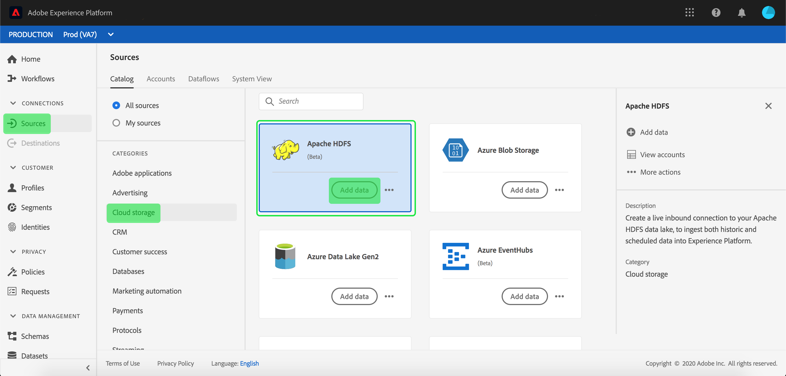

# 在UI中创建[!DNL Apache] HDFS源连接

>[!NOTE]
>
>[!DNL Apache] HDFS连接器为测试版。 有关使用测试版标记的连接器的详细信息，请参阅[源概述](../../../../home.md#terms-and-conditions)。

[!DNL Adobe Experience Platform]中的源连接器提供按计划接收外部源数据的能力。 本教程提供了使用[!DNL Platform]用户界面验证[!DNL Apache Hadoop Distributed File System]（以下称为“HDFS”）源连接器的步骤。

## 入门指南

本教程需要对[!DNL Platform]的以下组件有充分的了解：

- [[!DNL Experience Data Model (XDM)] 系统](../../../../../xdm/home.md):组织客户体验数 [!DNL Experience Platform] 据的标准化框架。
   - [模式合成的基础](../../../../../xdm/schema/composition.md):了解XDM模式的基本构建基块，包括模式构成的主要原则和最佳做法。
   - [模式编辑器教程](../../../../../xdm/tutorials/create-schema-ui.md):了解如何使用模式编辑器UI创建自定义模式。
- [[!DNL Real-time Customer Profile]](../../../../../profile/home.md):根据来自多个来源的汇总数据提供统一、实时的消费者用户档案。

如果您已有有效的HDFS连接，则可以跳过此文档的其余部分，继续学习有关配置数据流](../../dataflow/batch/cloud-storage.md)的教程。[

### 收集所需凭据

要验证HDFS源连接器的身份，必须为以下连接属性提供值：

| 凭据 | 描述 |
| ---------- | ----------- |
| `url` | URL定义匿名连接到HDFS所需的身份验证参数。 有关如何获取此值的详细信息，请参阅以下HDFS](https://hadoop.apache.org/docs/r1.2.1/HttpAuthentication.html)的HTTPS身份验证文档。[ |

## 连接HDFS帐户

收集所需凭据后，您可以按照以下步骤将HDFS帐户链接到[!DNL Platform]。

登录到[Adobe Experience Platform](https://platform.adobe.com)，然后从左侧导航栏中选择&#x200B;**[!UICONTROL Sources]**&#x200B;以访问&#x200B;**[!UICONTROL Sources]**&#x200B;工作区。 **[!UICONTROL Catalog]**&#x200B;屏幕显示了可为其创建帐户的各种源。

您可以从屏幕左侧的目录中选择适当的类别。 或者，您也可以使用搜索选项找到要使用的特定源。

在&#x200B;**[!UICONTROL Cloud storage]**&#x200B;类别下，选择&#x200B;**[!UICONTROL Apache HDFS]**。 如果这是您首次使用此连接器，请选择&#x200B;**[!UICONTROL Configure]**。 否则，选择&#x200B;**[!UICONTROL Add data]**&#x200B;创建一个新的HDFS连接器。

将显示&#x200B;**[!UICONTROL Connect to HDFS]**&#x200B;页。 在此页上，您可以使用新凭据或现有凭据。

### 新帐户

如果您使用新凭据，请选择&#x200B;**[!UICONTROL New account]**。 在显示的输入表单上，提供名称、可选说明和您的HDFS凭据。 完成后，选择&#x200B;**[!UICONTROL Connect to source]**，然后为新连接建立留出一些时间。

### 现有帐户

要连接现有帐户，请选择要连接的HDFS帐户，然后选择&#x200B;**[!UICONTROL Next]**&#x200B;继续。

## 后续步骤

按照本教程，您已建立了与HDFS帐户的连接。 现在，您可以继续阅读下一个教程，并[配置一个数据流，以将来自您的云存储的数据引入 [!DNL Platform]](../../dataflow/batch/cloud-storage.md)。
