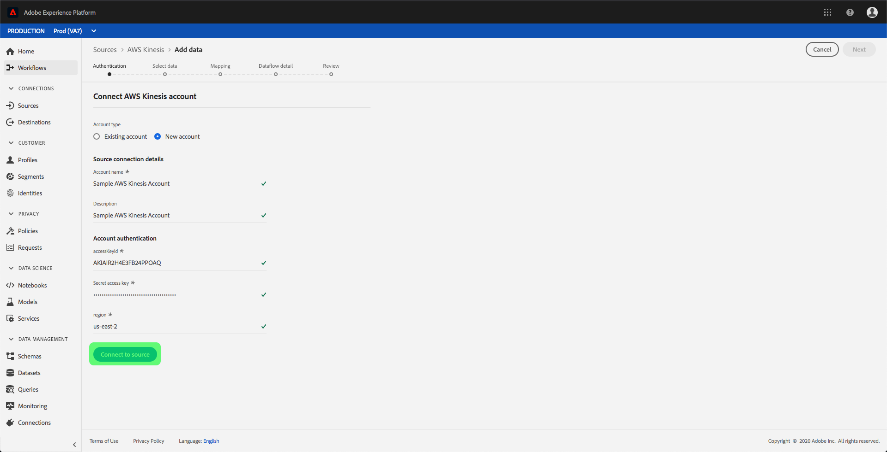
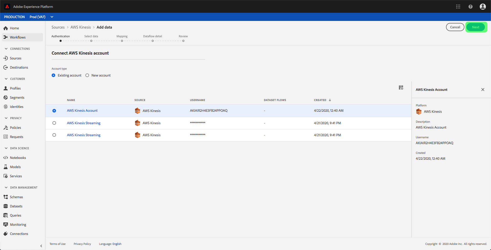

# 创建 [!DNL Amazon Kinesis] UI中的源连接

Adobe Experience Platform中的源连接器提供了按计划摄取外部源数据的功能。 本教程提供了验证 [!DNL Amazon Kinesis] (以下简称 [!DNL "Kinesis"])源连接器使用 [!DNL Platform] 用户界面。

## 快速入门

本教程需要对Adobe Experience Platform的以下组件有一定的了解：

- [[!DNL Experience Data Model (XDM)] 系统](../../../../../xdm/home.md):标准化框架， [!DNL Experience Platform] 组织客户体验数据。
   - [架构组合的基础知识](../../../../../xdm/schema/composition.md):了解XDM模式的基本构建块，包括模式组合中的关键原则和最佳实践。
   - [模式编辑器教程](../../../../../xdm/tutorials/create-schema-ui.md):了解如何使用模式编辑器UI创建自定义模式。
- [[!DNL Real-Time Customer Profile]](../../../../../profile/home.md):根据来自多个来源的汇总数据提供统一的实时客户资料。

如果您已经拥有 [!DNL Kinesis] 连接时，您可以跳过本文档的其余部分，并继续阅读上的教程 [配置数据流](../../dataflow/streaming/cloud-storage-streaming.md).

### 收集所需的凭据

为了验证您的 [!DNL Kinesis] 源连接器中，必须为以下连接属性提供值：

| 凭据 | 描述 |
| ---------- | ----------- |
| `accessKeyId` | 您的 [!DNL Kinesis] 帐户。 |
| `Secret access key` | 您的 [!DNL Kinesis] 帐户。 |
| `region` | 您的AWS服务器的区域。 |

有关这些值的更多信息，请参阅 [此 [!DNL Kinesis] 文档](https://docs.aws.amazon.com/streams/latest/dev/getting-started.html).

## 连接 [!DNL Kinesis] 帐户

收集所需的凭据后，您可以按照以下步骤链接 [!DNL Kinesis] 帐户 [!DNL Platform].

登录到 [Adobe Experience Platform](https://platform.adobe.com) 然后选择 **[!UICONTROL 源]** 从左侧导航栏访问 **[!UICONTROL 源]** 工作区。 的 **[!UICONTROL 目录]** 屏幕会显示您可为其创建帐户的各种源。

您可以从屏幕左侧的目录中选择相应的类别。 或者，您可以使用搜索选项找到要处理的特定源。

在 **[!UICONTROL 云存储]** 类别，选择 **[!UICONTROL AmazonKinesis]**. 如果这是您首次使用此连接器，请选择 **[!UICONTROL 配置]**. 否则，请选择 **[!UICONTROL 添加数据]** 创建新 [!DNL Kinesis] 连接器。

的 **[!UICONTROL 连接到Amazon Kinesis]** 对话框。 在此页面上，您可以使用新凭据或现有凭据。

### 新帐户

如果您使用新凭据，请选择 **[!UICONTROL 新帐户]**. 在显示的输入窗体中，提供名称、可选描述以及 [!DNL Kinesis] 凭据。 完成后，选择 **[!UICONTROL 连接]** 然后，再留出一些时间建立新连接。

### 现有帐户

要连接现有帐户，请选择 [!DNL Kinesis] 要连接的帐户，然后选择 **[!UICONTROL 下一个]** 以继续。

## 后续步骤

通过阅读本教程，您已将 [!DNL Kinesis] 帐户 [!DNL Platform]. 您现在可以继续下一个教程和 [配置数据流，将云存储中的数据引入 [!DNL Platform]](../../dataflow/streaming/cloud-storage-streaming.md).
