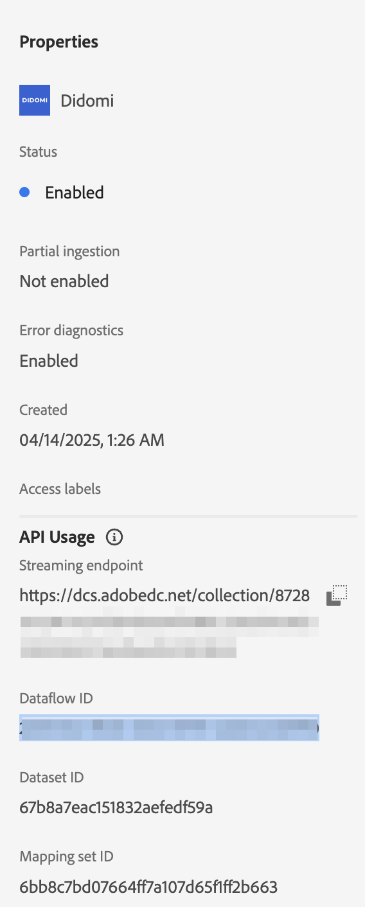

# 将[!DNL Didomi]连接到Experience Platform

>[!AVAILABILITY]
>
>[!DNL Didomi]源为测试版。 有关使用测试版标记源的更多信息，请阅读源概述中的[条款和条件](../../../../home.md#terms-and-conditions)。

阅读本指南，了解如何使用UI中的源工作区将您的[!DNL Didomi]帐户连接到Adobe Experience Platform。

>[!IMPORTANT]
>
>* 此文档页面由&#x200B;*Didomi*&#x200B;团队创建。 如有任何查询或更新请求，请直接通过&#x200B;*support@didomi.io*&#x200B;联系他们。
>* 有关生成连接的分步说明，请参阅[Didomi Adobe源连接器文档](https://developers.didomi.io/integrations/third-party-apps/preference-management-platform-integrations/Adobe-source-connector)。

## 快速入门

本教程需要对以下Adobe Experience Platform组件有一定的了解：

* [[!DNL Experience Data Model (XDM)] 系统](../../../../../xdm/home.md)： Experience Platform用于组织客户体验数据的标准化框架。
   * [架构组合的基础知识](../../../../../xdm/schema/composition.md)：了解XDM架构的基本构建块，包括架构组合中的关键原则和最佳实践。
   * [架构编辑器教程](../../../../../xdm/tutorials/create-schema-ui.md)：了解如何使用架构编辑器UI创建自定义架构。
* [[!DNL Real-Time Customer Profile]](../../../../../profile/home.md)：根据来自多个源的汇总数据，提供统一的实时使用者个人资料。

### 设置您的[!DNL Didomi]帐户

在继续之前，请确保已阅读[[!DNL Didomi] 概述](../../../../connectors/consent-and-preferences/didomi.md#prerequisites)中列出的先决条件步骤并完成这些步骤，以将您的帐户成功连接到Experience Platform。

## 导航源目录

在Experience Platform UI中，从左侧导航中选择&#x200B;**[!UICONTROL 源]**&#x200B;以访问&#x200B;*[!UICONTROL 源]*&#x200B;工作区。 选择类别或使用搜索栏查找您的源。

若要连接到[!DNL Didomi]，请转到&#x200B;*[!UICONTROL 数据库]*&#x200B;类别，选择&#x200B;**[!UICONTROL Didomi]**&#x200B;源卡，然后选择&#x200B;**[!UICONTROL 设置]**。

>[!TIP]
>
>当给定的源尚未具有经过身份验证的帐户时，源目录中的源会显示&#x200B;**[!UICONTROL 设置]**&#x200B;选项。 创建经过身份验证的帐户后，此选项将更改为&#x200B;**[!UICONTROL 添加数据]**。

## 添加您的源数据架构

接下来，使用&#x200B;*[!UICONTROL Select data]*&#x200B;接口上载在先决条件步骤[中下载的](../../../../connectors/consent-and-preferences/didomi.md#download-the-sample-payload-file)的JSON文件。

您可以使用预览界面查看有效载荷的文件结构。 完成后，选择&#x200B;**[!UICONTROL 下一步]**。

## 提供数据流详细信息

接下来，您必须提供有关数据集和数据流的信息。

### 数据集详细信息

数据集是用于数据集合的存储和管理结构，通常是表格，其中包含架构（列）和字段（行）。成功引入Experience Platform的数据将作为数据集保留在数据湖中。

在此步骤中，您可以使用现有数据集或创建新数据集。

>[!NOTE]
>
>无论您是使用现有数据集还是创建新数据集，都必须确保为配置文件&#x200B;**引入启用数据集**。

+++选择相关步骤以启用配置文件摄取、错误诊断和部分摄取。

如果您的数据集启用了实时客户个人资料，那么在此步骤中，您可以切换&#x200B;**[!UICONTROL 个人资料数据集]**&#x200B;以启用您的数据以进行个人资料摄取。 您还可以使用此步骤启用&#x200B;**[!UICONTROL 错误诊断]**&#x200B;和&#x200B;**[!UICONTROL 部分摄取]**。

* **[!UICONTROL 错误诊断]**：选择&#x200B;**[!UICONTROL 错误诊断]**&#x200B;以指示源生成错误诊断，以便以后在监视数据集活动和数据流状态时可以引用这些诊断。
* **[!UICONTROL 部分摄取]**：部分批次摄取是摄取包含错误的数据的能力，最多可摄取特定可配置阈值。 此功能允许您成功地将所有准确的数据提取到Experience Platform中，同时将所有不正确的数据与有关其无效原因的信息单独进行批处理。

+++

### 数据流详细信息

配置数据集后，您必须提供有关数据流的详细信息，包括名称、可选描述和警报配置。

| 数据流配置 | 描述 |
| --- | --- |
| 数据流名称 | 数据流的名称。  默认情况下，这将使用正在导入的文件的名称。 |
| 描述 | （可选）数据流的简短说明。 |
| 警报 | Experience Platform可生成用户可以订阅的基于事件的警报，这些选项全部为正在运行的数据流以触发这些警报。  有关详细信息，请阅读[警报概述](../../alerts.md) <ul><li>**源数据流运行开始**：选择此警报以在数据流运行开始时接收通知。</li><li>**源数据流运行成功**：选择此警报以在数据流结束且没有任何错误时接收通知。</li><li>**源数据流运行失败**：选择此警报以在数据流运行结束时发生任何错误时接收通知。</li></ul> |

{style="table-layout:auto"}

## 映射

在将数据摄取到Experience Platform之前，使用映射界面将源数据映射到相应的架构字段。  有关详细信息，请阅读UI中的[映射指南](../../../../../data-prep/ui/mapping.md)

映射专门用于将&#x200B;**目的数据**&#x200B;从[!DNL Didomi]传输到Experience Platform数据集。 这些目的表示用户的同意选择（例如，用于分析、个性化、广告等），并且是此集成中唯一接受的映射字段。

使用从[ webhook设置中下载的](../../../../connectors/consent-and-preferences/didomi.md#download-the-sample-payload-file)示例webhook有效负载[!DNL Didomi]将每个[!DNL Didomi]目的映射到Adobe数据集中的相应字段。

完成后，选择&#x200B;**[!UICONTROL 下一步]**。

## 审查

此时将显示&#x200B;*[!UICONTROL 审核]*&#x200B;步骤，允许您在创建数据流之前查看其详细信息。 详细信息分为以下类别：

* **[!UICONTROL 连接]**：显示帐户名、源平台和源名。
* **[!UICONTROL 分配数据集并映射字段]**：显示目标数据集和数据集所遵循的架构。

确认详细信息正确后，选择&#x200B;**[!UICONTROL 完成]**。

## 检索流端点URL

创建连接后，将显示源详细信息页面。 此页面显示新创建连接的详细信息，包括以前运行的数据流、ID和流端点URL。

## 在Adobe上完成配置

创建数据流后，导航到&#x200B;*[!UICONTROL 源]*&#x200B;目录，然后选择&#x200B;**[!UICONTROL 数据流]**。 使用数据流目录查找您的[!DNL Didomi]数据流并访问&#x200B;*[!UICONTROL 数据流活动]*&#x200B;接口。 接下来，使用右边栏中的&#x200B;*[!UICONTROL 属性]*&#x200B;面板，并检索以下各项的值：

* [!UICONTROL 流式处理终结点]
* [!UICONTROL 数据流ID]

在Experience Platform UI中：

1. 完成配置后，查看初始webhook设置中缺少的配置参数。
2. 一旦这些值可用，请返回Didomi并更新webhook配置。

## 更新Webhook配置

配置完成后，导航回[!DNL Didomi]控制台并使用&#x200B;**流式端点URL**&#x200B;和&#x200B;**数据流ID**&#x200B;更新您的webhook配置。

完成此操作后，[!DNL Didomi]将开始通过集成发送同意管理和首选项管理事件，数据将存储在您的Adobe数据集中。

## 后续步骤

通过学习本教程，您已成功地创建了一个数据流，以将批次数据从[!DNL Didomi]源引入Experience Platform。 有关其他资源，请访问下面列出的文档。

### 监测数据流

创建数据流后，您可以监视通过它摄取的数据，以查看有关摄取率、成功和错误的信息。 有关如何监视数据流的详细信息，请访问有关UI中[监视帐户和数据流的教程](../../../../../dataflows/ui/monitor-sources.md)。

### 更新您的数据流

要更新数据流计划、映射和常规信息的配置，请访问有关[在UI中更新源数据流的教程](../../update-dataflows.md)。

### 删除您的数据流

您可以删除不再必需的数据流或使用&#x200B;**[!UICONTROL 数据流]**&#x200B;工作区中提供的&#x200B;**[!UICONTROL 删除]**&#x200B;功能错误地创建的数据流。 有关如何删除数据流的详细信息，请访问有关[在UI中删除数据流](../../delete.md)的教程。
