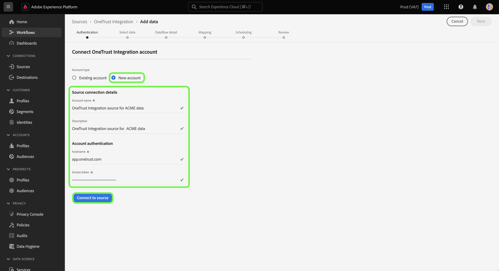

# （测试版）创建 [!DNL OneTrust Integration] UI中的源连接

>[!NOTE]
>
>的 [!DNL OneTrust Integration] 来源为测试版。 其功能和文档可能会发生更改。 有关使用测试版标记的源的信息，请参阅 [源概述](../../../../home.md#terms-and-conditions).

本教程提供了创建 [[!DNL OneTrust Integration]](https://my.onetrust.com/s/contactsupport?language=en_US) 源连接，以使用Platform用户界面将历史和计划同意数据摄取到Adobe Experience Platform。

## 先决条件

>[!IMPORTANT]
>
>的 [!DNL OneTrust Integration] 源连接器和文档由 [!DNL OneTrust Integration] 团队。 如有任何查询或更新请求，请联系 [[!DNL OneTrust] 团队](https://my.onetrust.com/s/contactsupport?language=en_US) 直接。

连接之前 [!DNL OneTrust Integration] 要访问Platform，必须先检索您的访问令牌。 有关查找访问令牌的详细说明，请参阅 [[!DNL OneTrust Integration] OAuth 2指南](https://developer.onetrust.com/docs/api-docs-v3/b3A6MjI4OTUyOTc-generate-access-token).

访问令牌在过期后不会自动刷新，因为系统到系统刷新令牌不受支持 [!DNL OneTrust]. 因此，必须确保在访问令牌过期之前，已在连接中更新您的访问令牌。 访问令牌的可配置最长有效期为一年。 要了解有关更新访问令牌的更多信息，请参阅 [[!DNL OneTrust] 有关管理OAuth 2.0客户端凭据的文档](https://developer.onetrust.com/docs/documentation/ZG9jOjIyODk1MTUw-managing-o-auth-2-0-client-credentials).

### 收集所需的凭据

为了连接 [!DNL OneTrust Integration] 对于平台，必须提供以下身份验证凭据的值：

| 凭据 | 描述 | 示例 |
| --- | --- | --- |
| 主机名 | 从中 [!DNL OneTrust Integration] 需要从中提取数据。 | `https://uat.onetrust.com/` |
| 授权测试URL | （可选）创建基本连接时，授权测试URL用于验证凭据。 如果未提供，则在创建源连接步骤期间会自动检查凭据。 |  |
| 访问令牌 | 与 [!DNL OneTrust Integration] 帐户。 | `ZGFkZDMyMjFhMmEyNDQ2ZGFhNTdkZjNkZjFmM2IyOWE6QjlUSERVUTNjOFVsRmpEZTJ6Vk9oRnF3Sk8xNlNtcm4=` |

有关这些凭据的更多信息，请参阅 [[!DNL OneTrust Integration] 身份验证文档](https://developer.onetrust.com/docs/api-docs-v3/b3A6MjI4OTUyOTc-generate-access-token).

## 连接 [!DNL OneTrust Integration] 帐户

>[!NOTE]
>
>的 [!DNL OneTrust Integration] 正在与Adobe共享API规范以获取数据。

在平台UI中，选择 **[!UICONTROL 源]** 从左侧导航访问 [!UICONTROL 源] 工作区。 的 [!UICONTROL 目录] 屏幕会显示您可以创建帐户的各种源。

您可以从屏幕左侧的目录中选择相应的类别。 或者，您可以使用搜索选项找到要处理的特定源。

在 *[!UICONTROL 同意和首选项]* 类别，选择 [!DNL OneTrust Integration]，然后选择 **[!UICONTROL 添加数据]**.

的 **[!UICONTROL 连接OneTrust集成帐户]** 页面。 在此页面上，您可以使用新凭据或现有凭据。

### 现有帐户

要使用现有帐户，请选择 [!DNL OneTrust Integration] 创建新数据流的帐户，然后选择 **[!UICONTROL 下一个]** 以继续。

### 新帐户

如果要创建新帐户，请选择 **[!UICONTROL 新帐户]**，然后提供名称、可选描述和您的凭据。 完成后，选择 **[!UICONTROL 连接到源]** 然后，再留出一些时间建立新连接。

## 后续步骤

通过阅读本教程，您已经与 [!DNL OneTrust Integration] 帐户。 您现在可以继续下一个教程和 [配置数据流以将同意数据引入平台](../../dataflow/consent-and-preferences.md).
