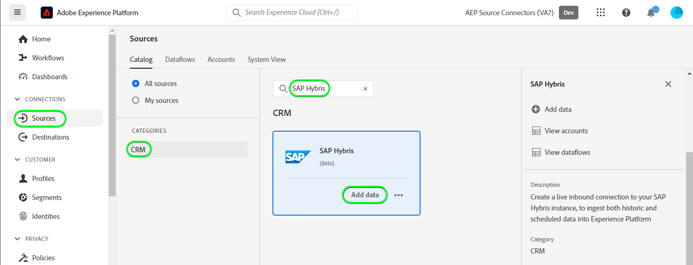
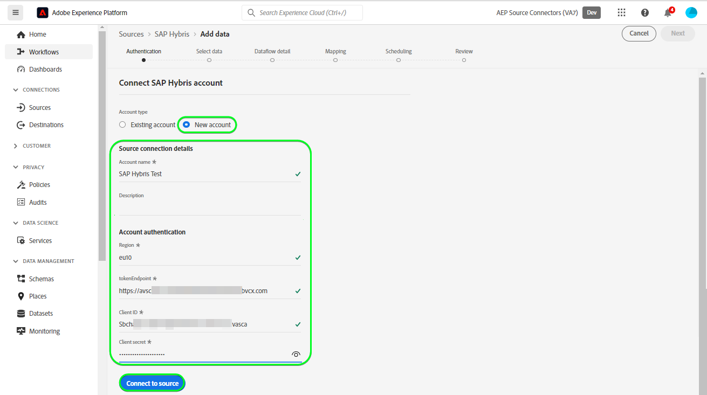
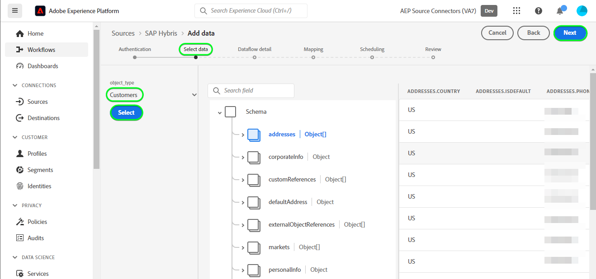
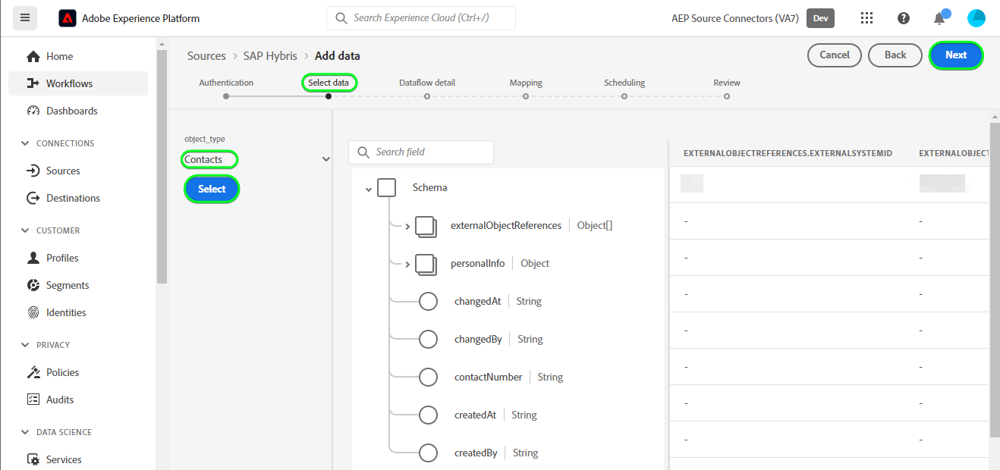
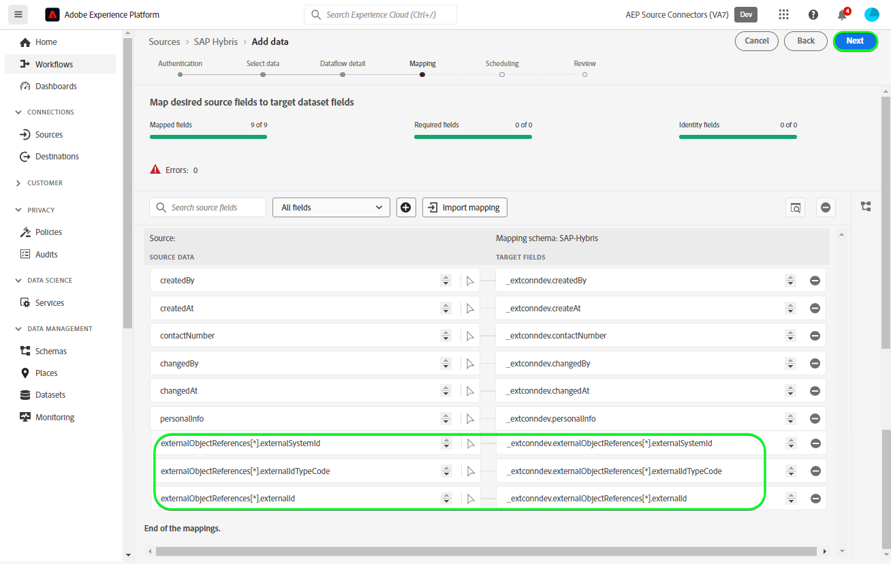

# 创建 [!DNL SAP Hybris] UI中的源连接

>[!NOTE]
>
>此 [!DNL SAP Hybris] 源为测试版。 请参阅 [源概述](../../../../home.md#terms-and-conditions) 有关使用测试版标记源的更多信息。

以下教程将指导您完成创建 [!DNL SAP Hybris] 要引入的源连接 [[!DNL SAP] 订阅帐单](https://www.sap.com/products/financial-management/subscription-billing.html) 使用Adobe Experience Platform用户界面查看联系人和客户数据。

## 快速入门 {#getting-started}

本教程需要对以下Experience Platform组件有一定的了解：

* [[!DNL Experience Data Model (XDM)] 系统](../../../../../xdm/home.md)：用于实现此目标的标准化框架 [!DNL Experience Platform] 组织客户体验数据。
   * [模式组合基础](../../../../../xdm/schema/composition.md)：了解XDM架构的基本构建基块，包括架构构成中的关键原则和最佳实践。
   * [架构编辑器教程](../../../../../xdm/tutorials/create-schema-ui.md)：了解如何使用架构编辑器UI创建自定义架构。
* [[!DNL Real-Time Customer Profile]](../../../../../profile/home.md)：根据来自多个来源的汇总数据提供统一的实时使用者个人资料。

如果您已经拥有有效的 [!DNL SAP Hybris] 帐户，您可以跳过本文档的其余部分并继续阅读关于的教程 [配置数据流](../../dataflow/crm.md).

### 收集所需的凭据 {#gather-credentials}

为了连接 [!DNL SAP Hybris] 要Experience Platform，必须提供以下连接属性的值：

| 凭据 | 描述 |
| --- | --- |
| 客户端ID | 的值 `clientId` 服务密钥。 |
| 客户端密码 | 的值 `clientSecret` 服务密钥。 |
| 令牌端点 | 的值 `url` 从服务密钥中，它将类似于 `https://subscriptionbilling.authentication.eu10.hana.ondemand.com`. |
| 区域 | 您的数据中心位置。 此区域出现在 `url` 且其值类似于 `eu10` 或 `us10`. 例如，如果 `url` 是 `https://eu10.revenue.cloud.sap/api` 您将需要 `eu10`. |

欲知更多信息，请参见 [[!DNL SAP Hybris] 文档](https://help.sap.com/docs/CLOUD_TO_CASH_OD/987aec876092428f88162e438acf80d6/c5fcaf96daff4c7a8520188e4d8a1843.html).

### 创建平台架构 {#create-platform-schema}

创建之前 [!DNL SAP Hybris] 源连接时，还必须确保首先创建一个Experience Platform架构以用于源。 请参阅上的教程 [创建平台架构](../../../../../xdm/schema/composition.md) 以了解有关如何创建架构的全面步骤。

展开以下部分可查看模式示例。

+++ 查看架构示例

```
{
  "_extconndev": {
    "addresses": [
      {
        "addressUUID": "{ADDRESS_UUID}",
        "city": "Burnaby",
        "country": "Canada",
        "email": "chandni@acme.com",
        "houseNumber": "27",
        "isDefault": false,
        "phone": "123-456-7890",
        "postalCode": "V3J 1X9",
        "state": "British Columbia",
        "street": "Beresford"
      }
    ],
    "changedAt": "1687204041",
    "changedBy": "vero@acme.com",
    "contactNumber": "123-456-7980",
    "corporateInfo": {
      "company": "acme"
    },
    "createAt": "1687204041",
    "createdBy": "vero@acme.com",
    "customReferences": [
      {
        "id": "Sample value",
        "typeCode": "Sample value"
      }
    ],
    "customerNumber": "Sample value",
    "customerType": "Sample value",
    "defaultAddress": {
      "addressUUID": "Sample value",
      "city": "North Vancouver",
      "country": "Canada",
      "email": "chandni@acme.come",
      "houseNumber": "34",
      "isDefault": false,
      "phone": "123-456-7890",
      "postalCode": "V7H 2P1",
      "state": "British Columbia",
      "street": "Maple"
    },
    "externalObjectReferences": [
      {
        "externalId": "{EXTERNAL_ID}",
        "externalIdTypeCode": "{EXTERNAL_ID_TYPE_CODE}",
        "externalSystemId": "{EXTERNAL_SYSTEM_ID}"
      }
    ],
    "markets": [
      {
        "active": false,
        "country": "USA",
        "currency": "USD",
        "marketId": "Sample value",
        "priceinfo": {
          "incoterms": "{INCO_TERMS}",
          "incotermsLocation": "{INCO_TERMS_LOCATION}",
          "priceGroup": "{PRICE_GROUP}",
          "priceListType": "{PRICE_LIST_TYPE}"
        },
        "salesArea": {
          "distributionChannel": "{DISTRIBUTION_CHANNEL}",
          "division": "{DIVISION}",
          "salesOrganization": "{SALES_ORGANIZATION}"
        }
      }
    ],
    "personalInfo": {
      "firstName": "Chandni",
      "lastName": "Kaur"
    }
  },
  "_id": "/uri-reference",
  "_repo": {
    "createDate": "2004-10-23T12:00:00-06:00",
    "modifyDate": "2004-10-23T12:00:00-06:00"
  },
  "createdByBatchID": "/uri-reference",
  "modifiedByBatchID": "/uri-reference",
  "personID": "{PERSON_ID}",
  "repositoryCreatedBy": "kevin@acme.com",
  "repositoryLastModifiedBy": "kevin@acme.com"
}
```

+++

## 连接您的 [!DNL SAP Hybris] 帐户 {#connect-account}

在Platform UI中，选择 **[!UICONTROL 源]** 以访问 [!UICONTROL 源] 工作区。 此 [!UICONTROL 目录] 屏幕显示您可以用来创建帐户的各种源。

您可以从屏幕左侧的目录中选择相应的类别。 或者，您可以使用搜索选项查找要使用的特定源。

在 *CRM* 类别，选择 **[!UICONTROL SAP Hybris]**，然后选择 **[!UICONTROL 添加数据]**.



此 **[!UICONTROL 连接SAP Hybris帐户]** 页面。 在此页上，您可以使用新凭据或现有凭据。

### 现有帐户 {#existing-account}

要使用现有帐户，请选择 [!DNL SAP Hybris] 要用于创建新数据流的帐户，然后选择 **[!UICONTROL 下一个]** 以继续。


### 新帐户 {#new-account}

如果要创建新帐户，请选择 **[!UICONTROL 新帐户]**，然后提供名称、可选描述和您的凭据。 完成后，选择 **[!UICONTROL 连接到源]** 然后留出一些时间来建立新连接。



### 选择数据 {#select-data}

最后，必须选择要摄取到Platform的对象类型。

| 对象类型 | 描述 |
| --- | --- |
| `Customers` | 具有订阅的实体。 |
| `Contacts` | 客户的联系详细信息。 |

>[!BEGINTABS]

>[!TAB 客户]

要摄取客户数据，请选择 **[!UICONTROL 客户]** 作为对象类型，然后选择 **[!UICONTROL 下一个]**.



>[!TAB 联系人]

要摄取联系人数据，请选择 **[!UICONTROL 联系人]** 作为对象类型，然后选择 **[!UICONTROL 下一个]**.



>[!ENDTABS]

## 后续步骤 {#next-steps}

按照本教程，您已建立与的连接 [!DNL SAP Hybris] 帐户。 您现在可以继续下一教程和 [配置数据流以将CRM数据引入平台](../../dataflow/crm.md).

## 其他资源 {#additional-resources}

以下各节提供了在使用时，您可以参考的其他资源 [!DNL SAP Hybris] 源。

### 映射 {#mapping}

Platform根据您选择的目标架构或数据集，为自动映射的字段提供智能推荐。 您可以手动调整映射规则以适合您的用例。 根据需要，您可以选择直接映射字段，或使用数据准备函数转换源数据以派生计算值或计算值。 有关使用映射器界面和计算字段的综合步骤，请参阅 [数据准备UI指南](../../../../../data-prep/ui/mapping.md).

数据流的映射配置将因架构和您选择摄取的对象类型而异。

>[!BEGINTABS]

>[!TAB 客户]

对于客户数据， [!DNL SAP Hybris] 使用 [客户](https://api.sap.com/api/BusinessPartner_APIs/path/GET_customers) 和 [客户 — 联系人关系](https://api.sap.com/api/BusinessPartner_APIs/path/GET_relationships-customer-contacts) 的端点 [!DNL SAP Business Partners] 用于检索数据的API

以下是的映射配置示例 [!DNL SAP Hybris] 客户数据的数据流：

| 目标字段 | 描述 |
| --- | --- |
| `customerNumber` | 客户的编号。 |
| `corporateInfo` | 客户的编号。 |
| `customerType` | 客户类型。 |
| `createdAt` | 指示客户创建时间的时间戳。 |
| `changedAt` | 指示客户上次更新时间的时间戳。 |
| `markets[*].country` | 客户市场，作为数组对象进行检索。 |
| `addresses[*].email` | 与客户多个地址关联的电子邮件，检索为数组对象。 |
| `addresses[*].city` | 与客户多个地址关联的城市，检索为数组对象。 |
| `addresses[*].addressUUID` | 与客户多个地址关联的ID，检索为数组对象。 |
| `externalObjectReferences[*].externalSystemId` | 附加数据，检索为数组对象。 |
| `externalObjectReferences[*].externalId` | 附加数据，检索为数组对象。 |
| `customReferences[*].id` | 附加数据，检索为数组对象。 |
| `customReferences[*].typeCode` | 附加数据，检索为数组对象。 |


>[!TAB 联系人]

对于联系数据， [!DNL SAP Hybris] 使用 [联系人](https://api.sap.com/api/BusinessPartner_APIs/path/GET_contacts) 的端点 [!DNL SAP Business Partners] 用于检索数据的API。

以下是的映射配置示例 [!DNL SAP Hybris] 联系数据的数据流：

| 目标字段 | 描述 |
| --- | --- |
| `contactNumber` | 联系人的电话号码。 |
| `createdAt` | 指示联系人创建时间的时间戳。 |
| `changedAt` | 指示上次更新联系人的时间的时间戳。 |
| `personalInfo.lastName` | 联系人的姓氏。 |
| `personalInfo.firstName` | 联系人的名字。 |
| `externalObjectReferences[*].externalSystemId` | 附加数据，检索为数组对象。 |
| `externalObjectReferences[*].externalId` | 附加数据，检索为数组对象。 |
| `externalObjectReferences[*].externalIdTypeCode` | 附加数据，检索为数组对象。 |



>[!ENDTABS]

