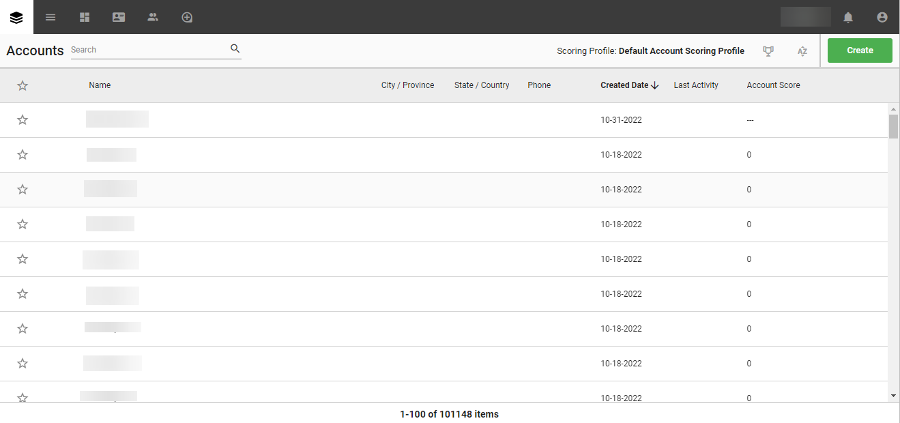

# 在用户界面中创建[!DNL SugarCRM Accounts & Contacts]源连接

本教程提供了使用Adobe Experience Platform用户界面创建[!DNL SugarCRM Accounts & Contacts]源连接的步骤。

## 快速入门

本教程需要对以下Experience Platform组件有一定的了解：

* [[!DNL Experience Data Model (XDM)] 系统](../../../../../xdm/home.md)： [!DNL Experience Platform]用于组织客户体验数据的标准化框架。
   * [架构组合的基础知识](../../../../../xdm/schema/composition.md)：了解XDM架构的基本构建块，包括架构组合中的关键原则和最佳实践。
   * [架构编辑器教程](../../../../../xdm/tutorials/create-schema-ui.md)：了解如何使用架构编辑器UI创建自定义架构。
* [[!DNL Real-Time Customer Profile]](../../../../../profile/home.md)：根据来自多个源的汇总数据，提供统一的实时使用者个人资料。

如果您已经拥有有效的[!DNL SugarCRM]帐户，则可以跳过本文档的其余部分，并转到有关[配置数据流](../../dataflow/crm.md)的教程。

### 收集所需的凭据

为了将[!DNL SugarCRM Accounts & Contacts]连接到Experience Platform，您必须提供以下连接属性的值：

| 凭据 | 描述 | 示例 |
| --- | --- | --- |
| `Host` | 源连接到的SugarCRM API端点。 | `developer.salesfusion.com` |
| `Username` | 您的SugarCRM开发人员帐户用户名。 | `abc.def@example.com@sugarmarketdemo000.com` |
| `Password` | 您的SugarCRM开发人员帐户密码。 | `123456789` |

### 创建Experience Platform架构

在创建[!DNL SugarCRM]源连接之前，还必须确保首先创建一个Experience Platform架构以用于您的源。 有关如何创建架构的完整步骤，请参阅有关[创建Experience Platform架构](../../../../../xdm/schema/composition.md)的教程。

[!DNL SugarCRM Accounts & Contacts]支持多个API。 这意味着您必须根据所使用的对象类型创建单独的架构。 有关accounts和contacts架构，请参阅以下示例：

>[!BEGINTABS]

>[!TAB 帐户]

>[!TAB 联系人]

>[!ENDTABS]

## 连接您的[!DNL SugarCRM Accounts & Contacts]帐户

在Experience Platform UI中，从左侧导航栏中选择&#x200B;**[!UICONTROL 源]**&#x200B;以访问[!UICONTROL 源]工作区。 [!UICONTROL Catalog]屏幕显示您可以用来创建帐户的各种源。

您可以从屏幕左侧的目录中选择相应的类别。 或者，您可以使用搜索选项查找您要使用的特定源。

在&#x200B;*CRM*&#x200B;类别下，选择&#x200B;**[!UICONTROL SugarCRM帐户和联系人]**，然后选择&#x200B;**[!UICONTROL 添加数据]**。

带有SugarCRM帐户和联系人卡片的

出现&#x200B;**[!UICONTROL 连接SugarCRM帐户和联系人帐户]**&#x200B;页面。 在此页上，您可以使用新凭据或现有凭据。

### 现有账户

要使用现有帐户，请选择要用于创建新数据流的[!DNL SugarCRM Accounts & Contacts]帐户，然后选择&#x200B;**[!UICONTROL 下一步]**&#x200B;以继续。

将SugarCRM帐户和联系人帐户与现有帐户连接的

### 新帐户

如果要创建新帐户，请选择&#x200B;**[!UICONTROL 新建帐户]**，然后提供名称、可选描述和凭据。 完成后，选择&#x200B;**[!UICONTROL 连接到源]**，然后留出一些时间来建立新连接。

使用新帐户连接SugarCRM帐户和联系人帐户的

### 选择数据

最后，您必须选择要摄取到Experience Platform的对象类型。

| 对象类型 | 描述 |
| --- | --- |
| `Accounts` | 与您的组织有关系的公司。 |
| `Contacts` | 与您的组织建立关系的个人。 |

>[!BEGINTABS]

>[!TAB 帐户]

>[!TAB 联系人]

>[!ENDTABS]

## 后续步骤

通过学习本教程，您已建立与[!DNL SugarCRM Accounts & Contacts]帐户的连接。 您现在可以继续下一教程，并[配置数据流以将数据导入Experience Platform](../../dataflow/crm.md)。

## 其他资源

以下各节提供了在使用[!DNL SugarCRM]源时可以参考的其他资源。

### 护栏 {#guardrails}

[!DNL SugarCRM] API限制速率是每分钟90次调用或每天2000次调用，以先发生者为准。 但是，通过在连接规范中添加参数来绕过此限制，该参数将延迟请求时间，从而永远不会达到速率限制。

### 验证 {#validation}

要验证您是否已正确设置源，并且正在摄取[!DNL SugarCRM Accounts & Contacts]数据，请执行以下步骤：

* 在Experience Platform UI中，选择源目录上[!DNL SugarCRM Accounts & Contacts]卡片菜单旁边的&#x200B;**[!UICONTROL 查看数据流]**。 接下来，选择&#x200B;**[!UICONTROL 预览数据集]**&#x200B;以验证已摄取的数据。

* 根据您正在处理的对象类型，您可以根据以下[!DNL SugarMarket]帐户或联系人页面上显示的计数验证聚合数据：

>[!BEGINTABS]

>[!TAB 帐户]

>[!TAB 联系人]

>[!ENDTABS]

>[!NOTE]
>
>[!DNL SugarMarket]页不包含已删除的对象计数。 但是，通过此源检索的数据也将包含已删除的计数，这些计数将标有已删除的标志。
