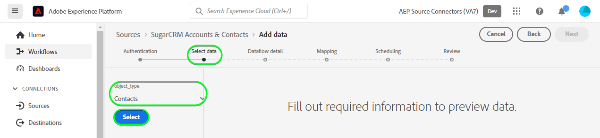

# (Beta)创建 [!DNL SugarCRM Accounts & Contacts] UI中的源连接

>[!NOTE]
>
>此 [!DNL SugarCRM Accounts & Contacts] 源为测试版。 请参阅 [源概述](../../../../home.md#terms-and-conditions) 有关使用测试版标记源的更多信息。

本教程提供了用于创建 [!DNL SugarCRM Accounts & Contacts] 源连接(使用Adobe Experience Platform用户界面)。

## 快速入门

本教程需要对以下Experience Platform组件有一定的了解：

* [[!DNL Experience Data Model (XDM)] 系统](../../../../../xdm/home.md)：用于实现此目标的标准化框架 [!DNL Experience Platform] 组织客户体验数据。
   * [模式组合基础](../../../../../xdm/schema/composition.md)：了解XDM架构的基本构建基块，包括架构构成中的关键原则和最佳实践。
   * [架构编辑器教程](../../../../../xdm/tutorials/create-schema-ui.md)：了解如何使用架构编辑器UI创建自定义架构。
* [[!DNL Real-Time Customer Profile]](../../../../../profile/home.md)：根据来自多个来源的汇总数据提供统一的实时使用者个人资料。

如果您已经拥有有效的 [!DNL SugarCRM] 帐户，您可以跳过本文档的其余部分并继续阅读关于的教程 [配置数据流](../../dataflow/crm.md).

### 收集所需的凭据

为了连接 [!DNL SugarCRM Accounts & Contacts] 到Platform时，必须提供以下连接属性的值：

| 凭据 | 描述 | 示例 |
| --- | --- | --- |
| `Host` | 源连接到的SugarCRM API端点。 | `developer.salesfusion.com` |
| `Username` | 您的SugarCRM开发人员帐户用户名。 | `abc.def@example.com@sugarmarketdemo000.com` |
| `Password` | 您的SugarCRM开发人员帐户密码。 | `123456789` |

### 创建平台架构

创建之前 [!DNL SugarCRM] 源连接时，还必须确保首先创建用于源的Platform架构。 请参阅上的教程 [创建平台架构](../../../../../xdm/schema/composition.md) 以了解有关如何创建架构的全面步骤。

此 [!DNL SugarCRM Accounts & Contacts] 支持多个API。 这意味着您必须根据所使用的对象类型创建单独的架构。 有关帐户和联系人架构，请参阅以下示例：

>[!BEGINTABS]

>[!TAB 帐户]

>[!TAB 联系人]

>[!ENDTABS]

## 连接您的 [!DNL SugarCRM Accounts & Contacts] 帐户

在Platform UI中，选择 **[!UICONTROL 源]** 以访问 [!UICONTROL 源] 工作区。 此 [!UICONTROL 目录] 屏幕显示您可以用来创建帐户的各种源。

您可以从屏幕左侧的目录中选择相应的类别。 或者，您可以使用搜索选项查找要使用的特定源。

在 *CRM* 类别，选择 **[!UICONTROL SugarCRM帐户和联系人]**，然后选择 **[!UICONTROL 添加数据]**.

此 **[!UICONTROL 连接SugarCRM帐户和联系人帐户]** 页面。 在此页上，您可以使用新凭据或现有凭据。

### 现有帐户

要使用现有帐户，请选择 [!DNL SugarCRM Accounts & Contacts] 要用于创建新数据流的帐户，然后选择 **[!UICONTROL 下一个]** 以继续。

### 新帐户

如果要创建新帐户，请选择 **[!UICONTROL 新帐户]**，然后提供名称、可选描述和您的凭据。 完成后，选择 **[!UICONTROL 连接到源]** 然后留出一些时间来建立新连接。

### 选择数据

最后，必须选择要摄取到Platform的对象类型。

| 对象类型 | 描述 |
| --- | --- |
| `Accounts` | 与您的组织有关系的公司。 |
| `Contacts` | 与您的组织建立关系的个人。 |

>[!BEGINTABS]

>[!TAB 帐户]

>[!TAB 联系人]

>[!ENDTABS]

## 后续步骤

按照本教程，您已建立与的连接 [!DNL SugarCRM Accounts & Contacts] 帐户。 您现在可以继续下一教程和 [配置数据流以将数据引入平台](../../dataflow/crm.md).

## 其他资源

以下各节提供了在使用时，您可以参考的其他资源 [!DNL SugarCRM] 源。

### 护栏 {#guardrails}

此 [!DNL SugarCRM] API限制速率是每分钟90次调用或每天2000次调用（以先发生者为准）。 但是，通过在连接规范中添加参数来规避此限制，该参数将延迟请求时间，从而永远不会达到速率限制。

### 验证 {#validation}

验证是否已正确设置源和 [!DNL SugarCRM Accounts & Contacts] 正在摄取数据，请执行以下步骤：

* 在Platform UI中，选择 **[!UICONTROL 查看数据流]** 在 [!DNL SugarCRM Accounts & Contacts] 源目录中的卡菜单。 接下来，选择 **[!UICONTROL 预览数据集]** 以验证所摄取的数据。

* 根据您所使用的对象类型，您可以根据 [!DNL SugarMarket] 下面的“帐户”或“联系人”页：

>[!BEGINTABS]

>[!TAB 帐户]

>[!TAB 联系人]

>[!ENDTABS]

>[!NOTE]
>
>此 [!DNL SugarMarket] 页面不包含已删除的对象计数。 但是，通过此源检索的数据也将包含已删除的计数，这些计数将标有一个已删除的标志。
