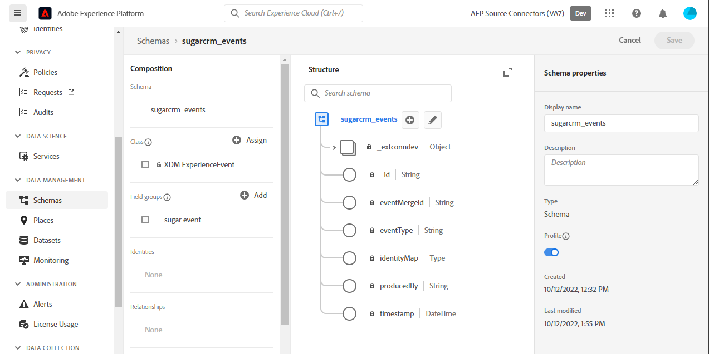

# （测试版）创建 [!DNL SugarCRM Events] UI中的源连接

>[!NOTE]
>
>的 [!DNL SugarCRM Events] 来源为测试版。 请参阅 [源概述](../../../../home.md#terms-and-conditions) 有关使用测试版标记的源的详细信息。

本教程提供了创建 [!DNL SugarCRM Events] 源连接。

## 快速入门

本教程需要对Experience Platform的以下组件有一定的了解：

* [[!DNL Experience Data Model (XDM)] 系统](../../../../../xdm/home.md):标准化框架， [!DNL Experience Platform] 组织客户体验数据。
   * [架构组合的基础知识](../../../../../xdm/schema/composition.md):了解XDM模式的基本构建块，包括模式组合中的关键原则和最佳实践。
   * [模式编辑器教程](../../../../../xdm/tutorials/create-schema-ui.md):了解如何使用模式编辑器UI创建自定义模式。
* [[!DNL Real-Time Customer Profile]](../../../../../profile/home.md):根据来自多个来源的汇总数据提供统一的实时客户资料。

如果您已经拥有 [!DNL SugarCRM] 帐户，您可以跳过本文档的其余部分，并继续阅读本教程 [配置数据流](../../dataflow/crm.md).

### 收集所需的凭据

为了连接 [!DNL SugarCRM Events] 对于平台，必须为以下连接属性提供值：

| 凭据 | 描述 | 示例 |
| --- | --- | --- |
| `Host` | 源连接到的SugarCRM API端点。 | `developer.salesfusion.com` |
| `Username` | 您的SugarCRM开发人员帐户用户名。 | `abc.def@example.com@sugarmarketdemo000.com` |
| `Password` | 您的SugarCRM开发人员帐户密码。 | `123456789` |

### 为创建平台模式 [!DNL SugarCRM]

在创建 [!DNL SugarCRM] 源连接时，还必须确保首先创建要用于源的平台架构。 请参阅 [创建平台模式](../../../../../xdm/schema/composition.md) 有关如何创建架构的完整步骤。

>[!WARNING]
>
>映射架构时，请确保同时映射必填项 `event_id` 和 `timestamp` 平台所需的字段。

## 连接 [!DNL SugarCRM Events] 帐户

在平台UI中，选择 **[!UICONTROL 源]** 从左侧导航栏访问 [!UICONTROL 源] 工作区。 的 [!UICONTROL 目录] 屏幕会显示您可以创建帐户的各种源。

您可以从屏幕左侧的目录中选择相应的类别。 或者，您可以使用搜索选项找到要处理的特定源。

在 *CRM* 类别，选择 **[!UICONTROL SugarCRM事件]**，然后选择 **[!UICONTROL 添加数据]**.

的 **[!UICONTROL 连接SugarCRM事件帐户]** 页面。 在此页面上，您可以使用新凭据或现有凭据。

### 现有帐户

要使用现有帐户，请选择 [!DNL SugarCRM Events] 创建新数据流的帐户，然后选择 **[!UICONTROL 下一个]** 以继续。

### 新帐户

如果要创建新帐户，请选择 **[!UICONTROL 新帐户]**，然后提供名称、可选描述和您的凭据。 完成后，选择 **[!UICONTROL 连接到源]** 然后，再留出一些时间建立新连接。

## 后续步骤

通过阅读本教程，您已经与 [!DNL SugarCRM Events] 帐户。 您现在可以继续下一个教程和 [配置数据流以将数据导入平台](../../dataflow/crm.md).

## 其他资源

以下部分提供了在使用 [!DNL SugarCRM] 来源。

### 护栏 {#guardrails}

的 [!DNL SugarCRM] API限制率为每分钟90次调用或每天2000次调用（以先发生者为准）。 但是，通过在连接规范中添加一个参数来绕过此限制，该参数将延迟请求时间，从而永远不会达到速率限制。

### 验证 {#validation}

验证是否已正确设置源和 [!DNL SugarCRM Events] 正在摄取数据，请执行以下步骤：

* 在平台UI中，选择 **[!UICONTROL 查看数据流]** 旁边 [!DNL SugarCRM Events] 源目录的卡片菜单。 接下来，选择 **[!UICONTROL 预览数据集]** 以验证所摄取的数据。

* 根据您所使用的对象类型，您可以根据 [!DNL SugarMarket] 事件页面如下：

>[!NOTE]
>
>的 [!DNL SugarMarket] 页面不包含已删除的对象计数。 但是，通过此源检索的数据也将包含已删除的计数，这些计数将标记为已删除的标记。