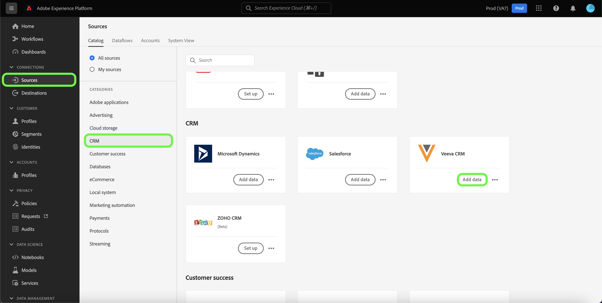

# 在用户界面中创建[!DNL Veeva CRM]源连接

Adobe Experience Platform中的Source连接器可按计划摄取外部源CRM数据。 本教程提供了使用[!DNL Experience Platform]用户界面创建[!DNL Veeva CRM]源连接器的步骤。

## 快速入门

本教程需要对以下Adobe Experience Platform组件有一定的了解：

* [[!DNL Experience Data Model (XDM)] 系统](../../../../../xdm/home.md)： [!DNL Experience Platform]用于组织客户体验数据的标准化框架。
   * [架构组合的基础知识](../../../../../xdm/schema/composition.md)：了解XDM架构的基本构建块，包括架构组合中的关键原则和最佳实践。
   * [架构编辑器教程](../../../../../xdm/tutorials/create-schema-ui.md)：了解如何使用架构编辑器UI创建自定义架构。
* [[!DNL Real-Time Customer Profile]](../../../../../profile/home.md)：根据来自多个源的汇总数据，提供统一的实时使用者个人资料。

如果您已经拥有有效的[!DNL Veeva CRM]帐户，则可以跳过本文档的其余部分，并转到有关[配置数据流](../../dataflow/crm.md)的教程。

### 收集所需的凭据

| 凭据 | 描述 |
| ---------- | ----------- |
| `environmentUrl` | [!DNL Veeva CRM]源实例的URL。 |
| `username` | [!DNL Veeva CRM]用户帐户的用户名。 |
| `password` | [!DNL Veeva CRM]用户帐户的密码。 |
| `securityToken` | [!DNL Veeva CRM]用户帐户的安全令牌。 |

有关入门的详细信息，请参阅此[[!DNL Veeva CRM] 文档](https://developer.veevacrm.com/doc/Content/rest-api.htm)。

## 连接您的[!DNL Veeva CRM]帐户

收集所需的凭据后，您可以按照以下步骤将您的[!DNL Veeva CRM]帐户关联到[!DNL Experience Platform]。

在Experience Platform UI中，从左侧导航栏中选择&#x200B;**[!UICONTROL 源]**&#x200B;以访问[!UICONTROL 源]工作区。 [!UICONTROL Catalog]屏幕显示您可以为其创建帐户的各种源。

您可以从屏幕左侧的目录中选择相应的类别。 或者，您可以使用搜索选项查找您要使用的特定源。

在[!UICONTROL CRM]类别下，选择&#x200B;**[!UICONTROL Veeva CRM]**，然后选择&#x200B;**[!UICONTROL 添加数据]**。

出现&#x200B;**[!UICONTROL Connect Veeva CRM帐户]**&#x200B;页面。 在此页上，您可以使用新凭据或现有凭据。

### 现有账户

要使用现有帐户，请选择要用于创建新数据流的[!DNL Veeva CRM]帐户，然后选择&#x200B;**[!UICONTROL 下一步]**&#x200B;以继续。

### 新帐户

如果您正在创建新帐户，请选择&#x200B;**[!UICONTROL 新帐户]**，然后提供名称、可选描述和您的[!DNL Veeva CRM]凭据。 完成后，选择&#x200B;**[!UICONTROL 连接到源]**，然后留出一些时间来建立新连接。

## 后续步骤

通过学习本教程，您已建立与[!DNL Veeva CRM]帐户的连接。 您现在可以继续下一教程，并[配置数据流以将数据导入Experience Platform](../../dataflow/crm.md)。
