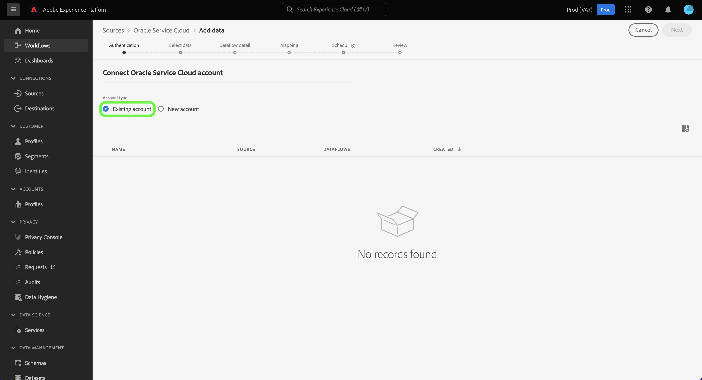

# 在UI中创建Oracle Service Cloud源连接

>[!WARNING]
>
>[!DNL Oracle Service Cloud]源将于2025年6月底弃用。

本教程提供了使用Oracle用户界面创建Adobe Experience Platform服务云源连接的步骤。

## 快速入门

本教程需要对以下Experience Platform组件有一定的了解：

* [[!DNL Experience Data Model (XDM)] 系统](../../../../../xdm/home.md)： Experience Platform用于组织客户体验数据的标准化框架。
   * [架构组合的基础知识](../../../../../xdm/schema/composition.md)：了解XDM架构的基本构建块，包括架构组合中的关键原则和最佳实践。
   * [架构编辑器教程](../../../../../xdm/tutorials/create-schema-ui.md)：了解如何使用架构编辑器UI创建自定义架构。
* [[!DNL Real-Time Customer Profile]](../../../../../profile/home.md)：根据来自多个源的汇总数据，提供统一的实时使用者个人资料。

如果您已拥有有效的Oracle Service Cloud源连接，则可以跳过本文档的其余部分，继续阅读[配置数据流](../../dataflow/customer-success.md)的教程

### 收集所需的凭据

要在[!DNL Experience Platform]上访问您的Oracle Service Cloud帐户，您必须提供以下值：

| 凭据 | 描述 |
| ---------- | ----------- |
| Host | Oracle服务云实例的主机URL。 |
| 用户名 | 您的Oracle Service Cloud用户帐户的用户名。 |
| 密码 | Oracle Service Cloud帐户的密码。 |

有关对您的Oracle Service Cloud帐户进行身份验证的更多信息，请参阅[[!DNL Oracle] 身份验证指南](https://docs.oracle.com/en/cloud/saas/b2c-service/20c/cxska/OKCS_Authenticate_and_Authorize.html)。

## 连接您的Oracle服务云帐户

在Experience Platform UI中，从左侧导航中选择&#x200B;**[!UICONTROL 源]**&#x200B;以访问[!UICONTROL 源]工作区。 [!UICONTROL 目录]屏幕显示可用于创建帐户的各种源。

您可以从屏幕左侧的目录中选择相应的类别。 或者，您可以使用搜索栏查找要使用的特定源。

在[!UICONTROL 客户成功]类别下，选择&#x200B;**[!UICONTROL Oracle服务云]**，然后选择&#x200B;**[!UICONTROL 添加数据]**。

此时会显示&#x200B;**[!UICONTROL 连接到Oracle Service Cloud]**&#x200B;页面。 在此页上，您可以使用新凭据或现有凭据。

### 现有账户

要连接现有帐户，请选择要连接的Oracle Service Cloud帐户，然后选择&#x200B;**[!UICONTROL 下一步]**&#x200B;以继续。

### 新帐户

如果您正在使用新凭据，请选择&#x200B;**[!UICONTROL 新帐户]**。 在显示的输入表单上，提供名称、可选描述和您的Oracle Service Cloud凭据。 完成后，选择&#x200B;**[!UICONTROL 连接到源]**，然后留出一些时间来建立新连接。

## 后续步骤

通过学习本教程，您已建立与Oracle Service Cloud帐户的连接。 您现在可以继续下一教程并[配置数据流以将客户成功数据导入Experience Platform](../../dataflow/crm.md)。
