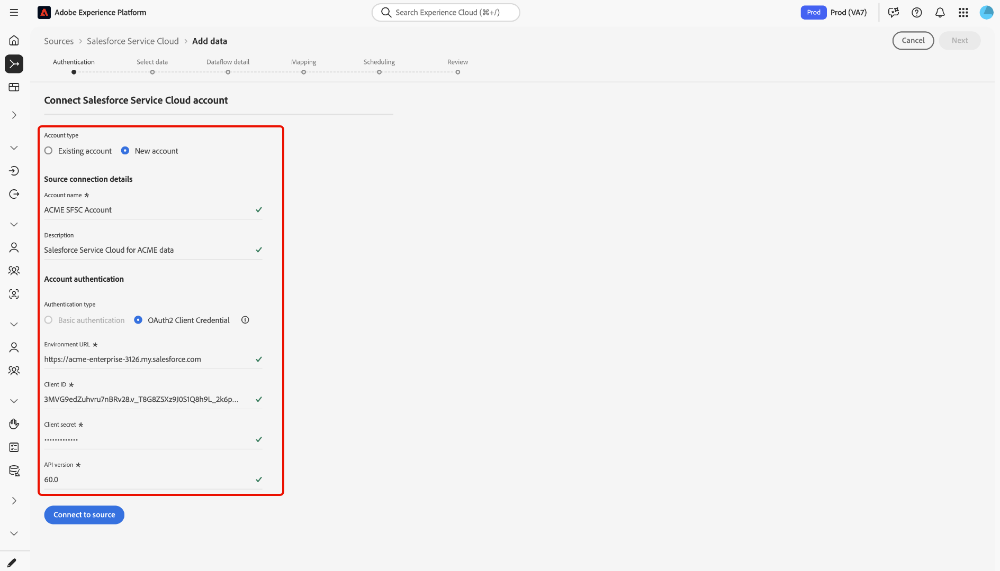

# 使用UI将您的[!DNL Salesforce Service Cloud]帐户连接到Experience Platform

按照此分步指南无缝连接您的[!DNL Salesforce Service Cloud]帐户并将您的客户成功数据导入Adobe Experience Platform。

## 快速入门

本教程需要对以下Experience Platform组件有一定的了解：

* [[!DNL Experience Data Model (XDM)] 系统](../../../../../xdm/home.md)： Experience Platform用于组织客户体验数据的标准化框架。
   * [架构组合的基础知识](../../../../../xdm/schema/composition.md)：了解XDM架构的基本构建块，包括架构组合中的关键原则和最佳实践。
   * [架构编辑器教程](../../../../../xdm/tutorials/create-schema-ui.md)：了解如何使用架构编辑器UI创建自定义架构。
* [[!DNL Real-Time Customer Profile]](../../../../../profile/home.md)：根据来自多个源的汇总数据，提供统一的实时使用者个人资料。

如果您已经拥有有效的[!DNL Salesforce Service Cloud]连接，则可以跳过本文档的其余部分，并转到有关[配置数据流以实现客户成功](../../dataflow/customer-success.md)的教程

### 收集所需的凭据

有关检索凭据的更多信息，请阅读[身份验证指南](../../../../connectors/customer-success/salesforce-service-cloud.md#credentials)。

## 连接您的[!DNL Salesforce Service Cloud]帐户

在Experience Platform UI中，从左侧导航中选择&#x200B;**[!UICONTROL Sources]**&#x200B;以访问[!UICONTROL Sources]工作区。 您可以从屏幕左侧的目录中选择相应的类别。 或者，您可以使用搜索选项查找您要使用的特定源。

在&#x200B;*[!UICONTROL Customer success]*&#x200B;类别下选择&#x200B;**[!DNL Salesforce Service Cloud]**，然后选择&#x200B;**[!UICONTROL Add data]**。

>[!TIP]
>
>当给定的源尚未拥有经过身份验证的帐户时，源目录中的源会显示&#x200B;**[!UICONTROL Set up]**&#x200B;选项。 一旦存在经过身份验证的帐户，此选项将更改为&#x200B;**[!UICONTROL Add data]**。

此时会显示&#x200B;**[!UICONTROL Connect to Salesforce Service Cloud]**&#x200B;页面。 在此页上，您可以使用新凭据或现有凭据。

### 使用现有帐户

要使用现有帐户，请选择&#x200B;**[!UICONTROL Existing account]**，然后从显示的列表中选择所需的帐户。 完成后，选择&#x200B;**[!UICONTROL Next]**&#x200B;以继续。

### 创建新帐户

要创建新帐户，请选择&#x200B;**[!UICONTROL New account]**&#x200B;并为您的新[!DNL Salesforce Service Cloud]帐户提供名称和描述。 接下来，选择&#x200B;**[!UICONTROL OAuth2 Client Credential]**，然后提供以下凭据的值：

* 环境 URL
* 客户端 ID
* 客户端密码
* API 版本

完成后，选择&#x200B;**[!UICONTROL Connect to source]**。

## 后续步骤

通过学习本教程，您已建立与[!DNL Salesforce Service Cloud]帐户的连接。 您现在可以继续下一教程，并[配置数据流以将客户成功数据引入Experience Platform](../../dataflow/customer-success.md)。
