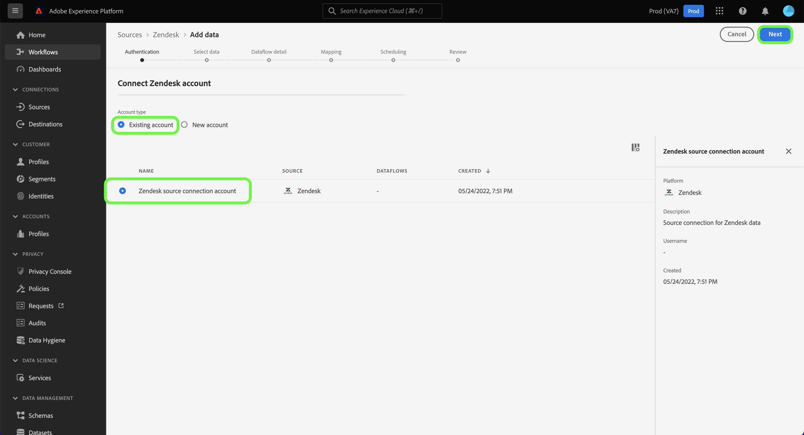

# 在用户界面中创建[!DNL Zendesk]源连接

本教程提供了使用Adobe Experience Platform用户界面创建[!DNL Zendesk]源连接的步骤。

## 快速入门

本教程需要对以下Adobe Experience Platform组件有一定的了解：

* [[!DNL Experience Data Model (XDM)] 系统](../../../../../xdm/home.md)： [!DNL Experience Platform]用于组织客户体验数据的标准化框架。
   * [架构组合的基础知识](../../../../../xdm/schema/composition.md)：了解XDM架构的基本构建块，包括架构组合中的关键原则和最佳实践。
   * [架构编辑器教程](../../../../../xdm/tutorials/create-schema-ui.md)：了解如何使用架构编辑器UI创建自定义架构。
* [[!DNL Real-Time Customer Profile]](../../../../../profile/home.md)：根据来自多个源的汇总数据，提供统一的实时使用者个人资料。

### 收集所需的凭据

要在Experience Platform上访问您的[!DNL Zendesk]帐户，必须提供以下凭据的值：

| 凭据 | 描述 | 示例 |
| --- | --- | --- |
| 子域 | 在注册过程中创建的特定于您帐户的唯一域。 | `yoursubdomain` |
| 访问令牌 | Zendesk API令牌。 | `0lZnClEvkJSTQ7olGLl7PMhVq99gu26GTbJtf` |

有关验证[!DNL Zendesk]源的更多信息，请参阅[[!DNL Zendesk] 源概述](../../../../connectors/customer-success/zendesk.md)。

### 为[!DNL Zendesk]创建Experience Platform架构

在创建[!DNL Zendesk]源连接之前，还必须确保首先创建一个Experience Platform架构以用于您的源。 有关如何创建架构的完整步骤，请参阅有关[创建Experience Platform架构](../../../../../xdm/schema/composition.md)的教程。

有关[!DNL Zendesk Search API]所需的[!DNL Zendesk]架构的其他指导，请参阅下面的[限制](#limits)部分。

## 连接您的[!DNL Zendesk]帐户

在Experience Platform UI中，从左侧导航栏中选择&#x200B;**[!UICONTROL 源]**&#x200B;以访问[!UICONTROL 源]工作区。 [!UICONTROL Catalog]屏幕显示您可以用来创建帐户的各种源。

您可以从屏幕左侧的目录中选择相应的类别。 或者，您可以使用搜索选项查找您要使用的特定源。

在&#x200B;*客户成功*&#x200B;类别下，选择&#x200B;**[!UICONTROL Zendesk]**，然后选择&#x200B;**[!UICONTROL 添加数据]**。

出现&#x200B;**[!UICONTROL 连接Zendesk帐户]**&#x200B;页面。 在此页上，您可以使用新凭据或现有凭据。

### 现有账户

若要使用现有帐户，请选择您要用来创建新数据流的&#x200B;*Zendesk*&#x200B;帐户，然后选择&#x200B;**[!UICONTROL 下一步]**&#x200B;以继续。

### 新帐户

如果要创建新帐户，请选择&#x200B;**[!UICONTROL 新建帐户]**，然后提供名称、可选描述和凭据。 完成后，选择&#x200B;**[!UICONTROL 连接到源]**，然后留出一些时间来建立新连接。

### 选择数据

在您的源进行身份验证后，页面将更新为交互式架构树，从而允许您浏览和检查数据的层次结构。 选择&#x200B;**[!UICONTROL 下一步]**&#x200B;以继续。

## 后续步骤

通过学习本教程，您已验证并创建了[!DNL Zendesk]帐户与Experience Platform之间的源连接。 您现在可以继续下一教程并[创建数据流以将客户成功数据导入Experience Platform](../../dataflow/customer-success.md)。

## 其他资源

以下部分提供了在使用[!DNL Zendesk]源时可以参考的其他资源。

### 验证 {#validation}

下面概述了验证是否成功连接[!DNL Zendesk]源以及是否正在将[!DNL Zendesk]配置文件摄取到Experience Platform时可以采取的步骤。

在Experience Platform UI中，从左侧导航中选择&#x200B;**[!UICONTROL 数据集]**&#x200B;以访问[!UICONTROL 数据集]工作区。 [!UICONTROL 数据集活动]屏幕显示执行的详细信息。

接下来，选择要查看的数据流的数据流运行ID，以查看有关该数据流运行的特定详细信息。

最后，选择&#x200B;**[!UICONTROL 预览数据集]**&#x200B;以显示已摄取的数据。

您还可以根据[!DNL Zendesk] > [!DNL Customers]页面上的数据验证Experience Platform数据。

### Zendesk架构

下表列出了必须为Zendesk设置的受支持映射。

>[!TIP]
>
>有关API的更多信息，请参阅[Zendesk Search API >导出搜索结果](https://developer.zendesk.com/api-reference/ticketing/ticket-management/search/#export-search-results)。

| 来源 | 类型 |
|---|---|
| `results.active` | 布尔值 |
| `results.alias` | 字符串 |
| `results.created_at` | 字符串 |
| `results.custom_role_id` | 整数 |
| `results.default_group_id` | 整数 |
| `results.details` | 字符串 |
| `results.email` | 字符串 |
| `results.external_id` | 整数 |
| `results.iana_time_zone` | 字符串 |
| `results.id` | 整数 |
| `results.last_login_at` | 字符串 |
| `results.locale` | 字符串 |
| `results.locale_id` | 整数 |
| `results.moderator` | 布尔值 |
| `results.name` | 字符串 |
| `results.notes` | 字符串 |
| `results.only_private_comments` | 布尔值 |
| `results.organization_id` | 整数 |
| `results.phone` | 字符串 |
| `results.photo` | 字符串 |
| `results.report_csv` | 布尔值 |
| `results.restricted_agent` | 布尔值 |
| `results.result_type` | 字符串 |
| `results.role` | 字符串 |
| `results.role_type` | 整数 |
| `results.shared` | 布尔值 |
| `results.shared_agent` | 布尔值 |
| `results.shared_phone_number` | 布尔值 |
| `results.signature` | 字符串 |
| `results.suspended` | 布尔值 |
| `results.ticket_restriction` | 字符串 |
| `results.time_zone` | 字符串 |
| `results.two_factor_auth_enabled` | 布尔值 |
| `results.updated_at` | 字符串 |
| `results.url` | 字符串 |
| `results.verified` | 布尔值 |

{style="table-layout:auto"}

### 限制 {#limits}

* [Zendesk搜索API >导出搜索结果](https://developer.zendesk.com/api-reference/ticketing/ticket-management/search/#export-search-results)每页最多返回1000条记录。
   * ``filter[type]``参数的值设置为``user``，因此Zendesk连接仅返回用户。
   * 每页的结果数由``page[size]``参数管理。 值设置为``100``。 这样做是为了减少Zendesk设置的减速限制的影响。
   * 查看[限制](https://developer.zendesk.com/api-reference/ticketing/ticket-management/search/#limits)和[分页](https://developer.zendesk.com/api-reference/ticketing/ticket-management/search/#pagination-1)。
   * 您还可以参考[使用游标分页](https://developer.zendesk.com/documentation/developer-tools/pagination/paginating-through-lists-using-cursor-pagination/)对列表进行分页。
