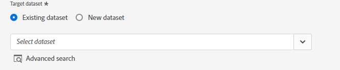

# 在UI中创建[!DNL Acxiom Prospecting Data Import]源连接和数据流

[!DNL Acxiom]的Adobe Real-Time Customer Data Platform潜在客户数据导入是一个尽可能提供最多生产力的潜在客户受众的过程。 [!DNL Acxiom]通过安全导出获取Real-Time CDP第一方数据，并通过屡获殊荣的卫生和身份解析系统运行该数据。 这将生成一个用作禁止列表的数据文件。 然后，此数据文件将与Acxiom全局数据库匹配，这样就可以定制目标客户列表以进行导入。

您可以使用[!DNL Acxiom]源检索和映射Acxiom目标客户服务的响应，并将Amazon S3用作放置点。

阅读本教程，了解如何使用Adobe Experience Platform用户界面创建[!DNL Acxiom Prospecting Data Import]源连接和数据流。

## 先决条件 {#prerequisites}

本教程需要对以下Experience Platform组件有一定的了解：

* [[!DNL Experience Data Model (XDM)] 系统](../../../../../xdm/home.md)： Experience Platform用于组织客户体验数据的标准化框架。
   * [架构组合的基础知识](../../../../../xdm/schema/composition.md)：了解XDM架构的基本构建块，包括架构组合中的关键原则和最佳实践。
   * [架构编辑器教程](../../../../../xdm/tutorials/create-schema-ui.md)：了解如何使用架构编辑器UI创建自定义架构。
* [[!DNL Real-Time Customer Profile]](../../../../../profile/home.md)：根据来自多个源的汇总数据，提供统一的实时使用者个人资料。
* [[!DNL Prospect Profile]](../../../../../profile/ui/prospect-profile.md)：了解如何使用第三方信息创建和使用潜在客户配置文件来收集有关未知客户的信息。

### 收集所需的凭据

要在Experience Platform上访问存储段，您需要为以下凭据提供有效值：

| 凭据 | 描述 |
| --- | --- |
| [!DNL Acxiom]身份验证密钥 | 身份验证密钥。 您可以从[!DNL Acxiom]团队中检索此值。 |
| [!DNL Amazon S3]访问密钥 | 存储段的访问密钥ID。 您可以从[!DNL Acxiom]团队中检索此值。 |
| [!DNL Amazon S3]密钥 | 存储桶的密钥ID。 您可以从[!DNL Acxiom]团队中检索此值。 |
| 存储桶名称 | 这是将共享文件的存储段。 您可以从[!DNL Acxiom]团队中检索此值。 |

>[!IMPORTANT]
>
>若要将您的&#x200B;**[!UICONTROL 帐户连接到Experience Platform，您必须同时为您的帐户启用]**&#x200B;查看源&#x200B;**[!UICONTROL 和]**&#x200B;管理源[!DNL Acxiom]权限。 请联系您的产品管理员以获取必要的权限。 有关详细信息，请阅读[访问控制UI指南](../../../../../access-control/ui/overview.md)。

## 连接您的[!DNL Acxiom]帐户

在Experience Platform UI中，从左侧导航栏中选择&#x200B;**[!UICONTROL 源]**&#x200B;以访问[!UICONTROL 源]工作区。 [!UICONTROL Catalog]屏幕显示您可以为其创建帐户的各种源。

您可以从屏幕左侧的目录中选择相应的类别。 或者，您可以使用搜索选项查找您要使用的特定源。

在&#x200B;**[!UICONTROL 数据和身份合作伙伴]**&#x200B;类别下，选择&#x200B;**[!UICONTROL Acxiom潜在客户数据导入]**，然后选择&#x200B;**[!UICONTROL 设置]**。

>[!TIP]
>
>显示&#x200B;**[!UICONTROL 添加数据]**&#x200B;的源卡意味着源已拥有经过身份验证的帐户。 另一方面，显示&#x200B;**[!UICONTROL 设置]**&#x200B;的源卡意味着您必须提供凭据并创建新帐户才能使用该源。

### 创建新帐户

如果您正在使用新凭据，请选择&#x200B;**[!UICONTROL 新帐户]**。 在显示的输入表单上，提供名称、可选描述和您的[!DNL Acxiom]凭据。 完成后，选择&#x200B;**[!UICONTROL 连接到源]**，然后留出一些时间来建立新连接。

| 凭据 | 描述 |
| --- | --- |
| 帐户名称 | 帐户的名称。 |
| 描述 | （可选）帐户用途的简要说明。 |
| [!DNL Acxiom]身份验证密钥 | 帐户审批需要[!DNL Acxiom]提供的密钥。 在与数据库建立连接之前，必须匹配正确的值。  此键必须为24个字符，并且只能包括：A-Z、a-z和0-9。 |
| S3 访问密钥 | S3访问密钥引用Amazon S3位置。 在定义S3角色权限时，这由管理员提供。 |
| S3 密钥 | S3密钥引用Amazon S3位置。 在定义S3角色权限时，这由管理员提供。 |
| s3SessionToken | （可选）连接到S3时的身份验证令牌值。 |
| serviceUrl | （可选）在非标准位置连接到S3时要使用的URL位置。 |
| 存储桶名称 | （可选）在S3上设置的S3存储段的名称，用作数据选择中的起始路径。 |
| 文件夹路径 | 如果使用存储段中的子目录，则还可以指定路径作为数据选择中的起始路径。 |

### 使用现有帐户

若要使用现有帐户，请选择&#x200B;**[!UICONTROL 现有帐户]**。

从列表中选择一个帐户以查看该帐户的详细信息。 选择帐户后，选择&#x200B;**[!UICONTROL 下一步]**&#x200B;以继续。

## 选择数据

从所需的存储段和子目录中选择要提取的文件。 一旦定义了分隔符和压缩类型，就可以提供数据的预览。 选择文件后，选择&#x200B;**[!UICONTROL 下一步]**&#x200B;以继续。

>[!NOTE]
>
>虽然JSON和Parquet文件类型已列出，但您并非要求或期望在[!DNL Acxiom]源工作流中使用它们。

## 提供数据集和数据流详细信息

接下来，您必须提供有关数据集和数据流的信息。

### 数据集详细信息

>[!BEGINTABS]

>[!TAB 使用新数据集]

数据集是用于数据集合的存储和管理结构，通常是表格，其中包含架构（列）和字段（行）。成功引入Experience Platform的数据将作为数据集保留在数据湖中。 要使用新数据集，请选择&#x200B;**[!UICONTROL 新数据集]**。

| 新数据集详细信息 | 描述 |
| --- | --- |
| 输出数据集名称 | 新数据集的名称。 |
| 描述 | （可选）简要说明数据集的用途。 |
| 架构 | 您的组织中存在的架构的下拉列表。 您还可以在源配置过程之前创建自己的架构。 有关详细信息，请参阅[在UI中创建架构](../../../../../xdm/tutorials/create-schema-ui.md)指南。 |

>[!TAB 使用现有数据集]

要使用现有数据集，请选择&#x200B;**[!UICONTROL 现有数据集]**。

您可以选择&#x200B;**[!UICONTROL 高级搜索]**&#x200B;查看贵组织的所有数据集的窗口，包括它们各自的详细信息，例如是否允许将它们摄取到实时客户档案。

>[!ENDTABS]

### 数据流详细信息

在此步骤中，如果为配置文件启用了数据集，则可以选择&#x200B;**[!UICONTROL 配置文件数据集]**&#x200B;切换来启用配置文件摄取的数据。 您还可以启用[!UICONTROL 错误诊断]和[!UICONTROL 部分摄取]。

* **错误诊断** — 选择&#x200B;**错误诊断**&#x200B;以指示源生成错误诊断，以便稍后使用API引用这些诊断。 有关详细信息，请阅读[错误诊断概述](../../../../../ingestion/quality/error-diagnostics.md)
* **启用部分摄取** — 部分批次摄取能够摄取包含错误的数据，最大为特定阈值。 借助此功能，用户可以成功地将其所有正确数据摄取到Adobe Experience Platform，同时对其所有不正确的数据进行单独批处理，并且提供有关其无效原因的详细信息。  有关详细信息，请阅读[部分摄取概述](../../../../../ingestion/batch-ingestion/partial.md)

| 数据流配置 | 描述 |
| --- | --- |
| 数据流名称 | 数据流的名称。  默认情况下，这将使用正在导入的文件的名称。 |
| 描述 | （可选）数据流的简短说明。 |
| 警报 | Experience Platform可生成用户可以订阅的基于事件的警报，这些选项全部为正在运行的数据流以触发这些警报。  有关详细信息，请阅读[警报概述](../../alerts.md) <ul><li>**源数据流运行开始**：选择此警报以在数据流运行开始时接收通知。</li><li>**源数据流运行成功**：选择此警报以在数据流结束且没有任何错误时接收通知。</li><li>**源数据流运行失败**：选择此警报以在数据流运行结束时发生任何错误时接收通知。</li></ul> |

## 映射

在将数据摄取到Experience Platform之前，使用映射界面将源数据映射到相应的架构字段。  有关详细信息，请阅读UI中的[映射指南](../../../../../data-prep/ui/mapping.md)

## 计划数据流摄取

使用计划界面定义数据流的摄取计划。

| 计划配置 | 描述 |
| --- | --- |
| 频率 | 配置频率以指示数据流运行的频率。 您可以将频率设置为： <ul><li>**一次**：将频率设置为`once`以创建一次性引入。 创建一次性摄取数据流时，间隔和回填配置不可用。 默认情况下，调度频率设置为一次。</li><li>**分钟**：将频率设置为`minute`，以计划数据流以每分钟摄取数据。</li><li>**小时**：将频率设置为`hour`，以计划数据流每小时摄取数据。</li><li>**天**：将频率设置为`day`，以计划数据流每天摄取数据。</li><li>**周**：将频率设置为`week`，以计划数据流每周摄取数据。</li></ul> |
| 间隔 | 选择频率后，可以配置间隔设置以建立每次引入之间的时间范围。 例如，如果将频率设置为天并将间隔配置为15，则数据流将每15天运行一次。 不能将间隔设置为零。 每个频率的最小接受间隔值如下：<ul><li>**一次**：不适用</li><li>**分钟**： 15</li><li>**小时**： 1</li><li>**天**： 1</li><li>**周**： 1</li></ul> |
| 开始时间 | 预计运行的时间戳，以UTC时区显示。 |
| 回填 | 回填可确定最初摄取的数据。 如果启用了回填，则指定路径中的所有当前文件将在第一次计划摄取期间摄取。 如果禁用回填，则只摄取在第一次引入运行到开始时间之间加载的文件。 将不会摄取在开始时间之前加载的文件。 |

## 查看您的数据流

使用“复查”页可在摄取之前获取数据流摘要。 详细信息按以下类别分组：

* **连接** — 显示源类型、所选源文件的相关路径以及该源文件中的列数。
* **分配数据集和映射字段** — 显示要将源数据摄取到哪个数据集，包括该数据集所遵循的架构。
* **正在计划** — 显示摄取计划的活动周期、频率和间隔。
查看数据流后，单击“完成”并留出一段时间来创建数据流。

## 后续步骤

通过学习本教程，您已成功地创建了一个数据流，以将批次数据从[!DNL Acxiom]源引入Experience Platform。 有关其他资源，请访问下面列出的文档。

### 监测数据流

创建数据流后，您可以监视通过它摄取的数据，以查看有关摄取率、成功和错误的信息。 有关如何监视数据流的详细信息，请访问有关UI中[监视帐户和数据流的教程](../../monitor.md)。

### 更新您的数据流

要更新数据流计划、映射和常规信息的配置，请访问有关[在UI中更新源数据流的教程](../../update-dataflows.md)

### 删除您的数据流

您可以删除不再必需的数据流或使用&#x200B;**[!UICONTROL 数据流]**&#x200B;工作区中提供的&#x200B;**[!UICONTROL 删除]**&#x200B;功能错误地创建的数据流。 有关如何删除数据流的详细信息，请访问有关[在UI中删除数据流](../../delete.md)的教程。

## 其他资源 {#additional-resources}

[!DNL Acxiom]受众数据和分发： https://www.acxiom.com/customer-data/audience-data-distribution/
