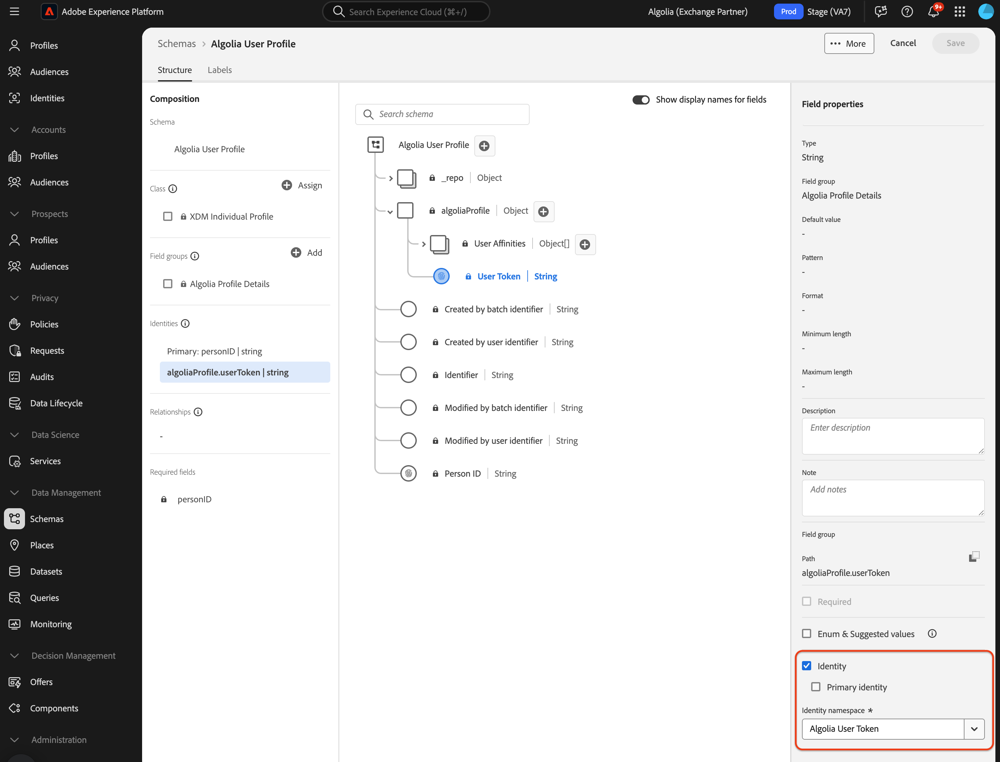
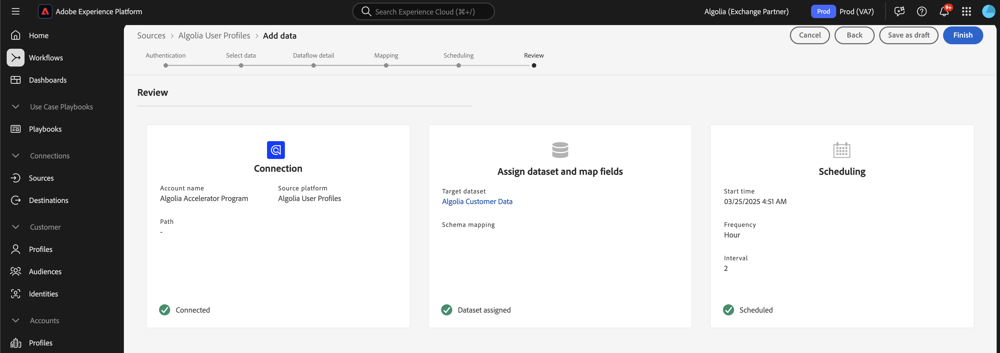

# 使用用户界面将[!DNL Algolia User Profiles]数据摄取到Experience Platform

本教程将指导您使用用户界面将数据从[!DNL Algolia User Profiles]帐户引入Adobe Experience Platform。

## 快速入门

>[!IMPORTANT]
>
>在开始之前，请确保您已完成[[!DNL Algolia User Profiles] 概述](../../../../connectors/data-partners/algolia-user-profiles.md#prerequisites)中列出的先决条件。

本教程假定您熟悉以下Experience Platform组件：

* [[!DNL Experience Data Model (XDM)] 系统](../../../../../xdm/home.md)： Experience Platform用于组织客户体验数据的标准化框架。

   * [架构组合基础](../../../../../xdm/schema/composition.md)：了解架构组合，包括关键原则和最佳实践。
   * [架构编辑器教程](../../../../../xdm/tutorials/create-schema-ui.md)：了解如何使用架构编辑器UI创建自定义架构。
* [[!DNL Real-Time Customer Profile]](../../../../../profile/home.md)：基于来自多个源的汇总数据的统一、实时客户个人资料。
* [源](../../../../home.md)：从各种源中摄取数据，并使用Experience Platform服务来构建、标记和增强数据。

### 收集所需的凭据

要将[!DNL Algolia]连接到Adobe Experience Platform，请提供以下凭据：

| 凭据 | 描述 |
| -------------- | ----------------------------------------------------------------------------------------- |
| 应用程序Id | 分配给您[!DNL Algolia]帐户的唯一标识符。 |
| API密钥 | 用于向[!DNL Algolia]的服务验证和授权API请求的凭据。 |

有关详细信息，请参阅[!DNL Algolia] [身份验证文档](https://www.algolia.com/doc/tools/cli/get-started/authentication/)。

## 连接您的[!DNL Algolia]帐户

在Experience Platform UI中，从左侧导航中选择&#x200B;**[!UICONTROL 源]**&#x200B;以打开&#x200B;*[!UICONTROL 源]*&#x200B;工作区。 使用&#x200B;*[!UICONTROL 类别]*&#x200B;面板或搜索栏查找所需源。

要连接[!DNL Algolia]，请选择&#x200B;*[!UICONTROL 数据和标识合作伙伴]*&#x200B;下的&#x200B;**[!UICONTROL Algolia]**&#x200B;源卡，然后选择&#x200B;**[!UICONTROL 设置]**。

>[!TIP]
>
> 如果源尚未拥有经过身份验证的帐户，则会显示&#x200B;**[!UICONTROL 设置]**&#x200B;选项。 经过身份验证后，这更改为&#x200B;**[!UICONTROL 添加数据]**。

## 身份验证

### 使用现有帐户

若要使用现有帐户，请选择&#x200B;**[!UICONTROL 现有帐户]**，然后选择要使用的[!DNL Algolia User Profiles]帐户。 然后选择&#x200B;**[!UICONTROL 下一步]**。

### 创建新帐户

要创建新帐户，请选择&#x200B;**[!UICONTROL 新建帐户]**，然后输入名称、可选描述和您的[!DNL Algolia]凭据。 选择&#x200B;**[!UICONTROL 连接到源]**&#x200B;并等待连接建立。

## 添加数据

创建[!DNL Algolia User Profiles]帐户后，将显示&#x200B;**[!UICONTROL 添加数据]**&#x200B;步骤。 使用它可以选择和预览要摄取的用户配置文件数据。

* 在左侧，输入可选的&#x200B;**[!UICONTROL 索引]**&#x200B;和&#x200B;**[!UICONTROL 关联性]**。
* 在右侧，预览最多100行用户配置文件。

完成后，选择&#x200B;**[!UICONTROL 下一步]**。

## 提供数据流详细信息

如果使用现有数据集，请选择与包含[!DNL Algolia Profile]字段组的架构关联的数据集。 确保[!DNL Algolia User Token]字段正在使用[!DNL Algolia User Token]标识命名空间。  如果[!DNL Algolia User Token]当前未创建或分配，则说明如下。

如果创建新数据集，请使用[!DNL Algolia Profile]字段组选择架构。

### 创建[!DNL Algolia User Token]身份命名空间

如果您的组织中不存在[!DNL Algolia User Token]身份命名空间，则需要创建它。

使用左侧导航并选择&#x200B;**[!UICONTROL 标识]**&#x200B;以访问[标识服务](../../../../../identity-service/home.md)用户界面工作区，然后选择&#x200B;**[!UICONTROL 创建标识命名空间]**。

接下来，为您的自定义命名空间提供&#x200B;**[!UICONTROL 显示名称]**&#x200B;和&#x200B;**[!UICONTROL 身份符号]**。 在此步骤中，还必须配置命名空间的类型。 完成后，选择&#x200B;**[!UICONTROL 创建]**。

| 自定义命名空间配置 | 值 |
| --- | --- |
| **[!UICONTROL 显示名称]** | [!DNL Algolia User Token] |
| **[!UICONTROL 身份符号]** | [!DNL AlgoliaUserToken] |
| **[!UICONTROL 选择类型]** | [!DNL Cookie ID] |

添加后，命名空间会显示在列表中。 您现在可以在架构中应用它。

### 将命名空间应用于架构

使用左侧导航并选择&#x200B;**[!UICONTROL 架构]**&#x200B;以访问[架构](../../../../../xdm/ui/overview.md) UI工作区。 使用架构工作区创建或更新包含[!DNL Algolia Profile Details]字段组的架构。 接下来，导航到&#x200B;**[!UICONTROL 用户令牌]**&#x200B;字段并使用右边栏选择&#x200B;**[!UICONTROL 标识]**&#x200B;框。 此外，使用输入框定义[!DNL Algolia User Token]身份命名空间。 完成后，选择&#x200B;**[!UICONTROL 保存]**。

为&#x200B;**[!UICONTROL 用户令牌]**&#x200B;字段分配[!DNL Algolia User Token]身份命名空间后，该身份将显示在任何配置文件的用户配置文件中。

## 将数据字段映射到XDM架构

使用映射界面将源数据映射到架构字段。 有关详细信息，请参阅[映射指南](../../../../../data-prep/ui/mapping.md)。

## 计划摄取运行

接下来，使用计划界面定义数据流的摄取计划。

| 计划配置 | 描述 |
| --- | --- |
| 频率 | 配置频率以指示数据流运行的频率。 您可以将频率设置为： <ul><li>**一次**：将频率设置为`once`以创建一次性引入。 创建一次性摄取数据流时，间隔和回填配置不可用。 默认情况下，调度频率设置为一次。</li><li>**分钟**：将频率设置为`minute`，以计划数据流以每分钟摄取数据。</li><li>**小时**：将频率设置为`hour`，以计划数据流每小时摄取数据。</li><li>**天**：将频率设置为`day`，以计划数据流每天摄取数据。</li><li>**周**：将频率设置为`week`，以计划数据流每周摄取数据。</li></ul> |
| 间隔 | 选择频率后，可以配置间隔设置以建立每次引入之间的时间范围。 例如，如果将频率设置为天并将间隔配置为15，则数据流将每15天运行一次。 不能将间隔设置为零。 每个频率的最小接受间隔值如下：<ul><li>**一次**：不适用</li><li>**分钟**： 15</li><li>**小时**： 1</li><li>**天**： 1</li><li>**周**： 1</li></ul> |
| 开始时间 | 预计运行的时间戳，以UTC时区显示。 |
| 回填 | 回填可确定最初摄取的数据。 如果启用了回填，则指定路径中的所有当前文件将在第一次计划摄取期间摄取。 如果禁用回填，则只摄取在第一次引入运行到开始时间之间加载的文件。 将不会摄取在开始时间之前加载的文件。 |

## 查看您的数据流

使用“复查”页可在摄取之前获取数据流摘要。 详细信息按以下类别分组：

* **连接** — 显示源类型、所选源文件的相关路径以及该源文件中的列数。
* **分配数据集和映射字段** — 显示要将源数据摄取到哪个数据集，包括该数据集所遵循的架构。
* **正在计划** — 显示摄取计划的活动周期、频率和间隔。

查看数据流后，选择&#x200B;**[!UICONTROL 完成]**，然后等待一些时间来创建数据流。

## 后续步骤

通过学习本教程，您已成功创建了一个数据流，以将意图数据从[!DNL Algolia]源引入Experience Platform。 有关其他资源，请访问下面列出的文档。

### 监测数据流

创建数据流后，您可以监视通过它摄取的数据，以查看有关摄取率、成功和错误的信息。 有关如何监视数据流的详细信息，请访问有关UI中[监视帐户和数据流的教程](../../../../../dataflows/ui/monitor-sources.md)。

### 更新您的数据流

要更新数据流计划、映射和常规信息的配置，请访问有关[在UI中更新源数据流的教程](../../update-dataflows.md)。

### 删除您的数据流

您可以删除不再必需的数据流或使用&#x200B;**[!UICONTROL 数据流]**&#x200B;工作区中提供的&#x200B;**[!UICONTROL 删除]**&#x200B;功能错误地创建的数据流。 有关如何删除数据流的详细信息，请访问有关[在UI中删除数据流](../../delete.md)的教程。
