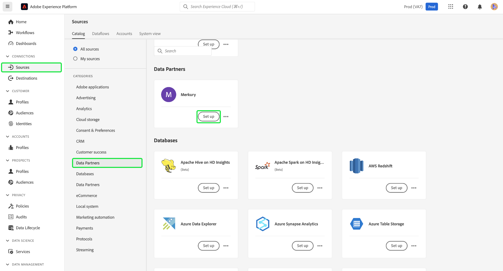

# 创建 [!DNL Merkury Enterprise Identity Resolution] UI中的源连接和数据流

>[!NOTE]
>
>此 [!DNL Merkury Enterprise Identity Resolution] 源为测试版。 请阅读 [源概述](../../../../home.md#terms-and-conditions) 有关使用测试版标记源代码的更多信息。

本教程提供了创建 [!DNL Merkury Enterprise Identity Resolution] 源连接和数据流(使用Adobe Experience Platform用户界面)。

## 快速入门

本教程需要对以下Experience Platform组件有一定的了解：

* [[!DNL Experience Data Model (XDM)] 系统](../../../../../xdm/home.md)：Experience Platform用于组织客户体验数据的标准化框架。
   * [模式组合基础](../../../../../xdm/schema/composition.md)：了解XDM架构的基本构建基块，包括架构构成中的关键原则和最佳实践。
   * [架构编辑器教程](../../../../../xdm/tutorials/create-schema-ui.md)：了解如何使用架构编辑器UI创建自定义架构。
* [[!DNL Real-Time Customer Profile]](../../../../../profile/home.md)：根据来自多个来源的汇总数据提供统一的实时使用者个人资料。

### 收集所需的凭据

要在Experience Platform时访问存储段，您需要为以下凭据提供有效值：

| 凭据 | 描述 |
| --- | --- |
| 访问密钥 | 存储段的访问密钥ID。 您可以从 [!DNL Merkury] 团队。 |
| 密钥 | 存储桶的密钥ID。 您可以从 [!DNL Merkury] 团队。 |
| 存储桶名称 | 这是您的Merkury存储桶，将在其中共享文件。 您可以从 [!DNL Merkury] 团队。 |

有关设置的更多信息 [!DNL Merkury] 和其他先决条件，请阅读 [[!DNL Merkury] 源概述](../../../../connectors/data-partners/merkury.md).

## 连接您的Merkury帐户

在Platform UI中，选择 **[!UICONTROL 源]** 从左侧导航栏访问 [!UICONTROL 源] 工作区。 此 [!UICONTROL 目录] 屏幕显示了多种来源，您可以使用这些来源创建帐户。

您可以从屏幕左侧的目录中选择相应的类别。 或者，您可以使用搜索选项查找您要使用的特定源。

在 **[!UICONTROL 数据合作伙伴]** 类别，选择 **[!UICONTROL 梅尔库里]** 然后选择 **[!UICONTROL 设置]**.

此 **[!UICONTROL 连接到Merkury]** 页面。 在此页上，您可以使用新凭据或现有凭据。

### 创建新帐户

如果您正在使用新凭据，请选择 **[!UICONTROL 新帐户]**. 在出现的输入表单上，提供名称、可选描述以及 [!DNL Merkury] 凭据。 完成后，选择 **[!UICONTROL 连接到源]** 然后等待一段时间以建立新连接。

### 使用现有帐户

要使用现有帐户，请选择 **[!UICONTROL 现有帐户]** 然后选择 [!DNL Merkury] 您希望使用的帐户。 选择&#x200B;**[!UICONTROL 下一步]**&#x200B;以继续。

>[!BEGINSHADEBOX]

**支持的文件格式**

您可以使用以下文件格式摄取 [!DNL Merkury] 来源：

* 分隔符分隔值(DSV)：任何单字符值都可以用作DSV格式的数据文件的分隔符。
* [!DNL JavaScript Object Notation] (JSON)： JSON格式的数据文件必须符合XDM。
* [!DNL Apache Parquet]：Parquet格式的数据文件必须符合XDM。
* 压缩文件：JSON和分隔文件可以压缩为： `bzip2`， `gzip`， `deflate`， `zipDeflate`， `tarGzip`、和 `tar`.

>[!ENDSHADEBOX]

## 添加数据

创建之后 [!DNL Merkury] 帐户， **[!UICONTROL 添加数据]** 步骤随即显示，为您提供一个界面以探索 [!DNL Merkury] 文件层次结构并选择要带入Experience Platform的文件夹或特定文件。

* 界面的左侧是一个目录浏览器，其中显示了 [!DNL Merkury] 文件层次结构。
* 界面的右侧部分允许您预览兼容文件夹或文件中最多100行数据。

选择根文件夹以访问您的文件夹层次结构。 在此处，您可以选择单个文件夹以递归方式摄取文件夹中的所有文件。 摄取整个文件夹时，必须确保该文件夹中的所有文件共享相同的数据格式和架构。

选择文件夹后，正确的界面将更新为所选文件夹中第一个文件的内容和结构的预览。

在此步骤中，您可以在继续之前对数据做出多个配置。 首先，选择 **[!UICONTROL 数据格式]** 然后在显示的下拉面板中为文件选择适当的数据格式。

下表显示了所支持文件类型的相应数据格式：

| 文件类型 | 数据格式 |
| --- | --- |
| CSV | [!UICONTROL 已分隔] |
| JSON | [!UICONTROL JSON] |
| Parquet | [!UICONTROL XDM Parquet] |

### 选择列分隔符

+++选择以查看有关如何设置分隔符的步骤

配置数据格式后，可在引入分隔文件时设置列分隔符。 选择 **[!UICONTROL 分隔符]** 选项，然后从下拉菜单中选择分隔符。 该菜单显示最常用的分隔符选项，包括逗号(`,`)，制表符(`\t`)和管道字符(`|`)。

如果您希望使用自定义分隔符，请选择 **[!UICONTROL 自定义]** 并在弹出输入栏中输入您选择的单个字符分隔符。

+++

### 摄取压缩文件

+++ 选择可查看有关如何摄取压缩文件的步骤

您还可以通过指定压缩JSON或分隔文件的压缩类型来摄取它们。

在 [!UICONTROL 选择数据] 步骤，选择要摄取的压缩文件，然后选择其相应的文件类型以及是否符合XDM。 接下来，选择 **[!UICONTROL 压缩类型]** 然后选择源数据的相应压缩文件类型。

要将特定文件带入Platform，请选择一个文件夹，然后选择要摄取的文件。 在此步骤中，还可以使用文件名旁边的预览图标预览给定文件夹中其他文件的文件内容。

完成后，选择 **[!UICONTROL 下一个]**.

+++

## 提供数据流详细信息

此 [!UICONTROL 数据流详细信息] 页面允许您选择是使用现有数据集还是新数据集。 在此过程中，您还可以配置要摄取到配置文件的数据，并启用以下设置 [!UICONTROL 错误诊断]， [!UICONTROL 部分摄取]、和 [!UICONTROL 警报].

### 使用现有数据集

要将数据摄取到现有数据集，请选择 **[!UICONTROL 现有数据集]**. 您可以使用检索现有数据集 [!UICONTROL 高级搜索] 选项，或者通过在下拉菜单中滚动现有数据集的列表来进行更改。 选择数据集后，为数据流提供名称和描述。

### 使用新数据集

要摄取到新数据集中，请选择 **[!UICONTROL 新数据集]** 然后提供输出数据集名称和可选描述。 接下来，使用 [!UICONTROL 高级搜索] 选项，或者通过在下拉菜单中滚动查看现有架构的列表来进行更改。 选择架构后，为数据流提供名称和描述。

### 启用配置文件和错误诊断

+++选择以查看启用错误诊断和配置文件摄取的步骤

接下来，选择 **[!UICONTROL 配置文件数据集]** 切换以为实时客户个人资料启用数据集。 这允许您创建实体的属性和行为的整体视图。 来自所有启用配置文件的数据集的数据将包含在配置文件中，并在保存数据流时应用更改。

[!UICONTROL 错误诊断] 为数据流中发生的任何错误记录启用详细的错误消息生成，而 [!UICONTROL 部分摄取] 允许您摄取包含错误的数据，摄取到手动定义的特定阈值为止。 请参阅 [部分批次摄取概述](../../../../../ingestion/batch-ingestion/partial.md) 以了解更多信息。

+++

### 启用警报

+++选择此选项可查看启用警报的步骤

您可以启用警报以接收有关数据流状态的通知。 从列表中选择警报以订阅接收有关数据流状态的通知。 有关警报的详细信息，请参阅以下内容中的指南： [使用UI订阅源警报](../../alerts.md).

完成向数据流提供详细信息后，选择 **[!UICONTROL 下一个]**.

+++

## 将数据字段映射到XDM架构

此 [!UICONTROL 映射] 此时会显示步骤，为您提供用于将源架构中的源字段映射到目标架构中相应的目标XDM字段的界面。

Platform根据您选择的目标架构或数据集，为自动映射的字段提供智能推荐。 您可以手动调整映射规则以适合您的用例。 根据需要，您可以选择直接映射字段，或使用数据准备函数转换源数据以派生计算值或计算值。 有关使用映射器界面和计算字段的全面步骤，请参阅 [数据准备UI指南](../../../../../data-prep/ui/mapping.md).

成功映射源数据后，选择 **[!UICONTROL 下一个]**.

## 计划摄取运行

此 [!UICONTROL 正在计划] 此时将显示步骤，允许您配置摄取计划，以使用配置的映射自动摄取选定的源数据。 默认情况下，计划设置为 `Once`. 要调整摄取频率，请选择 **[!UICONTROL 频率]** 然后从下拉菜单中选择一个选项。

>[!TIP]
>
>间隔和回填在一次性摄取期间不可见。

如果将摄取频率设置为 `Minute`， `Hour`， `Day`，或 `Week`，则必须设置一个时间间隔，以便在每次引入之间设置时间范围。 例如，摄取频率设置为 `Day` 并且间隔设置为 `15` 这意味着您的数据流计划每15天摄取一次数据。

在此步骤中，您还可以启用 **回填** 并为数据的增量摄取定义列。 回填用于摄取历史数据，而您为增量摄取定义的列允许从现有数据中区分新数据。

有关计划配置的详细信息，请参阅下表。

| 字段 | 描述 |
| --- | --- |
| 频度 | 摄取发生的频率。 可选择频率包括 `Once`， `Minute`， `Hour`， `Day`、和 `Week`. |
| 间隔 | 设置所选频率间隔的整数。 间隔值应为非零整数，且应设置为大于或等于15。 |
| 开始时间 | UTC时间戳，指示何时设置第一次引入。 开始时间必须大于或等于当前UTC时间。 |
| 回填 | 一个布尔值，用于确定最初摄取的数据。 如果启用了回填，则指定路径中的所有当前文件将在第一次计划摄取期间摄取。 如果禁用回填，则只摄取在第一次引入运行到开始时间之间加载的文件。 将不会摄取在开始时间之前加载的文件。 |

>[!NOTE]
>
>对于批量摄取，每个后续数据流都会根据文件所在的区域 **上次修改时间** 时间戳。 这意味着批处理数据流从源中选择新的文件，或者自上次流运行以来修改的文件。 此外，您必须确保在文件上传与计划流量运行之间有足够的时间跨度，因为可能无法提取在计划流量运行时间之前未完全上传到您的云存储帐户的文件以供摄取。

配置完摄取计划后，选择 **[!UICONTROL 下一个]**.

## 查看您的数据流

此 **[!UICONTROL 审核]** 此时会显示步骤，允许您在创建新数据流之前对其进行查看。 详细信息分为以下类别：

* **[!UICONTROL 连接]**：显示源类型、所选源文件的相关路径以及该源文件中的列数。
* **[!UICONTROL 分配数据集和映射字段]**：显示要将源数据摄取到哪个数据集，包括数据集所遵循的架构。
* **[!UICONTROL 正在计划]**：显示摄取计划的活动时段、频率和间隔。

查看数据流后，单击 **[!UICONTROL 完成]** 留出一段时间来创建数据流。

## 后续步骤

通过学习本教程，您已成功地创建了一个数据流以从 [!DNL Merkury] 要Experience Platform的源。 有关其他资源，请访问下面列出的文档。

### 监测数据流

创建数据流后，您可以监视通过它摄取的数据，以查看有关摄取率、成功和错误的信息。 有关如何监视数据流的更多信息，请访问上的教程 [在UI中监控帐户和数据流](../../monitor.md).

### 更新您的数据流

要更新数据流计划、映射和常规信息的配置，请访问上的教程 [在UI中更新源数据流](../../update-dataflows.md)

### 删除您的数据流

您可以删除不再必需的数据流或使用 **[!UICONTROL 删除]** 函数位于 **[!UICONTROL 数据流]** 工作区。 有关如何删除数据流的更多信息，请访问上的教程 [在UI中删除数据流](../../delete.md).