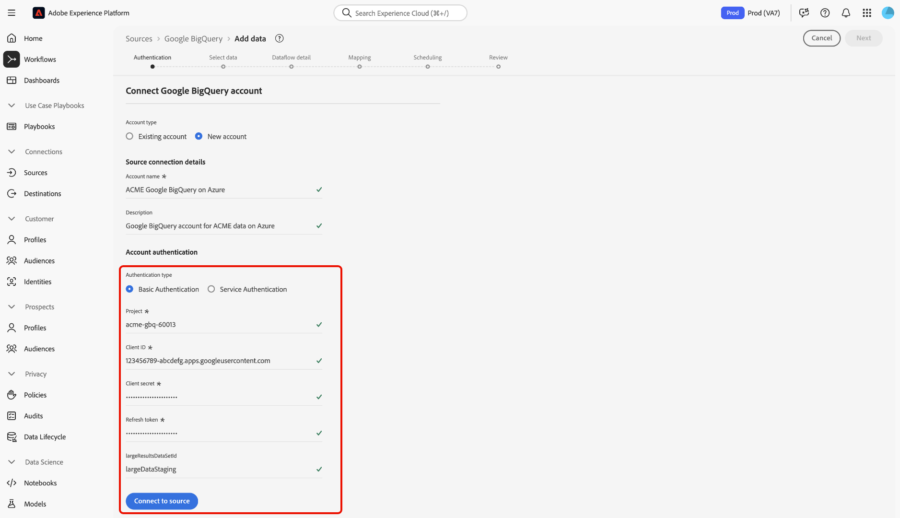
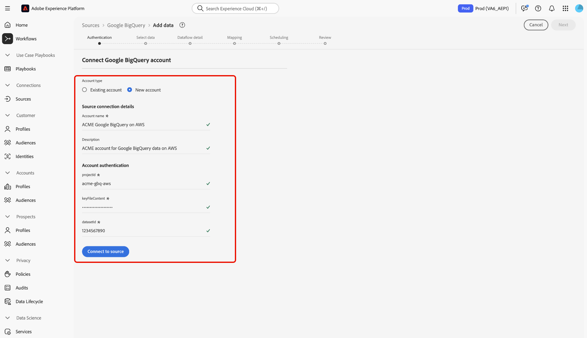

# 使用UI将[!DNL Google BigQuery]连接到Experience Platform

>[!IMPORTANT]
>
>[!DNL Google BigQuery]源在源目录中可供已购买Real-Time Customer Data Platform Ultimate的用户使用。

阅读本教程，了解如何使用用户界面将您的[!DNL Google BigQuery]帐户连接到Adobe Experience Platform。

## 快速入门

本教程需要对以下Experience Platform组件有一定的了解：

* [[!DNL Experience Data Model (XDM)] 系统](../../../../../xdm/home.md)： Experience Platform用于组织客户体验数据的标准化框架。
   * [架构组合的基础知识](../../../../../xdm/schema/composition.md)：了解XDM架构的基本构建块，包括架构组合中的关键原则和最佳实践。
   * [架构编辑器教程](../../../../../xdm/tutorials/create-schema-ui.md)：了解如何使用架构编辑器UI创建自定义架构。
* [[!DNL Real-Time Customer Profile]](../../../../../profile/home.md)：根据来自多个源的汇总数据，提供统一的实时使用者个人资料。

如果您已经拥有有效的[!DNL Google BigQuery]连接，则可以跳过本文档的其余部分，并转到有关[配置数据流](../../dataflow/databases.md)的教程。

### 收集所需的凭据

有关收集所需凭据的详细步骤，请阅读[[!DNL Google BigQuery] 身份验证指南](../../../../connectors/databases/bigquery.md#prerequisites)。

## 导航源目录 {#navigate}

在Experience Platform UI中，从左侧导航中选择&#x200B;**[!UICONTROL 源]**&#x200B;以访问&#x200B;*[!UICONTROL 源]*&#x200B;工作区。 您可以在&#x200B;*[!UICONTROL 类别]*&#x200B;面板中选择相应的类别或者，您可以使用搜索栏导航到要使用的特定源。

若要使用[!DNL Google BigQuery]，请选择&#x200B;*[!UICONTROL 数据库]*&#x200B;下的&#x200B;**[!UICONTROL Google BigQuery]**&#x200B;源卡，然后选择&#x200B;**[!UICONTROL 添加数据]**。

>[!TIP]
>
>当给定的源尚未具有经过身份验证的帐户时，源目录中的源会显示&#x200B;**[!UICONTROL 设置]**&#x200B;选项。 创建经过身份验证的帐户后，此选项将更改为&#x200B;**[!UICONTROL 添加数据]**。

## 使用现有帐户 {#existing}

若要使用现有帐户，请选择要连接的[!DNL Google BigQuery]帐户，然后选择&#x200B;**[!UICONTROL 下一步]**&#x200B;以继续。

## 创建新帐户 {#create}

如果您没有现有帐户，则必须通过提供与您的源对应的必需身份验证凭据来创建新帐户。

要创建新帐户，请选择&#x200B;**[!UICONTROL 新帐户]**，然后提供名称并选择性地为您的帐户添加描述。

### 连接到Azure上的Experience Platform {#azure}

你可以使用基本身份验证或服务身份验证将你的[!DNL Google BigQuery]帐户连接到Azure上的Experience Platform。

>[!BEGINTABS]

>[!TAB 使用基本身份验证]

要使用基本身份验证，请选择&#x200B;**[!UICONTROL 基本身份验证]**，并提供[项目、客户端ID、客户端密钥、刷新令牌和（可选）大型结果数据集ID](../../../../connectors/databases/bigquery.md#generate-your-google-bigquery-credentials)的值。 完成后，选择&#x200B;**[!UICONTROL 连接到源]**，等待一段时间以建立连接。

>[!TAB 使用服务身份验证]

要使用服务身份验证，请选择&#x200B;**[!UICONTROL 服务身份验证]**，并提供[项目ID、密钥文件内容和（可选）大型结果数据集ID](../../../../connectors/databases/bigquery.md#generate-your-google-bigquery-credentials)的值。 完成后，选择&#x200B;**[!UICONTROL 连接到源]**，等待一段时间以建立连接。

>[!ENDTABS]

### 连接到Amazon Web Services上的Experience Platform (AWS) {#aws}

>[!AVAILABILITY]
>
>本节适用于在Amazon Web Services (AWS)上运行的Experience Platform的实施。 在AWS上运行的Experience Platform当前仅对有限数量的客户可用。 要了解有关支持的Experience Platform基础架构的更多信息，请参阅[Experience Platform multi-cloud概述](../../../../../landing/multi-cloud.md)。

要创建新的[!DNL Google BigQuery]帐户并连接到AWS上的Experience Platform，请确保您处于VA6沙盒中，然后提供身份验证所需的凭据。

* **项目ID**：与您的[!DNL Google BigQuery]帐户对应的项目ID。
* **密钥文件内容**：用于验证服务帐户的密钥文件。 您可以从[[!DNL Google Cloud service accounts] 仪表板](https://console.cloud.google.com)检索此值。 密钥文件内容采用JSON格式。 向Experience Platform进行身份验证时，必须在[!DNL Base64]中对此进行编码。
* **数据集ID**： [!DNL Google BigQuery]数据集ID。 此ID表示数据表的位置，必须预先创建此ID才能支持大型结果集。

## 跳过样本数据预览 {#skip-preview-of-sample-data}

在数据选择步骤中，摄取大型表或数据文件时可能会遇到超时。 您可以跳过数据预览以规避超时，并且仍可以查看架构，尽管没有示例数据。 要跳过数据预览，请启用&#x200B;**[!UICONTROL 跳过预览样本数据]**&#x200B;切换开关。

工作流的其余部分将保持不变。 唯一需要注意的是，跳过数据预览可能会阻止在映射步骤中自动验证已计算和必填字段，您随后必须在映射期间手动验证这些字段。

## 后续步骤

通过学习本教程，您已建立与[!DNL Google BigQuery]帐户的连接。 您现在可以继续下一教程，并[配置数据流以将数据导入Experience Platform](../../dataflow/databases.md)。
