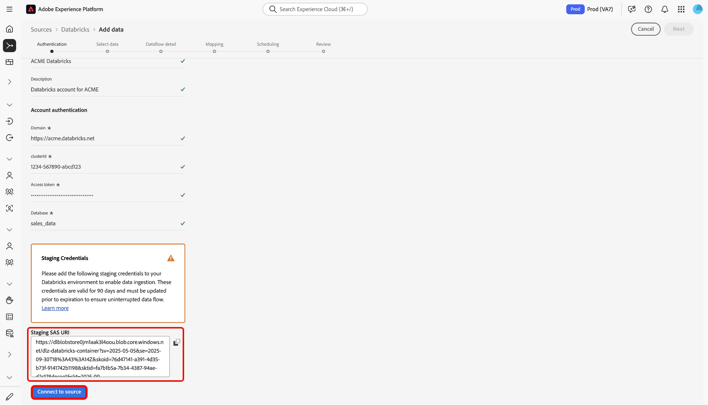

# 在UI中将[!DNL Databricks]连接到Experience Platform

>[!AVAILABILITY]
>
>* [!DNL Databricks]源在源目录中可供已购买Real-Time CDP Ultimate的用户使用。
>
>* [!DNL Databricks]源为测试版。 有关使用测试版标记源的更多信息，请阅读源概述中的[条款和条件](../../../../home.md#terms-and-conditions)。

阅读本指南，了解如何使用UI中的源工作区将您的[!DNL Databricks]帐户连接到Adobe Experience Platform。

## 快速入门

本指南要求您对Experience Platform的以下组件有一定的了解：

* [源](../../../../home.md)： Experience Platform允许从各种源摄取数据，同时让您能够使用Experience Platform服务来构建、标记和增强传入数据。
* [沙盒](../../../../../sandboxes/home.md)： Experience Platform提供了将单个Experience Platform实例划分为多个单独的虚拟环境的虚拟沙盒，以帮助开发和改进数字体验应用程序。

### 收集所需的凭据

提供以下凭据的值以将[!DNL Databricks]连接到Experience Platform。

| 凭据 | 描述 |
| --- | --- |
| 域 | [!DNL Databricks]工作区的URL。 例如：`https://adb-1234567890123456.7.azuredatabricks.net`。 |
| 群集ID | [!DNL Databricks]中集群的ID。 此群集必须已经是现有的群集，并且应该是一个交互式群集。 |
| 访问令牌 | 用于验证您的[!DNL Databricks]帐户的访问令牌。 您可以使用[!DNL Databricks]工作区生成访问令牌。 |
| 数据库 | 增量湖中数据库的名称。 |

有关详细信息，请参阅 [[!DNL Databricks]  概述](../../../../connectors/databases/databricks.md)。

## 导航源目录

在Experience Platform UI中，从左侧导航中选择&#x200B;**[!UICONTROL 源]**&#x200B;以访问&#x200B;*[!UICONTROL 源]*&#x200B;工作区。 选择类别或使用搜索栏查找您的源。

若要连接到[!DNL Databricks]，请转到&#x200B;*[!UICONTROL 数据库]*&#x200B;类别，选择&#x200B;**[!UICONTROL Azure数据库]**&#x200B;源卡，然后选择&#x200B;**[!UICONTROL 设置]**。

>[!TIP]
>
>当给定的源尚未具有经过身份验证的帐户时，源目录中的源会显示&#x200B;**[!UICONTROL 设置]**&#x200B;选项。 创建经过身份验证的帐户后，此选项将更改为&#x200B;**[!UICONTROL 添加数据]**。

### 使用现有帐户

若要使用现有帐户，请选择&#x200B;**[!UICONTROL 现有帐户]**，然后选择要使用的[!DNL Azure Databricks]帐户。

### 创建新帐户

要创建新帐户，请选择&#x200B;**[!UICONTROL 新帐户]**，并提供帐户名称并选择性地为您的帐户添加描述。 接下来，提供以下身份验证凭据的值：

* 域
* 群集ID
* 访问令牌
* 数据库

此外，您必须将[!UICONTROL 暂存SAS URI]凭据复制并粘贴到[!DNL Azure Databricks]环境。 完成后，选择&#x200B;**[!UICONTROL 连接到源]**，等待一段时间以建立连接。

## 为[!DNL Azure Databricks]数据创建数据流

现在您已成功连接[!DNL Azure Databricks]帐户，您现在可以[创建数据流并将数据库中的数据摄取到Experience Platform](../../dataflow/databases.md)。
